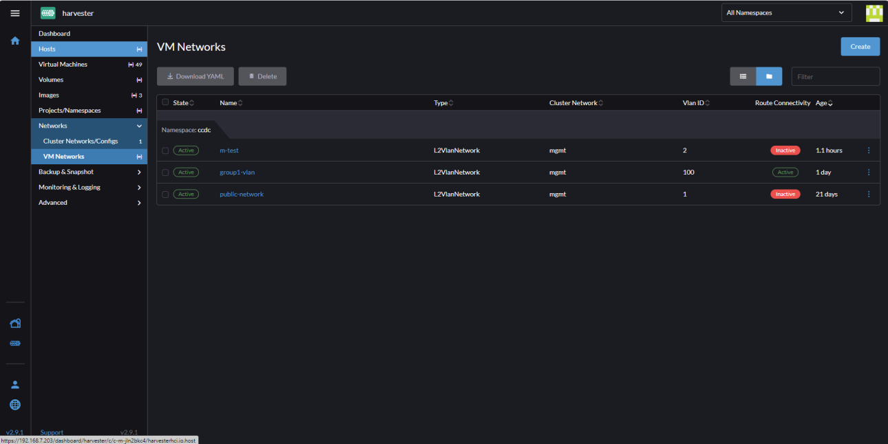

# Harvester Network Creation
This document will contain notes on the creation of networks on the *Harvester* hypervisor.

## (Harvester) Isolated Network Creation
This section will discuss how you can create a network that can be used as a private network on Harvester. They do not have a option to create an internal network explicitly, as they have the *management* network which is used for this purpose. However we can create a `VLAN` or `Untagged` network that **does not use** DHCP, and has a gateway set to an **internal ip** to emulate this.


Open the *Networks* configuration menu in Harvester's VM management interface:



Click Create and fill out the information in the *Basics* window. If you chose to use the *L2VlanNetwork* type you should select a **VlanID**. However if we are not interconnecting this to our network or other internal networks this will not have any real effect, and you can simply chose the *Untagged* network.


In the *Route* window configure it to use the **Manual** mode so we can make this network *internal* and not able to immediately access the internet. Fill in a `CIDR` range that does not conflict with the host's network (In our case do not use addresses that conflict with `192.168.0.0/21`). You should also set the `Gateway` to be some address in the `CIDR` range you selected.


## (Harvester) Isolated Network Attaching to Virtual Machine
Once you have created the network, you can select this as one of the options when creating a VM in Harvester.

> [!IMPORTANT]
> If the only network you connect the VM to does not have access to the internet the boot time of the VM may be much longer than usual since there may be a networking service that will check for a network connections for ~2 mins before the boot process continues. If you open the serial or VNC console during the boot process this can be observed.


* By selecting `Add Network` you can add additional interfaces too. This is what allows us to have a a public and private interface.

> [!NOTE]
> If your cloudinit requires network connections such as when they download packages or reach out to various sites/services you should make sure at least one of the interfaces has a network connections as the cloudinit may fail causing additional issues.
## (System Configuration) Isolated Network
If you are using an Ubuntu system it may not have *NetworkManager* installed by default, if you want to use `nmtui` or `nmcli` to configure the interfaces you will need to install *NetworkManager* and configure it such that the interfaces will be rendered by *NetworkManager* (otherwise you will not see anything in `nmtui`).

> [!NOTE]
> As will be shown later you do not need to use network manager as everything can be done as part of the *netplan* files.

**Installing and Configuring network Manager**:

You should use the package manager provided on your system to install Network Manager on an *Ubuntu* system we would use the following command:
```
sudo apt install network-manager
```

Once done add create the file `/etc/netplan/01-network-manager.yaml`:
```
network:
    version: 2
    renderer: NetworkManager
```
* As this has the number `01` leading the file it is the first applied, and this makes it so all subsequent configurations will be rendered with *NetworkManager*

> [!NOTE]
> You can simply add the `version` and `renderer` configuration lines to the target network file rather than applying this to all interfaces.

**Configuring an Interface**:

Regardless of whether you want to use a local *dhcp* server, or configure the IP's such that they are static the process is mostly the same!

Use the `ip` command to list the interfaces on your machine. We will need the *MAC* address which is sometimes referred to as the *link* address.
1. Use `ip a` to see which interface does not have an ip assigned. You can locate the *MAC* address here from the *link/ether* output.
2. You can also use the `ip link` command to print out only the MAC/Link addresses. If we know the interface we can simply use this! (For us this will generally be `enp2s0`).

    


Create a file `/etc/netplan/51-static.yaml` this is going to be applied after the cloudinit config which is `50-...`. This is where we add the configuration for the new interface, it should have the following contents:

```
network:
    ethernets:
        enp2s0:
            dhcp4: false
            dhcp6: false
            match:
                macaddress: MACADDR
            addresses: [IP/SUBNET]
            set-name: enp2s0
    version: 2
```
* Replace `MACADDR` with the *MAC* address of the interface you found earlier.
* Replace `IP/SUBNET` with the IP address you are assigning to the machine, and the subnet the network will be a part of (how many network bits are there!?!).

> [!IMPORTANT]
> You will need to make sure the new file has the proper permissions, use `chmod 600 FILE` on the 51-static.yaml file.

An example configuration is as follows:
```
network:
    ethernets:
        enp2s0:
            dhcp4: false
            dhcp6: false
            match:
                macaddress: 1e:7e:6f:fc:66:50
            addresses: [172.16.0.10/24]
            set-name: enp2s0
    version: 2
```

> [!NOTE]
> You can add this as another entry in the `50-cloud-init.yaml file however if the cloudinit config is ever re-applied it will be overwritten.

## Removing the External Interface.
This section will discuss the process of removing an interface from one of your VMs.

> [!IMPORTANT]
> If the only network you connect the VM to does not have access to the internet the boot time of the VM may be much longer than usual since there may be a networking service that will check for a network connections for ~2 mins before the boot process continues. If you open the serial or VNC console during the boot process this can be observed.

Open the `Edit Config` menu for the Virtual Machine:


Select the *Networks* window and click the big **X** on the interface you would like to remove. Once done save the changes and the system will need to restart.


## Application of Changes

Finally once you are satisfied with your configuration you should run the `sudo netplan apply` command.

> [!NOTE]
> This will re-assign the address on the public ip, so you will be disconnected if you are using SSH.