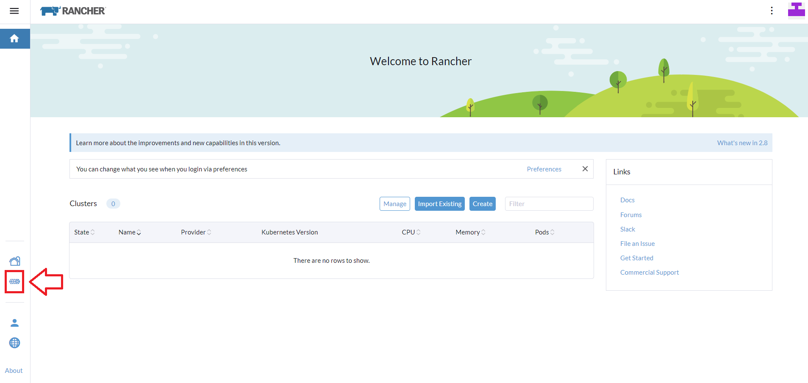
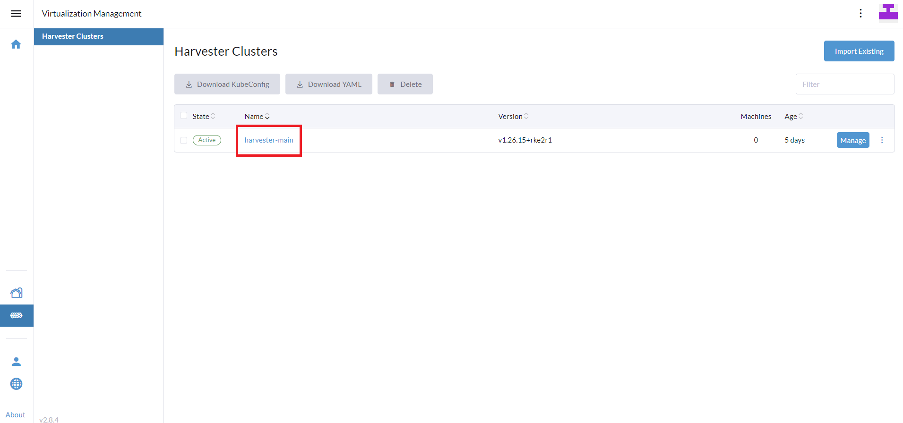
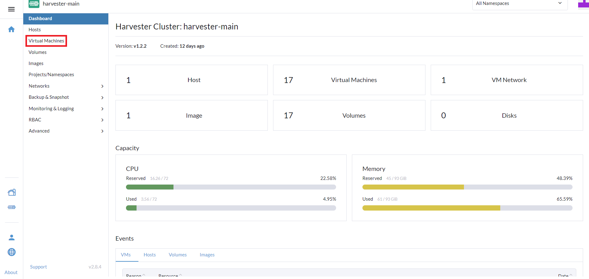
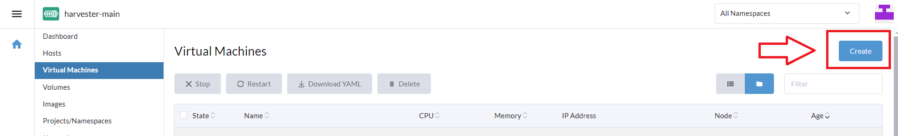
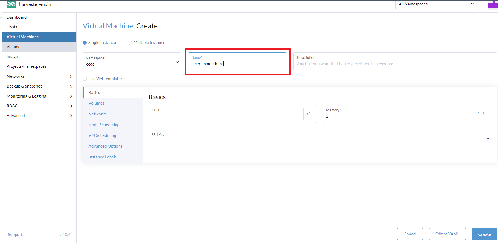
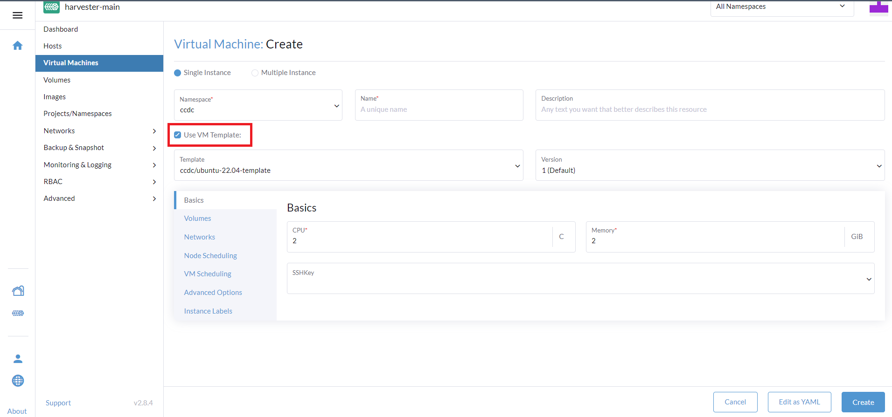
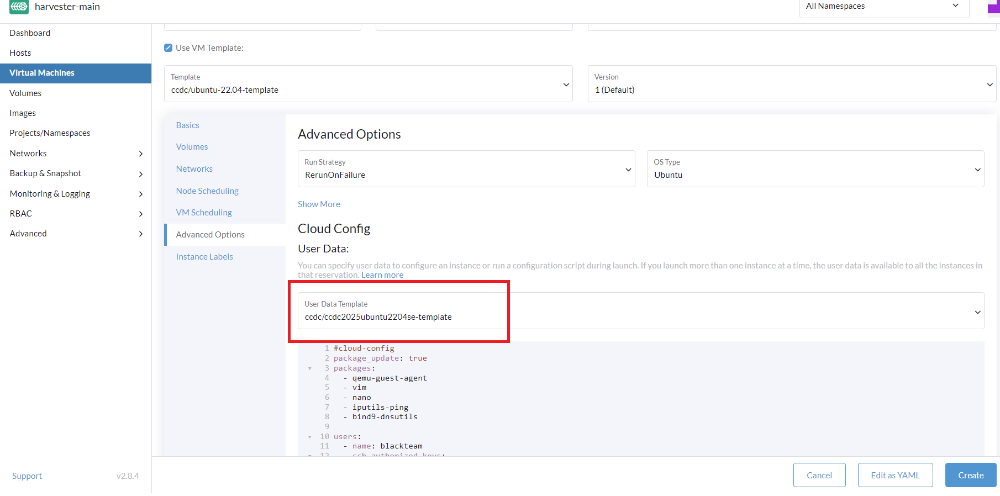
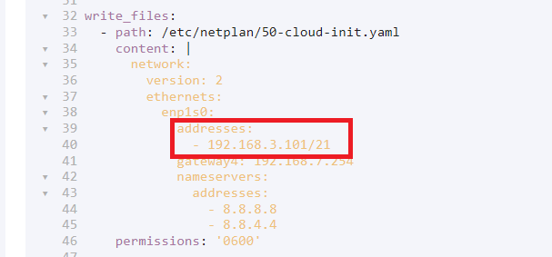
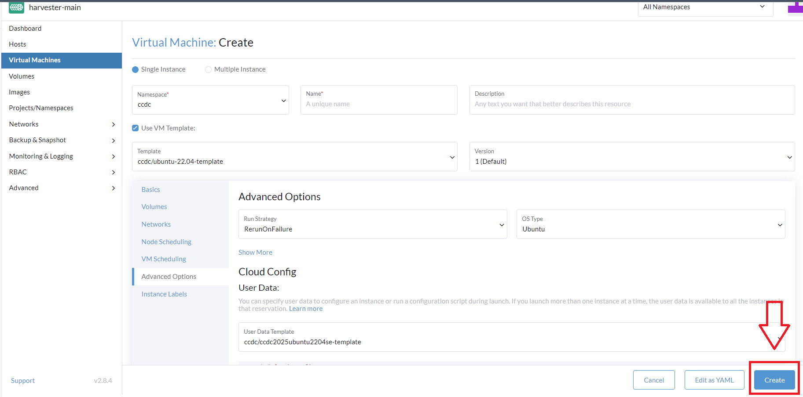
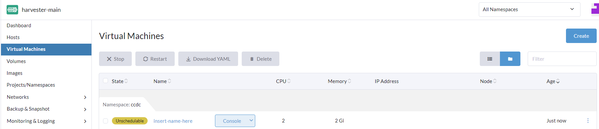

# Making New Machines From A Template 
This guide will show you how to use the new hypervisor Harvester with a nice Kubernetes Management Platform known as `Rancher` to create a new Virtual Machine from a predefined template.

## Step 1: Login :) and navigate to Virtualization Management
You're going to need to sign into your account, then you will presented with the homepage. 

Press the `Virtualization Management` button to gain access to the clusters you have permission to.

## Step 2: Choose target cluster.
Press the appropriate cluster that you want.

## Step 3: Choose Virtual Machines
You'll be at the Dashboard homepage by default. So now you can choose to create new VMs by choosing the `Virtual Machines` tab.

## Step 4: Create a new VM
Choose `Create`

## Step 5: Name the machine
Be very particular, they don't like capital letters or periods. But dashes are ok.

## Step 6: Choose Template
Because we're so nice at UML, we gave you a base Ubuntu template. But you can make your own (different guide at a different time). So for now, you can use the `ccdc/ubuntu-22.04-template` that was here at the time.

Make sure to choose the `Use VM Template:` checkbox to be prompted with the option to choose the template within your namespace.

## Step 7: Choose Cloud-Init template (optional)
If you want to use our cloud-init template (or another one), you can go down to `Advanced Options` and then choose a `User Data Template` to use ours with the default blueteam password where the username is `blueteam`.

### Step 7a: Change the IP of the static netplan configuration
If you're using the template, then you'll see the netplan configuration that you need to change. Just change to a non-occupied IP and you're set to press the Create button.

## Step 8: Press Create
Press the button.

## Step 9: Just wait

Now, you can rest easy and it should be taken care of. The cloud-init steps will be run once when the machine boots up. I believe it's a one time operation. But you should see the IP change to your static IP once everything is ready to go.

