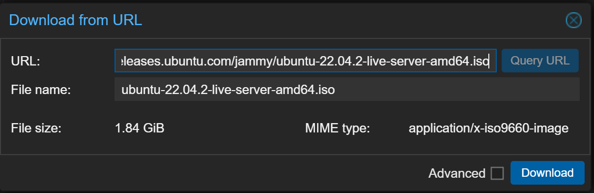
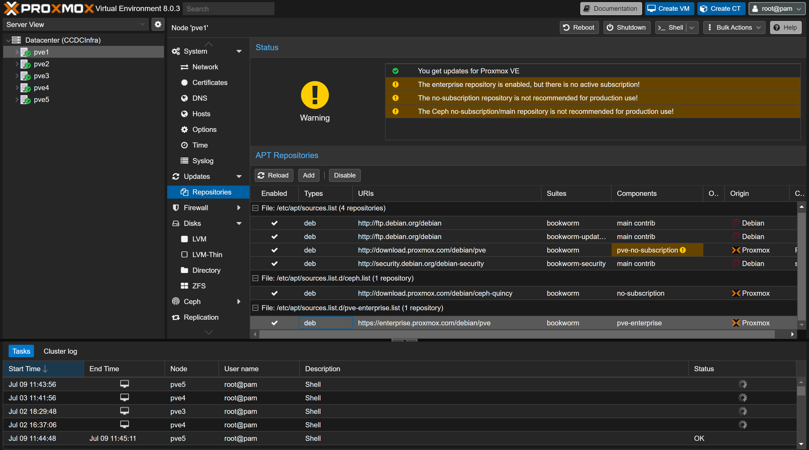

# Proxmox <!-- omit from toc -->
This directory contains documentation relating to the installation and setup of the Proxmox machines for our practice infrastructure. Infromation regarding the Gluster setup for the Proxmox systems will be contained in the [Gluster Directory](./../Gluster/README.md).


If you need information regarding the methods used to access Proxmox, please refer to the [root readme](./../README.md)

## Repository Table of Contents <!-- omit from toc -->
* [Initial Install & Setup](./1-InstallingProxmox%2BInfrastructure%20Specific%20Details.md)
* [Changing Hostnames](./2-ChangingHostNames.md)

## Table of Contents <!-- omit from toc -->
- [Install Ubuntu](#install-ubuntu)
- [Enterprise Edition](#enterprise-edition)
  - [CLI Method](#cli-method)
  - [Web Interface](#web-interface)
- [Set Correct Time Zone](#set-correct-time-zone)
- [SDN setup](#sdn-setup)


## Install Ubuntu
1. Navigate to:
    ```
    https://releases.ubuntu.com/
    ```
2. Select the version of ubuntu we would like to download and gather the link.
3. Open a storage device in the proxmox cluster

    

4. Click on the ISO option, if this does not appear you are using the wrong storage device. 
5. Click on Download From URL, enter in the previously discovered URL

    

6. Click Query, ensure the information looks alright. This will fill in the filename information for you.
    
7. Click Download
## Enterprise Edition
We need to update the source list that apt utilizes when searching for packages. This is particularly important if we have the Enterprise Edition for Proxmox installed.


### CLI Method
We need to edit the */etc/apt/sources* anf add the following line.
```
# Proxmox VE pve-no-subscription repository provided by proxmox.com,
# NOT recommended for production use
deb http://download.proxmox.com/debian/pve bookworm pve-no-subscription
```

Remove the Enterprise Edition Repository 
```
# Both are enterprise Repositories  
rm -f /etc/apt/sources.list.d/pve-enterprise.list && \
rm -f  /etc/apt/sources.list.d/ceph.list
```
### Web Interface 
1. Open the Web GUI and navigate to a Proxmox instance 

    

2. Open the Updates drop down, and acess the Repositories menu

    

3. Click Add, and click OK to the prompt shown below

    

4. Select *No Subscription* from the dropdown menu as shown below, and click add

    

5. Click on the Enterprise Repositories

    

6. Click Disable, you should see the repository is unchecked and greyed out
   
    

## Set Correct Time Zone 
1. Open the Web GUI and navigate to a Proxmox instance 

    

2. Navigate to the Time menu under **System**

    

3. Click on the Time Zone and hit Edit

    

4. Change to New_York, or whatever time zone is needed

    

5. Hit OK, Now repeat for all other machines in the cluster.

## SDN setup
Please refer to [SDN](./../Network/Proxmox/SDN.md)
