# OpenProject
[OpenProject](https://www.openproject.org/) as of 6-17-24 is the platform we will be using to ensure coordination between team members and accountability through task tracking. This is an *Open Source* software, and we are currently self-hosting it on the infrastructure at the Cyber Range. You need to be connected through the Open VPN client in order to access the website. As this is self hosted there may be a time it breaks, or the power at the Cyber Range goes out and is inaccessible, please let us know if you experience issues and we can troubleshoot this. There are many students both current and graduated who use platforms similar to OpenProject in conjunction with the Agile (or other productivity) framework in their internships and full time jobs; they will be helping us implement this in our weekly workflow. 

> [!IMPORTANT]
> If you do not have a Open VPN certificate please reach out to us in the UML CCDC server.

## Accessing Open Project
This section assume you are already connected to the VPN using the [Open VPN Client](https://openvpn.net/client/), using the profile you have [previously imported](https://openvpn.net/connect-docs/import-profile.html) with the configuration we have provided.

> [!NOTE]
> The VPN may be a full tunnel by default, you can modify the `ovpn` file before importing it to make this a split tunnel if you would like to.

1. Access the current IP of the OpenProject page, at the time of writing this is [http://192.168.0.72/](http://192.168.0.72/)
2. Create an Account
   * This account should include your name, this is so we can identify you.
   * Make sure this password is not one you use personally this is a student managed service and located in the cyber range where students may introduce malware onto systems in the network.
3. Notify an Admin that you have made an account so you can be added to the project
   * At the time of writing this is `Amaan` and `Matt H`
4. Once you have been added to the project, log in and you will be greeted with a guide. Follow this to famialrize yourself with the application.

    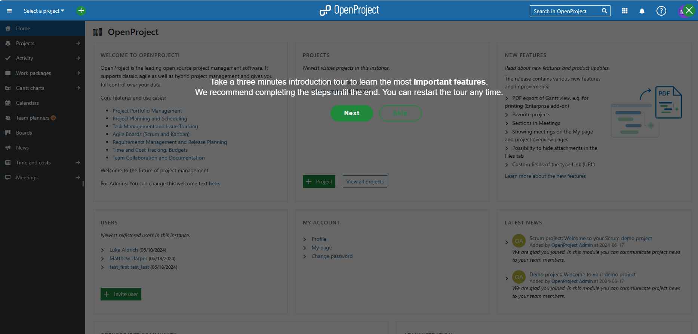

5. In the top left click the *Select a Project* dropdown and open the one we have told you to use!

    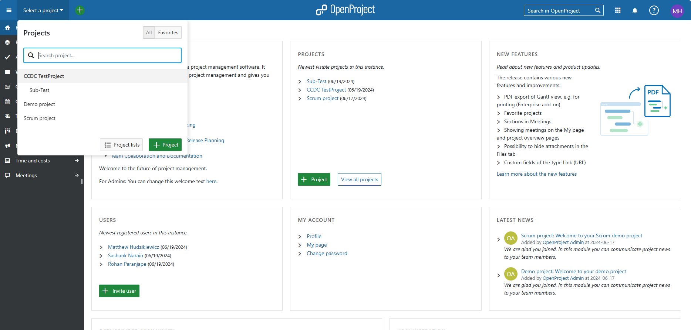

6. From the main page we can see an overview of the project, and on the left the enabled modules. Our main focus will be the *Work Packages* which contain our tasks, the *Boards* provide a nice means of visualization, and the *Gantt Chars* Provide a interesting overview of start and end times.

    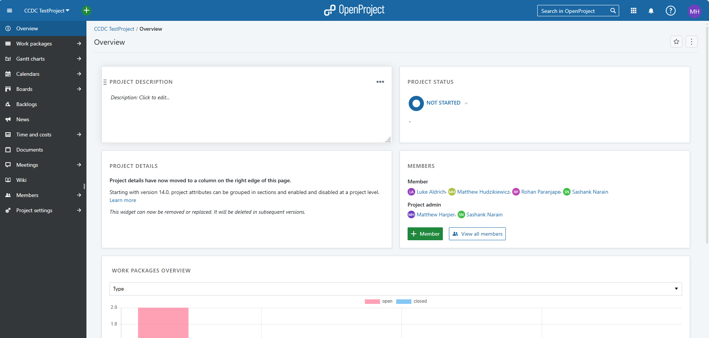

7. When you create a *Work Package* it will be a top-most member, and is visible in the *All Open* page.

    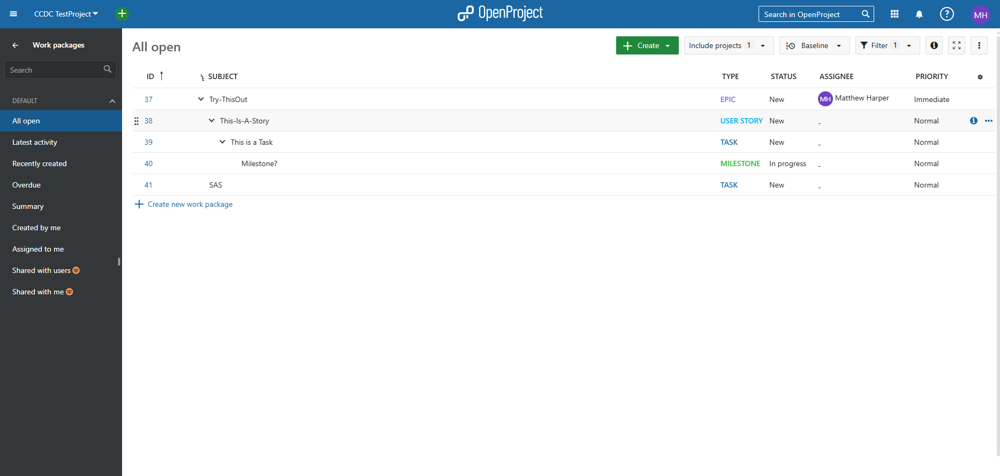

8. You can create child members by double clicking on the package you want to be the parent. You can from the *Relations* tab add a Child or other kind of relation.

    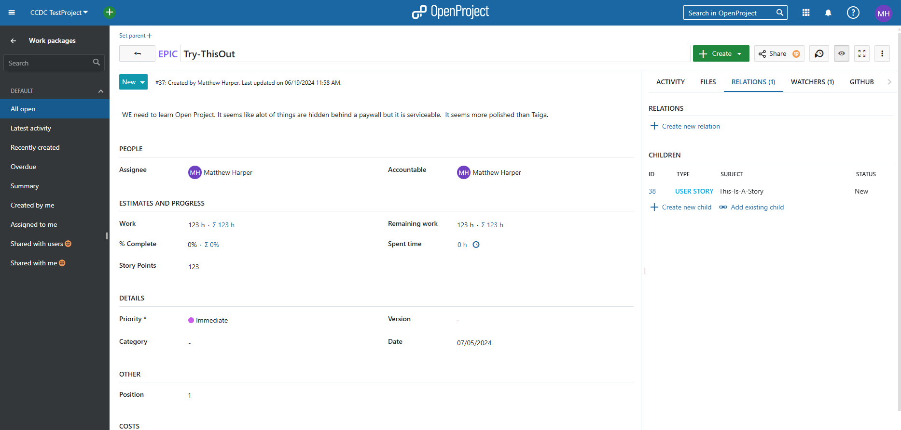

9. We can also add additional *Watchers* who will be notified when activity occurs.

    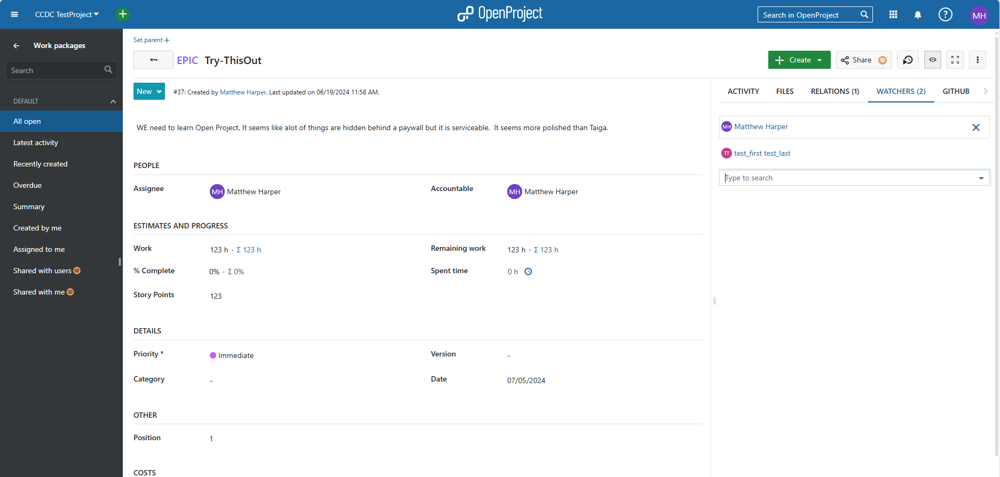

### Admin
This section will cover topics applicable to administrators on OpenProject.
## Enabling Users
1. Access the Administrations page by clicking on your user icon.

    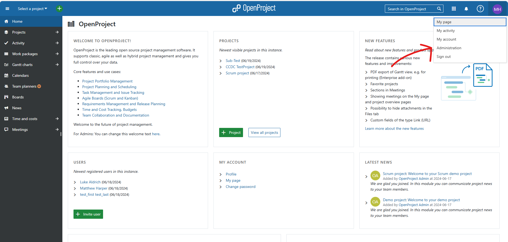

2. Select *Users and Permissions*

    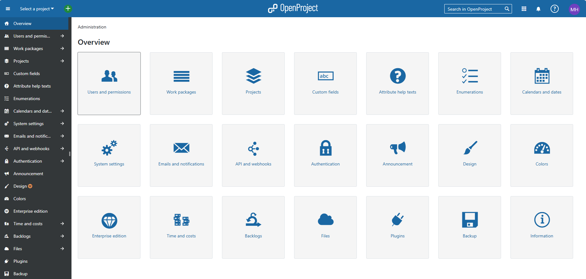

3. Click on Activate

    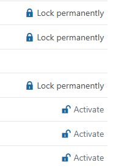

   * You can also Lock unused users.

## Creating a New Project
1. Open OpenProject, you can get to the main page by clicking the OpenProject logo in the upper center region.

    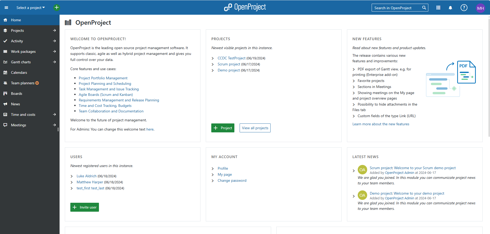

2. Click on *Projects* to open the page used to create and manage active projects in OpenProject

    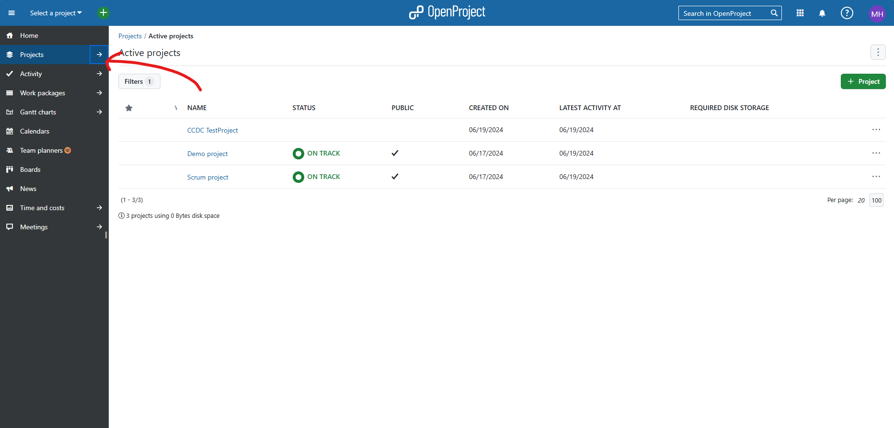

3. Click the green *+ Project* button and give your project a name. You can make the project a sub-project of another.

    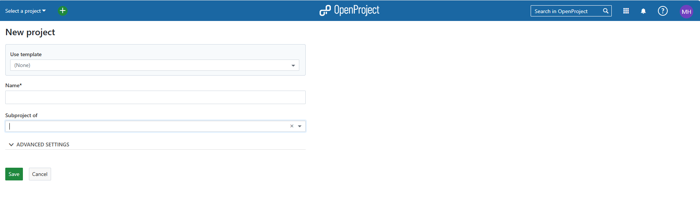

4. Open the Project Settings

    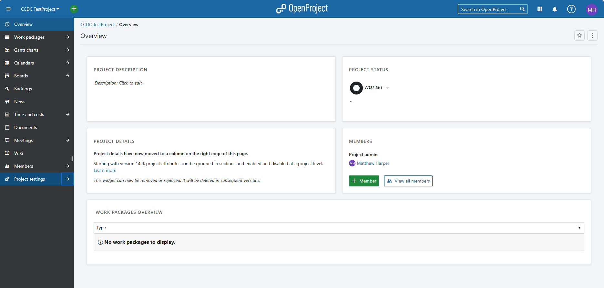

5. Open the Modules section and modify this as you would like. You can [integrate OpenProject](https://www.openproject.org/docs/system-admin-guide/integrations/github-integration/) with Github too!

    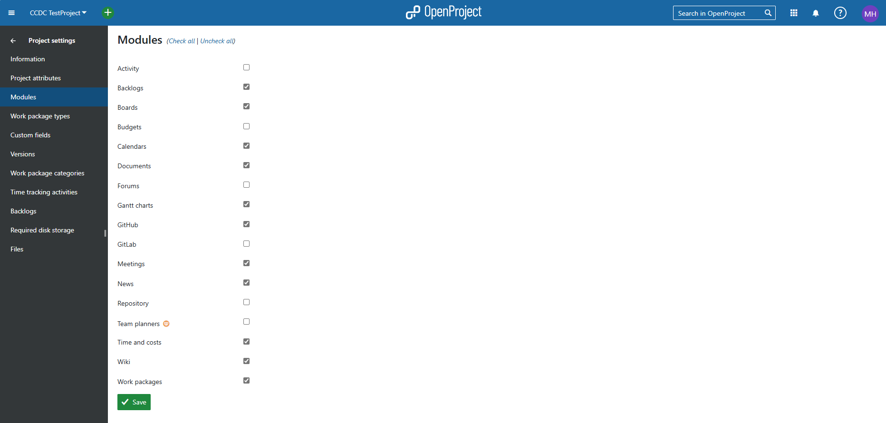

    * OpenProject has a [wiki](https://www.openproject.org/docs/user-guide/home/global-modules/) explaining each of the modules
6. We can chose which work-package types to enable. In this case we have enabled all of them.

    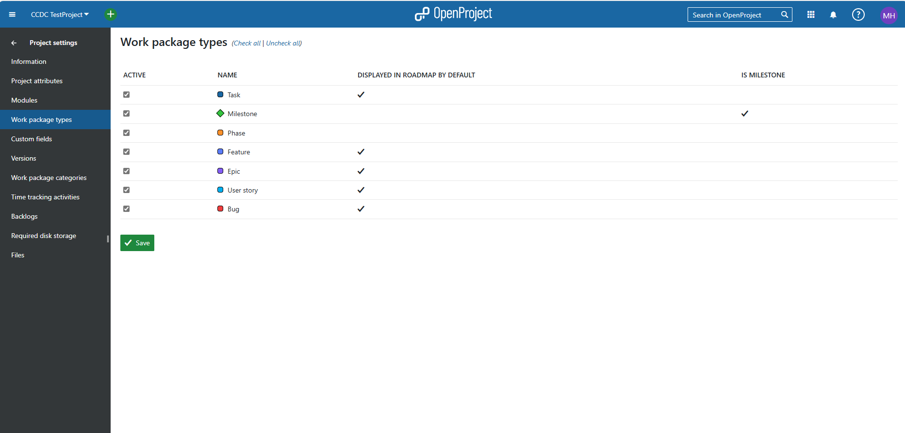

7. If you would like custom felids in the Stories, Epics, Tasks, etc. Then you can create some.

    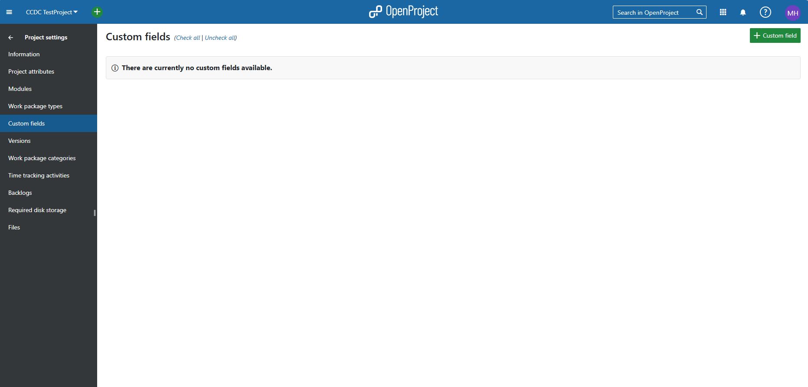
