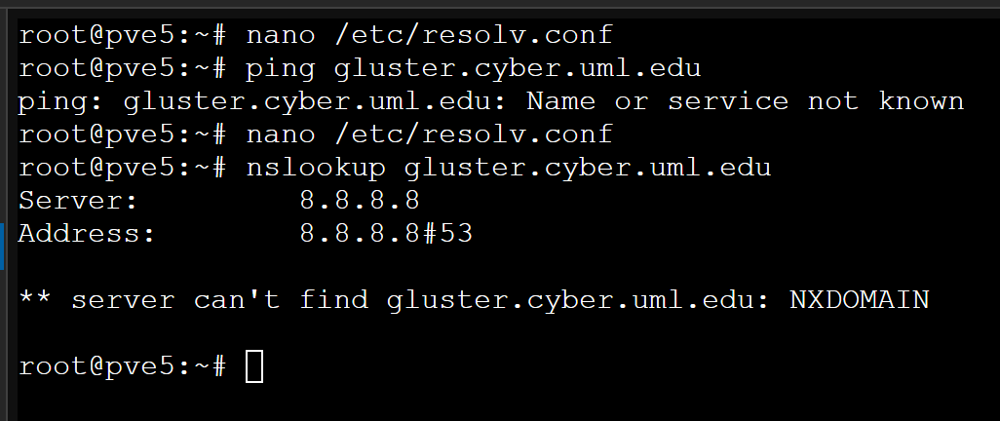
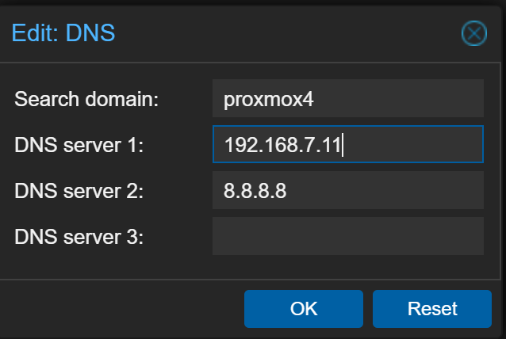
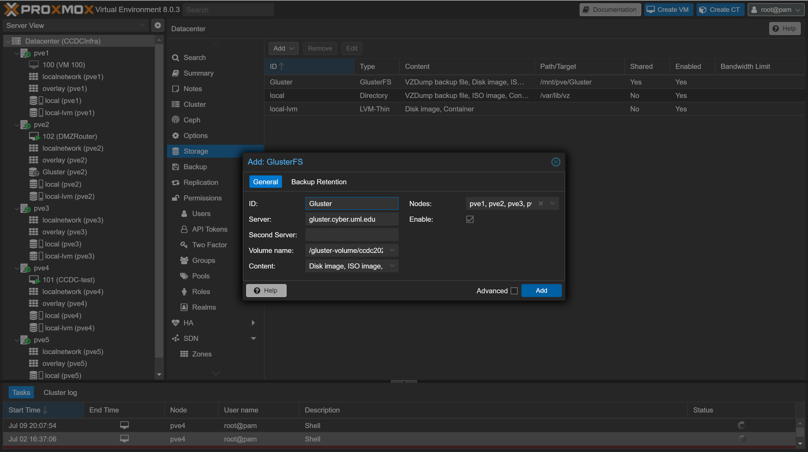

# Gluster <!-- omit from toc -->
Information on Gluster as utilized in the practice setup.

## Table of Contents <!-- omit from toc -->
- [DNS Setup](#dns-setup)
- [Setup Gluster](#setup-gluster)
  - [DataCenter Version](#datacenter-version)
- [Gluster brick created from Files](#gluster-brick-created-from-files)
- [MORE](#more)
- [Error Fixing](#error-fixing)


## DNS Setup
We are utilizing a Gluster volume located in the cyber range. In order to use this, we need to configure the DNS for the host Proxmox machine. To do this we need to edit the */etc/resolv.conf* file, and create additional *nameserver* entries. The **order** of the entries matters.

1. Open the */etc/resolv.conf* file with an editor.

    ```
    vi /etc/resolv.conf
    ```
2. Example of **INCORRECT** Configuration 

    ```
    search proxmox5
    nameserver 8.8.8.8
    nameserver 192.168.7.11
    ```
    * Note that the entry ```nameserver 192.168.7.11``` our internal DNS resolver appears *after* the public DNS server
3. Results of **INCORRECT** Configuration 

    
    * Our Domain Name, ```gluster.cyber.uml.edu``` will attempt to be resolved by the 8.8.8.8 server. This is not good.
4. Example of the **CORRECT** Configuration

    ```
    search proxmox5
    nameserver 192.168.7.11
    nameserver 8.8.8.8
    ```
5. Results of **CORRECT** Configuration 

    
    * Our Domain Name, ```gluster.cyber.uml.edu``` will now be resolved by the 192.168.7.11 server.


We can also modify the DNS through the Web Interface 
1. Open the Proxmox Cluster, Select the instance and open the DNS page as shown below 

    

2. Click Edit and put the *CyberRange* IP in DNS 1, with the *External DNS* in DNS 2

    

3. Select OK

## Setup Gluster
1. Install Gluster-Server and Gluster-Client
    ```
    apt-get install glusterfs-server glusterfs-client
    ```

### DataCenter Version
1. Open Data-center View

    

2. Open Storage Tab

    

3. Click Add, and select GlusterFS

    
    

4. Fill in the information as follow 
    * ID - Some Identifier, name does not matter: Ex. ```Gluster```
    * Server - IP or DNS of Gluster server: Ex. ```gluster.cyber.uml.edu```
    * Second Server - Can be blank
    * Volume Name - Name of volume: Ex. ```/gluster-volume/ccdc2024```
    * Content: ALL (Drop Down Menu) 
    * Nodes: ALL (Drop Down Menu)
    * Enable: Ensure it is checked (This is the default)
    
    

5. Click Add, It may or may not work see [Error Fixing](#error-fixing)
   * You will be done at this point


## Gluster brick created from Files
The following entry is not utilized with the Proxmox Instance. This is based on the article [here](https://www.jamescoyle.net/how-to/2096-use-a-file-as-a-linux-block-device), excluding the loop device steps. 

In doing this we can create a point to create a brick from, *without* partitioning the system. Our issue with PFSense is that LVM is utilized so this is not feasible. 


```
# Make file to fill with zeros later with the /dev/zero "device"
sudo touch /tempffs
# Make mountpoint
sudo mkdir/gluster_brick

# inputfile of the device that always outputs zero (I think) to some file in the root 
# This will create a file of $1 (replace $1 with something) Gigabytes
sudo dd if=/dev/zero of=/tempffs bs=1G count=$1

# Format the file with the ext4 format
sudo mkfs.ext4 /tempffs

# Add to fstab
sudo echo "/tempffs /gluster_brick ext4 defaults 0 2" | sudo tee -a /etc/fstab

# Check if it mounts properly 
sudo mount -a
lsblk
```
## MORE

## Error Fixing

