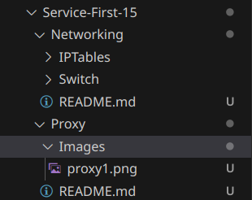

# Injects-Incidents-Infrastructure <!-- omit-from-toc --> <!-- omit in toc -->
This directory contains materials relating to possible injects, incidents and the infrastructure (it's setup) that we are using. Of note should be the section [Writing Guide](#writing-guide) since this is the main reason this README was made.

## Table of Contents <!-- omit-from-toc --> <!-- omit in toc -->
- [Writing Guide](#writing-guide)
  - [All](#all)
  - [Service-Possible-Incidents](#service-possible-incidents)
  - [Service-Possible-Injects](#service-possible-injects)

## Writing Guide
*Initially Written by Matt Harper...*

This document will give a basic structure that should be used for each of the respective assignments *Service-Possible-Incidents*, and *Service-Possible-Injects*.

This may change as requested by the actual coaches. However so we have some **common** structure I made this.

### All 
All documents should be in a folder with the name of your service **SERVICE**, this folder should contain a file named **README.md**. If you have multiple **sub-services** you can create sub-folders for each **sub-services** inside of the **SERVICE** folder with a README in each.

The **README.md** file will contain your writeups.

If your writeup requires *Images* you should create a folder named **Images** in the **SERVICE** Folder where each image for the writeup will be contained.


See this example below:




### Service-Possible-Incidents
This document should contain possible incidents that can happen to your service. This includes how attackers can use your service to gain access to the infrastructure, or how attackers can misconfigure or take down your service.

This should have the following format

```md
# Service Name
What is this service, how important to the infrastructure this is (A web-server is not as critical as Wazuh, or Active Directory)

## Possible Misconfigurations
This section contains information on how your service could be *initially* misconfigured to prevent you from fully utilizing it, or allowing it to work fully.

## Impact
For each possible compromise, how does that impact the infrastructure, does this bring down a critical service. What does it mean when an attacker has compromised this service? Do they have passwords, access to other systems?

## Indicators of Compromise
How can you tell this service was compromised, does it write logs anywhere. Can you create logs when users modify configuration files or run commands?
```

### Service-Possible-Injects
In a slightly different structure from the previous assignment each **SERVICE** or **sub-service** folder should contain one or more files, likely titled *inject1.md*, *inject2.md*, etc.

Each of these readme's should contain information relating to a possible inject

```md
# Service
What is this service, the level of difficulty of this inject.

**Time**: XX (Contains the estimated time of competition)

## Expectations
What should be implemented and completed by the time this inject is completed
1. We should have a list of all users on all machines
2. All unauthorized users should be logged, and locked
3. The password requirements on all Linux machines must bet set to a modern general standard (12 chars, uppercase and lowercase, etc)
4. ...

## Dependencies
What could be attacked while this inject is being implemented to throw those completing it off balance. If a person is auditing users, what happens if more users are added!

## Inject
This is where creative writing skills come into play I guess. Imagine how they could ask you to do this. Then make it more obscure.
```