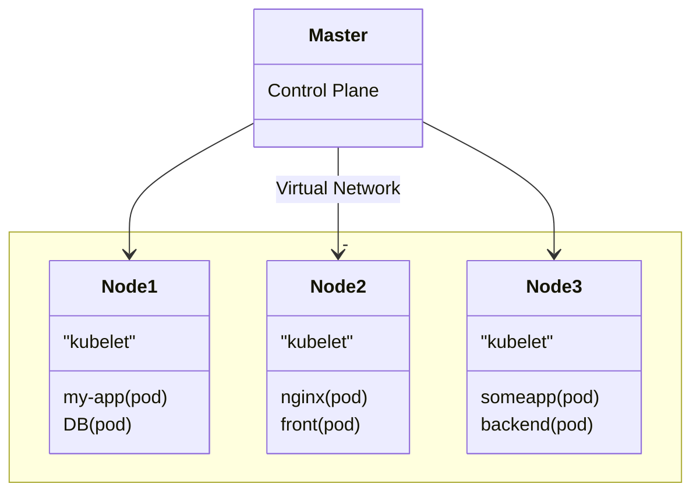
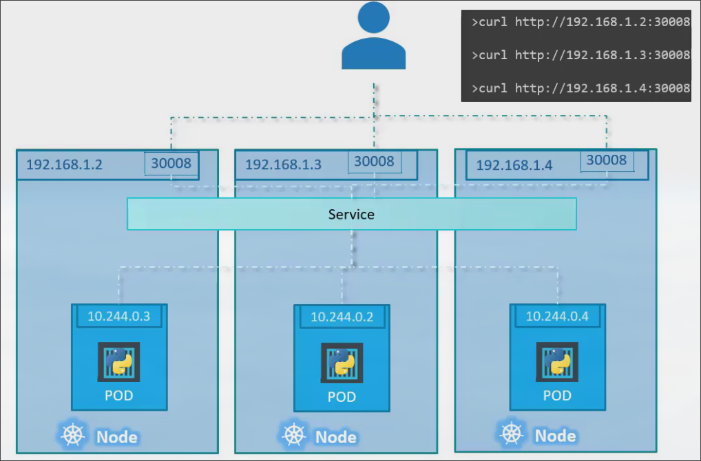
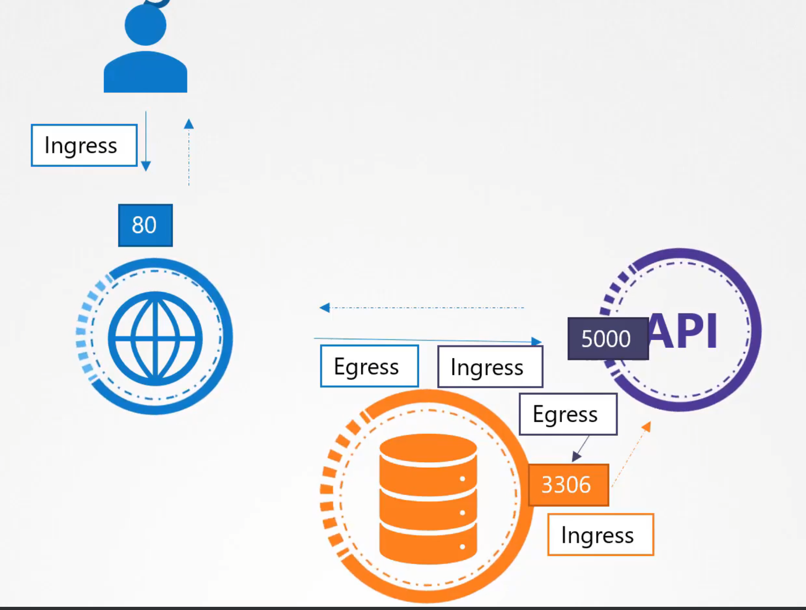
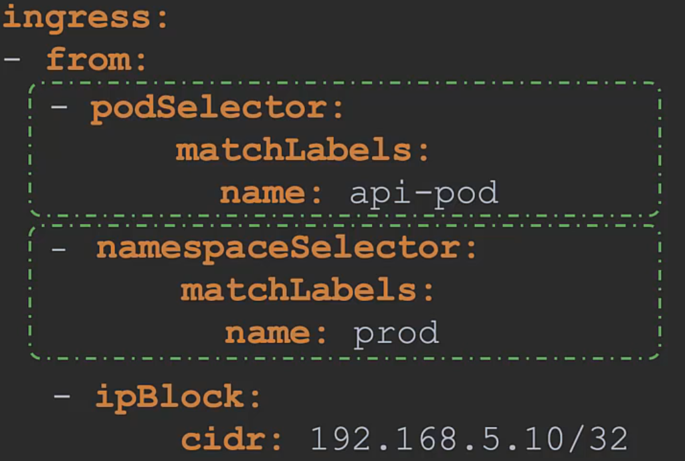

Disclaimer -> Majority of screenshots sourced from [here](https://www.udemy.com/course/certified-kubernetes-administrator-with-practice-tests/)

[toc]

## Terminology

### Main Architecture



#### Control Plane

The master node requires significantly less resources than a worker node, however it is 
an extreme single point of failure. You should have more than 1 Master running in a cluster.

This is running on a physical or virtual machine. It includes the following functionality,

- API Server
  - **All communication, between all components, must go through the API server**
  - Works via exposing `RESTful api` 
    - You post `YAML (manifests)` configuration files to it via `HTTPS` 
      - Which container image, ports to expose, Pod replicas, etc.
  - Auth flow 
    - Request to API server is subjected to authorization and authentication
    - Config in the YAML file is validated and persisted to the cluster store.
    - Changes are scheduled to the worker nodes.
  - What are some examples that would talk to this?
    - Kubernetes UI Dashboard
    - API for scripts / automating technologys
    - CLI tools
- Cluster Store 
  - Only `Stateful` part of control Plane
  - Based on `etcd`
    - A database is a key-value store. (Think of a table)
    - The issue with this, is if you add a column, and not every row has a value for it, you are wasting space.
    - In etcd, instead of 1 large table, every row is instead its own table.
    - You can run etcd by itself on a server, runs on port 2379.
  - `Single source of truth` for the cluster 
  - Persistently stores entire configuration and state of the cluster 
  - For `HA` , 3-5 etcd replicas is recommended.
  - Default K8 installs replica of etcd on every `control plane` and auto configures `HA`
  - Uses `RAFT` algorithm to handle multiple writes to single location.
  - Holds at any time the current state of the Kubernetes cluster.
    - Config data
    - Status data
    - Backup and Storage is made from this (snapshots)
  - etcd is deployed by kubeadm as a pod for this.
- Controller Manager (Kube-Controller-Manager)
  - Keeps track of whats happening in the cluster.
  - Node-Controller
    - On-Boarding new nodes to the cluster 
    - Handling when nodes get destroyed / unavailable
    - Checking the status of nodes 
    - Node monitor period is every 5 seconds 
    - Communicates through the kube-apiserver
    - If it receives no response from a node, it waits 40 seconds before marking it unreachable.
      - Waits another 5 mins after marked, then removes the node and deploys the pods on it onto other nodes if they are part of a ReplicaSet
  - Replication-Controller
    - Ensures desired number of containers are running at all times in a replication group.
    - Communicates via kube-apiserver
    - If pod dies, it creates another one.
- Scheduler (Kube-Scheduler)
  - Decides on which `Node` each `Pod` should be scheduled
  - Keep in mind, this does not create the pods on the node. It communicates via the kube-apiserver to the kubelet on the node it has chosen to create the pod.
  - Assigns pods based on requirements using 2 stages.
    - First stage filters nodes by removing any nodes that cant support the pod (needs 3 cpus only has 2)
    - Second stage ranks the remaining filtered nodes on scale of 0-10 by calculating the amount of free resources that would be available on the given node after placing the pod on it. Higher score wins (smaller impact).
  - For example.


  - ```mermaid 
    classDiagram
    Master --> Node1 : 20% used
    Master --> Node2 : 70% used 
    Master : Control Plane
    Node1 : "Worker"
    Node1 : kubelet
    Node2 : "Worker"
    Node2 : kubelet
    ```

  - The `Pods` will be scheduled on `Node1`

As a general overview of the above functionality, see the below diagrams.


#### Pod


- Usually 1 Application Per Pod
- Each Pod gets its own `internal` IP Address
- When a pod crashes and is re-created, it is given a new IP address
- Container within Node.

- Ingress
  - Handles forwarding to services.
  - If you wanted https://my-app.com instead of http://db-service-ip:port then you 
  would set up an Ingress. The request would first go to the ingress, then be forwarded to the service.
- Service 
  - Permanent IP address that can be attached to a pod.
  - Even if pod dies, the service is persistent.
  - Acts as a load balancer as well 
    - Will send requests to whichever Pod is less busy.
  - Internal Service 
    - Used when accessing a Pod directly
    - http://db-service-ip:port
  - External Service 
    - Used when accessing a Node 
    - http://node-ip:port 

#### Node


Three major components
- Kubelet (Captain of ship.)
  - Watches `API` server for new work tasks
    - If it cannot complete it, it tells control plane and lets it decide.
  - Also registers cpu, memory, and storage into wider cluster pool.
  - On every node. This is what handles the initial join as well.
- Container runtime (`containerd`)
  - Btw, `containerd` is just stripped down version of `docker`
  - Pulling and running images.
- Network Proxy (Kube-proxy)
  - Responsible for local cluster networking.
  - Ensures each node gets its own unique IP 
  - implements iptables to handle routing and load-balancing traffic 
    - Every time a new service is created, it creates appropriate rules on each node to forward traffic from service to appropriate pod.
  - You have a web server in one container on node a, and you have a db running in one container in 
    node b. The `kube-proxy` handles this communication.

#### Replica Set


- This is the newer version of the **Replication Controller** that is being implemented now.
- The values explained before for Replication-Controller hold the same here.
- Uses labels and selectors to understand which pods to monitor. 
  - This can be newly created, or already created pods, as long as they match the label.
- If you were to define 3 replicas in a replica set, and had 3 nodes already existing with a matching label, then it would deploy NO new pods.
- When scaling pods, always update via the yaml file, and just run replace command to push it.

#### Deployment


- Adds on functionality to our replicasets.
- Functionality
  - Version Control of Docker Instances
  - Rolling updates 
  - Rollbacks 
  - Ability to pause and resume environment to change requirements in-between. (underlying app version, resource allocation, etc.)

#### Services

##### NodePort


Key thing to understand. The NodePort service has its own IP within the cluster, known as the cluster IP. Think of the service as its own virtual server within the node.

1. TargetPort: Where the service forwards the requests to.
2. Port: This is the node exposed on the service (virtual server) to communicate with the pod.
3. NodePort: Used to access the webserver/application externally. (30000 to 32767)

**You would access the service above with the following -> curl http://nodeIP:30008**

The only required field in a yaml file is the Port. If you don't provide a TargetPort, it is assumed to be the same as the port. If you dont provide a NodePort, it is given a free port within the valid range automatically.

Also, regarding yaml, ports: is an array, so you must add, **-** ,before the initial field. More examples in yaml section below.

**Okay, but what about when you have replicaSets going and have multiple pods across multiple nodes??**

Its easy. First thing to understand is that when you have the deployment set up, your replicated pods all have the same key:value pair under labels. This is where the selector in the Service comes in! It looks for anything with these, and will forward the request to the least busy pod matching the pair. See below.


Okay, now that you understand that, it should be pretty simple to grasp how it works across multiple nodes. The service is deployed across the cluster, so its interacting with all the nodes. All it is doing is searching for that label on the pods, and then deciding the best one to send it to. It is also good to note, it is manually accessible from all the nodes IPS.




##### ClusterIP 

Kubernetes creates a default ClusterIP service called `kubernetes`.

So, above works for pods of the same type. But what if we need to have multiple different types of pods interact with eachother, the example below is a great example of a full-stack deployment. The major issue being, PODS are constantly destroyed, and assigned new IP addresses, so trying to communicate via that is somewhat annoying. Instead, we introduce the ClusterIP service as a middle-man. Both the back-end and redis in the image below are ClusterIPS. They take in the requests from the pod and forward it to any open pods, similiar to how nodeport forwards to anything open.


##### LoadBalancer

**Very important to understand, THIS ONLY WORKS ON SUPPORTED CLOUD PLATFORMS (Google Cloud Platform, AWS, Azure, etc)**

Instead of having to set up a vm + nginx or some type of proxy manager to handle load balancing manually, you can set up the built in LoadBalancer which supports supported cloud platform native load-balancing.

If you did this on an unsupported platform, it would handle itself the same as a NodePort.

#### Labels, Selectors and Annotations

- Labels are attached as a key:value pair.
  - These are used to add identifiers to an object.
  - For example, I may add a label to my web server as the following,
    - function: front-end 
- Selectors are how we can search through all our labels.
  - From the example above, I could select the following,
    - function=front-end 
  - Which would give me all my front-end objects.
- Annotations are just that, they are way to add some extra information.
  - For example, I may add that the current buildVersion is 1.3.


#### Taints and Tolerations

- Taints are applied to nodes.
- Pods cannot be placed on a node with a taint, unless they are tolerant to that taint.
- Taints have taint effects, which apply to pods that do not tolerate the taint.
  - NoSchedule
  - PreferNoSchedule
  - NoExecute
    - When applied to a node with existing pods, any pods not tolerant of the taint will be killed (ejected from that node).
- The master node automatically has a taint applied, that is why nothing gets placed on it.
- `Key Concept:` Taints only restrict pods from being placed on them. They do NOT gaurentee that a pod will be placed on a node just because it is tolerant.


#### Namespaces

Great for isolation (resource isolation, not security isolation)

A `key takeaway` here, the namespace encapsulates pods across nodes. It is not restricted to a specific node.


- At startup, kubernetes creates 3 namespaces.
  - Default 
    - Where everything you create is normally put.
  - kube-system
    - Isolated from user so they arent accidently deleted.
    - Networking solution, DNS service, etc.
  - kube-public
    - Resources that should be made available to all the users are created.
- You can specify a `pods` namespace in the yaml under metadata as well.
- You can assign a quota of resources to each namespace, restricting a specific amount to each.
- Resources inside a namespace can refer to themselves with their own name. 
  - For example, mysql.connect("db-service")
- Resources in different namespaces can do this with a slightly different approach.
  - mysql.connect("db-service.dev.svc.cluster.local")
  - lets break this up,

| db-service    | dev    | svc    | cluster.local    |  
|---------------- | --------------- | --------------- | --------------- |
| Service Name    | Namespace    | Service    | Domain    |

  
#### ResourceQuota

These are used in conjunction with namespaces to actually specify how much resources you want to give each namespace. For example, you can limit the cpu, memory, pods, etc.


#### Node Selectors and Affinity

- Node selectors are simple and easy. 
  - They mirror regular selectors with key:value pairs.
  - Nodes must be labeled beforehand. 
  - Limited in capability, cannot say "I want to place on a large OR medium"
- This is where node afinity takes over.
  - See the yaml file example below for an explanation.
  - A big part is the `requiredDuringSchedulingIgnoredDuringExecution`.
  - To wrap our heads around this, Pods have 2 stages, `DuringScheduling` and `DuringExecution`, with the latter occuring first.
    - When we do `requiredDuringSchedulingIgnoredDuringExecution`, we are saying `DuringScheduling`the pod MUST match with the correct affinity of a node or it will not be deployed. 
      - This is used when the pod `placement` is `crucial`.
    - The other option, `preferredDuringSchedulingIgnoredDuringExecution`, is 
      - This is when the placement is `wanted`, but `not crucial`. 
    - It will prefer a node with the correct affinity, but it will still deploy to a node without one.
  - For the second part `IgnoredDuringExecution`, this refers to pods that are already running (aka pods that are past `DuringScheduling`). 
    - If you update this value for these running pods, they will ignore it.
    - In newer versions, they are adding one to shutdown pods when updated. (required, required.)


#### Affinity Vs Taint

- If you want to guarantee a certain pod gets placed on a certain node -> `Affinity`
  - Pods without affinity can also get placed on the same `node`
- If you want to guarantee a certain pod does not get placed on a certain node -> `Taint`
  - A pod you want on the tainted node could still be placed on an untainted node.
- If you want to guarantee only certain pods get placed on certain nodes -> `Affinity and Taint`

#### Container Runtime Engine

- All the components in the master node can be deployed in containers.
- All our applications are deployed in containers.
- The DNS service and networking solution can be deployed in containers.

So, how do we run them! That is what the runtime engine is for. We need something that can handle running 
all these different containers. 

- Docker Engine
- Containerd 
- Rocket

Kubernetes allows different container runtimes as long as they adhere to the `OCI (Open Container Initiative)`. However 
Docker was before Kubernetes, so they were not designed around OCI. To fix this, Kubernetes introduced `dockershim`, which 
was a bridge of sorts for supporting docker. **Dockershim is no longer supported**.

##### Docker Vs. Containerd 

- Docker is built from numerous pieces.
  - CLI 
  - API 
  - BUILD 
  - VOLUMES 
  - AUTH 
  - SECURITY 
  - containerd (their runtime for containers.)
- Containerd is a PART of docker.
  - It is `CRI` compatible, aka it conforms to `OCI`, so you can strip this away from the 
  - comes with `ctr`, which provides limited set of features to interact with containers. Mainly used for debugging containerd.
  - `nerdctl` is a much better alternative for cml interactions with containerd. Basically 1to1 sub for docker commands.

#### Visual Example of Architecture

This is an example of interaction with Architecture when creating a pod directly via a POST request.


**source -> Mumshad Mannambeth Udemy course**

3 initial steps always take place 

1. Authenticate the user 
2. Validate the request 
3. Retrieve data.

4. Now, the **kube-apiserver** creates a pod for the request without assigning it to a node. It then updates the information in the etcd server that a new pod has been created, and then goes and updates the user that the pod has been created. So in this stage it goes, 

        User -> kube-apiserver -> etcd -> kube-apiserver -> user.

5. Now, the scheduler is always monitoring the kube-apiserver. It notices that there is a new pod there with no node assigned. It does things behind the scene as discussed above to decide what node to place the pod on, then tells the kube-apiserver the node it decided. The kube-apiserver then updates the information in the etcd cluster. So in this stage it goes, 

        scheduler -> kube-apiserver -> etcd

6. Then it communicates with the chosen node via the **kubelet** and passes on the pod information. The kubelet creates the pod on the node, and instructs the **container runtime engine** to deploy the application image. Once deployed, the kubelet tells the kube-apiserver the status of the newly created pod. Finally, the kube-apiserver updates the data in the etcd cluster. So in this stage it goes,

        kube-apiserver -> kubelet -> container runtime engine -> kubelet -> kube-apiserver -> etcd

### Additonal Concepts

#### Imperative vs Declarative

##### Imperative

A series of steps on how to reach a goal.


In the `k8` world, multiple kubectl commands focused on the same goal are Imperative.

##### Declarative

A single statement of what your goal is.


In the `k8` world, those multiple commands above would be put into a yaml file, and you would only need to run apply for everything to occur.

`Presented Issue` : You have a database running on a pod. You assign an address to access the DB and call it 
something like service-mongo-db. You then change the address, and need to change it for the service as well. Normally,
you would change it, Re-Build the image, push to the repo, and then pull into pod.

`Solution` :

##### ConfigMap (cm)

<mark style="color:purple">**NON CONFIDENTIAL DATA ONLY NO SECRETS**</mark>

Takes care of external configuration for your application.

For above, 
DB_URL=service-mongo-db  
change simply at this configuration point.  
DB_URL=mongo-db  

##### Secret 

Similiar to ConfigMap, but it is used to store secret data. (Passwords, certificates, etc.)

DB_USER=mongo-user
DB_PASS=mongo-pass

Stored in base64, <mark>NOT ENCRYPTED BY DEFAULT</mark>. Requires third party tools to handle actual encryption

#### Networking

##### Docker Networking


##### K8 Networking

###### Ports 

    Control plane
    Protocol	Direction	Port Range	Purpose	Used By
    TCP	Inbound	6443	Kubernetes API server	All
    TCP	Inbound	2379-2380	etcd server client API	kube-apiserver, etcd
    TCP	Inbound	10250	Kubelet API	Self, Control plane
    TCP	Inbound	10259	kube-scheduler	Self
    TCP	Inbound	10257	kube-controller-manager	Self

    Worker node(s)
    Protocol	Direction	Port Range	Purpose	Used By
    TCP	Inbound	10250	Kubelet API	Self, Control plane
    TCP	Inbound	30000-32767	NodePort Services†	All

- For etcd in the control plane
  - 2380 is used for when you have multiple control planes.
  - 2379 is for the majority of connections. (Where all control plane components connect to)

#### Volumes (vol)

Kubernetes itself does not provide data persistance. You are responsible for backing up the data.

Physically attaches remote or local storage to a pod. Makes data persistent upon re-deployment of pods.

#### Replication

You will normally have `nodes` replicated, so that the services running on the `pods` within have some `HA`.

How do we do this?

Create a,

##### Deployment (deploy)

**Used for Stateless apps**

This is basically a blueprint for one of your pods. It allows you to say you want x blueprints available
compared to having to create each pod. Allows you to scale up and down.

- Abstraction of pods.

- Important aspect. Lets say you have a pod that is consistently writing to a volume. You cannot use just
a blueprint on it, as they would need some mechanism to manage the writes (think of a lock file)

To fix this, we have, 

##### Statefulset (sts)

**Used for Stateful apps or databases**

Substitute of deployments that is used for databases. 

These are also a pain. So it is better practice to host DB's outside of the cluster. However,
if that is not possible then you can use this.


#### Security

##### Host Machine Security

The first thing you need to do is secure the Host machine itself. At a bare minimum this means Password based authentication is disabled for SSH, SSH keybased authentication is enabled and used, and a simple hardening process has been conducted.

##### API-Server Security

###### Basic Authentication (Not recommended ever)

- Can create csv file with password,username,userid in the following format
  - password123,user,u0100
- You would then suppply this to the kube-apiserver.service file at the end of the ExecStart= block
  - --basic-auth-file=user-details.csv
- If you used kubeadm to deploy the server, you must also update that file with the following line. It should be located at /etc/kubernetes/manifests/kube-apiserver.yaml
  - --basic-auth-file=user-details.csv
- You could then check the authentication to the api server with the following command
  - curl -v -k https://master-node-ip:6443/api/v1/pods -u "user1:password123"


Full walkthrough for Kubeadm

Create a user/password file like this

    # User File Contents
    password123,user1,u0001
    password123,user2,u0002

Edit the kube-apiserver static pod manifest located at

    /etc/kubernetes/manifests/kube-apiserver.yaml


You are going to want to add the volumeMount and volume respectively for where you are storing the auth file.

        volumeMounts:
        - mountPath: /tmp/users
          name: usr-details
          readOnly: true
    volumes:
    - hostPath:
        path: /tmp/users
        type: DirectoryOrCreate
      name: usr-details

Under containers -> - command you are going to want to also add the following option which is the path to your auth file.

    - --basic-auth-file=/tmp/users/user-details.csv

Finally, you would need to create the necessary roles and role bindings for these users you are listing

    ---
    kind: Role
    apiVersion: rbac.authorization.k8s.io/v1
    metadata:
      namespace: default
      name: pod-reader
    rules:
    - apiGroups: [""] # "" indicates the core API group
      resources: ["pods"]
      verbs: ["get", "watch", "list"]
    
    ---
    # This role binding allows "jane" to read pods in the "default" namespace.
    kind: RoleBinding
    apiVersion: rbac.authorization.k8s.io/v1
    metadata:
      name: read-pods
      namespace: default
    subjects:
    - kind: User
      name: user1 # Name is case sensitive
      apiGroup: rbac.authorization.k8s.io
    roleRef:
      kind: Role #this must be Role or ClusterRole
      name: pod-reader # this must match the name of the Role or ClusterRole you wish to bind to
      apiGroup: rbac.authorization.k8s.io

You can test the authentication with,

    curl -v -k https://localhost:6443/api/v1/pods -u "user1:password123"


###### TLS in Kubernetes Manually

Server certificates for Servers

- Kube-API Server
- ETCD Server
- Kubelet Server

Client certificates for Clients (All authenticate to kube-api server)

- admin
- kube-scheduler
- kube-controller-manager
- kube-proxy

Special Cases

- The kube-api server acts as a client when talking to the etcd server. It can use its server certificates for this, or create seperate ones as a client.
- The kube-api server does the same with the kubelet server and vise versa.

A kubernetes cluster requires atleast 1 certificate authority to verify all the above certificates.

Lets now take a look at generating the certificates. Our first steps will be getting the CA up and running. 

**Keep in mind this section is for a kubernetes cluster that was deployed "the hard way" , not using kubeadm. When deploying a cluster with kubeadm, the following process is automated and done during the initiation phase.**

First generate the keys

    openssl genrsa -out ca.key 2048

Then generate the Certificate signing request

    openssl req -new -key ca.key -subj "/CN=KUBERNETES-CA" -out ca.csr

Sign the certificate (Self signed by CA)

    openssl x509 -req -in ca.csr -signkey ca.key -out ca.crt

__Lets move on to the client certificates. Lets start with the admin certificate.__

First generate the keys

    openssl genrsa -out admin.key 2048

Then generate the Certificate signing request. Notice the /O, this is a existing group inside kubernetes that identifys the user as an admin.

    openssl req -new -key admin.key -subj "/CN=kube-admin/O=system:masters" -out admin.csr

Sign the certificate (Signed by CA, so it is now valid inside cluster)

    openssl x509 -req -in admin.csr -CA ca.crt -CAkey ca.key -out admin.crt


__Lets do the kube-scheduler client certificate__

First generate the keys

    openssl genrsa -out scheduler.key 2048

Then generate the Certificate signing request and pass the above config to it.

    openssl req -new -key scheduler.key -subj "/CN=system:kube-scheduler" -out scheduler.csr

Sign the certificate (Signed by CA, so it is now valid inside cluster)

    openssl x509 -req -in scheduler.csr -CA ca.crt -CAkey ca.key -out scheduler.crt

__Lets do the kube-controller-manager client certificate__

First generate the keys

    openssl genrsa -out controller-manager.key 2048

Then generate the Certificate signing request and pass the above config to it.

    openssl req -new -key controller-manager.key -subj "/CN=system:kube-controller-manager" -out controller-manager.csr

Sign the certificate (Signed by CA, so it is now valid inside cluster)

    openssl x509 -req -in controller-manager.csr -CA ca.crt -CAkey ca.key -out controller-manager.crt


__Lets do the kube-proxy client certificate__

First generate the keys

    openssl genrsa -out kube-proxy.key 2048

Then generate the Certificate signing request and pass the above config to it.

    openssl req -new -key kube-proxy.key -subj "/CN=system:kube-proxy" -out kube-proxy.csr

Sign the certificate (Signed by CA, so it is now valid inside cluster)

    openssl x509 -req -in kube-proxy.csr -CA ca.crt -CAkey ca.key -out kube-proxy.crt


Okay, how do we use these certificates? Lets take the admin one for example. There are two ways we can use it. Either directly calling the REST API on the cml, or including it into kube-config on the client.

Via cml

    curl https://kube-apiserver:6443/api/v1/pods --key admin.key --cert admin.crt --cacert ca.crt

Via kube-config.yaml, you can check yours with kubectl config view, and edit the file directly at ~/.kube/config

    apiVersion: v1
    clusters:
    - cluster:
        certificate-authority-data: ca.crt
        server: https://xxxxxx:6443
      name: kubernetes
    ...
    kind: Config
    users:
    - name: kubernetes-admin
      user:
        client-certificate-data: admin.crt
        client-key-data: admin.key

As a general rule of thumb, the CA certificate must be specified for every client and server so it can correctly authenticate itself.

__Lets now do the server ones starting with the kube-api server certificate__

First generate the keys

    openssl genrsa -out apiserver.key 2048

We must also create an openssl config file -> openssl.cnf , to account for the other names people refer to the apiserver as.

    [req]
    req_extensions = v3_req
    distinguished_name = req_distinguished_name
    [ v3_req ]
    basicConstraints = CA:FALSE
    keyUsage = nonRepudiation,
    subjectAltName = @alt_names
    [ alt_names ]
    DNS.1 = kubernetes
    DNS.2 = kubernetes.default
    DNS.3 = kubernetes.default.svc
    DNS.4 = kubernetes.default.svc.cluster.local
    IP.1 = clusterIP
    IP.2 = clusterIP

Then generate the Certificate signing request and pass the above config to it.

    openssl req -new -key apiserver.key -subj "/CN=kube-apiserver" -out apiserver.csr -config openssl.cnf

Sign the certificate (Signed by CA, so it is now valid inside cluster)

    openssl x509 -req -in apiserver.csr -CA ca.crt -CAkey ca.key -out apiserver.crt

__Lets do the kubelet client certificates__

For the kubelet clients, each node needs its own certificate in the naming scheme node01 - nodexxxx etc. You must also edit each kubelet-config.yaml file for each node to add the clientCAFile (ca cert) and the tlsCertFile (client cert) and tlsPrivateKeyFile (client key).

First generate the keys

    openssl genrsa -out node01.key 2048

Then generate the Certificate signing request and pass the above config to it.

    openssl req -new -key node01.key -subj "/CN=node01" -out node01.csr

Sign the certificate (Signed by CA, so it is now valid inside cluster)

    openssl x509 -req -in node01.csr -CA ca.crt -CAkey ca.key -out node01.crt

You would also need to create a certificate on each node to communicate with the kube-api server. (The above is for the kube-client server.) These would need the following with the naming scheme system:node:node01 and be in group SYSTEM:NODES

First generate the keys

    openssl genrsa -out node-node01.key 2048

Then generate the Certificate signing request and pass the above config to it.

    openssl req -new -key node-node01.key -subj "/CN=system:node:node01/O=system:nodes" -out node-node01.csr

Sign the certificate (Signed by CA, so it is now valid inside cluster)

    openssl x509 -req -in node-node01.csr -CA ca.crt -CAkey ca.key -out node-node01.crt

The kube-api server now has 3 certificates

- apiserver.crt / apiserver.key
- apiserver-kubelet-client.crt / apiserver-kubelet-client.key
- apiserver-etcd-client.crt / apiserver-etcd-client.key

Where do these get passed in? 


Well, if we check the kubeapi config @ /etc/systemd/system/kube-apiserver.service , we get

    ...
      ...
      # The CA file
      - --client-ca-file=/etc/kubernetes/pki/ca.crt 
      ...
      # APISERVER-etcd-client certificates
      - --etcd-cafile=/etc/kubernetes/pki/etcd/ca.crt
      - --etcd-certfile=/etc/kubernetes/pki/apiserver-etcd-client.crt
      - --etcd-keyfile=/etc/kubernetes/pki/apiserver-etcd-client.key
      - --etcd-servers=https://127.0.0.1:2379
      # APISERVER-kubelet-client certificates
      - --kubelet-client-certificate=/etc/kubernetes/pki/apiserver-kubelet-client.crt
      - --kubelet-client-key=/etc/kubernetes/pki/apiserver-kubelet-client.key
      ...
      # APISERVER certificates
      - --tls-cert-file=/etc/kubernetes/pki/apiserver.crt
      - --tls-private-key-file=/etc/kubernetes/pki/apiserver.key
    ...


If we check the kubelet config @ /etc/systemd/system/kubelet.service we get

    ...
    users:
    - name: system:node:k8-master-1
      user:
        client-certificate: /var/lib/kubelet/pki/kubelet-client-current.pem
        client-key: /var/lib/kubelet/pki/kubelet-client-current.pem

###### Proccess of Interacting with Certificates API via Kubectl

When interacting with kubernetes, you can handle the acceptance and distribution of certificates via the certificates api, compared to having to manually go into the cluster each time and add the certificates. The following is a full example process of this.

This whole process is mostly handled by the controller-manager. It also has two options where you can specify the clusters signing cert file and signing key file, under `/etc/kubernetes/manifests/kube-controller-manager.yaml`

Create some temporary fields to, can remove as needed. 

```bash
export VAULT_K8S_NAMESPACE="vault" \
export VAULT_HELM_RELEASE_NAME="vault" \
export VAULT_SERVICE_NAME="vault-internal" \
export K8S_CLUSTER_NAME="cluster.local" \
export WORKDIR=/tmp/vault
```

Generate private key (Locally)

    openssl genrsa -out ${WORKDIR}/vault.key 2048

Create CSR (Certificate Signing Request) config file. This is required when there can be multiple domains associated with your certificate, like in the example below it can be .namespace, .servicename, etc.

```bash
cat > ${WORKDIR}/vault-csr.conf <<EOF
[req]
default_bits = 2048
prompt = no
encrypt_key = yes
default_md = sha256
distinguished_name = kubelet_serving
req_extensions = v3_req
[ kubelet_serving ]
O = system:nodes
CN = system:node:*.${VAULT_K8S_NAMESPACE}.svc.${K8S_CLUSTER_NAME}
[ v3_req ]
basicConstraints = CA:FALSE
keyUsage = nonRepudiation, digitalSignature, keyEncipherment, dataEncipherment
extendedKeyUsage = serverAuth, clientAuth
subjectAltName = @alt_names
[alt_names]
DNS.1 = *.${VAULT_SERVICE_NAME}
DNS.2 = *.${VAULT_SERVICE_NAME}.${VAULT_K8S_NAMESPACE}.svc.${K8S_CLUSTER_NAME}
DNS.3 = *.${VAULT_K8S_NAMESPACE}
IP.1 = 127.0.0.1
EOF
```There was a formatting error, skip this line when copying. (include the EOF in the above line though)
```
Generate CSR (Certificate Signing Request) from above config and private key. You can do this without the config if not required.

    openssl req -new -key ${WORKDIR}/vault.key -out ${WORKDIR}/vault.csr -config ${WORKDIR}/vault-csr.conf

Create CSR (Certificate Signing Request) Yaml file to send to Kubernetes. This is what is important. 

```bash
cat > ${WORKDIR}/csr.yaml <<EOF
apiVersion: certificates.k8s.io/v1
kind: CertificateSigningRequest
metadata:
  name: vault.svc
spec:
  signerName: kubernetes.io/kubelet-serving
  expirationSeconds: 8640000
  request: $(cat ${WORKDIR}/vault.csr|base64|tr -d '\n')
  usages:
  - digital signature
  - key encipherment
  - server auth
EOF
```

The above in its normal yaml format.

```yaml
apiVersion: certificates.k8s.io/v1
kind: CertificateSigningRequest
metadata:
  name: vault.svc
spec:
  signerName: kubernetes.io/kubelet-serving
  expirationSeconds: 8640000
  # You could also manually supply this, by base64 decoding the .csr file and putting the contents here. This is just easier.
  request: $(cat ${WORKDIR}/vault.csr|base64|tr -d '\n')
  usages:
  - digital signature
  - key encipherment
  - server auth
```

Send to cluster

    kubectl create -f ${WORKDIR}/csr.yaml

Approve CSR with Cluster

    kubectl certificate approve vault.svc

Confirm certificate signed

    kubectl get csr

####### Store cert + key in Kubernetes secret store

Retreive cert from kubernetes to local and store in crt file.

    kubectl get csr vault.svc -o jsonpath='{.status.certificate}' | openssl base64 -d -A -out ${WORKDIR}/vault.crt

Retreive kube CA certificate from kubernetes to local

```bash
kubectl config view \
--raw \
--minify \
--flatten \
-o jsonpath='{.clusters[].cluster.certificate-authority-data}' \
| base64 -d > ${WORKDIR}/vault.ca
```

##### Network policies

###### Kubernetes Networking Policies

By default, Kubernetes is designed as an Allow all mesh, where everything can talk to everything. 

Within and without kubernetes there is `Ingress` and `Egress`. These are decided from the perspective of the object, where incoming is ingress and outgoing is egress.

This example explained it well for me, you have a web server hosted on kubernetes.

- The user requests something from the web server on port 80.
- The web server in turn communicates with the API on port 5000.
- The API has to communicate with the etcd on port 3306.

This is visualized as the following,



A few points to make this image more clear.

- From the web servers perspective (blue on the left), it has ingress on port 80 from the user, out egress on port 5000 to the API.
- From the apis perspective, it has ingress from the web server on port 5000, and egress on port 3306 to etcd
- From etcd perspective, it has ingress on port 3306 from the api, and egress on 3306 TO the api.

If we were to convert these into rules, we would be left with the following,


Lets run with this idea, what if we dont want the website to access the etcd directly, but be forced to communicate via the api to reach it. To accomplish this, we would create an ingress network policy for the etcd pod that only allows ingress from the api. When you create the policy, it goes from allow all to only that rule, so you do not have to block by default. 

Also, you do not have to worry about returning traffic. If you allow ingress from somewhere, egress related to that ingress is automatically allowed out. It is the same as normal networking where you typically allow connected, established. 

However, it is extremely important to realize the following difference, although my communication is allowed back if I allow ingress from the API pod, unrelated communication is NOT allowed unless specifically stated. For example, if the etcd pod was trying to make an API call unrelated to the current communication, it would not be allowed without the proper egress rule.

OKAY! Lets recap.

- We can now block and allow certain traffic to and from pods by using selectors and labels.

But, what if we have pods in other namespaces like dev, test and prod, and we only want the pod to be matched (and allowed traffic) in our current namespace. EASY! See below examples on network policies, but you would just add a namespaceSelector field. I am pointing this out here so you realize that other namespaces could have the same labels and end up unintentionally being allowed. You could also use this namespace selector to only allow communication inside a namespace without restricting the pod.

The final case to consider, what about an IP outside of the kubernetes cluster? Simple again, just use an ipBlock object. This is where another extremely `important` detail comes up.



In the above example, notice the 3 - next to podSelector, namespaceSelector, and ipBlock. Since these are all seperated, they are all OR rules. If any of the three match traffic is allowed, now compare that to below. 


In thios above example, notice it is now only 2, and namespaceSelector is part of the podSelector array. In this scenario, the traffic must match the api-pod label AND be in the prod envirement, OR be coming from the ipBlock range.

## Configuration Files

### YAML

- Each YAML file consists of 3 parts.
  - Metadata 
  - Specification (Different ones depending on kind:)
  - status (auto generated)
    - If desired != Actual, Kubernetes attempts to fix it. (This comes from the etcd)

#### YAML Examples with Breakdowns

##### Node Affinity

    apiVersion: 
    kind:

    metadata:
      name: my-pod 
    spec:
      containers:
        - name: test 
          image: nginx
      affinity:
        nodeAffinity:
          requiredDuringSchedulingIgnoredDuringExecution:
            nodeSelectorTerms:
            - matchExpressions:
              - key: size
                operator: In 
                values:
                - Large 

 

    apiVersion: 
    kind:

    metadata:
      name: my-pod 
    spec:
      containers:
        - name: test 
          image: nginx

This is just our normal pod declaration

    affinity:
      nodeAffinity:
        requiredDuringSchedulingIgnoredDuringExecution:
          nodeSelectorTerms:
          - matchExpressions:
            - key: size
              operator: In 
              values:
              - Large
              - small

- `affinity` is our attribute
- `nodeAffinity` we are referring to nodes affinity 
- `requiredDuringSchedulingIgnoredDuringExecution` 
  - There are two stages during pod creation, DuringScheduling and DuringExecution.
- `nodeSelectorTerms` array where we will specify the key,value pairs.
- `matchExpressions` similiar to selector, match the below attributes.
- `key: size` this is the key to look for 
- `operator: in` ensures pod will be placed on node if its value is in the following list.
  - For example, could do operator: NotIn to not put in any of the labels
- `values:` list of values to search for, remember it uses the provided key.

You can also only check for the key with 

    ...
    - key: size 
      operator: Exists


    
##### Full Deployment 

    apiVersion: apps/v1
    kind: Deployment
    metadata:
      name: mongo-deployment
      labels:
        app: mongo
    spec:
      replicas: 3 # Deploy 3
      selector:
        matchLabels:
          app: mongo
      template:
        metadata:
          labels:
            app: mongo
        spec:
          containers:
          - name: mongodb
            image: mongo:7.0 
            ports:
            - containerPort: 27017 # Reference the docker image for this. Look for "Connect to x from another docker container" 
          env:
          - name: MONGO_INITDB_ROOT_USERNAME
            valueFrom:
              secretKeyRef:
                name: dotfile-secret  
                key: username 
          - name: MONGO_INITDB_ROOT_PASSWORD
            valueFrom:
              secretKeyRef:
                name: dotfile-secret 
                key: password


    ---
    # Service, --- is yaml seperator
    apiVersion: v1
    kind: Service
    metadata:
      name: mongo-service 
    spec: 
      selector: 
        app.kubernetes.io/name: mongo
      ports:
        - protocol: TCP
          port: 8080 
          targetPort: 27017


Lets break this up. 

    apiVersion: apps/v1
    kind: Deployment
    metadata:
      name: mongo-deployment
      labels:
        app: mongo

- The `apiVersion` will be supplied when you check on Kubernetes docs.
- The `kind` is a Deployment, remember above we stated deployments are for making blueprints of a pod, allowing you to deploy more than 1.
- The `metadata` is a required part. 
- The `name` is the name of the deployment 
- The `labels` here are optional.


    spec:
      replicas: 3 # Deploy 3
      selector:
        matchLabels:
          app: mongo

- `spec` is a required field.
- `replicas` is saying how many copies of the pod do you want running
- `selector` is where we can say what pod these settings should apply to
- `matchLabels` is saying all pods that match this label (id,key pair) belong to the deployment above.
  - Important to note. `app: mongo` is a value/key pair. It can be anything, but it is best practice to use app as the id.


    template: # Blueprint (configuration) for the pods 
        metadata:
          labels:
            app: mongo
        spec:
          containers: # Good to only do 1 per pod.
          - name: mongodb # name of container
            image: mongo:7.0 # Normal image on docker
            ports:
            - containerPort: 27017 # Reference the docker image for this. Look for "Connect to x from another docker container"

- `template` is where we configure the blueprint for the pods.
- `metadata` required field. Keep in mind, we are now configuring the POD, not the deployment itself.
- `labels` is shared across all replicas of the pod. It is what gets matched against the above check and 
is also checked for the service access.
- `spec` is required, but notice the different fields since we are configuring a template now. 
- `containers` We declare we want to create a container inside this pod (1 is best practice)
- `name` name of the container 
- `image` this is straight from docker. Grab these from dockerhub
- `ports` Important, reference the docker image you copied for this. It will most likely be under a section 
"Connect to x from another docker container."


BUT WAIT..HOW DO I LOAD ENV VARIABLES LISTED ON DOCKER HUB??

          env:
          - name: MONGO_INITDB_ROOT_USERNAME
            valueFrom:
              secretKeyRef:
                name: dotfile-secret  
                key: username 
          - name: MONGO_INITDB_ROOT_PASSWORD
            valueFrom:
              secretKeyRef:
                name: dotfile-secret 
                key: password

- `env` is a section for loading environment variables.
- `name` name of the variable you wish to load, normally on dockerhub page.
- `valueFrom` where are you loading it from?
- `secretKeyRef` I want to load a KeyRef from a `secret` element
  - Important to note, if you wanted to load from a `configMap`, you would do `configMapKeyRef`
- For the next two, lets reference a `mongo-secret.yaml` file (secrets file) we created.
- `name` references the `metadata` name below
- `key` references which `data` attribute we are referencing below..
 
      apiVersion: v1
      kind: Secret
      metadata:
        name: dotfile-secret
      data:
        username: bW9uZ291c2Vy
        password: bW9uZ29wYXNz


This is the service parts.

    apiVersion: v1
    kind: Service
    metadata:
      name: mongo-service

- `apiVersion` again, pulled off kubernetes docs.
- `kind` This is a service. Remember, services are used to assign permanent addresses to pods,
and act as load balancers.
- `metadata` required. 
- `name` name of service, endpoint used for access. Defined in our `mongo-config.yaml` under `mongo-url`. Must be same.


    spec:
      selector:
        app.kubernetes.io/name: mongo
      ports:
        - protocol: TCP
          port: 8080
          targetPort: 27017

- `spec` required, this is for a service though, so its slightly different.
- `selector` Select the pods to forward requests to 
- `app.kubernetes.io/name` **Common name** of pods to forward to , should match template labels
- `ports` Define ports on how to interact 
- `protocol` Protocol to access service port.
- `port` This is the Service port. Remember, a service is defined in the network with its own IP address. This is the 
port you will access it at. Can change to what we want, best practice to set to the same as targetPort (easy to remember)
- `targetPort` This is the containerPort of deployment. Should always be the same. The service forwards requests to 
the application within the pod via this port.

 
The above is for an `INTERNAL SERVICE`. If you want an `EXTERNAL SERVICE` you need to add the elemnts below,

    spec:
      type: NodePort
      selector:
        app.kubernetes.io/name: mongo
      ports:
        - protocol: TCP
          port: 8080
          targetPort: 27017
          nodePort: 32000

- `type` Is the service type. By default it is set to `ClusterIP` which represents an internal service. An external service 
is represented by `NodePort`. 
- `nodePort` Opens a port on the nodes IP `NodeIP:NodePort`
  - IMPORTANT -> Must be between `30000-32767`


#### Pod Example
    
    apiVersion: v1 
    kind: Pod
    metadata:
      name: myapp-pod
      namespace: dev 
      labels:
        app: myapp
        type: front-end
    spec:
      containers:
      - name: nginx-controller
        image: nginx

This is the pods that would be deployed

    NAME             READY   STATUS    RESTARTS   AGE 
    nginx            1/1     Running   0          45m

#### ReplicationController Example

    apiVersion: v1
    kind: ReplicationController
    metadata:
      name: myapp-rc
      labels:
        # key: value
        app: myapp
        type: front-end
    spec: 
      template:
        # Can pull from our created pod.yaml above. Everything below kind:
        metadata:
          name: myapp-pod
          labels:
            app: myapp
            type: front-end
        spec:
          containers:
          - name: nginx-controller
            image: nginx 
      replicas: 3

This is the pods that would be deployed.

    NAME             READY   STATUS    RESTARTS   AGE
    myapp-rc-6d44f   1/1     Running   0          11s
    myapp-rc-jb7b6   1/1     Running   0          11s
    myapp-rc-mqv2s   1/1     Running   0          11s

#### ReplicaSet Example

    apiVersion: apps/v1
    kind: ReplicaSet
    metadata:
    name: myapp-replicaset
    labels:
      # key: value 
      app: myapp
      type: front-end
    spec:
      template:
        # Can pull from our created pod.yaml. Everytrhing below metadata:
        metadata:
          name: myapp-pod
          labels:
            app: myapp
            type: front-end
        spec:
          containers:
          - name: nginx-controller
            image: nginx

      replicas: 3
      selector:
        matchLabels:
          # key: value
          type: front-end

This is the pods that would be deployed.

    NAME                     READY   STATUS    RESTARTS   AGE
    myapp-replicaset-5whw4   1/1     Running   0          70s
    myapp-replicaset-qzp9k   1/1     Running   0          70s
    myapp-replicaset-xq6vg   1/1     Running   0          70s

#### Deployment Example

    apiVersion: apps/v1
    kind: Deployment
    metadata:
    name: myapp-replicaset
    labels:
      # key: value 
      app: myapp
      type: front-end
    spec:
      template:
        # Can pull from our created pod.yaml. Everytrhing below metadata:
        metadata:
          name: myapp-pod
          labels:
            app: myapp
            type: front-end
        spec:
          containers:
          - name: nginx-controller
            image: nginx

      replicas: 3
      selector:
        matchLabels:
          # key: value
          type: front-end

This is the pods that would be deployed.

    NAME                     READY   STATUS    RESTARTS   AGE
    myapp-replicaset-5whw4   1/1     Running   0          70s
    myapp-replicaset-qzp9k   1/1     Running   0          70s
    myapp-replicaset-xq6vg   1/1     Running   0          70s

#### Service -> NodePort Example

    apiVersion: v1 
    kind: Service
    metadata:
      name: myapp-service
    spec:
      type: NodePort
      ports:
      - targetPort: 80 
        port: 80 
        nodePort: 30008
      selector:
        app: myapp 
        type: front-end

For reference, the selector params are taken from these spots in a pod declaration.

    apiVersion: v1 
    kind: Pod
    metadata:
      name: myapp-pod
      labels:
        app: myapp        << HERE
        type: front-end   << HERE
    spec:
      containers:
      - name: nginx-controller
        image: nginx


#### Service -> ClusterIP Example

    apiVersion: v1
    kind: Service
    metadata:
      name: back-end
    spec:
      type: ClusterIP
      ports:
      - targetPort: 80 
        port: 80 
      selector:
        app: myapp 
        type: back-end

#### Labels & Selectors & Annotations Example

    apiVersion: apps/v1
    kind: ReplicaSet
    metadata:
    ...
      annotations:
        buildversion: 1.34 
    spec:
      replicas: 3 
      selector:
        matchLabels: 
          app: App1
          function: front-end
      template:
        metadata:
          labels:
            app: App1
            function: front-end
        spec:
          containers:
          - name: simple-webapp
            image: nginx 

#### Taint & Tolerations example

    apiVersion: v1 
        kind: Pod
        metadata:
          name: myapp-pod
          labels:
            app: myapp
            type: front-end
        spec:
          containers:
          - name: nginx-controller
            image: nginx  
          tolerations:
          - key: "app" 
            operator: "Equal"
            value: "blue" 
            effect: "NoSchedule"

This is equivilent to 

    kubectl taint nodes node1 app=blue:NoSchedule


#### Namespace

    apiVersion: v1 
    kind: Namespace 
    metadata:
      name: dev 

#### ResourceQuota
 
 ```yaml
apiVersion: v1 
kind: ResourceQuota
metadata:
  name: compute-quota
  namespace: dev 
spec:
  hard:
    pods: "10"
    requests.cpu: "4"
    requests.memory: 5Gi 
    limits.cpu: "10"
    limits.memory: 10Gi 
```

#### NetworkPolicy

```yaml
apiVersion: networking.k8s.io/v1
kind: NetworkPolicy
metadata:
  name: db-policy
spec:
  podSelector:
    matchLabels:
      # This is the label for the pod we are applying this rule too (in this case etcd)
      role: db
  policyTypes:
  - Ingress
  - Egress
  ingress:
  - from:
    - podSelector:
        matchLabels:
          # this is the label for where the ingress is allowed to come from (the api server(pod))
          name: api-pod
      # This is specifying the namespace you want to allow. It is also AND'd with the above. Add an - if you want it as an OR.
      namespaceSelector:
        matchLabels:
          name: prod
    - ipBlock:
        # You can also allow external IP coming in.
        cidr: 192.168.3.10/32
    ports:
    - protocol: TCP
      port: 3306
  egress:
  # Changes to to when it is egress. This allows etcd to communicate with the outside IP
  - to:
    - ipBlock:
        cidr: 192.168.3.10/32
    ports:
    - protocol: TCP
      port: 80
```

#### LimitRange

```yaml
apiVerison: v1
kind: LimitRange
metadata:
  name: cpu-resource-constraint
spec:
  limits:
  - default:
    cpu: 500m
  defaultRequest:
    cpu: 500m
  max:
    cpu: "1"
  min:
    cpu: 100m
  type: Container
```

```yaml
apiVerison: v1
kind: LimitRange
metadata:
  name: memory-resource-constraint
spec:
  limits:
  - default:
    memory: 500Mi
  defaultRequest:
    memory: 500Mi
  max:
    memory: "1Gi"
  min:
    memory: 100Mi
  type: Container
```

#### Resource Quota


#### Persistent Volume (PV)

    apiVersion: v1
    kind: PersistentVolume
    metadata:
      name: nfs-main-volume
      labels:
        type: local
    spec:
      persistentVolumeReclaimPolicy: Retain
      claimRef:
        name: nfs-main-claim
      storageClassName: manual
      capacity:
        storage: 200Mi
      accessModes:
        - ReadWriteMany
      hostPath:
        path: "/data/nfs"

#### Persistent Volume Claim (PVC)

    kind: PersistentVolumeClaim
    apiVersion: v1
    metadata:
      name: claim-log-1
    spec:
      accessModes:
        - ReadWriteOnce
      resources:
        requests:
          storage: 50Mi

### Update configuration / Rollout Control


#### spec.revisionHistoryLimitt 

Tells how many revision versions to keep for rolling back to. (Replica sets)

    spec:
      revisionHistoryLimit: 5 

#### spec.progressDeadlineSecondss

Tells how long to wait during a rollout for each new replica to come online. (Timer is independent for each replica.)

    spec:
      progressDeadlineSeconds: 300 

#### spec.minReadySecondss


#### spec.strategyy 

    strategy:
      type: RollingUpdate
      rollingUpdate:
        maxUnavailable: 1 
        maxSurge: 1 

This is saying, 


## Minikube Cluster

This is a way to test your production deployment on a single machine. Both master and worker run on a single node.

### Install / Setup on Linux

Always reference the official docs for updates. -> https://minikube.sigs.k8s.io/docs/start/

Pull

    curl -LO https://storage.googleapis.com/minikube/releases/latest/minikube-linux-amd64
Install 

    sudo install minikube-linux-amd64 /usr/local/bin/minikube

Minikube requires docker to run `dont ask`, skip this if you already have it installed.

Add key 

    # Add Docker's official GPG key:
    sudo apt-get update
    sudo apt-get install ca-certificates curl gnupg
    sudo install -m 0755 -d /etc/apt/keyrings
    curl -fsSL https://download.docker.com/linux/ubuntu/gpg | sudo gpg --dearmor -o /etc/apt/keyrings/docker.gpg
    sudo chmod a+r /etc/apt/keyrings/docker.gpg

    # Add the repository to Apt sources:
    echo \
      "deb [arch="$(dpkg --print-architecture)" signed-by=/etc/apt/keyrings/docker.gpg] https://download.docker.com/linux/ubuntu \
      "$(. /etc/os-release && echo "$VERSION_CODENAME")" stable" | \
      sudo tee /etc/apt/sources.list.d/docker.list > /dev/null
    sudo apt-get update

Install it bro

    sudo apt-get install docker-ce docker-ce-cli containerd.io docker-buildx-plugin docker-compose-plugin

Verify

    sudo docker run hello-world

Add yourself to docker group

    sudo usermod -aG docker $USER && newgrp docker

Back to Kubernetes

    minikube start

You now have the minikube cluster running. See below to start interacting with it via kubectl

## crictl

Built by Kubernetes, used to `inspect and debug` container runtimes. As of recently, it is recommended to specify the runtime to 
crictl.

    crictl --runtime-endpoint

    export CONTAINER_RUNTIME_ENDPOINT

### Pull image

    crictl pull busybox

### List images

    crictl images 

### List containers

    crictl ps -a 

### Run command in container

    crictl exec -i <containerid> ls 

### View Logs
    
    crictl logs <containerId>

### View Pods

    crictl pods 


## Kubectl (cml)

**Note, if using with minikube, you MUST append any commands with minikube**

This is the cml interface way to access the master api server.

### Information Objects

#### View all resource types created in cluster

    kubectl get all


#### Get detailed information on a resource type

    kubectl describe <resourceType> <resourceName>

    kubectl describe service webapp-service

    kubectl describe pods <pod>

#### Get the Internal/External IP of a resource type

    kubectl get <component> -o wide

    kubectl get pods <pod> -o wide 

#### Get detailed information on resource type

    kubectl get <resourceType> <resourceName> -o yaml

    or for every <resourceType>
  
    kubectl get <resourceType> -o yaml 

    for smaller output 

    kubectl get <resourceType> -o wide

#### Check logs

    kubectl logs <podName>

    kubectl logs mongo-deployment-6557966f8c-dh7b9

    Checking logs from a multipod?

    kubectl logs multipod --container <containerName>

#### Viewing information based on namespace

    This applys to all commands above,

    just append --namespace=<namespace>

    kubectl get pods --namespace=kube-system

#### Viewing information from all namespaces

    This applys to most above 

    just append --all-namespaces

    kubectl get pods --all-namespaces

#### Viewing information via selectors

    kubectl get pods --selector <key=pair>,<key=pair>

    kubectl get pods --selector function=front-end,app=App1


### Create Objects

#### Deploy yaml file

    Keep in mind, you MUST deploy in order of requirements. For example, if you have a web application, that uses a db 
    and has a config / secrets you must deploy in the following order.

    config -> secrets -> db -> webapp

    Also, this is the declarative way of updating / creating.

    kubectl apply -f name.yaml

#### Create a pod with specific name and image

    kubectl run nginx --image nginx

#### Create a pod with port 444 open
  
    kubectl expose pod valid-pod --port=444 --name=frontend

#### Create a pod without making it and instead outputting to yaml.

    kubectl run nginx --image=nginx:latest --dry-run=client -o yaml > temp.yaml

#### Create namespace

    kubectl create namespace <namespacename>

    kubectl create -f namespace-dev.yaml


### Update Objects

#### Edit a yaml file

    This will NOT update the local yaml file. It works in memory for current running.

    kubectl edit <resourceType> <resourceName>

#### Re-Deploy changed yaml file

    kubectl replace -f name.yaml
    
    kubectl replace --force -f name.yaml

#### Restart Pods

    kuberctl delete pods -l app=<labelOfpod>

#### Delete Pods

    kuberctl delete <resourceType> <resourceName>

    Delete all pods 

    kuberctl delete pods --all 

#### Restart Deployments (restarts anything in the deployment yaml file (pods, services))

    kubectl rollout restart deployment <deployment-name>

#### Execute commands in pod

    kubectl exec <podname> -- <command>

    Gaining a shell in a pod 

    kubectl exec -it <podname> -- sh

#### Scaling

**IT IS BEST PRACTICE TO ONLY SCALE VIA THE YAML FILE**

    kubectl scale deploy <deploy-name> --replicas 5 

Below will not change yaml file.

    kubectl scale --replicas=6 -f <file.yaml>
    
    kubectl scale --replicas=6 replicaset <replicaSetName>


#### Switch to namespace

    kubectl config set-context $(kubectl config current-context) --namespace=dev 

#### Apply Taint

    kubectl taint nodes node-name <key=value:taint-effect>

#### Label Nodes

    kubectl label nodes <node-name> <label-key>=<label-value>

### Resource types / Applys to all info

    Resource types that can be used as <resourceType>
      pods, rs (replicaSet), nodes, services, deploy, ReplicationController, configMap, secrets

    Also, instead of having to supply a -f file.yaml, you can supply <resourceType>/<resourceName>
      kubectl scale --replicas=2 rs/new-replica-set


## Tutorials | Useful stuff to remember

### Secrets -> data method -> Base 64

Convert user / pass to base 64 

    echo -n 'mongouser' | base64
    echo -n 'mongopass' | base64

Output would be 

    bW9uZ291c2Vy
    bW9uZ29wYXNz

Put these under the data field in the secrets yaml config

    data:
      username: bW9uZ291c2Vy
      password: bW9uZ29wYXNz

Finally, create the secret using kubectl apply on secrets file.

    kubectl apply -f ./secret.yaml

### Deploying the Dashboard (Insecure.)

Create `dashboard-adminuser.yaml`

Place the following inside

    apiVersion: v1
    kind: ServiceAccount
    metadata:
      name: admin-user
      namespace: kubernetes-dashboard

Deploy it 

    kubectl apply -f dashboard-adminuser.yaml 

Get the token for login, used in last step.

    kubectl -n kubernetes-dashboard create token admin-user 

Deploy the dashboard 

    kubectl apply -f https://raw.githubusercontent.com/kubernetes/dashboard/v2.7.0/aio/deploy/recommended.yaml 

Start the proxy for dashboard 

    kubectl proxy 

Access it and paste the token from earlier step.

    http://localhost:8001/api/v1/namespaces/kubernetes-dashboard/services/https:kubernetes-dashboard:/proxy/.


### Deploying Bare metal K8 cluster across 1 control and 2 worker nodes

Also, note this great [video](https://www.youtube.com/watch?v=iwlNCePWiw4)

I am following this [guide](https://kubernetes.io/docs/setup/production-environment/tools/kubeadm/install-kubeadm/) to install kubeadm.


First disable Swap file. 

**For Ubuntu**

To check if swap is on 

    sudo swapon --show  
temporarily disable swap file

    sudo swapoff -a 
      
Permanently disable swap file

    sudo swapoff -a 
    sudo rm /swap.img 

    edit and remove the /swap.img line.
    sudo vim /etc/fstab
    
    check its off  
    sudo swapon --show


Now, ensure MAC address and UUID are unique for each node.

**For Ubuntu**

Check MAC address 

    ip a 

    Example below,
    link/ether 52:54:00:03:b4:f8 brd ff:ff:ff:ff:ff:ff
    52:54:00:03:b4:f8 is mac address

Check UUID 

    sudo cat /sys/class/dmi/id/product_uuid


Finally, I am going to setup the hostnames.

    Master -> k8s-master.lab.local 
    NodeA  -> k8s-worker1.lab.local
    NodeB  -> k8s-worker2.lab.local

Can do this with the following commands.

On Master

    sudo hostnamectl set-hostname k8s-master.lab.local 

On NodeA

    sudo hostnamectl set-hostname k8s-worker1.lab.local 

On NodeB

    sudo hostnamectl set-hostname k8s-worker2.lab.local 

Then, change the /etc/hosts file on the `Master (control plane) only`

    sudo vim /etc/hosts 

Paste this, change ips to whatever you use. 
    
    # K8 cluster nodes 
    10.1.30.10 k8s-master.lab.local
    10.1.30.20 k8s-worker1.lab.local
    10.1.30.21 k8s-worker2.lab.local

While you are here, also change the 127.0.1.1 line at the top 
to reflect the hostnames we set above. For example,

    127.0.1.1 k8s-master.lab.local


Pre-requirements

Load needed modules

    cat <<EOF | sudo tee /etc/modules-load.d/k8s.conf
    overlay
    br_netfilter
    EOF

reload

    sudo modprobe overlay
    sudo modprobe br_netfilter

Configure kernel parems

    cat <<EOF | sudo tee /etc/sysctl.d/k8s.conf
    net.bridge.bridge-nf-call-iptables  = 1
    net.bridge.bridge-nf-call-ip6tables = 1
    net.ipv4.ip_forward                 = 1
    EOF

Apply sysctl params without reboot

    sudo sysctl --system


**This is back to being on all**

Install a container runtime, some options include docker engine, containerd, CRI-O. We will use containerd.

**For Ubuntu**

For future [reference](https://docs.docker.com/engine/install/ubuntu/)

Add Docker's official GPG key 

    sudo apt-get update
    sudo apt-get install ca-certificates curl gnupg
    sudo install -m 0755 -d /etc/apt/keyrings
    curl -fsSL https://download.docker.com/linux/ubuntu/gpg | sudo gpg --dearmor -o /etc/apt/keyrings/docker.gpg
    sudo chmod a+r /etc/apt/keyrings/docker.gpg

Add the repository to Apt sources

    echo \
      "deb [arch="$(dpkg --print-architecture)" signed-by=/etc/apt/keyrings/docker.gpg] https://download.docker.com/linux/ubuntu \
      "$(. /etc/os-release && echo "$VERSION_CODENAME")" stable" | \
      sudo tee /etc/apt/sources.list.d/docker.list > /dev/null
    sudo apt-get update

Install latest version of `containerd.io`

    sudo apt update && sudo apt install -y containerd.io

Configure `containerd` to use systemd as cgroup 

    containerd config default | sudo tee /etc/containerd/config.toml >/dev/null 2>&1 

Also,

    sudo sed -i 's/SystemdCgroup \= false/SystemdCgroup \= true/g' /etc/containerd/config.toml

Restart services

    sudo systemctl restart containerd && sudo systemctl enable containerd


Install kubeadm, kubelet and kubectl 

    sudo apt update && sudo apt install -y apt-transport-https ca-certificates curl gpg

Grab key 

    curl -fsSL https://pkgs.k8s.io/core:/stable:/v1.28/deb/Release.key | sudo gpg --dearmor -o /etc/apt/keyrings/kubernetes-apt-keyring.gpg 

Add repo 

    echo 'deb [signed-by=/etc/apt/keyrings/kubernetes-apt-keyring.gpg] https://pkgs.k8s.io/core:/stable:/v1.28/deb/ /' | sudo tee /etc/apt/sources.list.d/kubernetes.list 

Install

    sudo apt update && sudo apt install -y kubelet kubeadm kubectl && sudo apt-mark hold kubelet kubeadm kubectl

 

#### Deploying the cluster

**Give it a good old reboot before this.** -- (If you used ansible dependencies install, start here.)

ON THE `CONTROL PLANE` 

Extremely important sidenote, this CIDR range **CANNOT** be in use on your network anywhere (accessible).

    sudo kubeadm init --pod-network-cidr=10.10.0.0/16 --control-plane-endpoint=<hostname>

You will get some output after this, make sure to keep the `token output and hash` so we can join nodes later.

    ...snip..
    To start using your cluster, you need to run the following as a regular user:

    mkdir -p $HOME/.kube
    sudo cp -i /etc/kubernetes/admin.conf $HOME/.kube/config
    sudo chown $(id -u):$(id -g) $HOME/.kube/config
    ...snip...

This is based off what I was given as output, yours may be slightly different or the same, always double check.

    mkdir -p $HOME/.kube
    sudo cp -i /etc/kubernetes/admin.conf $HOME/.kube/config 
    sudo chown $(id -u):$(id -g) $HOME/.kube/config 

Test it is working with 

    kubectl cluster-info

Side-note, I got an error about not being able to retrieve from port 8433. This was because when I did 

    sudo cp -i /etc/kubernetes/admin.conf $HOME/.kube/config 
    It prompted for 
    cp: overwrite '/home/alex/.kube/config'? 
    You must type y, you cant just press enter.

#### Joining Worker Nodes

If you already have the join node output copied, skip the next 3 commands.

If you didnt copy the token before its fine, just run 

    kubeadm token list

If its been over 24 hours, or you for some reason dont have one, you can use this to create one.

    kubeadm token create 

To get the hash, you can run this.

    openssl x509 -pubkey -in /etc/kubernetes/pki/ca.crt | openssl rsa -pubin -outform der 2>/dev/null | openssl dgst -sha256 -hex | sed 's/^.* //'

Once you have all this you can join the node with (Make sure to use sudo)

    sudo kubeadm join --token <token> <control-plane-host>:<control-plane-port> --discovery-token-ca-cert-hash sha256:<hash>

For example,

    sudo kubeadm join --token mediumlongtoken k8s-master.lab.local:6443 --discovery-token-ca-cert-hash sha256:reallylonghash

Test your creation

    kubectl get nodes

You will notice it says `NotReady` for all 3, this is because we do not have a `CNI (Container Network Interface)` setup for the cluster. As a quick info sess, CNI handles the Pod-to-Pod communication. Read more [here](https://kubernetes.io/docs/concepts/services-networking/). 

Install one of the below CNIS, then come back here.

(Optional, not recommended) Remove the taints on control plane so you can schedule pods on it.

    kubectl taint nodes --all node-role.kubernetes.io/control-plane-
    kubectl taint nodes --all node-role.kubernetes.io/master-

(Optional, not recommended) You will see errors, all you should look for is,

    node/<your-hostname> untainted

Now, check the nodes in your cluster, all should be good ..

    kubectl get nodes -o wide

#### Calico CNI

I am going to use `Calico` as my `Network Addon`. You can see a list of other available ones [here](https://kubernetes.io/docs/concepts/cluster-administration/addons/). The one I am using is for `50 Nodes or Less`

The following instructions are from `Calico` install [site](https://docs.tigera.io/calico/latest/getting-started/kubernetes/quickstart). Reference them for future changes. Okay, lets start.

Install Tigera Calico operator and custom resource definitions (BTW this is a `Namespace` kind.)

    kubectl create -f https://raw.githubusercontent.com/projectcalico/calico/v3.26.3/manifests/tigera-operator.yaml 

Install custom resources (we need this for cidr change). (BTW this is an `Installation` kind.)

    kubectl create -f https://raw.githubusercontent.com/projectcalico/calico/v3.26.3/manifests/custom-resources.yaml 

We need to change our CIDR range to what we set at the beginning, referenced [here](https://docs.tigera.io/calico-cloud/networking/ipam/initial-ippool). Change the cidr: line to what we made earlier.
    
    kubectl edit Installation default 

Check all the pods that are `Calico pods` are running with this. (Just keep it open till they all say **running** to confirm.)

    watch kubectl get pods -n calico-system

(Optional) Remove the taints on control plane so you can schedule pods on it.

    kubectl taint nodes --all node-role.kubernetes.io/control-plane-
    kubectl taint nodes --all node-role.kubernetes.io/master-

(Optional) You will see errors, all you should look for is,

    node/<your-hostname> untainted

Now, check the nodes in your cluster, all should be good ..

    kubectl get nodes -o wide

#### Flannel CNI

The following instructions are from `Flannel` install [site](https://github.com/flannel-io/flannel). Reference them for future changes.

Grab the manifest first, we need to change the podCIDR to whatever we set above

    wget https://github.com/flannel-io/flannel/releases/latest/download/kube-flannel.yml

Search for the term `10.244.0.0/16` and change it to whatever you did. It should look like below

     net-conf.json: |
    {
      "Network": "10.244.0.0/16",
      "Backend": {
        "Type": "vxlan"
      }
    }

Finally just apply the manifest

    kubectl apply -f kube-flannel.yml

### Installing metallb (Loadbalancer)

FYI - This is a solution for implementing a loadbalancer on a bare-metal kubernetes cluster (Aka, a cluster deployed manually on VMS or actual machines.) This is not meant to be a solution for cloud providers as they provide their own load balancers normally.

Enable strictARP here

    kubectl edit configmap -n kube-system kube-proxy 

or with a command to do the above

    kubectl get configmap kube-proxy -n kube-system -o yaml | \
    sed -e "s/strictARP: false/strictARP: true/" | \
    kubectl apply -f - -n kube-system

Now to install by manifests

    kubectl apply -f https://raw.githubusercontent.com/metallb/metallb/v0.13.12/config/manifests/metallb-native.yaml 

Now we need to configure IPAddressPool resource. Create a file called pool-1.yml and add the following contents (Adjust ip to what you want.) This is the IP range that will be accessible outside.

    apiVersion: metallb.io/v1beta1
    kind: IPAddressPool
    metadata:
      name: first-pool
      namespace: metallb-system
    spec:
      addresses:
      - 10.35.40.30-10.35.40.40

Make sure to apply this

    kubectl apply -f IPAddressPool.yml

Now we need to create an L2Advertisement resource. Create a file called l2-advertisement.yml or something. Make sure teh ipAddressPools at the bottom is the same name as the one you just created.

    apiVersion: metallb.io/v1beta1
    kind: L2Advertisement
    metadata:
      name: homelab-l2-advertisement
      namespace: metallb-system
    spec:
      ipAddressPools:
      - first-pool

Make sure to apply this

    kubectl apply -f L2Advertisement.yml

Okay, give it a try with a test webapp deployment. Toss this into a web-app-deployment.yml file,

    apiVersion: apps/v1
    kind: Deployment
    metadata:
      name: web-app
      labels:
        app.kubernetes.io/name: web-app
      name: web-app
    spec:
      replicas: 1
      selector:
        matchLabels:
          app.kubernetes.io/name: web-app
      template:
        metadata:
          labels:
            app.kubernetes.io/name: web-app
        spec:
          containers:
          - image: nginx
            name: web-app
            command: 
              - /bin/sh
              - -c
              - "echo 'welcome to my web app!' > /usr/share/nginx/html/index.html && nginx -g 'daemon off;'"
          dnsConfig:
                options:
                  - name: ndots
                    value: "2"

    ---

    apiVersion: v1
    kind: Service
    metadata:
      name: web-app
      labels:
        app.kubernetes.io/name: web-app
    spec:
      selector:
        app.kubernetes.io/name: web-app
      ports:
      - name: http
        port: 80
        protocol: TCP
        targetPort: 80
      type: LoadBalancer

Then apply it,

    kubectl apply -f web-app-deployment.yml

And test it. Get the EXTERNAL-IP of the service and then curl it.
    
    kubectl get svc web-app
    curl <EXTERNAL-IP> 

### Installing nginx ingress controller

Now, instead of using an IP, lets set up an ingress controller so we can use domain names.

I will be using helm to install this, if you havent installed helm go [here](https://helm.sh/docs/intro/install/)

The ingress controller i am using is [nginx ingress controller](https://docs.nginx.com/nginx-ingress-controller/installation/installing-nic/installation-with-helm/)

There are two sources to install this, kubernetes community and nginx offical site. I prefer the community and have found the most success with it.


#### From Kubernetes [Community Docs](https://kubernetes.github.io/ingress-nginx/deploy/) (Preffered))

##### Option A - Helm

This is an all in one install / update solution that will place it all in ingress-nginx namespace

    helm upgrade --install ingress-nginx ingress-nginx --repo https://kubernetes.github.io/ingress-nginx --namespace ingress-nginx --create-namespace

You can check the setable values 

    helm show values ingress-nginx --repo https://kubernetes.github.io/ingress-nginx

##### Option B - Manual

    kubectl apply -f https://raw.githubusercontent.com/kubernetes/ingress-nginx/controller-v1.8.2/deploy/static/provider/cloud/deploy.yaml


#### From Nginx [Official Site](https://docs.nginx.com/nginx-ingress-controller/)


##### Option A - Helm Via OCI Registry

The service will be deployed as my-release-nginx-ingress-controller, change my-release in the following command if you want to name it.

    helm install my-release oci://ghcr.io/nginxinc/charts/nginx-ingress --version 1.1.0

To uninstall (Replace my-release with whatever name you used.)

    helm uninstall my-release 


##### Option B - Helm Manually

Pull the chart

    helm pull oci://ghcr.io/nginxinc/charts/nginx-ingress --untar --version 1.1.0

Cd into folder

    cd nginx-ingress

Create nginx-ingress namespace

    kubectl create namespace nginx-ingress

Deploy the required resources into new namespace (?)

    kubectl -n nginx-ingress apply -f crds

Finally run helm install command

    helm install --namespace=nginx-ingress nginx-ingress .

Verifiy its running

    kubectl get pods -n nginx-ingress

#### Testing basic ingresss

Now, lets alter our deployment to use this new ingress tool

First edit web-app-deployment.yml and remove the line,

    type: LoadBalancer

Then, create a file called web-app-ingress.yml and add the following

    apiVersion: networking.k8s.io/v1
    kind: Ingress
    metadata:
      name: web-app
      annotations:
        kubernetes.io/ingress.class: "nginx"
    spec:
      rules:
      - host: web-app.home-k8s.lab
        http:
          paths:
          - path: /
            pathType: Prefix
            backend:
              service:
                name: web-app
                port:
                  number: 80

Apply this,

    kubectl apply -f web-app-ingress.yml

You can test this locally by adding the mapping to your /etc/hosts file. For example,
    
    10.35.40.31 web-app.home-k8s.lab

The IP you add above is from the following command and under EXTERNAL-IP, Look for the nginx-ingress-controller service,    
    
    kubectl get svc -n nginx-ingress

Finally,

    curl web-app.home-k8s.lab

#### Assigning DNS name to the ingresss

Go to wherever your CA is (Mine is cloudflare) and do the following.

- For more detail, you want to create an A record with your domain name (www.example.com) and have it point to the external IP.
- Then you can create a CNAME wild card (name would be *) and have it point to your domain name which will point any subdomains to www.example.com.

To test it, you can do the following which is sourced from part 4 [here](https://cert-manager.io/docs/tutorials/acme/nginx-ingress/)

Test Deployment

    kubectl apply -f https://raw.githubusercontent.com/cert-manager/website/master/content/docs/tutorials/acme/example/deployment.yaml

Test Service

    kubectl apply -f https://raw.githubusercontent.com/cert-manager/website/master/content/docs/tutorials/acme/example/service.yaml

Test Ingress, change the hosts values to your DNS name you redirected to earlier (www.example.com)

    kubectl create --edit -f https://raw.githubusercontent.com/cert-manager/website/master/content/docs/tutorials/acme/example/ingress.yaml

You should then be able to browse to this on the web, however it will give an insecure warning since we havent implemented secure certificates. We can use cert-manager for that.


### Installing CSI driver for NFS Storage

- First ensure [helm](https://helm.sh/docs/intro/install/) is installed
- Incase stuff changes, this is the [reference](https://github.com/kubernetes-csi/csi-driver-nfs/tree/master/charts) for the driver we are installing.

First add the repo

    helm repo add csi-driver-nfs https://raw.githubusercontent.com/kubernetes-csi/csi-driver-nfs/master/charts

Then install the driver, PLEASE NOTE THE VERSION AT THE END, THIS COULD BE OUTDATED NOW

    helm install csi-driver-nfs csi-driver-nfs/csi-driver-nfs --namespace kube-system --version v4.5.0

Create a storage class resource to define our nfs storage and use this driver, can be in a file like storageclass-nfs.yml
Also, under paremeters this is the server ip of your NFS share and the directory path of it as well.

    apiVersion: storage.k8s.io/v1
    kind: StorageClass
    metadata:
      name: csi-nfs-1
    provisioner: nfs.csi.k8s.io
    parameters:
      server: 10.35.40.210
      share: /mnt/DataStore01/k8s/NFSfullaccess
    reclaimPolicy: Delete
    volumeBindingMode: Immediate
    mountOptions:
      - hard
      - nfsvers=4.1

Now, you would want to create a PVC to claim storage from this class.

    apiVersion: v1
    kind: PersistentVolumeClaim
    metadata:
      name: pihole-etc-claim # MATCH BELOW claimName TO here
      namespace: dev
    spec:
      accessModes:
        - ReadWriteMany
      storageClassName: csi-nfs-1 # Very important this matches the storage class above!!
      resources:
        requests:
          storage: 1Gi

Then, if you wanted to use this in a deployment.

      volumeMounts:
      - name: etc
        mountPath: "/etc/pihole" # This is the path on the pod you are deploying.
    volumes:
      - name: etc
        persistentVolumeClaim:
          claimName: pihole-etc-claim # THIS IS WHAT NEEDS TO MATCH ABOVE

Some important issues I ran into.

- Most of the issues were on the actual NFS server.
- For this to work, I had to SQUASH all access to root, nothing else.
  - This is because the pods need to be able to chown files etc, and a non root squash cannot do it (IDK.)
  - I had this on truenas SCALE, so I went to Shares->clickedonmyshare
  - Advanced Options, Mapall User -> root , Mapall Group -> root
- This implementation is EXTREMELY insecure currently, only would be viable with proper firewalling / in a homelab.
  - However, this share is also not storing any sensitive data.


TODO Deploy postgressql-ha
### Deploy Postgressql

#### In HA Mode

#### Normally


TODO Deploy gitlab
### Deploy gitlab


TODO Deploy semaphore
### Deploy semaphore

Will most likely depend on postgressql

[here](https://docs.semui.co/)

