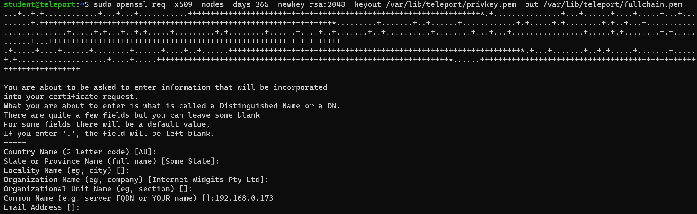
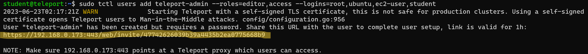
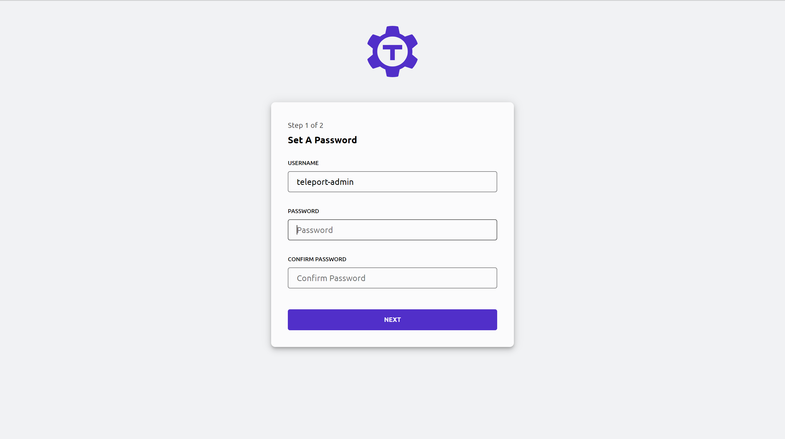
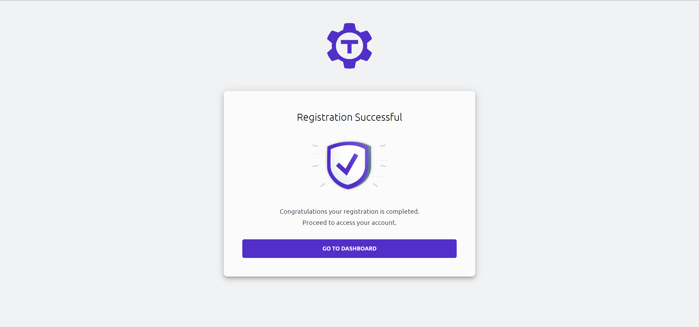
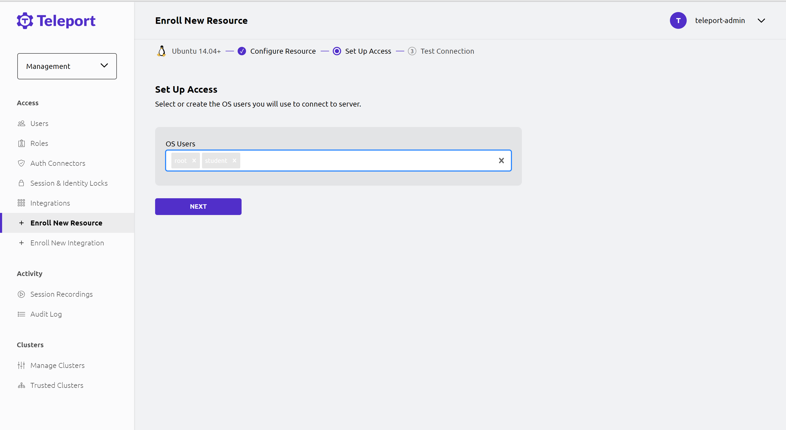

# Teleport 

## Table of Contents 

## Install 
Please follow the instructions located at the official <a href="https://goteleport.com/docs/installation/">Teleport documentation</a>. This will give a more detailed explication of the commands provided below (Except for Docker, they dont tell us much there).

We have the option of installing Teleport on the System, or as a Container.

### System Install
This is taken from the <a href="https://goteleport.com/docs/installation/">Teleport documentation</a>.

Run the following commands (On Debian based systems)
```sh
# Add the GPG Key 
sudo curl https://apt.releases.teleport.dev/gpg \
-o /usr/share/keyrings/teleport-archive-keyring.asc

# Add environment variables from os-release
source /etc/os-release

# Add teleport repository, this needs to be updated for each major release
echo "deb [signed-by=/usr/share/keyrings/teleport-archive-keyring.asc] \
https://apt.releases.teleport.dev/${ID?} ${VERSION_CODENAME?} stable/v13" \
| sudo tee /etc/apt/sources.list.d/teleport.list > /dev/null

# Update package list and install
sudo apt-get update
sudo apt-get install teleport
```

An alternative method we can use is described at [Getting Started](https://goteleport.com/docs/get-started/).
```sh
# Download and run the script
curl https://goteleport.com/static/install.sh | bash -s 13.1.1
```
### Server Access 
This is taken from the guides listed at <a href="https://goteleport.com/docs/server-access/introduction/">Server Teleport Access Guides</a>

First follow the instructions at [Getting Started](https://goteleport.com/docs/get-started/).

1. Configure DNS, (If we can, since this is internal we will be port forwarding... so make sure the certificate matches the outer-router IP)
    * If this were an outward facing system, we would use lets-encrypt or some other CA service
2. Install (Should already be done)
3. Use the Private network method
    * [Generate a certificate](https://goteleport.com/docs/management/admin/self-signed-certs/) (We can use self signed) For this we will use *openssl* to generate a self signed certificate and key pair.
        ```
            # make a directory to store this info (Configure permissions correctly)
            mkdir mkdir /var/lib/teleport-info

            sudo openssl req -x509 -nodes -days 365 -newkey rsa:2048 -keyout /var/lib/teleport-info/privkey.pem -out /var/lib/teleport-info/fullchain.pem 
        ```
        * The *sudo* is needed as the teleport private key file is protected, now that we are using our own directory, we will not need it. But I have kept it, to prevent future issues.
        * Fill out the information as desired the **ONLY** field that matters is the common name  which should be the URL that resolves to the ip hosting teleport, or the IP address directly. An **example** is shown below.

            

    * Place a valid private key in ```/var/lib/teleport-info/privkey.pem``` (Done by openssl command)
    * Place a valid certificate chain ```/var/lib/teleport-info/fullchain.pem``` (Done by openssl command)
4. Configure the Teleport Server
    ``` sh
    sudo teleport configure -o file \
    --cluster-name=192.168.0.173 \
    --public-addr=192.168.0.173:443 \
    --cert-file=/var/lib/teleport-info/fullchain.pem \
    --key-file=/var/lib/teleport-info/privkey.pem
    ```
    * Replace the IP there, with your IP or a Domain name that will resolve.
    * May need to remove an existing file 
        ```
        rm -f /etc/teleport.yaml
        ```
5. Enable and Start Teleport
    ```
    sudo systemctl enable teleport && \
    sudo systemctl start teleport
    ```
6. Run ```sudo tctl status``` we should see output like the following 
    
7. Create an administrator, use the following command.
    ```
    # Create a privileged user teleport-admin
    # --logins provides a list of allowed logins from this account
    sudo tctl users add teleport-admin --roles=editor,access --logins=root,ubuntu,ec2-user,student
    ```
8. Use the URL outputted by the command to finalize the creation of the account. And example is shown below.

    

9. Click Get Started

    

10. Create a password

    

11. Setup 2FA as shown below, Use google authenticator or some other 2FA app.

    

12. Goto the dashboard 

    

13. We should see the Sever as listed below 

    

### Adding Nodes CLI
1. Enter into **Teleport Server**
2. Install Teleport 
    ```
    # Download run script
    curl https://goteleport.com/static/install.sh | bash -s 13.1.1
    ```
3. Add a server to our cluster, to do this we will use the ```tctl``` command, short for teleport-control.
    ```
    # Generate a join token, and save it to a file (with redirection!)
    tctl tokens add --type=node --format=text > token.file
    ```
4. Generate a configuration file 
    ```
    sudo teleport node configure \
   --output=file:///etc/teleport.yaml \
   --token=/path/to/token.file \
   --proxy=tele.example.com:443
    ```
    * **Replace** tele.example.com with the IP or URL
5. Start and enable teleport
    ```
    sudo systemctl enable teleport && \
    sudo systemctl start teleport
    ```

### Adding Nodes Web Interface (Linux)

1. Login to the Teleport web-interface 
2. Click Add Server as shown below

    

3. Click on the Distribution you would like to add 

    

4. Follow the provided instructions (run the command on the host we want to add)

    
    
    * Add a ```--insecure``` flag to curl if using self signed certs with teleport.  
5. Modify the ```/lib/systemd/system/teleport.service```, look at the output of ```systemctl status teleport``` if this is not the location to find it. It should look like the following. **See** [The Alt Section](#look-into-alternate-way-to-make-it-trusted) if using an actual CA.
    ```
    [Unit]
    Description=Teleport Service
    After=network.target

    [Service]
    Type=simple
    Restart=on-failure
    EnvironmentFile=-/etc/default/teleport
    ExecStart=/usr/local/bin/teleport start --pid-file=/run/teleport.pid --insecure
    ExecReload=/bin/kill -HUP $MAINPID
    PIDFile=/run/teleport.pid
    LimitNOFILE=524288

    [Install]
    WantedBy=multi-user.target`
    ```
    * The line ```ExecStart=/usr/local/bin/teleport start --pid-file=/run/teleport.pid``` needs ```--insecure``` added 
6. Restart the process
    ```
    sudo systemctl daemon-reload && \
    sudo systemctl restart teleport.service
    ```
7. If using tsh, we will need to use the ```--insecure``` flag
8. We should see the following on a success

    

9. Configure the users that can be accessed. An example is shown below.

    

10. Test the connection

    

### Add Windows RDP  Console 
https://goteleport.com/docs/desktop-access/active-directory-manual/#allow-remote-rdp-connections
### Add Windows RDP Web
[Reference!](https://goteleport.com/docs/desktop-access/active-directory/#compare-desktop-access-to-other-rdp-clients)

1. Login to the Teleport web-interface 
2. Click Add Server as shown below

    

3. Remove the filter and select Active Directory as shown below
    


### Look into alternate way to make it trusted
1. Copy certificate over that is used by the teleport server. This can be through the use of ```scp``` or something
2. Move the certificate to the ```/usr/local/share/ca-certificates/``` directory. An example shown below. This should be the root certificate.
    ```
    mv servercert.crt /usr/local/share/ca-certificates/servercert.crt
    ```
3. Run the following command to update the trusted certificate store
    ```
    sudo update-ca-certificates
    ```
4. Now we have a certificate validation error, likely due to the fact it is a self signed, we probably need to make an actual CA...
    * We may need to add an alt name that is the same name, alter images later if this is the case.
