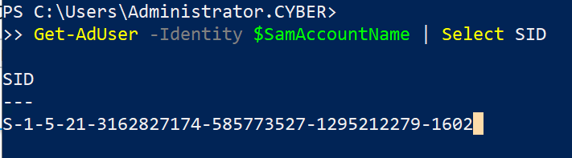
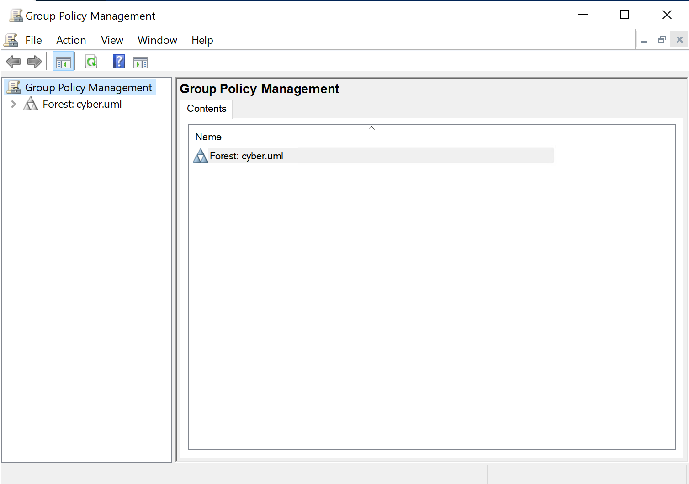
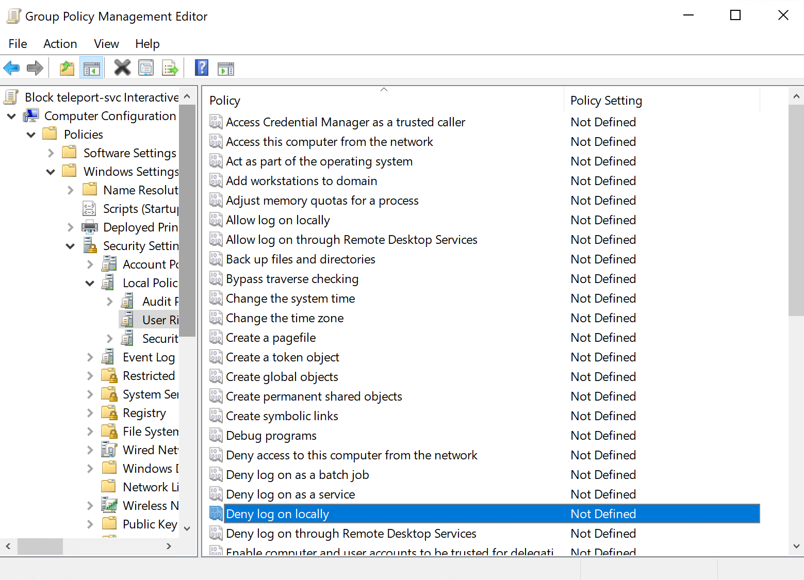
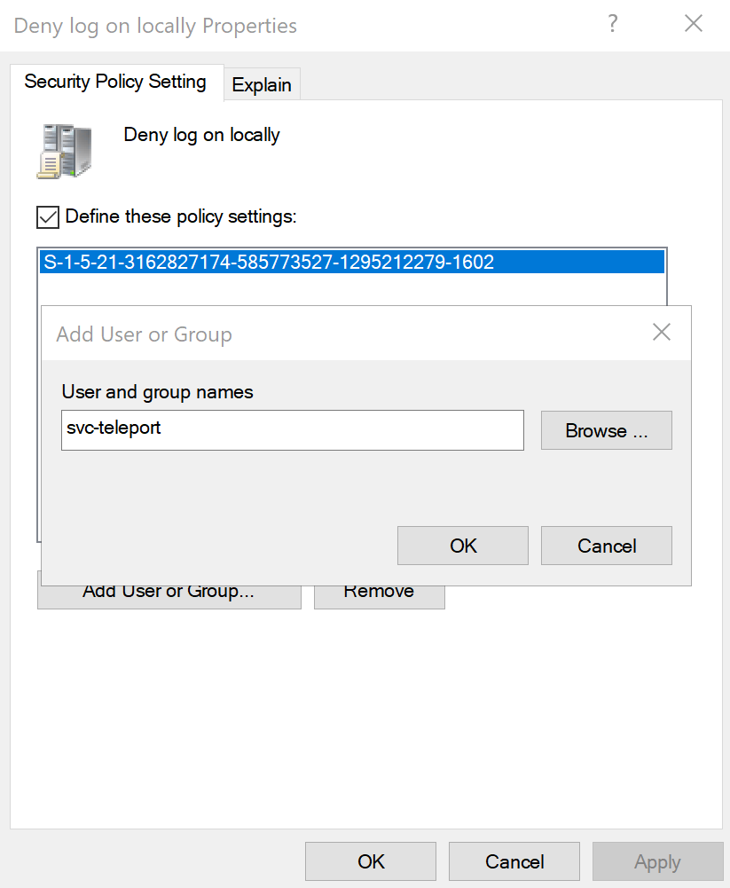

# Teleport  <!-- omit from toc -->
This is a document detailing the installation, setup and use of **Teleport**. This will Primarily focus on the use of a host-based install. Not a Container based install. We can look into the use of Teleport with containers, however this will involve the [Amazon Elastic Container Registry](https://aws.amazon.com/ecr/).

## Table of Contents <!-- omit from toc -->
- [Host Based](#host-based)
  - [System Install](#system-install)
  - [Server Access](#server-access)
    - [Disable MFA](#disable-mfa)
  - [Adding Nodes CLI](#adding-nodes-cli)
  - [Adding Nodes Web Interface (Linux)](#adding-nodes-web-interface-linux)
  - [Add Windows RDP  Console](#add-windows-rdp--console)
  - [Add Windows RDP Web](#add-windows-rdp-web)
  - [Look into alternate way to make the certificate trusted -- Not Working ATM](#look-into-alternate-way-to-make-the-certificate-trusted----not-working-atm)
- [Container Based Teleport](#container-based-teleport)
  - [Installation](#installation)
  - [Configuration](#configuration)
  - [Startup](#startup)
    - [Manual](#manual)
    - [Docker Compose](#docker-compose)
- [Error Fixing](#error-fixing)

## Host Based 
Please follow the instructions located at the official <a href="https://goteleport.com/docs/installation/">Teleport documentation</a>. This will give a more detailed explication of the commands provided below (Except for Docker, they dont tell us much there).

We have the option of installing Teleport on the System, or as a Container.

**Notice**: The Host should have > 1 CPU and 4 - 6 GB of memory to function properly.
### System Install
This is taken from the <a href="https://goteleport.com/docs/installation/">Teleport documentation</a>.

Run the following commands (On Debian based systems)
```sh
# Add the GPG Key 
sudo curl https://apt.releases.teleport.dev/gpg \
-o /usr/share/keyrings/teleport-archive-keyring.asc

# Add environment variables from os-release
source /etc/os-release

# Add teleport repository, this needs to be updated for each major release
echo "deb [signed-by=/usr/share/keyrings/teleport-archive-keyring.asc] \
https://apt.releases.teleport.dev/${ID?} ${VERSION_CODENAME?} stable/v13" \
| sudo tee /etc/apt/sources.list.d/teleport.list > /dev/null

# Update package list and install
sudo apt-get update
sudo apt-get install teleport
```

An alternative method we can use is described at [Getting Started](https://goteleport.com/docs/get-started/).
```sh
# Download and run the script
curl https://goteleport.com/static/install.sh | bash -s 13.1.1
```
### Server Access 
This is taken from the guides listed at <a href="https://goteleport.com/docs/server-access/introduction/">Server Teleport Access Guides</a>

First follow the instructions at [Getting Started](https://goteleport.com/docs/get-started/).

1. Configure DNS, (If we can, since this is internal we will be port forwarding... so make sure the certificate matches the outer-router IP)
    * If this were an outward facing system, we would use lets-encrypt or some other CA service
2. Install (Should already be done)
3. Use the Private network method
    * [Generate a certificate](https://goteleport.com/docs/management/admin/self-signed-certs/) (We can use self signed) For this we will use *openssl* to generate a self signed certificate and key pair.
        ```
            # make a directory to store this info (Configure permissions correctly)
            sudo mkdir -p /var/lib/teleport-info

            sudo openssl req -x509 -nodes -days 365 -newkey rsa:2048 -keyout /var/lib/teleport-info/privkey.pem -out /var/lib/teleport-info/fullchain.pem 
        ```
        * The *sudo* is needed as the teleport private key file is protected, now that we are using our own directory, we will not need it. But I have kept it, to prevent future issues.
        * Fill out the information as desired the **ONLY** field that matters is the common name  which should be the URL that resolves to the ip hosting teleport, or the IP address directly. An **example** is shown below. As we are using HAProxy to provide SSL to the client, the IP or DNS name used should be the **INTERNAL ONE**.

            

    * Place a valid private key in ```/var/lib/teleport-info/privkey.pem``` (Done by openssl command)
    * Place a valid certificate chain ```/var/lib/teleport-info/fullchain.pem``` (Done by openssl command)
4. Configure the Teleport Server, replace \<IP\> with the machine's IP!
    ``` sh
    sudo teleport configure -o file \
    --cluster-name=Practice_Infra \
    --public-addr=<IP>:443 \
    --cert-file=/var/lib/teleport-info/fullchain.pem \
    --key-file=/var/lib/teleport-info/privkey.pem
    ```
    * Replace the IP there, with your IP or a Domain name that will resolve.
    * May need to remove an existing file 
        ```
        rm -f /etc/teleport.yaml
        ```
5. Start Teleport
    * Command Provided 
        ```
        sudo teleport start --config="/etc/teleport.yaml"
        # Then Enable 
        sudo systemctl enable teleport
        ```
    * Enable and Start Teleport
        ```
        sudo systemctl enable teleport && \
        sudo systemctl start teleport
        ```
6. Run ```sudo tctl status``` we should see output like the following 
    
7. Create an administrator, use the following command. If we do not want MFA **Refer to** [Disable MFA](#disable-mfa) before going further.
    ```
    # Create a privileged user teleport-admin
    # --logins provides a list of allowed logins from this account
    sudo tctl users add teleport-admin --roles=editor,access --logins=root,ubuntu,ec2-user,student
    ```
8.  Use the URL outputted by the command to finalize the creation of the account. And example is shown below.

    

9.  Click Get Started

    

10. Create a password

    

11. Setup 2FA as shown below, Use google authenticator or some other 2FA app. **Refer to** [Disable MFA](#disable-mfa) if we do not want this.

    

12. Goto the dashboard 

    

13. We should see the Sever as listed below 

    

#### Disable MFA
The following is based on the official [teleport documentation](https://goteleport.com/docs/reference/authentication/)

1. Open ```/etc/teleport.yaml``` in a text editor. You should see something like the following 

    

2. Look for the auth service section 
    ```
    auth_service:
    enabled: "yes"
    listen_addr: 0.0.0.0:3025
    cluster_name: Practice_Infra
    proxy_listener_mode: multiplex
    ```
3. Modify the above section so it looks like the following 
    ```
    auth_service:
    enabled: "yes"
    listen_addr: 0.0.0.0:3025
    cluster_name: Practice_Infra
    proxy_listener_mode: multiplex
    authentication:
        type: local
        second_factor: off
    ```


### Adding Nodes CLI
1. Enter into **Teleport Server**
2. Install Teleport (**This should already be done if the previous steps have been done**)
    ```
    # Download run script
    curl https://goteleport.com/static/install.sh | bash -s 13.1.1
    ```
3. Add a server to our cluster, to do this we will use the ```tctl``` command, short for teleport-control.
    ```
    # Generate a join token, and save it to a file (with redirection!)
    tctl tokens add --type=node --format=text > token.file
    ```
4. Transfer the generated *token.file* to the target machine 
5. Install Teleport on the **TARGET MACHINE**
    ```
    # Download run script
    curl https://goteleport.com/static/install.sh | bash -s 13.1.1
6. Generate a configuration file on the target machine using the *token file*
    ```
    sudo teleport node configure \
   --output=file:///etc/teleport.yaml \
   --token=/path/to/token.file \
   --proxy=tele.example.com:443
    ```
    * **Replace** /path/to/token.file with the path
    * **Replace** tele.example.com with the IP or DNS
7. Start and enable teleport
    ```
    sudo systemctl enable teleport && \
    sudo systemctl start teleport
    ```

### Adding Nodes Web Interface (Linux)

1. Login to the Teleport web-interface 
2. Click Add Server as shown below

    

3. Click on the Distribution you would like to add 

    

4. Follow the provided instructions (run the command on the host we want to add)

    
    
    * Add a ```--insecure``` flag to curl if using self signed certs with teleport.  
    * May need to modify the URL to match the INTERNAL IP and to use port 443
5. Modify the ```/lib/systemd/system/teleport.service```, look at the output of ```systemctl status teleport``` if this is not the location to find it. It should look like the following. **See** [The Alt Section](#look-into-alternate-way-to-make-it-trusted) if using an actual CA.
    ```
    [Unit]
    Description=Teleport Service
    After=network.target

    [Service]
    Type=simple
    Restart=on-failure
    EnvironmentFile=-/etc/default/teleport
    ExecStart=/usr/local/bin/teleport start --pid-file=/run/teleport.pid --insecure
    ExecReload=/bin/kill -HUP $MAINPID
    PIDFile=/run/teleport.pid
    LimitNOFILE=524288

    [Install]
    WantedBy=multi-user.target`
    ```
    * The line ```ExecStart=/usr/local/bin/teleport start --pid-file=/run/teleport.pid``` needs ```--insecure``` added 
6. Restart the process
    ```
    sudo systemctl daemon-reload && \
    sudo systemctl restart teleport.service
    ```
7. If using tsh, we will need to use the ```--insecure``` flag
8. We should see the following on a success

    

9. Configure the users that can be accessed. An example is shown below.

    

10. Test the connection

    

### Add Windows RDP  Console 
https://goteleport.com/docs/desktop-access/active-directory-manual/#allow-remote-rdp-connections -- Manual
https://goteleport.com/docs/desktop-access/getting-started/ -- Non-Manual


1. Open Powershell
2. Run the commands
    ```
    $Name="Teleport Service Account"
    $SamAccountName="svc-teleport"

    # Generate a random password that meets the "Password must meet complexity
    # requirements" security policy setting.
    # Note: if the minimum complexity requirements have been changed from the
    # Windows default, this part of the script may need to be modified.
    Add-Type -AssemblyName 'System.Web'
    do {
    $Password=[System.Web.Security.Membership]::GeneratePassword(15,1)
    } until ($Password -match '\d')
    $SecureStringPassword=ConvertTo-SecureString $Password -AsPlainText -Force

    New-ADUser `
    -Name $Name `
    -SamAccountName $SamAccountName `
    -AccountPassword $SecureStringPassword `
    -Enabled $true
    ```
3. In the **SAME POWERSHELL WINDOW**, run the following 
    ```
    # Save your domain's distinguished name to a variable.
    $DomainDN=$((Get-ADDomain).DistinguishedName)

    # Create the CDP/Teleport container.
    # If the command fails with "New-ADObject : An attempt was made to add an object
    # to the directory with a name that is already in use", it means the object
    # already exists and you can move on to the next step.
    New-ADObject -Name "Teleport" -Type "container" -Path "CN=CDP,CN=Public Key Services,CN=Services,CN=Configuration,$DomainDN"

    # Gives Teleport the ability to create LDAP containers in the CDP container.
    dsacls "CN=CDP,CN=Public Key Services,CN=Services,CN=Configuration,$DomainDN" /I:T /G "$($SamAccountName):CC;container;"
    # Gives Teleport the ability to create and delete cRLDistributionPoint objects in the CDP/Teleport container.
    dsacls "CN=Teleport,CN=CDP,CN=Public Key Services,CN=Services,CN=Configuration,$DomainDN" /I:T /G "$($SamAccountName):CCDC;cRLDistributionPoint;"
    # Gives Teleport the ability to write the certificateRevocationList property in the CDP/Teleport container.
    dsacls "CN=Teleport,CN=CDP,CN=Public Key Services,CN=Services,CN=Configuration,$DomainDN " /I:T /G "$($SamAccountName):WP;certificateRevocationList;"
    # Gives Teleport the ability to create and delete certificationAuthority objects in the NTAuthCertificates container.
    dsacls "CN=NTAuthCertificates,CN=Public Key Services,CN=Services,CN=Configuration,$DomainDN" /I:T /G "$($SamAccountName):CCDC;certificationAuthority;"
    # Gives Teleport the ability to write the cACertificate property in the NTAuthCertificates container.
    dsacls "CN=NTAuthCertificates,CN=Public Key Services,CN=Services,CN=Configuration,$DomainDN" /I:T /G "$($SamAccountName):WP;cACertificate;"
    ```
4. Run the following command ```Get-AdUser -Identity $SamAccountName | Select SID```. Save this information for later. Below is some example output. 

    

5. Run the following command 
    ```
    $GPOName="Block teleport-svc Interactive Login"
    ```
6. Run the following command 
    ```
    New-GPO -Name $GPOName | New-GPLink -Target $((Get-ADDomain).DistinguishedName)
    ```
7. Open the Group Policy Management program

    

8. Navigate to the GPO created something like: ```($FOREST > Domains > $DOMAIN > Group Policy Objects > Block teleport-svc Interactive Login)```

    

9. Edit it. Right click it.

    

10. Edit ```Computer Configuration > Policies > Windows Settings > Security Settings > Local Policies > User Rights Assignment```

    

11. Double click Deny log on locally and in the popup, check Define these policy settings.

    

12. use the SAM (SID from earlier), check the name and agree to everything.

    
    * I may be wrong so I also added the sam account name

        

13. Repeat fpr ```Deny log on through Remote Desktop Services```. It is in the same menu.

    

14. Download the Windows Certificate 
    * Trusted
        ```curl -o user-ca.cer https://10.0.1.15:443/webapi/auth/export?type=windows```
    * Untrusted
      * I just accessed it on a wen browser and saved it.

Stopped at Create another GPO and import the Teleport CA

May want to look into https://til.intrepidintegration.com/powershell/ssl-cert-bypass and try automatic one later.
### Add Windows RDP Web
[Reference!](https://goteleport.com/docs/desktop-access/active-directory/#compare-desktop-access-to-other-rdp-clients)

https://goteleport.com/docs/desktop-access/getting-started/ -- Non-Manual

1. Login to the Teleport web-interface 
2. Click Add Server as shown below

    

3. Remove the filter and select Active Directory as shown below
    


### Look into alternate way to make the certificate trusted -- Not Working ATM
1. Generate the Certificate with a SAN
    ```
    sudo openssl req -x509 -nodes -days 365 -newkey rsa:2048 -keyout /var/lib/teleport-info/privkey.pem  -addext "subjectAltName = DNS:<DNS>, IP:<IP>" -out /var/lib/teleport-info/fullchain.pem 
    ```
2. Copy certificate over that is used by the teleport server. This can be through the use of ```scp``` or something
3. Move the certificate to the ```/usr/local/share/ca-certificates/``` directory. An example shown below. This should be the root certificate.
    ```
    mv servercert.crt /usr/local/share/ca-certificates/servercert.crt
    ```
4. Run the following command to update the trusted certificate store
    ```
    sudo update-ca-certificates
    ```
5. Now we have a certificate validation error, likely due to the fact it is a self signed, we probably need to make an actual CA...
    * We may need to add an alt name that is the same name, alter images later if this is the case.


## Container Based Teleport 

WORK IN PROGRESS

### Installation 
We should refer to the [Official Teleport Docs](https://goteleport.com/docs/installation/#running-teleport-on-docker) for more information. 

This is quite simple we use **Docker Pull** and the repository that Teleport tells us to do so.
```
docker pull public.ecr.aws/gravitational/teleport-distroless:13.1.5
```

Then we will have a container that may be used in the future steps! In my case the name of the container was *public.ecr.aws/gravitational/teleport-distroless*. You can check that the container image was installed, and find its name using the command ```docker images```.

### Configuration
The configuration file may require some additional key-pair values from the [Official Configuration Page](https://goteleport.com/docs/reference/config/)

We can use the files generated by the [System Install](#server-access) if they exist (and we are migrating)

1. Make necessary directories for **Docker Volumes** if they do not already exist 
    ```
    mkdir -p ~/teleport/config ~/teleport/data
    ```
2. Configure Files 
3. Create Keys 
4. 
5. 
### Startup
#### Manual

#### Docker Compose

## Error Fixing
1. If Teleport cannot locate the repository, run a ```nslookup``` command, this will cache the results allowing for work to continue 
    
2. If you have a proxy to teleport, you will be given the IP and Port of the system that is forwarding the request. So you will need to modify that to the internal IP and port 443.
