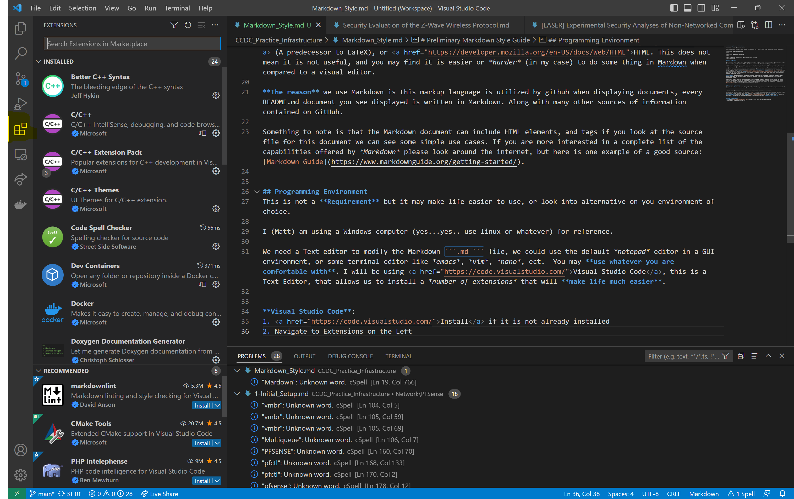
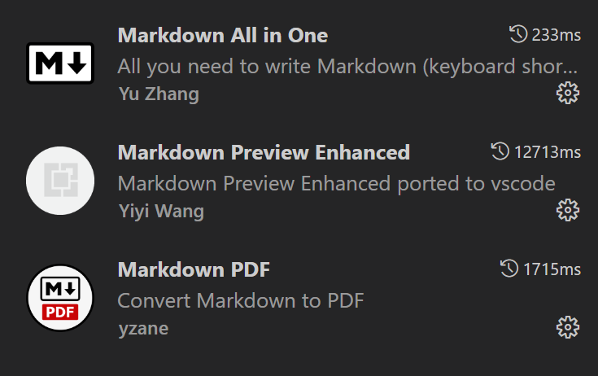
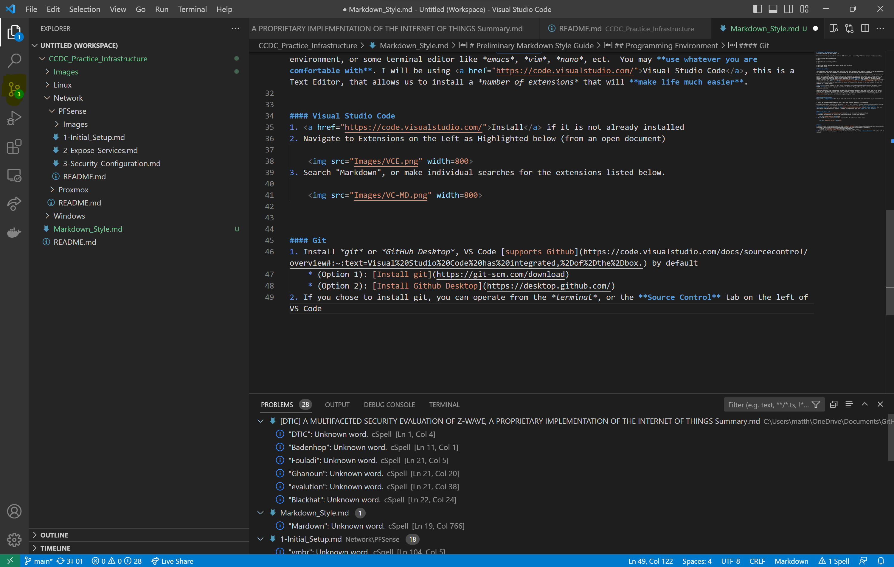
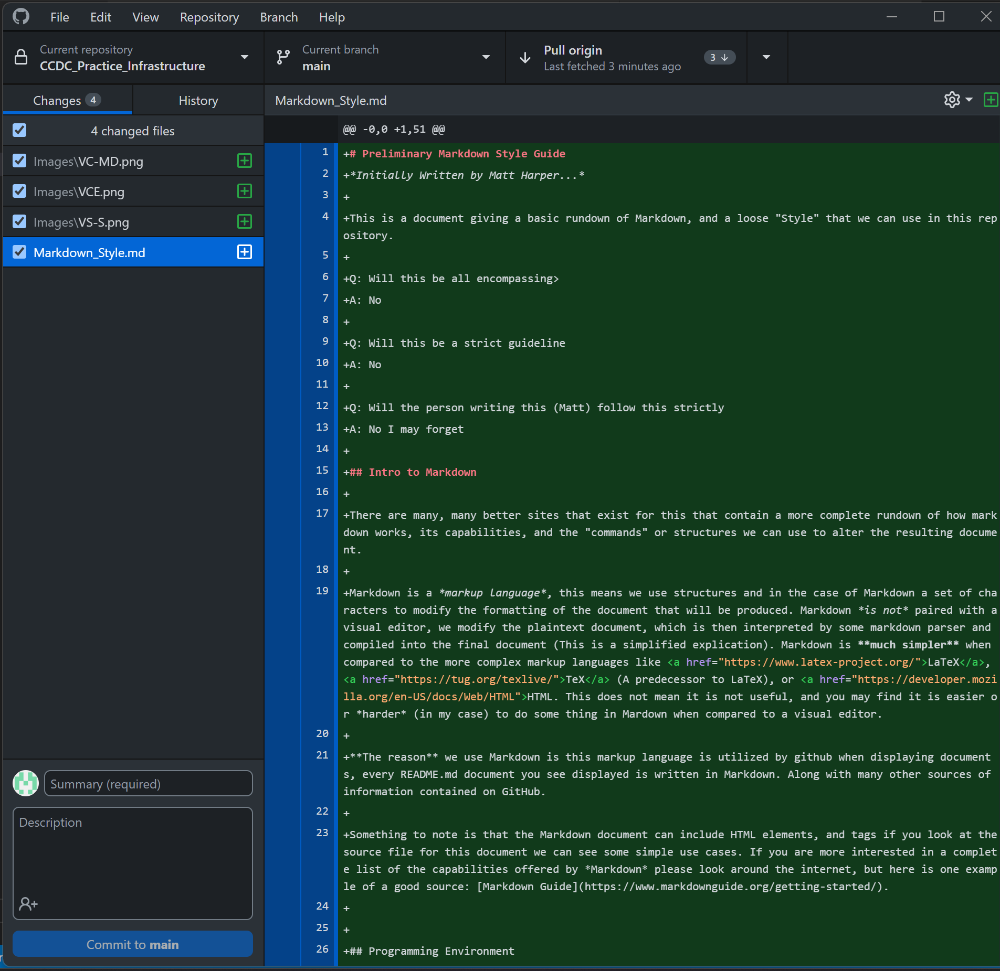
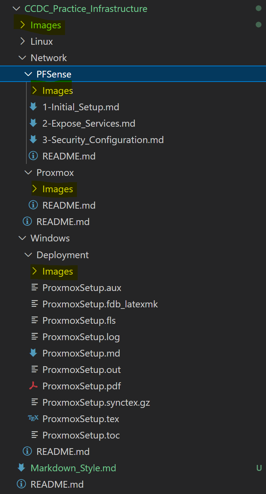

# Preliminary Markdown Style Guide
*Initially Written by Matt Harper...*

This is a document giving a basic rundown of Markdown, and a loose "Style" that we can use in this repository. 

Q: Will this be all encompassing>
A: No

Q: Will this be a strict guideline 
A: No

Q: Will the person writing this (Matt) follow this strictly 
A: No I may forget

## Intro to Markdown

There are many, many better sites that exist for this that contain a more complete rundown of how markdown works, its capabilities, and the "commands" or structures we can use to alter the resulting document.

Markdown is a *markup language*, this means we use structures and in the case of Markdown a set of characters to modify the formatting of the document that will be produced. Markdown *is not* paired with a visual editor, we modify the plaintext document, which is then interpreted by some markdown parser and compiled into the final document (This is a simplified explication). Markdown is **much simpler** when compared to the more complex markup languages like <a href="https://www.latex-project.org/">LaTeX</a>, <a href="https://tug.org/texlive/">TeX</a> (A predecessor to LaTeX), or <a href="https://developer.mozilla.org/en-US/docs/Web/HTML">HTML. This does not mean it is not useful, and you may find it is easier or *harder* (in my case) to do some thing in Mardown when compared to a visual editor. 

**The reason** we use Markdown is this markup language is utilized by github when displaying documents, every README.md document you see displayed is written in Markdown. Along with many other sources of information contained on GitHub.

Something to note is that the Markdown document can include HTML elements, and tags if you look at the source file for this document we can see some simple use cases. If you are more interested in a complete list of the capabilities offered by *Markdown* please look around the internet, but here is one example of a good source: [Markdown Guide](https://www.markdownguide.org/getting-started/).


## Programming Environment    
This is not a **Requirement** but it may make life easier to use, or look into alternative on you environment of choice. 

I (Matt) am using a Windows computer (yes...yes.. use linux or whatever) for reference.

We need a Text editor to modify the Markdown ```.md ``` file, we could use the default *notepad* editor in a GUI environment, or some terminal editor like *emacs*, *vim*, *nano*, ect.  You may **use whatever you are comfortable with**. I will be using <a href="https://code.visualstudio.com/">Visual Studio Code</a>, this is a Text Editor, that allows us to install a *number of extensions* that will **make life much easier**. 


#### Visual Studio Code
1. <a href="https://code.visualstudio.com/">Install</a> if it is not already installed.
2. Navigate to Extensions on the Left as Highlighted below (from an open document).

    
3. Search "Markdown", or make individual searches for the extensions listed below.

    

Please look into the *details* page of each extension for more details.
* Markdown All In One: Provides keyboard shortcuts, commands, and more to easily create and format a Markdown file.
  * If you copy an image to yor clipboard you can "CTL-V" it into the document, an image.png file will be created for you.
* Markdown Preview Enhanced: Allows us to preview a markdown file.
* (Optional) Markdown to PDF: Convert a Markdown file to a PDF file.
(I also use a spell checking extension!)

#### Git
1. Install *git* or *GitHub Desktop*, VS Code [supports Github](https://code.visualstudio.com/docs/sourcecontrol/overview#:~:text=Visual%20Studio%20Code%20has%20integrated,%2Dof%2Dthe%2Dbox.) by default
    * (Option 1): [Install git](https://git-scm.com/download)
    * (Option 2): [Install Github Desktop](https://desktop.github.com/)
2. If you chose to install git or GitHub Desktop, you can operate from the *terminal*, or the **Source Control** tab on the left of VS Code highlighted below
    
3. If you chose to install Github Desktop you also have the option to operate from the GitHub Desktop GUI as shown below
    

## Basic Style Guide
This is not exhaustive, and not strict but please try to keep things organized.

### Repository Style Guide
This is a short (hopefully) section describing the preferred structure of our GitHub repository. 

#### Directories (Folders)
Distinct sections should be contained in their *own* directory. The "root" directory of each topic should contain a ```README.md``` file, this will describe the topic, give brief overviews of the subtopics, and link to the ```README.md``` file of the subtopics. An in-progress example is shown below from the [PFSense](./Network/PFSense/README.md) directory. The ```README.md``` of the subtopics should contain information, or links to additional documents.


The naming convention of ```README.md``` is important as this is the file that will be displayed in a repository directory *no other* file will be displayed.

An Example of Directory Structures:


#### Images
Images should be contained in a ```Images``` folder located in the same *directory* as the document they are *used in*. This is to prevent a confused mix of unused images.

An example is shown below:


#### Markdown Basics
This section will contain the basic knowledged necessary to write a Markdown file for this repository.

##### Text Modification
* Italicize: Surround the text in one set of "*" as shown below with *no space* between them and the text
    \*This is what It looks like in the .md file\*
    *This is what is produced*
* Bold: Surround the text in one set of "**" as shown below with *no space* between them and the text
    \*\*This is what It looks like in the .md file\*\*
    **This is what is produced**
* Bold and Italicize: Surround the text in one set of "***" as shown below with *no space* between them and the text
    \*\*\*This is what It looks like in the .md file\*\*\*
    ***This is what is produced***

##### Code blocks
* Inline Block: On the same line surround text with one set of \`\`\` as shown below with *no space* between them and the text. This is useful for file locations.
text
    This is what It looks like in the \`\`\`.md\`\`\` file
    This is what is produced from the ```.md``` file
* Large Code Block
    This is what It looks like in the \`\`\`.md\`\`\` file
        
    \`\`\`c
    #include \<stdio.h\>

    int main(int argc, char* argv[], char* envp[]) {
        return 1; // there is a tab here in the MD file...
    }
        
    \`\`\`
        
    This is what is produced from the ```.md``` file
    ```
    #include \<stdio.h\>

    int main(int argc, char* argv[], char* envp[]) {
        return 1;
    }
    ```
##### Images 
* HTML
    \ 
* Markdown
    \[Alt Text](somePath)

##### Bullet Points
This has some personal motivations

We can use *\** for bullet points and *1.* for numbered lists. The examples will all use *bullet points* for simplicity.

If images or code blocks are associated with a bullet point they should be indented to one level more than the bullet point. Additionally to prevent issues with formatting, add an extra line with **NO CHARACTERS** on it between the image insertion and bullet point and any following text. An example is shown below.

The character "_" is equivalent to a SPACE 
The character "\n" is equivalent to a newline

**This is what It looks like in the \`\`\`.md\`\`\` file**
\* Some Text... refer to the image below 
\n
____\
\n
__\* Some sub bullet point 
\n
________\

**This is the result**
* Some Text... refer to the image below 
    
    

  * Some sub bullet point 
        


**This is what It looks like in the \`\`\`.md\`\`\` file**
\* Some Text... refer to the image below 
\n
____\`\`\`
____This is some Code
____\`\`\`
\n
__\* Some sub bullet point 
\n
________\`\`\`
________This is some Code
________\`\`\`

**This is the result**
* Some Text... refer to the image below 

    ```
    This is some Code
    ```

  * Some sub bullet point 

        ```
        This is some Code
        ```
##### Headings 
The \# character preceding a sentence on an empty line signifies a header. Notice the space between the Hash and word.


**Examples**
\# Title of a paper
# Title of a paper

\#\# Section 
## Section

\#\#\# Sub-Section
### Sub-Section

\#\#\#\# Sub-Sub Section
#### Sub-Sub Section

\#\#\#\#\# Sub-Sub-Sub Section
##### Sub-Sub-Sub Section

\#\#\#\#\#\# Sub-Sub-Sub-Sub Section
###### Sub-Sub-Sub-Sub Section

##### Table of Contents 
If the section is long enough, it should contain a table of contents (That is, if you need to scroll).

This can easily be done with Markdown All In One. We should not have an entry for the *Title* or *Table of Contents Section*.

* Create Table of Contents 
    1. Hit *CTL+T* to open the VSCode Command Bar
    2. Type in ```> Markdown All In One: Create Table of Contents```
* Omit Entries, *Title* and *Table of Contents*
    * Add  ```<!-- omit from toc -->``` to the end of a header. An example is shown below.
        \# Header \<!-- omit from toc -->

If you do not have Markdown All In One, ask someone who does to make the Table of contents.

##### Link to Documents or Headers
We give the relative path in a Hyperlink HTML or Markdown link structure.

**Document**
* HTML
    \<a href="./Some/Path"> Some Text To be Hyperlinked \</a>
* Markdown
    \[Some Text To be Hyperlinked](./Some/Path)

**Header**
I always use the Markdown structure. Spaces in a header are replaced with "-" and example is shown below *and* the characters are all lowercase.

\[Some Text To be Hyperlinked](#some-header)
