# PFSense <!-- omit from toc -->
This file describes the setup and configuration of the PFSense Instance on Proxmox, and the setup of the initial routes. Exposing Services and additional security are described in their own documents. (The FIREWALLS ARE SET TO ALLOW ALL IN MOST CASES HERE)


## Table of Contents <!-- omit from toc -->

- [Initial Machine Setup Proxmox](#initial-machine-setup-proxmox)
	- [Downloading ISO](#downloading-iso)
	- [Adding additional Network Interfaces](#adding-additional-network-interfaces)
	- [Creating the PFSense VM](#creating-the-pfsense-vm)
	- [References](#references)
- [Initial Machine Setup](#initial-machine-setup)
	- [Machine Configuration on Install](#machine-configuration-on-install)
	- [On First Boot Setup](#on-first-boot-setup)
	- [Web Interface Access](#web-interface-access)
	- [Interface Configuration](#interface-configuration)
	- [DHCP Configuration](#dhcp-configuration)
	- [Routes](#routes)
		- [DMZ Router Routes](#dmz-router-routes)
		- [Linux Router Routes](#linux-router-routes)
	- [Windows Router Routes](#windows-router-routes)
	- [DNS Configuration](#dns-configuration)
		- [On the DMZ Router](#on-the-dmz-router)
		- [On Linux and Windows Routers](#on-linux-and-windows-routers)
	- [Other](#other)


## Initial Machine Setup Proxmox
### Downloading ISO
1. Ssh into proxmox
	ssh [root@192.168.0.60](mailto:root@192.168.0.60)
	Type in password
2. Navigate to the directory where ISO files are stored in linux
	1. cd /var/lib/vz/template/iso
3. Go to PF Sense download page on your regular browser & fill out download specifications as shown below.
	
    *  You may have to click Download once, so the actual download link with the correct details are linked to the download button
		* This may be needed because I am unsure as to how often the webpage updates
	* **Right click the Download Button** & save the link
4. Navigate back to the ssh console and pull the iso file from the web
	1. use the wget command as follows to download the image to the Proxmox machine
		```
		wget -O pfSense.iso.gz https://atxfiles.netgate.com/mirror/downloads/pfSense-CE-2.6.0-RELEASE-amd64.iso.gz
		```
	
5. Unzip the file inside the same Linux ISO directory
	1. Using the following command to unzip the downloaded file
	```sh
	gunzip pfSense.iso.gz
	```

### Adding additional Network Interfaces 
1. Open the VM management interface by clicking on the VM name in the left column as highlighted in the image below.
	
	
2. Open the **Hardware** tab of the management interface as shown below.
	
	
3. Click on the **add** tab that is highlighted in the image below.
	
	
4. Now a drop down menu will appear. From this we can select **Network Device** option as shown below
	
	
5. From this we can select a Bridged network to attach the PFsense machine to
	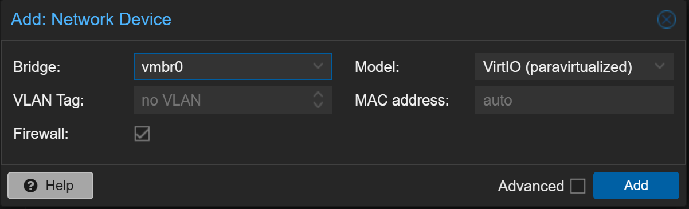 
	
	* We are able to select any created network at this time. We should refer to the [Network Diagram Summery](#network-diagram-summery-pfsense) section to determine which networks they will be attached to
6. Click **Add** and then repeat for all other PFSense Instances 

### Creating the PFSense VM
1. Navigate to Proxmox 
2. Click create VM
3. **General tab**
	1. Name your VM as shown below (Name may vary).
	
	
4. **OS Tab**
	1. Click **use iso file**
	2. Press **Storage: Local**
	3. Attach Iso img, we should end up with something like the image shown below
	
	
5. **System Tab**
	1. Leave as default, we can see this in the image below
   	
	
6. **Disks**
	1. 8gb minimum 
	2. I set the Disk size to 12gb as shown below
	
	
7. **CPU**
	1. Leave as Default or change this setting as you prefer. The result is shown below.
	
	
8. **Memory Tab**
	1. 1gb is required
	2. I gave 3gb, this is shown below.
	
	
9.  **Network Tab**
	1. ***The bridge changes dependent on the network the PFsense firewall is supposed to communicate with
	2. vmbr2 is our linux bridge
		1. If we were connected to a windows bridge it would be vmbr1 not vmbr2, this is due to the naming scheme we used
	3. **Multiqueue** = 8
		1. Allows the BSD kernel to negotiate the optimal value with Proxmox VE in the Network configuration
	
	4. **Firewall** This should be disabled, or set to allow all traffic.

The next tab is a confirmation tab, aka overview of out settings. Just hit next & don't forget to start the machine.

You have successfully added the PFSense ISO to is appropriate machine.

But you have not configured the fire wall software yet.

### References  
* https://www.zenarmor.com/docs/network-security-tutorials/how-to-install-pfsense-software-on-proxmox

## Initial Machine Setup
### Machine Configuration on Install
1. Open console to PFsense machine on Proxmox. Start initial setup. This is shown below.
	
2. Select Install
3. Select Default KeyMap
4. Select Auto (ZFS)
5. Select Install
6. Select Stripe (does not matter much)
7. ZFS Configuration - Hit space to select a disk, and hit OK.
8. Say yes, we are sure and would like to reformat the disk and everything.
9.  We do not need to open the shell, select Reboot.
10. Say yes we would like to Reboot
11. DO NOT HIT ANY KEY DURING THE BOOT PROCESS

### On First Boot Setup
These are for the questions immediately after the boot process finished.
1. Say NO to VLANS
2. WAN interface should be 
	* Internet Network in the case of the DMZ Router
	* Internal Router Network in the case of all others
	**You can find the interface names and corresponding name in the PFsense machine by looking at the hardware page**
	
	
3. LAN interface should be 
	* Linux/Windows network in the case of their respective router
	* DMZ/Internal Router Network in the case of the DMZ router
4. We will receive a yes/no prompt as shown below, select yes if you think it is correct.
	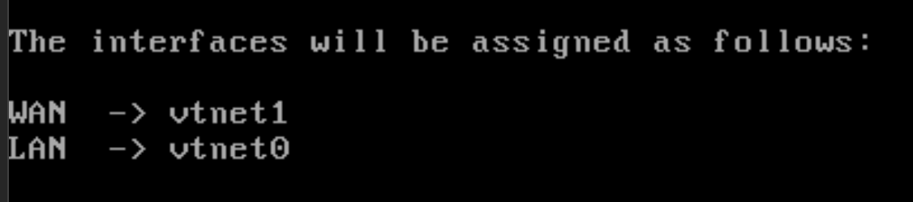
	**Note**: This may take some time.
5. If you get re-prompted for any of the above questions. Answer them the same.

### Web Interface Access
This will cover the basics of accessing a Web-Interface. How we access the internal PFSense instances will need to be discussed later. 

**NOTE**: We can access the Web interface from the internal Network, However for ease, we can **TEMPORARILY** modify the firewall to allow access from the WAN port (external network). This is what this covers, otherwise skip to point **6. Follow initial setup guide** and **11.** then end after that. 

***DISABLE THE OPTION TO BLOCK PRIVATE ADDRESSES WHEN SETTING UP ALL PFSENSE INSTANCES OR REMOVE IT FROM THE FIREWALL SETTING***

1. Determine the IP of the WAN interface. We can see this on a successful boot as shown below.
	
	
2. From the **console** select the shell option as shown below (Type "8" and hit enter)
	
	
3. Disable the packet filtering firewall so we can access the web interface to modify the **firewall**. Run the following command - pfctl (PF Control)
	```sh
	pfctl -d
	```
4. Navigate to the Wan interface IP, and chose to bypass the warning as shown below
	
	
5. Login using the default credentials 
	```
	Username: admin
	Password: pfsense
	```
6. Follow initial setup guide

	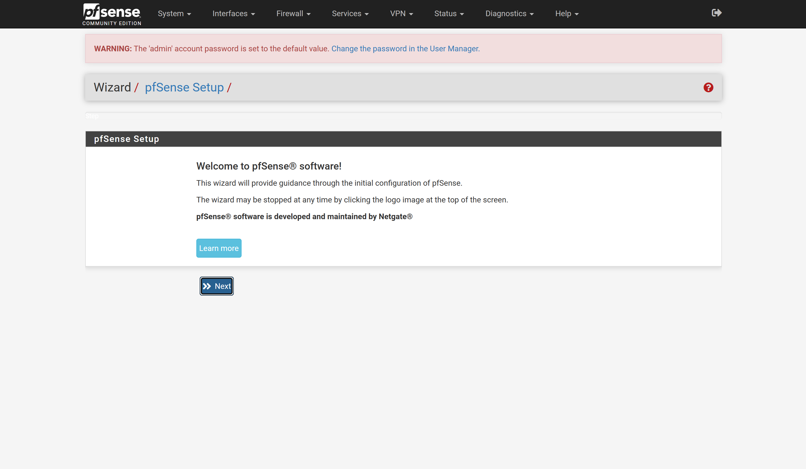
	
	1. Click Next
	2. Click Next
	3. Fill in the General information as follows for the DMZ, for the others DNS should be overridden by DHCP, but we should set it to the DMZ router's IP
	
	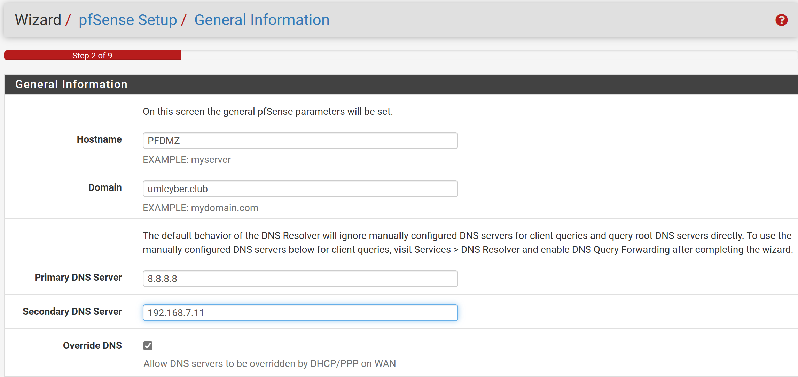

	4. Leave defaults for timeserver stuff
	5. For the WAN interface it should be configured through DHCP.
	6. Set the LAN interface, change the IP to be the desierd IP and Range
 
		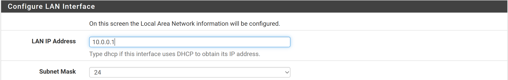
	7. Set the admin WebGUI Password as desired.
	8. Click Reload 
	9.  Click Finish
		* The web interface will go down as the firewall will go back up.
7. Re-disable the firewall from the console (Step 2 and 3)
8. Refresh the Web-Page, we will see the following.
	
	
9.  Access the Firewall Tab, and the **Rules** sub-tab as shown below
	
	
10. Click Add as highlighted below
	
	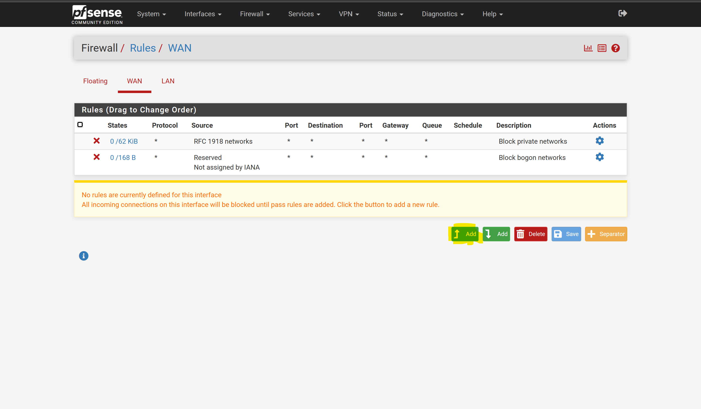
11. Set the following options
	
	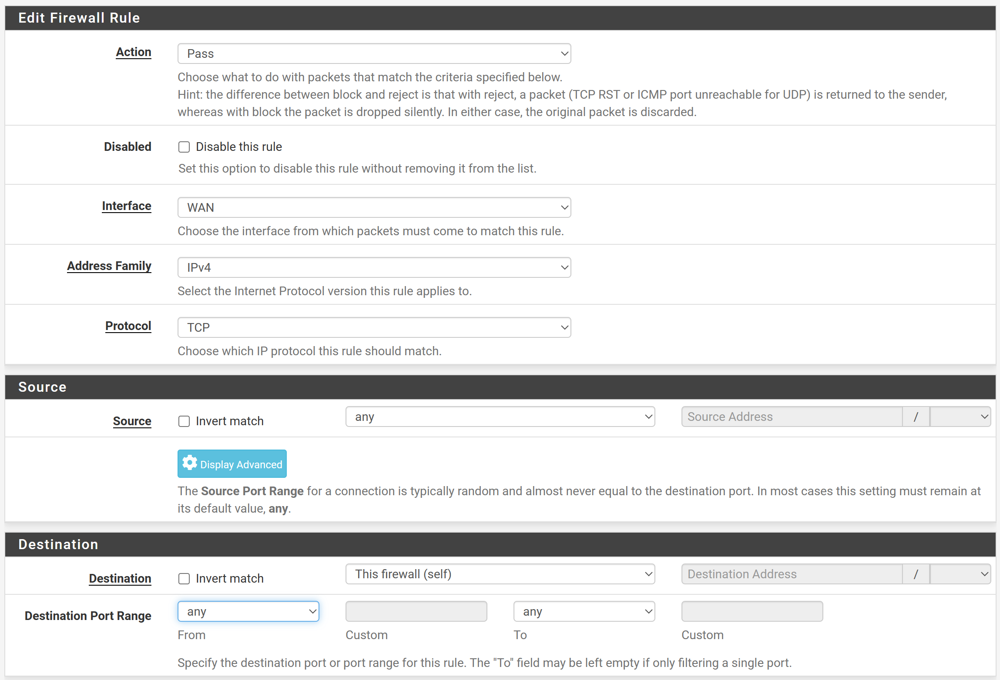
	
	```
	Action: Allow
	Interface: WAN
	Address Family: IPV4
	Protocol: TCP
	Destination: This Firewall
	From Prot: Any
	Destination Port: HTTPS (443)
	```	
12. Remove "Block Private Networks" it it is set as we are routing using private networks externally and internally. This is located in the "Block Private Networks" default rule.
	
	
### Interface Configuration 
1. Navigate to the **Interfaces Tab** as shown below
	
	
2. Navigate to each and ensure they are enabled
	
	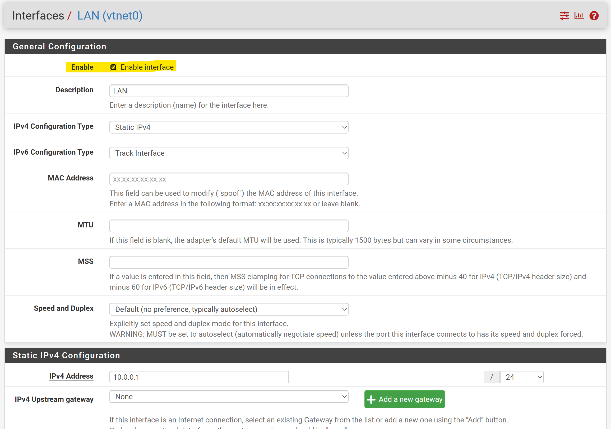
3. Ensure the IP Range of each is set correctly
	
	

### DHCP Configuration
1. Ensure all interfaces have an IP. Navigate to LAN and if it exists OTPX interfaces as shown below.
	
	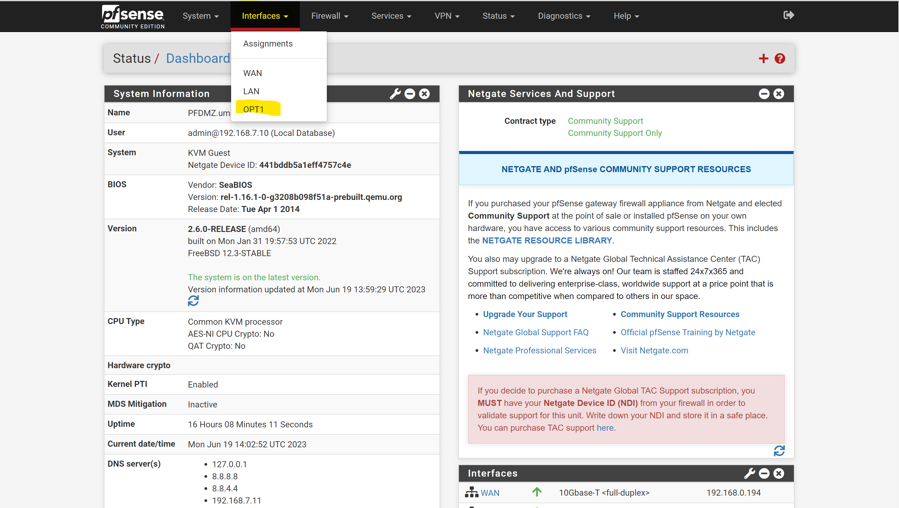
2. Select *Static IPV4* under the **IPv4 Configuration Option** as shown below 

   
3. Assign an IP as shown below (Vary values depending on the device configured).
	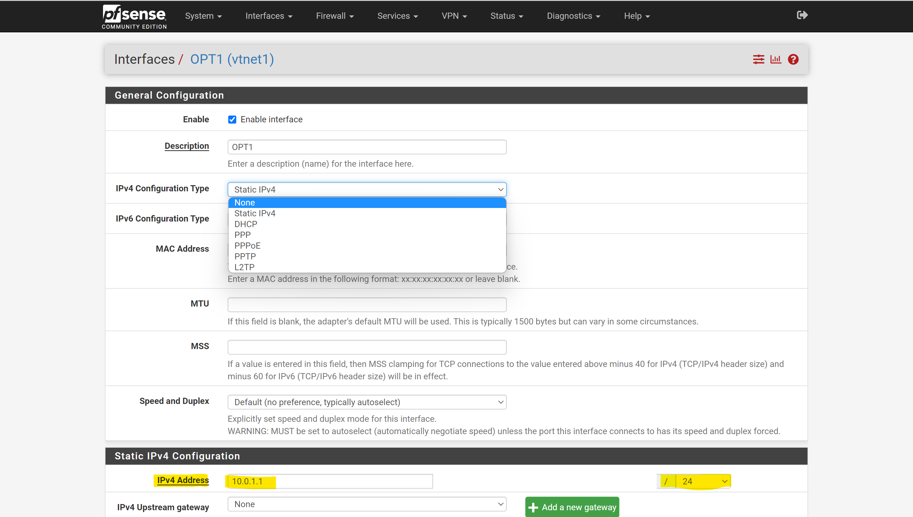
4. Save and apply, this may take some time depending on the VM configuration.
5. Navigate to DHCP Server as shown below
	
6. This will result in the following, if more than one interface is configured (with an IP) we will have multiple tabs to select from.
	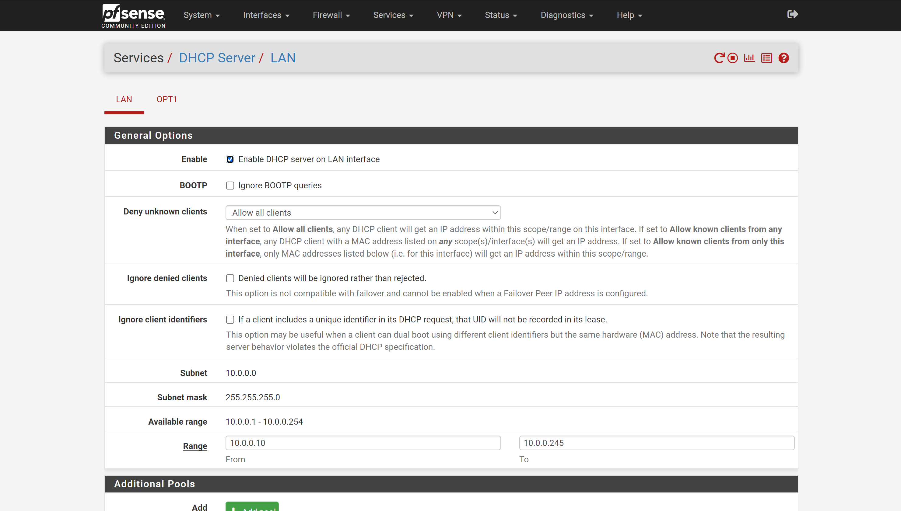
7. Ensure DHCP is Enabled
	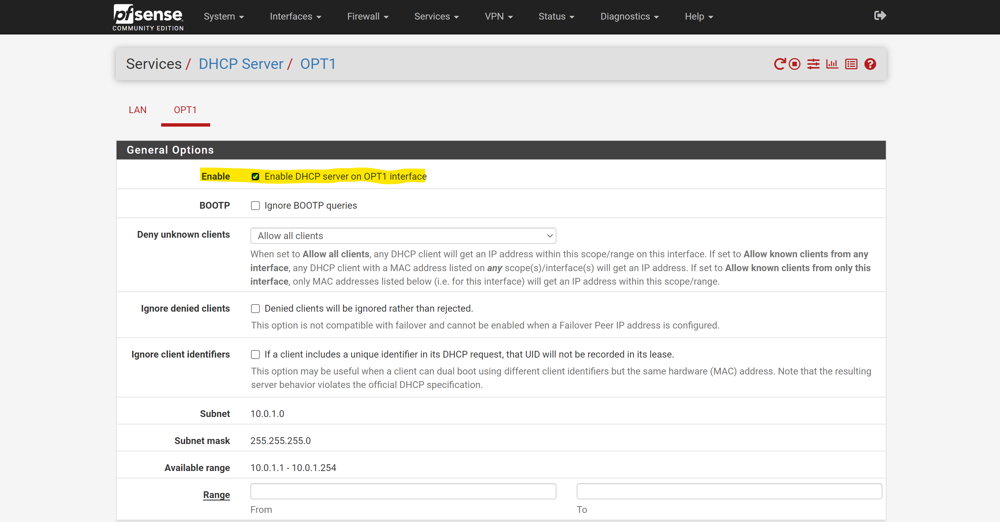
8. Define the range of available addresses, we can use the available address range to inform this.
	
9. If the IP on the inner PFSense routers have yet to be set, use the following steps to do so
   1. Reconfigure Interface *Option 2*
		
   2. Select WAN
		
   3. Select *Yes* for IPv4 DHCP, *No* for IPv6, and provide *NO INPUT* for the IPv6 address
		
   4. Press enter to continue and you are done 
10. Now the LAN Devices will get a DHCP address, if necessary restart them or have them release previous leases.
    1.  Install dhcpcd 
		``` 
		# Or we can just use DHClient without installing things
		sudo apt install dhcpcd5
		```
    2. Renew leases 
		```
		sudo dhcpcd -n
		# Or use DHClient
		sudo dhclient -v <INTERFACE> # Find the interface name in ```ip a```
		```
### Routes
1. Open the *Routes* tab in the *Diagnostics* Drop down as shown below
	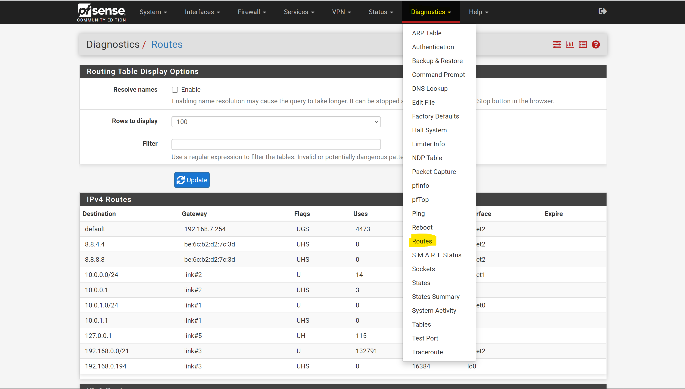
2. From this we can see the current routes on the system. An example is shown below.
	
3. Navigate to *Routes* tab in *System* as shown below
	
4. Navigate to Static routes and click *add*
	
5. On DMZ add route to internet as shown below. This means all non-matched routes will be sent to the DHCP configured gateway.
	
6. On all other Routers add the necessary static routes in addition to the Internet Route. The steps are shown below.
   1. Add Gateways for each PFSense Instance we want to route to. Click Add.
		
   2. Create new Gateway. Add it to the *Router Internal Network* Interface, and set the Gateway IP to the IP of a PFSense router ***ONLY DO THIS FOR THE DMZ ROUTER***
		
   3. Create a new Source Route, select the Gateway we created and the Destination Network should be the internal Network associated with the Gateway 
		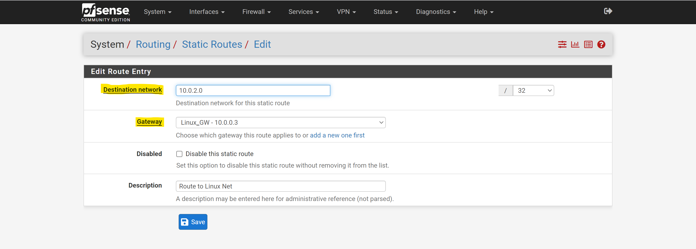
	4. More details are shown at [DMZ Router Routes](#dmz-router-routes), and [Linux Router Routes](#linux-router-routes). The Windows routs are a slight modification of the Linux Routes and located at [Windows Router Routes](#windows-router-routes).
	
**NOTICE**: You will be unable to ping the gateway or external systems unless you allow ICMP packets through the firewall.
   4. Navigate to Firewall *Rules* as follows
		
   5. Click Add for the *LAN* and *OPTX* interfaces
		
   6. Configure the rule to *allow* or in their words *pass* the ICMP packets
		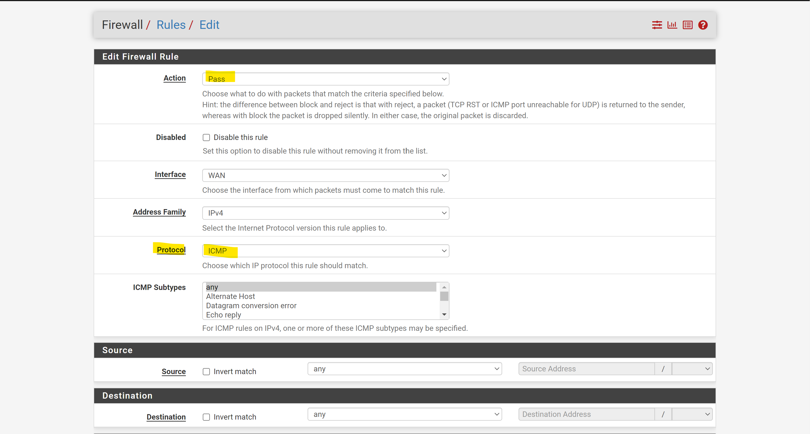
   7. We need to make no other changes (This is until we start hardening the system)


#### DMZ Router Routes
1. Make a gateway for the Router Internal Net interface routing to the Linux Network 
	
2. Make a gateway for the Router Internal Net Interface routing to the windows network
	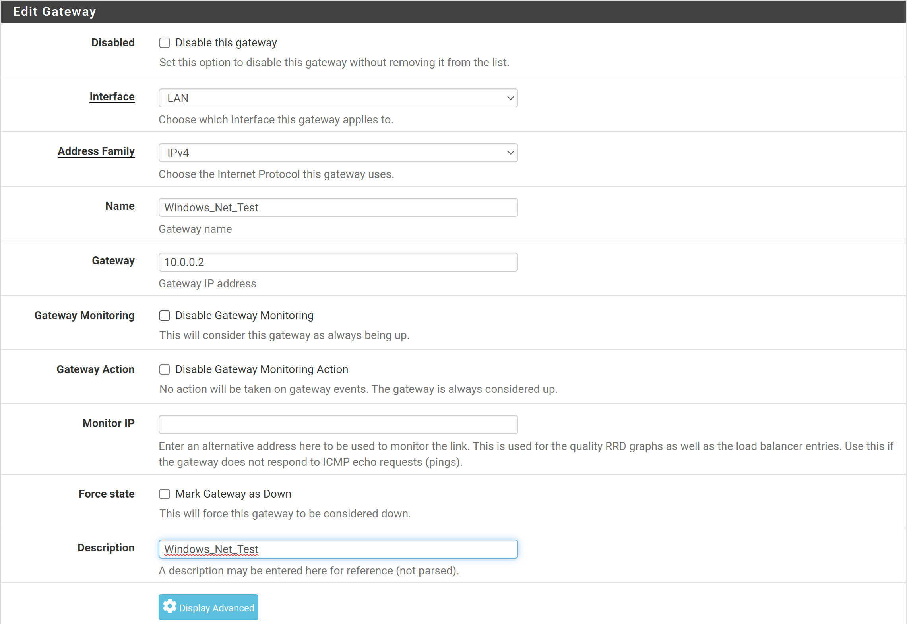
This Results in the following Gateway Page.
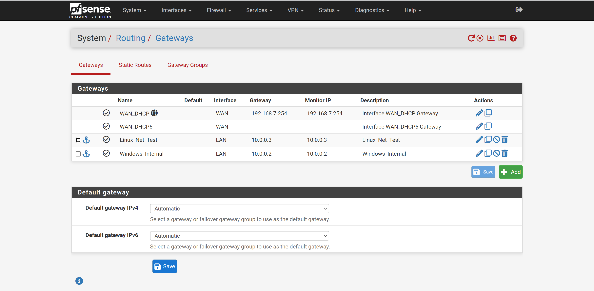

3. Create Default route to the internet
4. Create Route to Linux
5. Create Route to Windows 
This Results in the following.


#### Linux Router Routes 
1. No New Gateways are needed 
2. Make Static Route to Internet 
3. Make Static Route to DMZ
4. Make Static Route to Windows

Results are shown below:
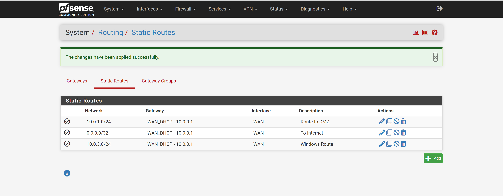

### Windows Router Routes 
We do the same as what we did in the Linux Router except rather than routing to the Windows Subnet, we route to the Linux Subnet. 

### DNS Configuration
#### On the DMZ Router
1. Ensure that we have the DNS Configured on the DMZ router (We may want to add a local DNS system to this). System -> General
	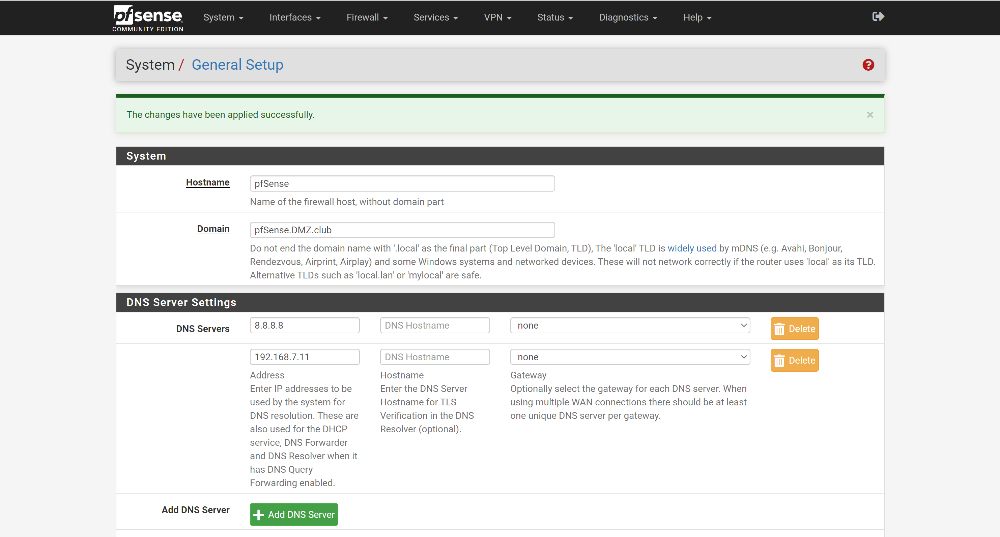
2. Open DNS Resolver. Services -> DNS Resolver as shown below
	
3. Enable DNS forwarding 
	
4. Enable *DHCP Registration*, This is for when we **EXPOSE A PROXY OR DEVICE** to the external network. So we can direct to the **Hostname** rather than an IP that may change
	
#### On Linux and Windows Routers
1. Disable DNS Resolver. Services -> DNS Resolver
	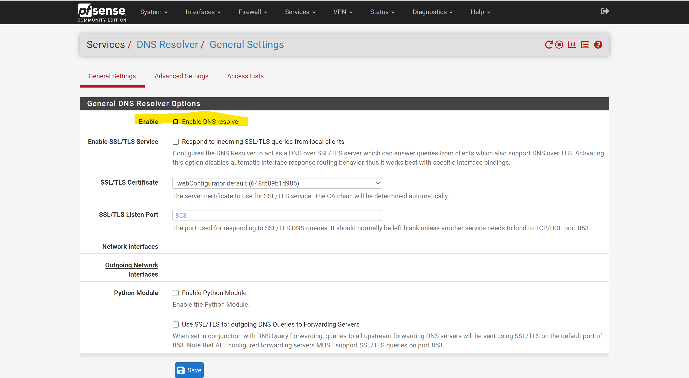
2. Enable DNS Forwarder, we need to configure this so it forwards to our DMZ Router. Services -> DNS Forwarder.
	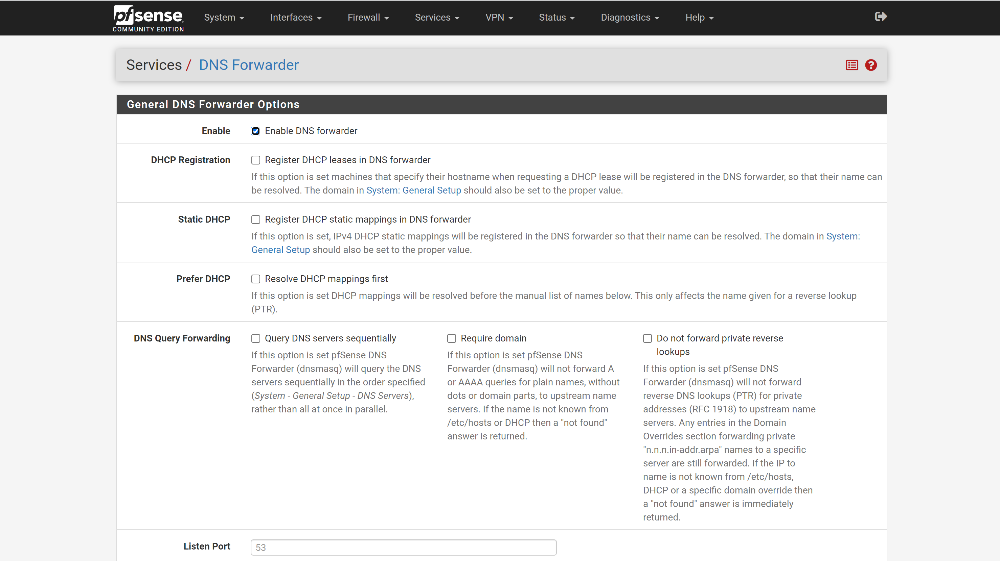
3. Enable *Register DHCP Leases* and *Register DHCP Static Mappings*
	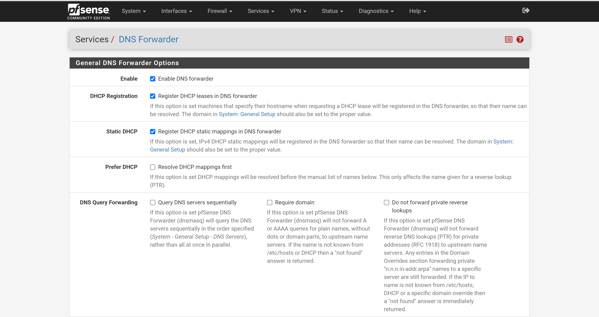

### Other
1. Ensure Hardware Checksums and TCP Segmentation *Hardware Offloading* is disabled (IN the past this has caused issues)
   1. Navigate to *System* and the sub-tab *Advanced* as shown below
		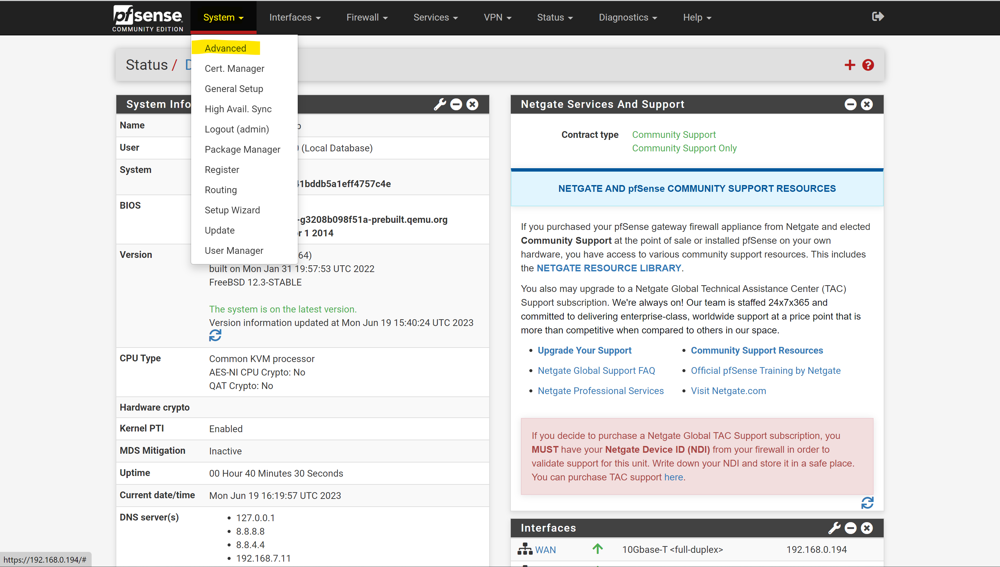
   2. Navigate to the Networking Tab
		
   3. Uncheck the options as shown below
		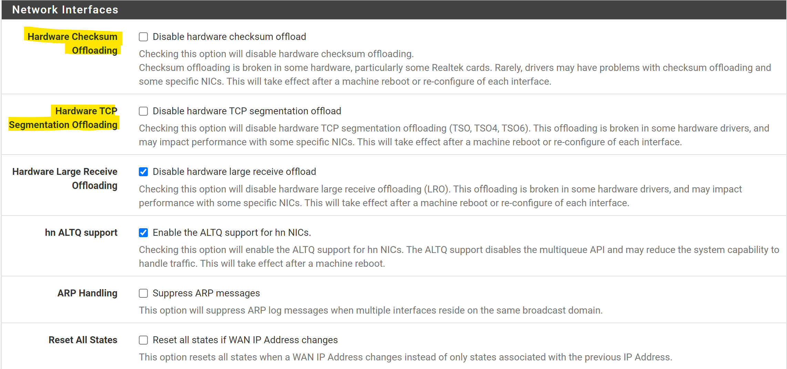

