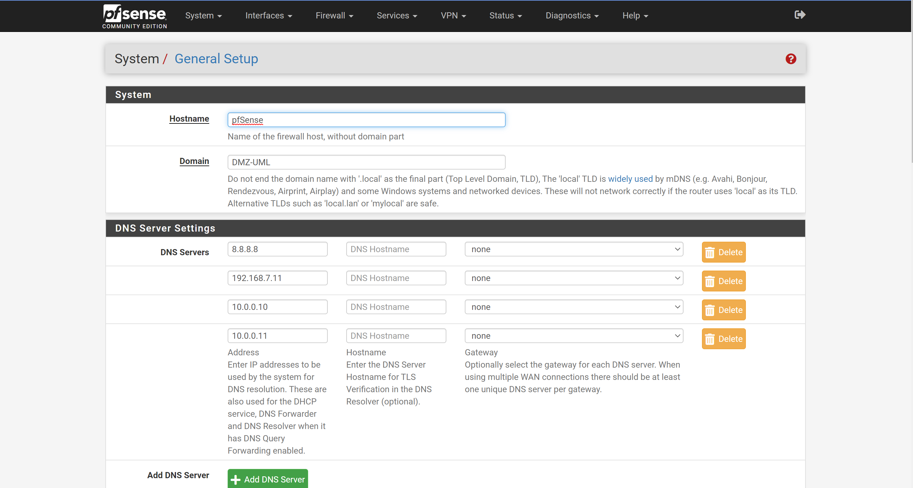
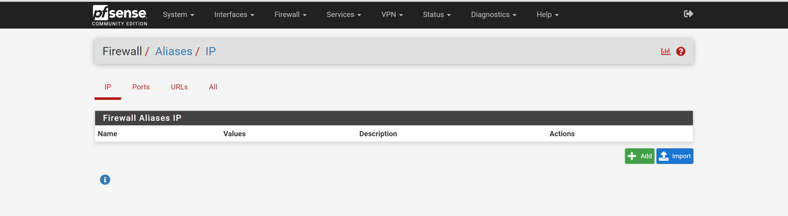
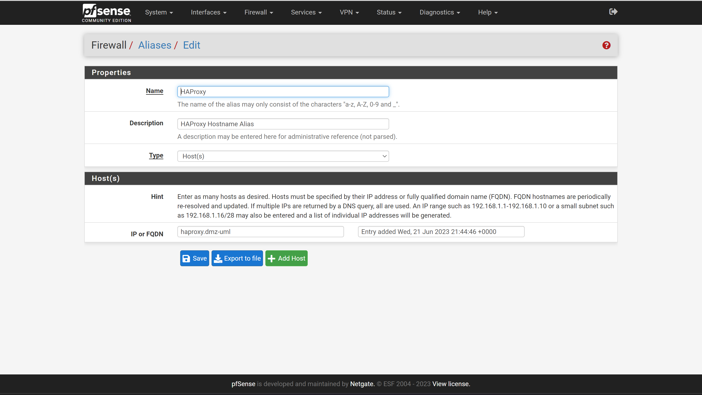
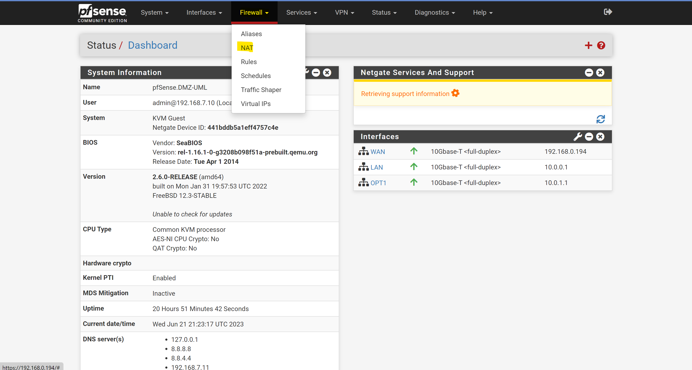
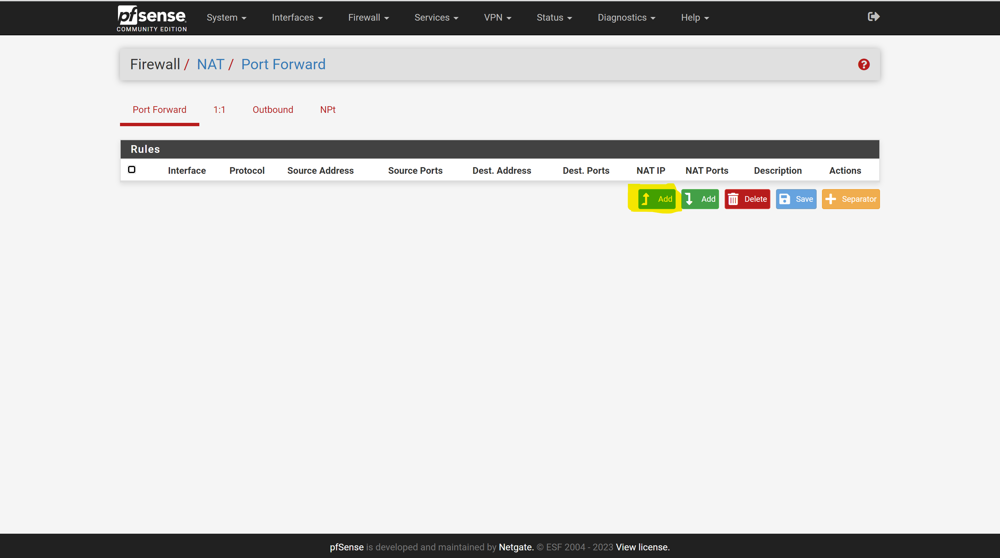
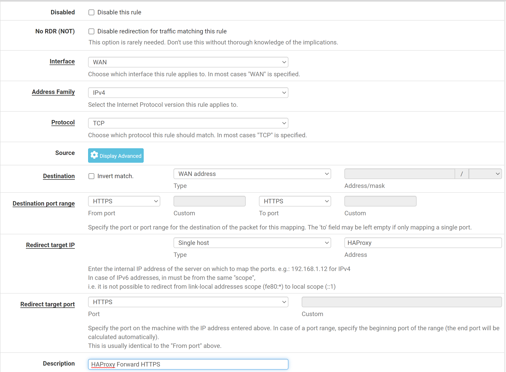
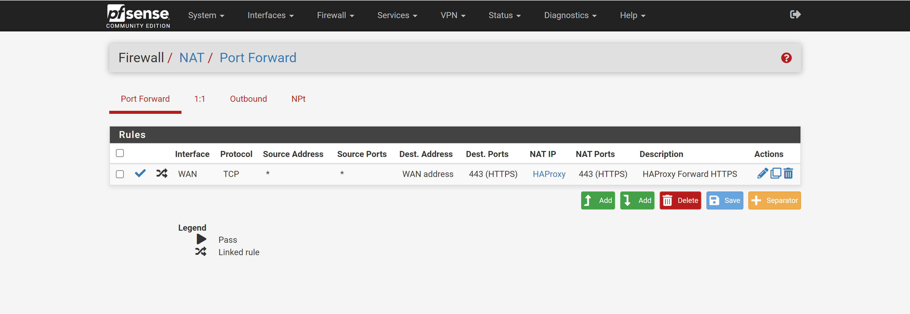

# PFSense <!-- omit from toc -->

# Table of Contents <!-- omit from toc -->
- [DNS Notes](#dns-notes)
- [Exposing Services](#exposing-services)
  - [NAT - Port Forwarding](#nat---port-forwarding)
    - [DMZ](#dmz)
    - [Linux](#linux)
    - [Windows](#windows)
  - [Virtual Addresses](#virtual-addresses)


## DNS Notes
If we have set the Domain name (System -> General) to be the same used in all the hostnames in the subnets managed by the device, we will be able to use the local DNS server on the **internal interface** of the PFSense router to resolve the local machines. This is only stored on the local DNS so we would need to optionally direct to that.

Probably going us a combination of local DNS resolution and Port Forwarding or Virtual IPs to forward the traffic correctly.

Likely the best bet is to use port forwarding, and the Hostname DNS Resolution. Assign all devices that need to get traffic the same hostname, and utilize DNS to provide a primitive round robin. **Does not appear to work as expected** 
## Exposing Services

### NAT - Port Forwarding 
This is the primary way we will expose services in the DMZ. This bypass the Router Firewall rules, and we need to be careful about this. We need to make sure we can identify the internal machine we are routing to regardless of their IP, as we use DHCP this may change depending on the number of machines, their boot order and other factors. 

To do this we will make use of the DHCP lease DNS registration that was enabled during out initial setup. This way we can opaquely forward to the correct device. 

(DEPRECATED) An additional measure we should look into, is if we register multiple devices with the same hostname - will the DNS register all of them and round robin  between them. If so this should be done.

#### DMZ 
1. Set Domain Name of DMZ: System -> General Setup, this can be something like below

    

2. Set Domain Names of Each VM in the DMZ 
   * (Option 1): Edit the ```/etc/hostname``` file 
        ```
        REPLACEHOSTNAME.DMZ-UML
        ``` 
   * (Option 2): Use the ```hostnamectl``` command
        ```sh
            hostnamectl set-hostname REPLACEHOSTNAME.DMZ-UML
        ```
3. Navigate to Aliases as shown below: Firewall -> Aliases

    

4. Click Add and Fill out the IP Alias as shown below. Use the Hostname of the HAProxy instance.

    

5. (Add any other Aliases) Save and apply changes 
6. Open the NAT Rules as shown below: Firewall -> NAT

    

7. Navigate to Port-Forward as shown below: You should already be there...

    

8. Click Add as Shown Below

    

9. Fill out the information as follows to redirect HTTPS to the HAPRoxy (If it's hostname is registered with DNS). Note we use ```WAN Address``` the use the WAN port Address, if we use Virtual IPs we would select ```Virtual IP option``` which only appears when they are created to select one, or ```WAN net``` to use all Virtual IPs.

    

    ```
    Interface: WAN
    Address Family: IPv4
    Protocol: TCP
    Destination: WAN address
    Destination port range: HTTPS to HTTPS
    Redirect target IP: Single Host, HAProxy
    Redirect target port: HTTPS
    ```
10. Save and apply, we should result in the following. **NOTICE**: Doing this will override firewall rules, and the workaround to access the Interface from the WAN will no longer work, repeat *9.* before doing so but instead forward a port to the firewall IP and HTTP port.

    

#### Linux
1. Follow steps 1 and 2 for the DMZ, alter the domain name to be something like ```LINUX-UML```
2. Open the NAT Rules as shown below: Firewall -> NAT

    
3. Navigate to Port-Forward as shown below: You should already be there...

    
4. Click Add as Shown Below

    
5. 
#### Windows

### Virtual Addresses
We will not need to use these for the DMZ, however we may want to use them for the Internal Windows and Linx machines.

This is because each address only has one set or ports, we cannot forward port 443 on one WAN address to two separate internal addresses. What we can do is set up the machine with *multiple* virtual addresses so the WAN port responds to, and has the traffic routed to it for multiple addresses.

1. Modify DHCP Server on the *DMZ Router* to reduce the set of assigned addresses, we need to *block off* a set of addresses we can use for virtual IPs. Below is an example providing 9 additional IPs (10.0.0.1 is the internal interface)  

    

2. **NOW ON THE LINUX OR WINDOWS ROUTER** Open Virtual IPs: Firewall -> Virtual IP

    

3. Click Add

    
4. Select *IP Alias* and fill out with a IP we Reserved 

    

5. Click save and apply we should have the following result

    

6. Follow Port Forwarding steps, However in place of ```WAN Address```  in **Step** *9.* we use the ```Virtual IP option``` as shown below to select one, or ```WAN net``` to use all Virtual IPs. 

    

