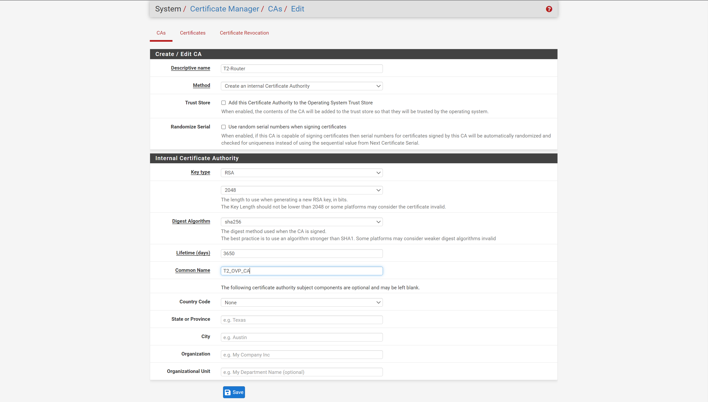
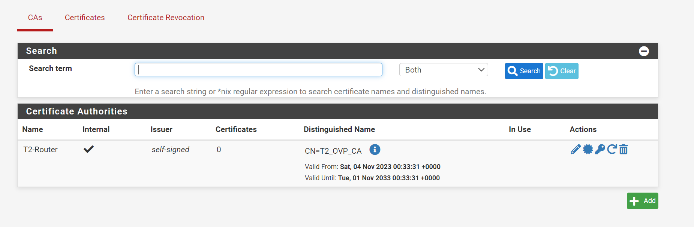
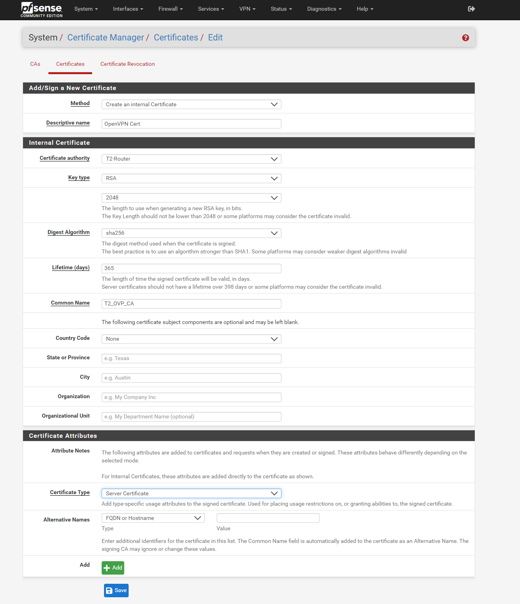
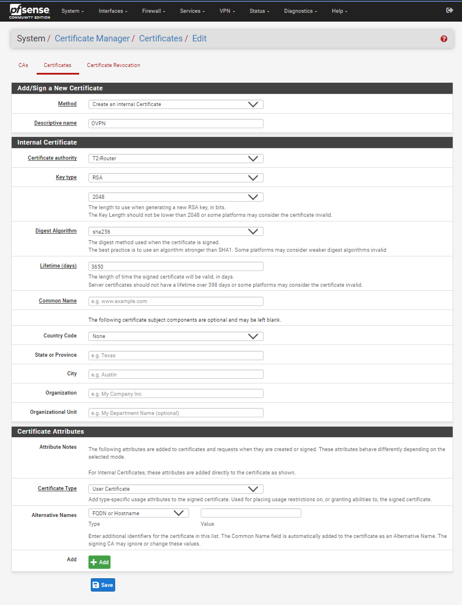
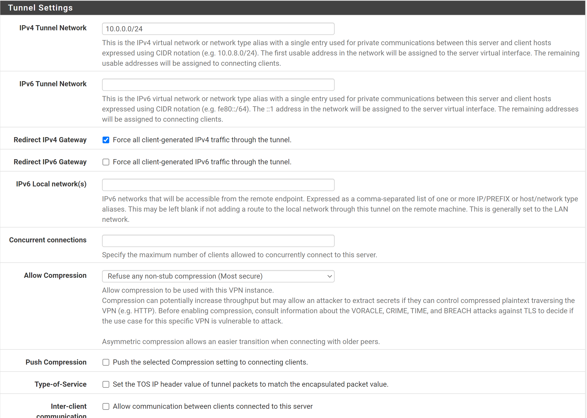
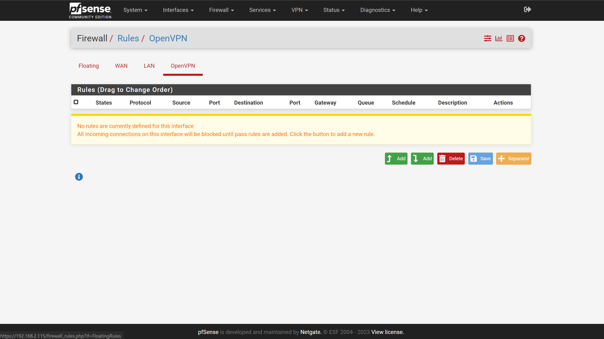
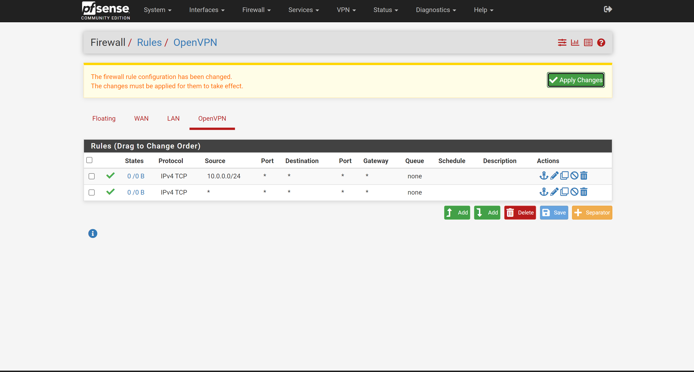
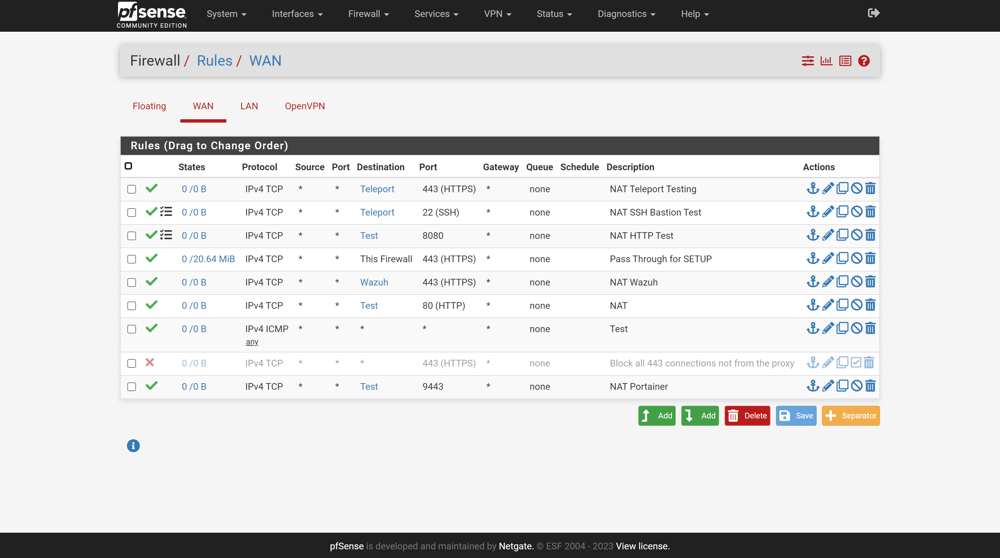
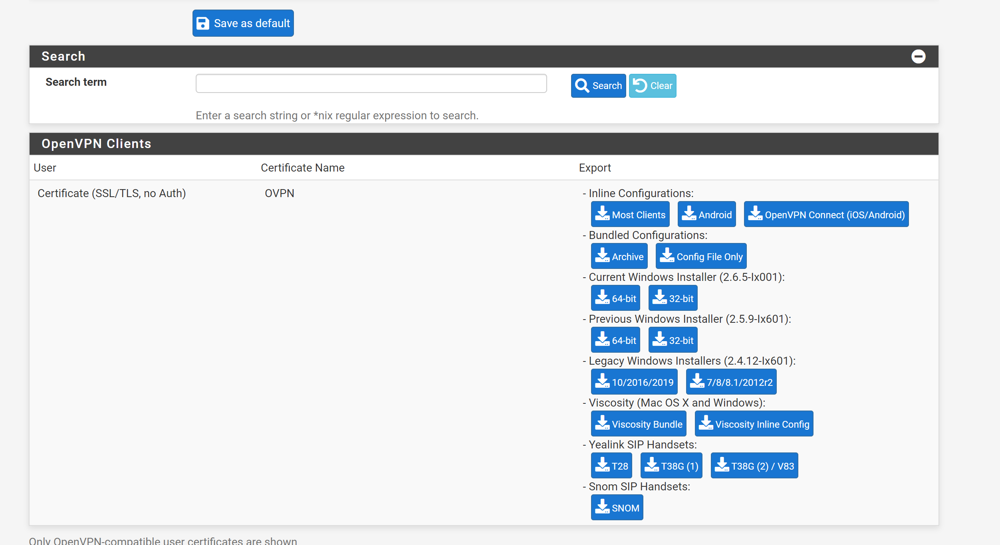

# VPN
This section details the setup of a VPN Server on the PFSense Router. This will cover both OpenVPN and Wireguard. 

## Package manager 
If the VPM service you want on the system is not there already you can open the *package manager* for PFSense. 
1. Open the PFSense browser and ckick on system
    
2. Click on the Package Manager tab, select avalable packages
    
3. Download.

## Certificate Generation
1. Open the Certificate Management ```Cert Mang.``` Tab
    
2. Create a new CA
   1. Click Add
        
   2. Setup the CA with a descriptive name and common name
        
        * Ensure we have "Create an internal CA" selected
        * None of the other really matter, we can increase the Key and Digest if we want. 
   3. Click save, you should now see a CA 
        
3. Create a Certificate for the Server
   1. Click on the Certificates tab, and click ```Add/Sign```
        
   2. Fill in the fields as follows
             
        * Fill in Descriptive name as desired
        * Fill in Cryptographic key size and hashing algorithms to match the ones selected in the CA creations
        * Select Server Certificate (Not FQDN needed?)


## OPEN VPN
This section will cover how to setup an Open VPN server on your PFSense machine. This may be used by anyone for anyreason to gain acces to a network (Since it bypasses all firewall rules)

1. Follow Steps in Certificate Generation
2. Create an OpenVPN user
   1. Navigate to user management
        
   2. Make a User with a password 
        
        * Username
        * Password 
        * Select Nothing Else!
   3.  Click Save 
   4.  Click the pencil icon to edit the user 
   5.  Scroll Down and click ```add user certificate```
        
   6. Fill in the information, make sure the certificate is an internal certificate, and is generated with the same key and digest algorithm as the CA. Refer to Certificate Generation.
        
        * The Common name should have a value, such as ```OVPN_User``` (Does not need to be a FQDN)
   7. Save
3. Open the PFSense browser and click on the VPN Dropdown
    
4. Click Add Server
5. Set Server mode to ```SSL/TLS``` or one of the ```User Auth``` based settings for **Remote Access**
6. Ensure it has something like the following Cryptographic settings
    
    * Use TLS
    * Generate TLS Key
    * Select out Server Cert
    * DH set to 4096
7. Minimal OpenVPN config is to do the following 
    
    * Enable ```Force all IPv4 redirect```
    * Set an IP range not in use for the internal OpenVPN routing
    * Set IPv4 gateway only
8. Goto the service tab, Verify its working 
    
9. Goto the System Logs tab, see if it is working (yes mine failed awhile ago)
    
10. Goto the firewall rules tab and select the OpenVPN subtab
    
11. Add a rule to allow everything out. One of the following 
        
    *  You may also limit it to the OVP IP Range 
        
12. Goto the firewall WAN subtab 
    
13. Create a rule to allow traffic to your Open VPN server 
    
14. Refer to Package manager and install the ```openvpn-client-export``` utility
15. Navigate to the Client Export tab for OpenVPN
    
16. Scroll Down and Download (Most-Clients Inline)
    

Based on: 
* https://www.comparitech.com/blog/vpn-privacy/openvpn-server-pfsense/
## Wireguard 
1. Refer to Package manager to install ```wireguard```
2. https://www.ivpn.net/setup/router/pfsense-wireguard/