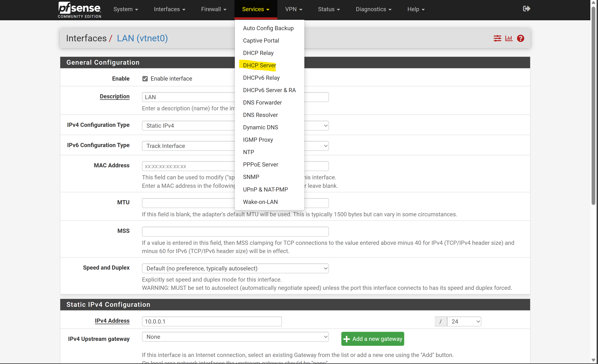

# PFSense 
This file describes the setup and configuration of the PFSense Instance

## Network Diagram Summery PFsense
1. DMZRouter
   * This will be connected to the Internet Network (WAN Port)
   * This will be connected to the DMZ Network
   * This will be connected to the Internal Router Network
2. Linux Router
	* This will be connected to the Linux Network
    * This will be connected to the Internal Router Network
3. Windows Router 
	* This will be connected to the Windows Network
    * This will be connected to the Internal Router Network
## Initial Machine Setup
### Downloading ISO
1. Ssh into proxmox
	ssh [root@192.168.0.60](mailto:root@192.168.0.60)
	Type in password
2. Navigate to the directory where ISO files are stored in linux
	1. cd /var/lib/vz/template/iso
3. Go to PF Sense download page on your regular browser & fill out download specifications as shown below.
	
    *  You may have to click Download once, so the actual download link with the correct details are linked to the download button
		* This may be needed because I am unsure as to how often the webpage updates
	* **Right click the Download Button** & save the link
4. Navigate back to the ssh console and pull the iso file from the web
	1. use the wget command as follows to download the image to the Proxmox machine
		```
		wget -O pfSense.iso.gz https://atxfiles.netgate.com/mirror/downloads/pfSense-CE-2.6.0-RELEASE-amd64.iso.gz
		```
	
5. Unzip the file inside the same Linux ISO directory
	1. Using the following command to unzip the downloaded file
	```sh
	gunzip pfSense.iso.gz
	```

### Creating the PFSense VM
1. Navigate to Proxmox 
2. Click create VM
3. **General tab**
	1. Name your VM as shown below (Name may vary).
	
4. **OS Tab**
	1. Click **use iso file**
	2. Press **Storage: Local**
	3. Attach Iso img, we should end up with something like the image shown below
	
5. **System Tab**
	1. Leave as default, we can see this in the image below
   	
6. **Disks**
	1. 8gb minimum 
	2. I set the Disk size to 12gb as shown below
	
7. **CPU**
	1. Leave as Default or change this setting as you prefer. The result is shown below.
	
8. **Memory Tab**
	1. 1gb is required
	2. I gave 3gb, this is shown below.
	
9.  **Network Tab**
	1. ***The bridge changes dependent on the network the PFsense firewall is supposed to communicate with
	2. vmbr2 is our linux bridge
		1. If we were connected to a windows bridge it would be vmbr1 not vmbr2, this is due to the naming scheme we used
	3. **Multiqueue** = 8
		1. Allows the BSD kernel to negotiate the optimal value with Proxmox VE in the Network configuration
	
	4. **Firewall** This should be disabled, or set to allow all traffic.

The next tab is a confirmation tab, aka overview of out settings. Just hit next & don't forget to start the machine.

You have successfully added the PFSense ISO to is appropriate machine.

But you have not configured the fire wall software yet.
### Adding additional Network Interfaces 
1. Open the VM management interface by clicking on the VM name in the left column as highlighted in the image below.
	
2. Open the **Hardware** tab of the management interface as shown below.
	
3. Click on the **add** tab that is highlighted in the image below.
	
4. Now a drop down menu will appear. From this we can select **Network Device** option as shown below
	
5. From this we can select a Bridged network to attach the PFsense machine to
	 
	* We are able to select any created network at this time. We should refer to the [Network Diagram Summery](#network-diagram-summery-pfsense) section to determine which networks they will be attached to
6. Click **Add** and then repeat for all other PFSense Instances 
### Machine Configuration on Startup
1. Open console to PFsense machine on Proxmox. Start initial setup. This is shown below.
	
2. Select Install
3. Select Default KeyMap
4. Select Auto (ZFS)
5. Select Install
6. Select Stripe (does not matter much)
7. ZFS Configuration - Hit space to select a disk, and hit OK.
8. Say yes, we are sure and would like to reformat the disk and everything.
9.  We do not need to open the shell, select Reboot.
10. Say yes we would like to Reboot
11. DO NOT HIT ANY KEY DURING THE BOOT PROCESS

### Boot Setup
These are for the questions immediately after the boot process finished.
1. Say NO to VLANS
2. WAN interface should be 
	* Internet Network in the case of the DMZ Router
	* Internal Router Network in the case of all others
	**You can find the interface names and corresponding name in the PFsense machine by looking at the hardware page**
	
3. LAN interface should be 
	* Linux/Windows network in the case of their respective router
	* DMZ/Internal Router Network in the case of the DMZ router
4. We will receive a yes/no prompt as shown below, select yes if you think it is correct.
	
	**Note**: This may take some time.
5. If you get re-prompted for any of the above questions. Answer them the same.

### Web Interface Access
This will cover the basics of accessing a Web-Interface. How we access the internal PFSense instances will need to be discussed later.

1. Determine the IP of the WAN interface. We can see this on a successful boot as shown below.
	
2. From the **console** select the shell option as shown below (Type "8" and hit enter)
	
3. Disable the packet filtering firewall so we can access the web interface to modify the **firewall**. Run the following command - pfctl (PF Control)
	```sh
	pfctl -d
	```
4. Navigate to the Wan interface IP, and chose to bypass the warning as shown below
	
5. Login using the default credentials 
	```
	Username: admin
	Password: pfsense
	```
6. Follow inital setup guide
	
	1. Click Next
	2. Click Next
	3. Fill in the General information as follows for the DMZ, for the others DNS should be overridden by DHCP, but we should set it to the DMZ router's IP
		
	4. Leave defaults for timeserver stuff
	5. For the WAN interface it should be configured through DHCP.
	6. Set the LAN interface, change the IP to be the desierd IP and Range 
		
	7. Set the admin WebGUI Password as desired.
	8. Click Reload 
	9. Click Finish
		* The web interface will go down as the firewall will go back up.
7. Re-disable the firewall from the console (Step 2 and 3)
8. Refresh the Web-Page, we will see the following.
	
9. Access the Firewall Tab, and the **Rules** sub-tab as shown below
	
10. Click Add as highlighted below
	
11. Set the following options
	
	```
	Action: Allow
	Interface: WAN
	Address Family: IPV4
	Protocol: TCP
	Destination: This Firewall
	From Prot: Any
	Destination Port: HTTPS (443)
	```	
12. Remove "Block Private Networks" we are routing using private networks externally. This is located in the "Block Private Networks" default rule.
	
	
### Interface Configuration 
1. Navigate to the **Interfaces Tab** as shown below
	
2. Navigate to each and ensure they are enabled
	
3. Ensure the IP Range of each is set correctly
	

### DHCP Configuration
1. Navigate to DHCP Server as shown below
	
### References  
* https://www.zenarmor.com/docs/network-security-tutorials/how-to-install-pfsense-software-on-proxmox
