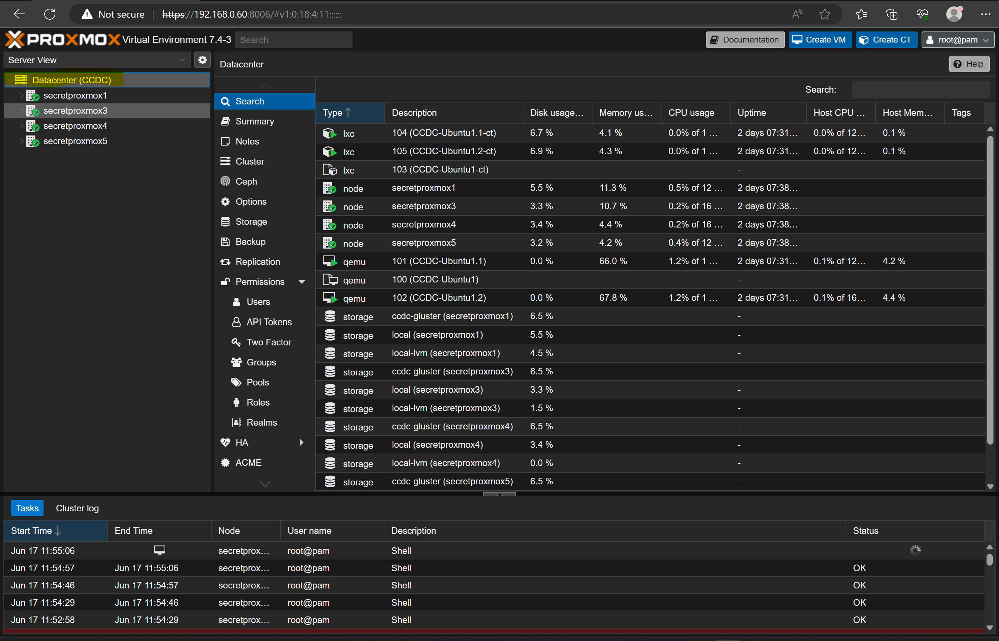
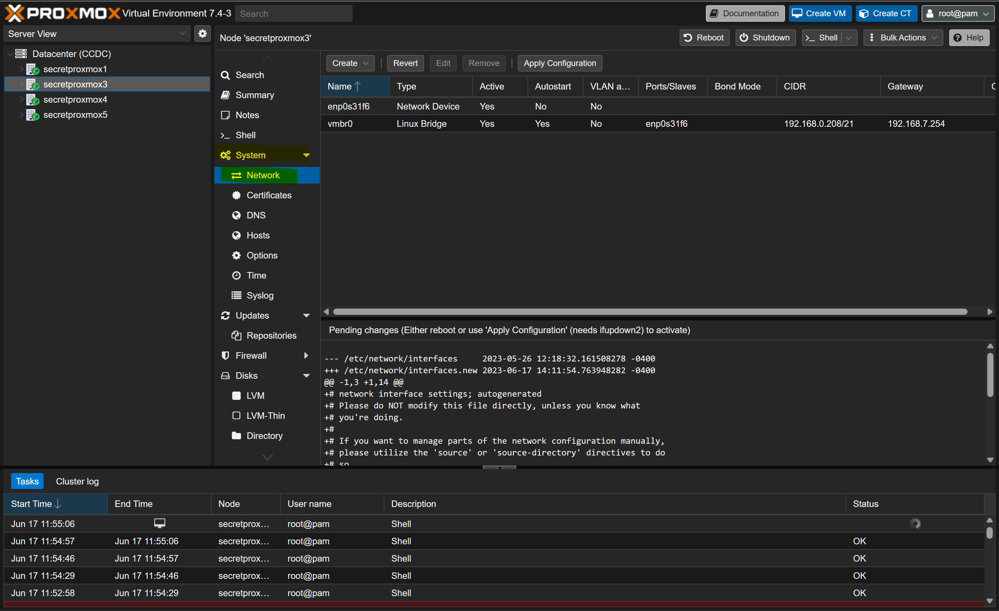
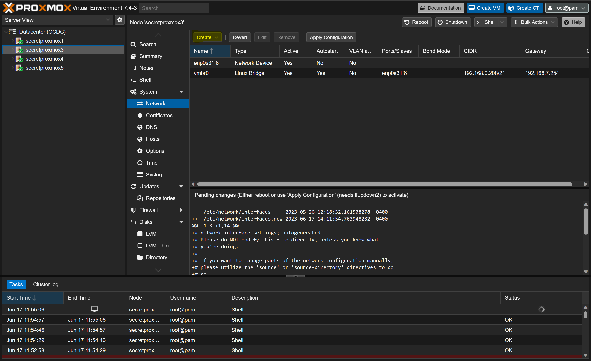
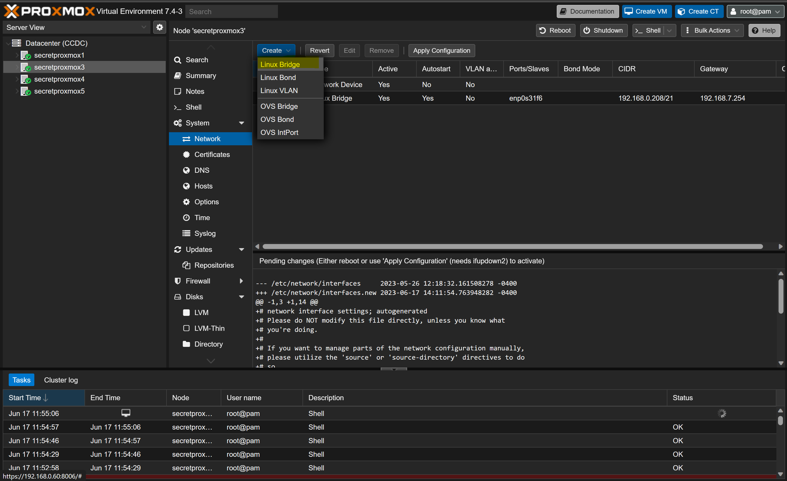
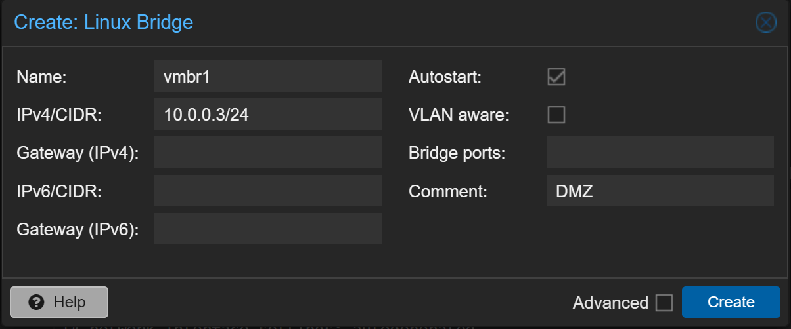

# Proxmox 

## Network Setup
It appears that the Linux VLAN and OVS Networking options are used for connecting Virtual devices to external VLans that are created using a **PHYSICAL** managed Network Switch.

### Plan/Idea
Based on what I have read:
1. Our best bet is to create **Bridged Networks** that have no gateway or interface specified.
   * This allows us to create **INTERNAL** Networks removing the  ability for devices to bypass the firewall
2. These Internal Networks can be attached to 1 of the interfaces created on the PFSense VM.
3. We will need 4 of them   
   * One for the DMZ Network
   * One for the Linux Network
   * One for the Windows Network
   * One for the Network used to connect the PFSense Routers.
4. The Ingress router (DMZ One) will be connected to the bridged network, so that will still needs to exist.
### Steps to Implement
1. Navigate to Proxmox, and login, you should see something like the image below. In this case we are seeing the *Datacenter View*.
    
    
2. Select a Proxmox host in the Datacenter, in this case we selected *secretproxmox3*. Then we need to select the *System* dropdown menu and *Networking*
   
    
3. Select *Create* to expand the options
    
    
4. Select the option *Linux Bridge*
    
    
5. We will see the following options field
    
    
6. Fill it out as follows varying the number in the *name* and the IPV4/CIDR range for each pass.
    
    
7. Repeat steps 3 to 6 three more times, varying the IPV4/CIDR and network name. Once done we should have something like the following.
    
    
    * The gateway will the the PFSense device that hosts a DHCP server.
### Network Setup References 
Ref on Linux VLAN: 
* https://engineerworkshop.com/blog/configuring-vlans-on-proxmox-an-introductory-guide/
* 
Ref on Internal Network:
* https://dannyda.com/2020/06/01/how-to-create-an-internal-only-isolated-network-for-guest-os-virtual-machines-vm-on-proxmox-ve-pve-like-in-vmware-workstation-host-only-network-but-different/ 
* https://forum.proxmox.com/threads/isolate-subnets.99263/
* https://forum.proxmox.com/threads/how-to-create-private-network.110734/
## VM Creation 
First we need to make sure the PFSense, Linux and Windows ISOs are available. We can do that with the following steps in each Documentation, However we provide general guidance in this document below.
1. Refer to [PFSense Documentation](./../PFSense/Initial_Setup.md)
2. Refer to [Linux Documentation](./../../Linux/README.md)
3. Refer to [Windows Documentation](./../../Windows/README.md)

## Network Creation
Refer to the [PFSense Documentation](./../PFSense/Initial_Setup.md) document for more details.

## VM Attachment
This is utilized in the [PFSense Documentation](./../PFSense/Initial_Setup.md), as they are the only set of devices that need multiple network interface connections. However, we may make use of it during development to ease access to the internal Routers. 