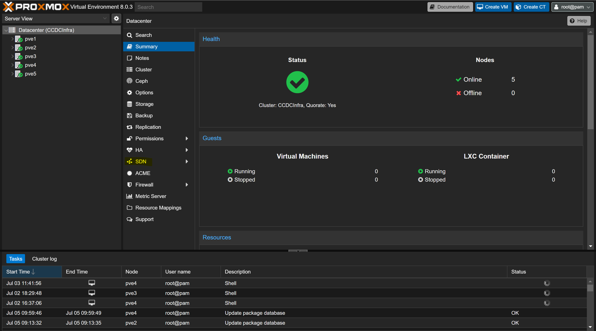
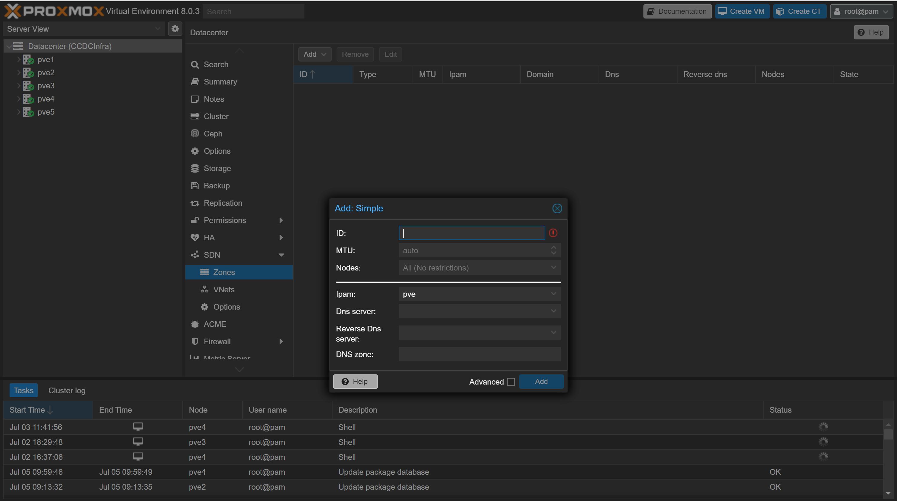
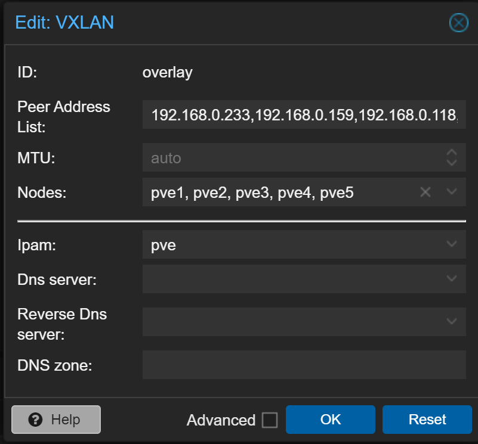
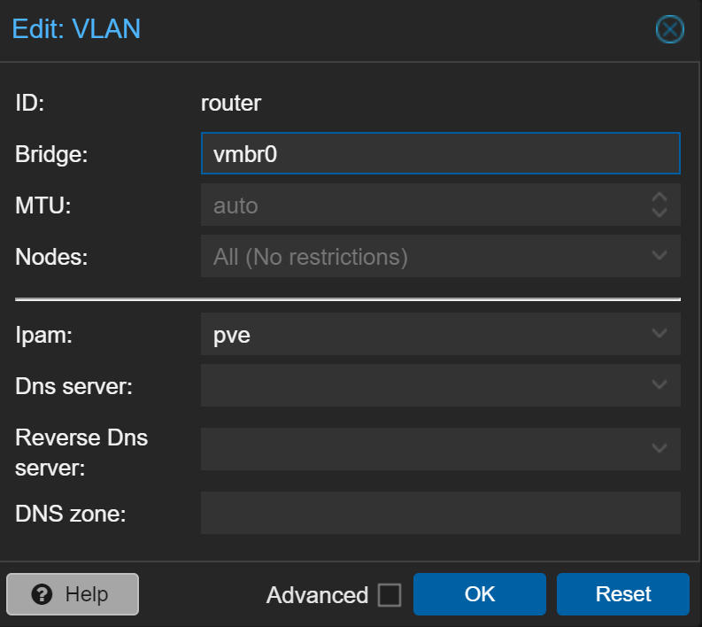
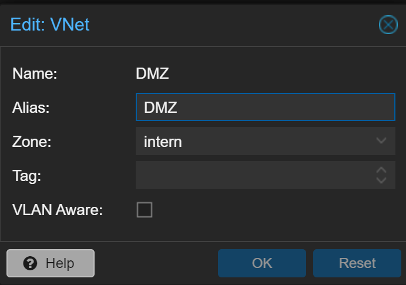
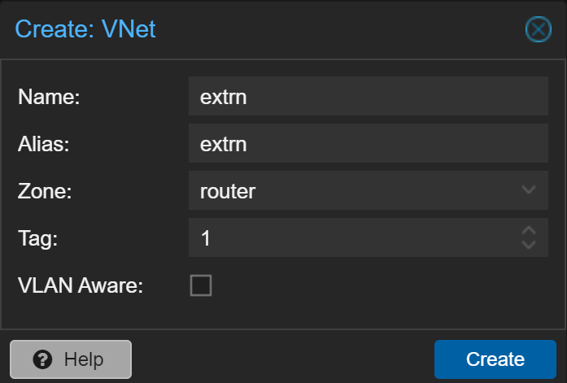
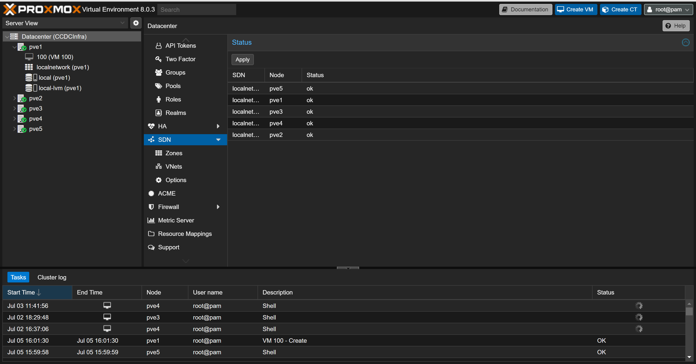

# Setup of the Software Defined Network
This document described the setup and configuration of Software Defined Networks in Proxmox for this project.

## Installation

### Modify Apt Source List
Please refer to [Proxmox Readme](./../../Proxmox/README.md) to add the non-enterprise repository, and remove the enterprise repositories.

1. Update and install packages 
    ```
    apt update && \
    apt install libpve-network-perl ifupdown2
    ```
2. Modify the ```/etc/network/interfaces``` file
    ```
    echo "source /etc/network/interfaces.d/*" >> /etc/network/interfaces
    ```
3. Wait some time, possibly restart devices
    * For me, the SDN field did not appear until 2 days later, when the machine may or may not have all been restarted
### SDN
1. Access the *Datacenter* page from the the web interface 

    

2. Access the SDN dropdown menu

    

3. Access Zones

    

4. Create a VLAN Zone 
   *  <a href="https://pve.proxmox.com/pve-docs/chapter-pvesdn.html">Per Proxmox's SND documentation</a>: "A zone defines a virtually separated network", we need this in order to virtually connect the Proxmox hosts, allowing for the "Seamless" communication between nodes on the various networks. We can likely use the **Simple** or **VLan** Zones. If we wish to utilize VLan Tags the VLAN network is required.

    

5. Fill in the information. They limit the ID to 10 characters
    * The DNS information appears to be a drop down. I was unable to configure this.

    

   *  For the DMZ we may want to create a VLAN network and specify a bridge as the default **vmb0** which is on each device. This is probably not necessary and can be skipped.  

            

6. Navigate to the VNet menu, create an VNet as shown below. As we are using a simple network, no VNet TAG is needed.

    

   *  For the DMZ we may want to create a VLAN network and specify a bridge as the default **vmb0** on each     
        

7. Repeat 6 for all desired networks (In our case 4)
8. Navigate to the SDN main page again, hit the **Apply** button
    
9. Now we have networks that devices can be attached to

