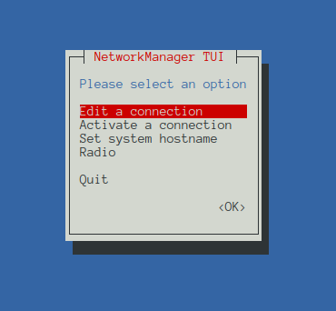
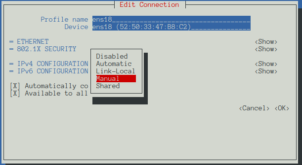
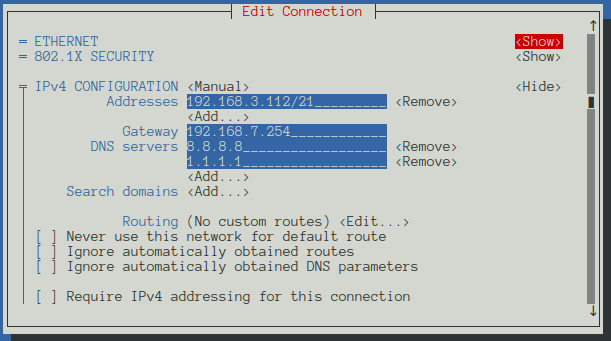
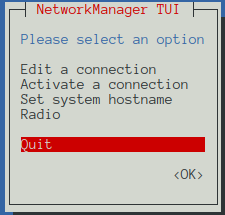

# Static Configurations 


## IP Addresses 
This is a section that pertains to the setting, and modification of **static** (manually) configured IP addresses.

### Redhat
This section covers a method we can use to manually configure the IP assigned to a redhat Linux machine.

**NMTUI**
1. Run `nmtui` as a sudo user
2. Select *Edit a connection*, and hit enter
   
  

3. Select the network interface you would like to edit and hit enter 

  

4. Move down to thew IPv4 configuration. Select Manual configuration.

  

5. Move over to *Show* and hit enter

  

6. Click *add* and fill out the information (IP address *We are on a /21 network*)

  

  * You can find out the default gateway by using the command `ip r`

7. Click OK

  

8. Select Back

  

9. Select Quit

  

10. Restart network manager
  * Restart service 
    ```
    # Ubuntu 
      sudo systemctl restart network-manager
    
    # RHEL
      sudo systemctl restart NetworkManager
    ```
  * Restart the machine 
    ```
      sudo restart 
    ```
**NMCLI**
1. Open a terminal on the target machine.
2. Run ```systemctl status NetworkManager``` to ensure the network management service is running.
3. Run ```ip a``` or ```ip a show``` to display the current interface configurations, manual or DHCP.
4. Run the following series of commands to statically configure the IP of the machine, this show the ens3 interface being modified, this can be changed to any valid interface
   1. ```nmcli con mod ens3 ipv4.addresses <CIDR-IP>```
      * Modify the ens3 interface to have the specified IP address
   2. ```nmcli con mod ens3 ipv4.gateway <Gateway-IP>```
      * Modify the ens3 interface to have the specified gateway (Where it directs external bound traffic)
   3. ```nmcli con mod ens3 ipv4.method manual```
      * Modify ens3 to be static (not use DHCP)
   4. ```nmcli con mod ens3 ipv4.dns "<DNS-Server>"```
      * Modify ens3 to use the specified DNS server
   5. ```nmcli con up ens3```
      * Bring interface up
5. We can look at the updated configuration using the following command ```cat /etc/sysconfig/network-scripts/ifcfg-ens3```
6. Stop DHCP services ```systemctl stop dhcpd```


**Proven Manual Method**
1. Open a file ```vim /etc/sysconfig/network-scripts/ifcfg-ens19```
2. Add in the following information
  ```
  TYPE="Ethernet"
  BOOTPROTO="none"
  IPADDR="<IP>"
  NETMASK="<MASK> i.e 255.255.255.0"
  GATEWAY="<IP>"
  DEVICE="ens19 (DEV NAME)" 
  NAME="ens19 (DEV NAME)"
  ONBOOT="yes"
  DNS1="<IP>" 
  ```
  * No (parens), just for a comment
3. Reboot and run nmtui on the device (Ensures it is configured)
  ```
  nmtui edit <dev>
  ```
4. This will result in a similar configuration to the following 
  
### Debian Based 

1. Open a terminal on the target machine
2. navigate to the ```/etc/netplan/``` directory
    ```
    cd /etc/netplan/
    ```
   * There will be a file ```00-installer...```, you
3. Create a file 
    ```
    sudo vim /etc/netplan/01-netman.yaml
    ```
   * Using vim makes Alex happy (can anything?)
   * Must be a yaml file, name probably does not matter much (01 may be)
4. Add the following boilerplate 
    ```
    network:
      version: 2
    ```
    * We are using version 2 I guess
5. (Optional) Add rendered as NetworkManager
    ```
    network:
      version: 2
      renderer: NetworkManager
    ```
6. Add a ethernet section, and interface. We are doing this statically, so we do not need dhcp
    ```
    network:
      version: 2
      renderer: NetworkManager
      ethernets:
          eth0:
          dhcp4: no
    ```
7. Configure the interface with a gateway and Static IP
    ```
    network:
      version: 2
      renderer: NetworkManager
      ethernets:
          eth0:
          dhcp4: no
          addresses: [<Static-IP>]
          routes:
            - to: default
              via: <IP>
    ```
8. Configure DNS 
    ```
    network:
      version: 2
      renderer: NetworkManager
      ethernets:
          eth0:
          dhcp4: no
          addresses: [<Static-IP>]
          routes:
            - to: default
              via: <IP>
          nameservers:
            addresses: [<IP>,<IP>]
    ```
9. Run ```netplan try```


For example the following is one we used on an ubuntu machine:
```
network:
  ethernets:
    ens19:
    dhcp4: false
    addresses: [10.0.2.10/24]
    routes:
      - to: default
        via: 10.0.2.1
    nameservers:
      addresses: [8.8.8.8]
  version: 2
```
## INterface Manipulation

1. Bring it down
  ```
  ip link set dev <interface> down
  ```
2. Bring it up 
  ```
  ip link set dev <interface> up
  ```