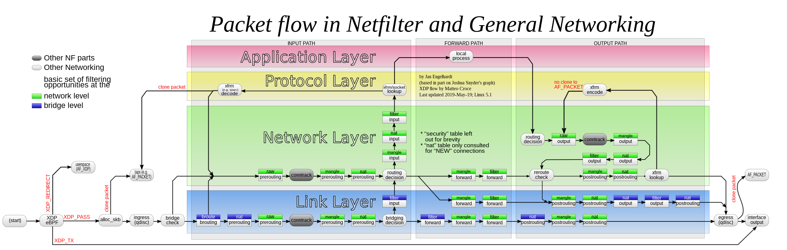

# IPTables
IPTables is a *Host-Based* Firewall. This means it is a firewall solution that *runs on the host system*. You may have heard bad things about how hard or outdated IPTables is; this may or may not be true, but for the most part, this is now for us (you) to decide.

> [!IMPORTANT]
> IPTables and Firewalld are mutually exclusive; this also includes Uncomplicated FireWall (UFW) since this merely acts as a frontend to IPTables and will likely override or mess up the manual configurations you perform. So if you are using IPTables, you should disable all other host-based firewall solutions. In this case, more is not better.

IPTables is one of the traditional tools used in a Linux system to manage the host-based firewalls, considering it was originally released in 1998 it is older than most of the people reading this... Owning to this considerable history the tool is not the most straightforward to use and may take some time to get used to. Something that should be noted is that by using IPTables we are not necessarily using an old an outdated system. This is simply a user-space program that we use to configure the kernel-space filtering of a firewall; namely they are both using the [*netfilter*](https://www.netfilter.org/about.html#history) backend. When using `iptables` we are using the same backend as we would be if `nftables` the modern user-space CLI tool were used.

## Considerations
First `iptables` is a *Command-Line tool* that is used to create and manage a series or *Rules* organized into *Chains* where a set of chains are organized into *Tables* to organize them based on their place in the path a packet will take through the system (firewall) when being sent or received.

Using the `iptables` command will only affect IPv4 traffic, you will need to use an equivalent set of flags with the `ip6tables` command to effect IPv6 traffic.
> [!NOTE]
> Although we will not use or discuss them much we can use [arptables](https://linux.die.net/man/8/arptables) to filter and manage ARP traffic and [ebtables](https://linux.die.net/man/8/ebtables) to manage ethernet frames directly.

The command line has a series of basic built-in flags loaded when we use the `-p` flag to select the protocol of the packet we are operating against that can get us through most of the Firewall configuration process, however, additional modules may be loaded with the `-m` flag increasing complexity of the rules we can create. The [man page](https://linux.die.net/man/8/iptables#:~:text=Match%20Extensions-,iptables,-can%20use%20extended) for IPTables has a list of some useful modules.

Using the `iptables` command immediately applies the rule or action, there is no need to restart a service or the machine. This means it can be quite easy to lock yourself out of a machine if your actions are not carefully thought out; additionally, you can easily induce service interruptions with these rules.

IPTables has a number of *Tables* and *Chains* whose relations can be shown in a complicated flow chart to describe how packets flow through the system. It is easy to hide rules in various tables and chains to effect service uptime and availability. Below is a table that will later be further discussed.

<figure>
    IPTables flowchart sourced from <a href="https://en.wikipedia.org/wiki/Iptables#/media/File:Netfilter-packet-flow.svg">Wikipedia</a>.</figcaption>
</figure>

## IPtables Basics and Structure
The basics of IPTables are inherently tied to the structure of IPTables itself, mainly how we interact with the various tables and chains contained within. First we will discuss the basics of the syntax we use for IPTables, and then we will discuss how this ties into the structure of the IPTables.


### IPTables Basic Structure
This section will not discuss the flow of a packet through IPtables, if that is done it will be in a later section since that is a bit more than the basics. In this section we will discuss the basic structures and concepts within iptables.
#### Tables
A table consists of a series of chains. In IPtables, there are some default chains contained in each of the tables. You can also find user- or service-created chains on most systems. These tables group together chains that are used for the same logical purpose, just as those chains logically group together rules. These tables do not have much effect outside of grouping chains.

Below are the tables we can find in IPtables, and some general information on the purpose of these tables.
* raw
* filter
* nat
* mangle
* security

The **raw** table is used to configure packets to make them exempt from tracking. This is done using the NOTRACK target in IPTabels, making it so `ip_conntrack` is not called. This is generally the first set of chains a packet will encounter and is generally used to configure whether the state of the connection is tracked or not.

The **filter** table is the one we often are the most concerned with. When using `iptables` commands, this is the default table we interact with, and as the name implies, it filters packets and does the actions we traditionally associate with a firewall. You can, of course, place those actions in other tables, though in most cases, this is ill-advised.

The **nat** table is used for *Network Address Translation (NAT)* operations (NAT allows us to hide multiple machines behind a singular IP). This is generally used for outgoing connections, we will see this with Docker. Only the first packet in a stream will hit this table when creating outbound traffic, the rest have the same actions as the first in the flow applied.

The **mangle** table special since it is used to perform packet alterations. There are a number of modification we can make to the packet, for example.
* You can change the Type Of Service (TOS) field
* You can change the Time To Live field (TTL)
* `MARK` sets special mark values on the packet
* `SECMARK` can set security context fields on the packet(used in SE LINUX)
* `CONNSECMARK` will copy the `SECMARK` on a single packet to the whole connection

The **security** table is used for Mandatory Access Controls, generally for *SELinux* constructs. This may not be present on all systems.

#### Chains
A chain consists of a series of rules that are applied at a specific point in the packet's journey through the *host-based firewall*. A chain can be thought of as a doubly linked list, where rules are grouped together starting at the head and moving down towards the tail. The packet will be checked against the rules sequentially, starting at the head of the list and moving towards the tail. Once a rule is matched against the packet, the *TARGET* is applied and we will stop searching through the chain for additional matches. This means if we place a more general rule, such as a *Catch-All* at the head of the list, even if there are more specific rules deeper in the chain, we will never compare against them as they stop at the *Catch-All*.
#### Rules
Rules in IPtables consist of a series of conditions, these can include the protocol `-p`, port `--dport`/`--sport`, the source `-s` or destination `-d` address, addition concepts defined by the modules `-m`, and much more. We then specify the *TARGET* of the rule should those conditions we specified earlier be met. The packet will be evaluated against the rules from the *start* or *head* of the chain until a rule is matched or the default policy is applied. The target can be one of the following:
* `ACCEPT`: Accept the packet.
* `DROP`: Reject the packet without notifying the sender.
* `REJECT`: Reject the packet and notify the sender.

> [!IMPORTANT]
> Iptables stops evaluating rules once it has successfully matched the conditions in the rule to a packet. Since our rules are evaluated sequentially starting at the beginning of a chain, we need to carefully plan out the order our rules are placed to prevent earlier, more general rules from being applied before more specific and granular rules if they are placed deeper in the chain.
### IPTables Basic Syntax
When using the `iptables` command, we will use the following general syntax; of course, this may vary depending on what you would like to do!

#### Adding or Deleting Rules
```sh
$ iptables -t <TABLE> [-A|-I|-D] <Chain> <Rule>
```

First we use the `iptables` command, if you have the necessary programs installed - Most of the time it's `iptables` but you should google this yourself! - we should not run into any issues when running the command unless you have other host-based firewalls installed. Below is a set of sample output if `iptables` is ran without any arguments.
```
$ iptables
iptables v1.8.9 (nf_tables): no command specified
Try `iptables -h' or 'iptables --help' for more information.
```
> [!NOTE]
> Notice how we can see (nf_tables), this is because we are not using the traditional iptables kernel API/interface, we are using the nftables interface. More details can be found online in articals such as ["iptables: The two variants and their relationship with nftables"](https://developers.redhat.com/blog/2020/08/18/iptables-the-two-variants-and-their-relationship-with-nftables#).

Next we generally specify the table we would like to be working with using the `-t` flag. This is not always necessary since the *default* is the **filter** table which is the one will are often most concerned with.

> [!NOTE]
> The table name should be *all lowercase*


After this we specify the action we would like to take, there are additional commands for creating and managing *chains* but this is outside of the *basics*. Below are three actions you will commonly use to manage the *rules* within a *chain*:
* `-A`: Append, this will create a rule at the *end* or *tail* of the chain. This becomes the last rule checked in the chain.
* `-I`: Insert, this will create a rule at the *beginning* or *head* of the chain. This becomes the first rule checked.
  * `-I <Chain> <Num>`: We can optionally specify a location to insert the rule at.
* `-D <Chain> <NUM>`: Delete, we specify an index within a chain of a rule to be removed

We always need to specify the *chain* to preform the action on, you will need to know the *name* or *identifier* of the chain and this can be seen when we list the contents of a table. Most tables share names such as `INPUT`, `OUTPUT`, `PREROUTING`, etc.

If we are not deleting a rule, we then include the necessary flags to define the rule we would like to add to our system.

We can also *flush* all the rules contained within a *table* or *chain* using the following command.
```
$ iptables -t <table> -F <chain>
```
*  `-t "table"` specify table to be modified
*  `-F "chain"`: removes all rules from the specified chain

This command will remove all the rules contained within a given chain, we can also omit a chain name which will instead flush all rules from all chains in the table. It should be obvious this may be damaging if your services use those chains to route traffic, such as VPNs or Orchestration programs like K8s.
#### Building Rules
We can filter traffic using the interface as a condition to check. This is done using the little **-i** flag in the rule definition for incoming traffic, the **-o** flag would be used for outgoing traffic. 
``` sh
# This rule allows use of the loopback interface  
# We specify the interface with the -i lo sequence to allow incoming traffic on the interface
$ sudo iptables -I INPUT -i lo -j ACCEPT
# We specify the interface with the -o sequence to allow for outbound traffic
$ sudo iptables -I OUTPUT -o lo -j ACCEPT
```

We can filter traffic based on the protocol and port number specified. This uses the **-p** flag, **--sport**, and **--dport** flags where the **sport** and **dport** flags are used to filter source and destination port values. Valid arguments for the **-p** flag include **all**, **tcp**, **udp**, **udplite**, **icmp**, **sctp**, and  **icmpv6**. The default argument unless one is specified with -p is **all**.
*Notice that flags using more than one character use two "-"s* 
```sh
# This is a rule that allows tcp communication to port 22 (SSH generally)
$ sudo iptables -A INPUT -p tcp --dport 22 -j ACCEPT
```

We can filter traffic based on the source address without the use of **modules**. This is done using the **-s** flag. This can be a network name or hostname. Specifying anything that has to be resolved with an external DNS query is a bad idea for obvious reasons. We can specify a network mask can also be provided in the form of CIDR notation or a number specifying the number of 1's from the left. (24 == 255.255.255.0)

```sh
# Accept only tcp packets to port 22 from the 192.168.1.0/24 network
$ sudo iptables -A INPUT -p tcp --dport 22 -s 192.168.1.0/24 -j ACCEPT
```

We can filter traffic by destination using the **-d** flag. The same conditions and rules apply to this flag as the **-s** source flag above.
```sh
## If the destination is X.X.X.X/Y and it is over tcp to port 80 it will be accepted (outbound)
$ sudo iptables -A OUTPUT -p tcp --dport 80 -d X.X.X.X/Y -j ACCEPT
```
You will have seen a **-j** flag previously, this is the jump flag and it defines what the should be done once the conditions in the rule are met. The target of the jump can be a **USER CREATED**, one of the built in targets. The following are the built in targets and what they do.
  * **ACCEPT** - Let the packet through 
  * **DROP** - Drop the packet (No response)
  * **REJECT** - Drop the packet (send a response)
  * **QUEUE** - Send packet to user space 
  * **RETURN** - Stop processing in this chain and resume processing in the calling chain

We can jump to a **USER CREATED** chain using the **-g** goto flag, as long as the user chain is a part of the table this rule is in.
```sh
## If the destination is X.X.X.X/Y and it is over tcp to port 80 it will be accepted (outbound)
$ sudo iptables -A INPUT -s X.X.X.X/Y -g <USER_CHAIN>
```
#### Modules
There are a number of built in modules that can be used to increase the granularity of the rules that we are defining. There are quite a lot of them that can be found on various [man pages](https://manpages.ubuntu.com/manpages/xenial/man8/iptables-extensions.8.html).

To use a module, you place the module name after the **-m** flag, then following the module name you can use the flags and options defined by that module to specify the conditions that need to be met.

Some useful modules include [conntrack](https://manpages.ubuntu.com/manpages/xenial/man8/iptables-extensions.8.html#:~:text=before%20the%20comparison\).-,conntrack,-This%20module%2C%20when) which allows you to look at the state of the connection, and use that as a condition to be met in the rule.

We are most likely going to use the **--ctstate** (Connection State) flag. This can analyze the packet for the following states:
  * `NEW`: The packet is part of a new connection from a client.
  * `ESTABLISHED`: The packet is part of a connection that has already been established with the host.
  * `RELATED`: The packet is part of a new connection related to an already established one.
  * `UNTRACKED`: This packet is explicitly un-tracked; This is done with the -j CT --notrack in the raw table
  * `INVALID`: This is an invalid state.
  * (There are two others that likely will not be used)
```sh
# Accept all incoming connections that are already established (Outgoing connections made first)
$ sudo iptables -A INPUT -m conntrack -ctstate ESTABLISHED -j ACCEPT
```

We could also use the [iprange](https://manpages.ubuntu.com/manpages/xenial/man8/iptables-extensions.8.html#:~:text=ipv6%2Dicmp%20%2Dh-,iprange,-This%20matches%20on) module to accept IPs in an explicit range. This uses the **--src-range** and **--dst-range** flags.

```sh
# Accept connections from a source range
$ sudo iptables -A INPUT -m iprange --src-range 192.168.1.100-192.168.1.110 --dst-range 192.168.2.100-192.168.2.200 -j ACCEPT
```

#### Examining IPTables
```sh
$ iptables -t <TABLE> -L
```

By using the `-L` flag we can list the contents of a given table as shown below:
```
$ iptables -t filter -L
Chain INPUT (policy ACCEPT)
target     prot opt source               destination         
ts-input   all  --  anywhere             anywhere            

Chain FORWARD (policy DROP)
target     prot opt source               destination         
ts-forward  all  --  anywhere             anywhere            
DOCKER-USER  all  --  anywhere             anywhere            
DOCKER-ISOLATION-STAGE-1  all  --  anywhere             anywhere            
ACCEPT     all  --  anywhere             anywhere             ctstate RELATED,ESTABLISHED
DOCKER     all  --  anywhere             anywhere            
ACCEPT     all  --  anywhere             anywhere            
ACCEPT     all  --  anywhere             anywhere            

Chain OUTPUT (policy ACCEPT)
target     prot opt source               destination         

Chain DOCKER (1 references)
target     prot opt source               destination         

Chain DOCKER-ISOLATION-STAGE-1 (1 references)
target     prot opt source               destination         
DOCKER-ISOLATION-STAGE-2  all  --  anywhere             anywhere            
RETURN     all  --  anywhere             anywhere            

Chain DOCKER-ISOLATION-STAGE-2 (1 references)
target     prot opt source               destination         
DROP       all  --  anywhere             anywhere            
RETURN     all  --  anywhere             anywhere            

Chain DOCKER-USER (1 references)
target     prot opt source               destination         
RETURN     all  --  anywhere             anywhere            

Chain ts-forward (1 references)
target     prot opt source               destination         
MARK       all  --  anywhere             anywhere             MARK xset 0xXXX/0xXXX
ACCEPT     all  --  anywhere             anywhere             mark match 0xXXX/0xXXX
DROP       all  --  XXX.XXX.XXX.XXX/YY   anywhere            
ACCEPT     all  --  anywhere             anywhere            

Chain ts-input (1 references)
target     prot opt source               destination         
ACCEPT     all  --  fedora               anywhere            
RETURN     all  --  XXX.XXX.XXX.XXX/YY   anywhere            
DROP       all  --  XXX.XXX.XXX.XXX/YY   anywhere            
ACCEPT     all  --  anywhere             anywhere            
ACCEPT     udp  --  anywhere             anywhere             udp dpt:XXXXX
```
We can see in this case the default chains in the *filter* table are present in addition to a number of chains created by services on my machine.

> [!IMPORTANT]
> Your output will vary based on what is on your system. Most of the time it will likely not have much...

We can use additional flags such as `--line-number` to print the index associated with the rule, which is often used to delete specific rules or insert rules at a specific location. We can also use the `-v` flag to print out additional information that can be useful when debugging our firewall rules. This generally is the number of packets a rule has been triggered by.

> [!TIP]
> You can add the `-n` flag to no resolve IP addresses to domains using a reverse DNS lookup. This is useful to prevent long lookup times.

```sh
$ iptables -t filter -L --line-number -v
Chain INPUT (policy ACCEPT 0 packets, 0 bytes)
num   pkts bytes target     prot opt in     out     source               destination         
1     200K  458M ts-input   all  --  any    any     anywhere             anywhere            

Chain FORWARD (policy DROP 0 packets, 0 bytes)
num   pkts bytes target     prot opt in     out     source               destination         
1        0     0 ts-forward  all  --  any    any     anywhere             anywhere            
2        0     0 DOCKER-USER  all  --  any    any     anywhere             anywhere            
3        0     0 DOCKER-ISOLATION-STAGE-1  all  --  any    any     anywhere             anywhere            
4        0     0 ACCEPT     all  --  any    docker0  anywhere             anywhere             ctstate RELATED,ESTABLISHED
5        0     0 DOCKER     all  --  any    docker0  anywhere             anywhere            
6        0     0 ACCEPT     all  --  docker0 !docker0  anywhere             anywhere            
7        0     0 ACCEPT     all  --  docker0 docker0  anywhere             anywhere            

Chain OUTPUT (policy ACCEPT 0 packets, 0 bytes)
num   pkts bytes target     prot opt in     out     source               destination         

Chain DOCKER (1 references)
num   pkts bytes target     prot opt in     out     source               destination         

Chain DOCKER-ISOLATION-STAGE-1 (1 references)
num   pkts bytes target     prot opt in     out     source               destination         
1        0     0 DOCKER-ISOLATION-STAGE-2  all  --  docker0 !docker0  anywhere             anywhere            
2        0     0 RETURN     all  --  any    any     anywhere             anywhere            

Chain DOCKER-ISOLATION-STAGE-2 (1 references)
num   pkts bytes target     prot opt in     out     source               destination         
1        0     0 DROP       all  --  any    docker0  anywhere             anywhere            
2        0     0 RETURN     all  --  any    any     anywhere             anywhere            

Chain DOCKER-USER (1 references)
num   pkts bytes target     prot opt in     out     source               destination         
1        0     0 RETURN     all  --  any    any     anywhere             anywhere            

Chain ts-forward (1 references)
num   pkts bytes target     prot opt in     out     source               destination         
1        0     0 MARK       all  --  tailscale0 any     anywhere             anywhere             MARK xset XXX/XXX
2        0     0 ACCEPT     all  --  any    any     anywhere             anywhere             mark match XXX/XXX
3        0     0 DROP       all  --  any    tailscale0  XXX.XXX.XXX.XXX/YY        anywhere            
4        0     0 ACCEPT     all  --  any    tailscale0  anywhere             anywhere            

Chain ts-input (1 references)
num   pkts bytes target     prot opt in     out     source               destination         
1        0     0 ACCEPT     all  --  lo     any     fedora               anywhere            
2        0     0 RETURN     all  --  !tailscale0 any     XXX.XXX.XXX.XXX/YY      anywhere            
3        0     0 DROP       all  --  !tailscale0 any     XXX.XXX.XXX.XXX/YY        anywhere            
4       30  2046 ACCEPT     all  --  tailscale0 any     anywhere             anywhere            
5       76  5472 ACCEPT     udp  --  any    any     anywhere             anywhere             udp dpt:41641
```

> [!NOTE]
> You can reset the counters we see in the verbose `-v` output with the command `iptables -t <table> -Z <chain>`.

#### Setting Policies
We can use the following command to set the *default policy* of a *chain*. As discussed previously, this is the action taken if none of the rules contained within the chain are triggered.
```
$ iptables -P <chain> [ACCEPT|DROP|REJECT]
```

This command sets the target our default policy will use. This can be any one of the valid targets in IPTables. Generally, we use *ACCEPT* to allow the packet through and *DROP* to reject the packets without notifying the sender we have done so (we will not appear on scans as much).


> [!IMPORTANT]
> This can only be done to the default chains in a table, you cannot do this on any user-created chains. We can emulate this by placing a catch-all at the bottom of the user chain; for example, we can use the following to create a default DROP rule in a user-created chain.
>
> ```sh
> $ iptables -t filter -A Some-User-Chain -j DROP
> ```

## Advanced IPTables Operations
### Adding User Chains
There are a few reasons to create a user-defined chain. The first is to create a unit of reusable rules that you can apply as a target for a rule in one of the default chains in the table. Generally, I use this to create a logging chain that I can make a target for.

We can create new **USER DEFINED** chains using the **-N** flag
```sh
$ sudo iptables -N <chain>
```

We can remove a user-defined chain using the **-X** flag
```sh
$ sudo iptables -X <chain>
```

We can jump to a user-defined chain with the `-j` flag we have commonly used for the *ACCEPT*ing and *DROP*ing of packets.
```sh
$ iptables -t <TABLE> [-A|-I|-D] <Chain> <Rule> -j <USER-CHAIN-NAME>
```

We can return to the calling chain with the *RETURN* target in a user chain.
```
$ iptables -t <TABLE> [-A|-I|-D] <Chain> <Rule> -j RETURN
```
> [!NOTE]
> This is useful since we can perform an early return.

### Debugging
There are a variety of tools that we can use to debug a firewall.

`iptables`: We can use the list and verbose function of IPTables to see the number of packets (and bytes) that a rule has applied to. This can be useful to see if a ACCEPT rule is being applied properly. Or to see if a DROP/REJECT rule is causing issues. (We can also see if a default policy is catching it, and what chain is blocking the traffic)

`ss`: This is a useful command line utility for determining what process may be bound to specific ports and what they are doing, as we can see the port and IP a packet is being sent to. We can also see if it has been established or if only a SYN has been sent. If we see only a SYN and no established connection, we may need to whitelist the port of the destination or source. This would be in the OUTPUT chain of the machine we are using **ss** on. The machine the packet is being sent to would need to whitelist our IP or the port the packet is being sent from in the INPUT chain. 

`netstat` -- Just use `ss`... this preforms the same operations!

Since as we mentioned *IPtables* Is really just a frontend using NFTables we can use the following command to trace all packet and the rules being applied. We should redirect this to a file and stop it after a bit.
```sh
xtables-monitor --trace


# redirect it to a file
xtables-monitor --trace > trace-file.txt
```

## Refs
[[1] iptables(8) - Linux man page](https://linux.die.net/man/8/iptables)

[[2] A Deep Dive into Iptables and Netfilter Architecture](https://www.digitalocean.com/community/tutorials/a-deep-dive-into-iptables-and-netfilter-architecture)

[[3] Understanding IPTables, NAT, Conntrack and Similar Tools (With Resources to Help)](https://aembit.io/blog/understanding-iptables-nat-conntrack-and-similar-tools-with-resources-to-help/#:~:text=The%20NAT%20functionality%20in%20iptables,NAT%20rules%20defined%20in%20iptables.)

[[4] UML-CCDC2024 IPTables Docs](https://github.com/UML-Cyber-Security/ccdc2024/blob/main/3-Docs_References/OS-Linux/Firewall/README.md)
