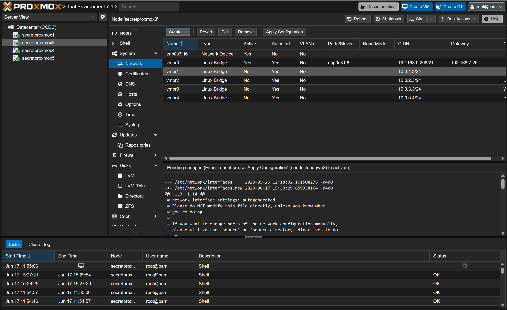

# Local Network
This document can be used when creating the Proxmox infrastructure on a **Single** machine. If you are using a Proxmox Cluster, or multiple machines then you should refer to the [SDN Documentation](./SDN.md).

## Steps to Implement Local Networks
1. Navigate to Proxmox, and login, you should see something like the image below. In this case we are seeing the *Datacenter View*.

    

2. Select a Proxmox host in the Datacenter, in this case we selected *secretproxmox3*. Then we need to select the *System* dropdown menu and *Networking*

    
3. Select *Create* to expand the options

    

4. Select the option *Linux Bridge*

    

5. We will see the following options field

    
6. Fill it out as follows varying the number in the *name* and the IPV4/CIDR range for each pass.

    

7. Repeat steps 3 to 6 three more times, varying the IPV4/CIDR and network name. Once done we should have something like the following.

    

    * The gateway will the the PFSense device that hosts a DHCP server.

## Network Setup References
Ref on Linux VLAN:
* https://engineerworkshop.com/blog/configuring-vlans-on-proxmox-an-introductory-guide/
Ref on Internal Network:
* https://dannyda.com/2020/06/01/how-to-create-an-internal-only-isolated-network-for-guest-os-virtual-machines-vm-on-proxmox-ve-pve-like-in-vmware-workstation-host-only-network-but-different/
* https://forum.proxmox.com/threads/isolate-subnets.99263/
* https://forum.proxmox.com/threads/how-to-create-private-network.110734/