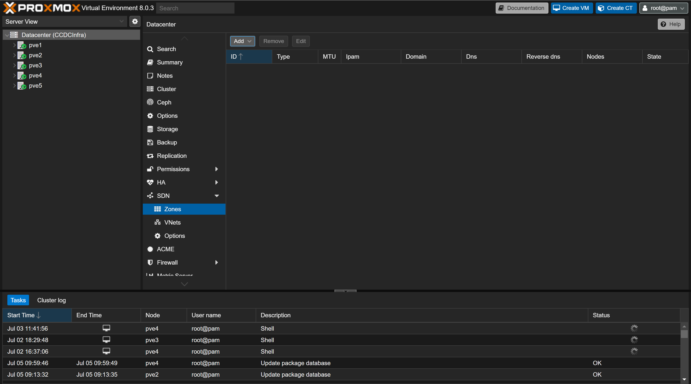
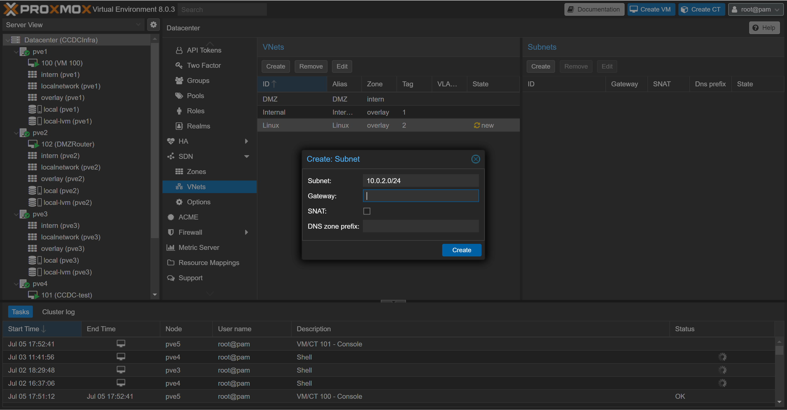

# Setup of the Software Defined Network <!-- omit from toc -->
This document described the setup and configuration of Software Defined Networks in Proxmox for this project. It also contains a walkthrough for the Network Creation.

## Table of Contents <!-- omit from toc -->

- [Installation](#installation)
  - [Modify Apt Source List](#modify-apt-source-list)
  - [SDN](#sdn)
  - [If HTTP fails Internally and externally](#if-http-fails-internally-and-externally)

## Installation
1. Ensure Host machine is using Ubuntu 20.04 or greater
### Modify Apt Source List
Please refer to [Proxmox Readme](./../../Proxmox/README.md) to add the non-enterprise repository, and remove the enterprise repositories.

1. Update and install packages
    ```
    apt update && \
    apt install libpve-network-perl ifupdown2
    ```
2. Modify the ```/etc/network/interfaces``` file
    ```
    echo "source /etc/network/interfaces.d/*" >> /etc/network/interfaces
    ```
3. Wait some time, possibly restart devices
    * For me, the SDN field did not appear until 2 days later, when the machine may or may not have all been restarted
### SDN
1. Access the *Datacenter* page from the the web interface

    

2. Access the SDN dropdown menu

    

3. Access Zones

    

4. Create a VXLan Zone
   *  <a href="https://pve.proxmox.com/pve-docs/chapter-pvesdn.html">Per Proxmox's SND documentation</a>: "A zone defines a virtually separated network", we need this in order to virtually connect the Proxmox hosts, allowing for the "Seamless" communication between nodes on the various networks. If we wish to utilize this properly VXLans are required, as they create an overlay network between the systems allowing for their communication!

    

5. Fill in the information. They limit the ID to 10 characters!
    * The DNS information appears to be a drop down. I was unable to configure this as we did not configure a Proxmox DNS server.
    * The Peer Addresses are the IP addresses of the Nodes in the Proxmox Cluster. This is a comma separated list!
    * The Nodes should all be selected (Dropdown)
    

6. Navigate to the VNet menu, create an VNet as shown below. As we are using a simple network. Ensure each VNet TAG is unique!

    

7. Repeat 6 for all desired networks (In our case 4)
8. Click on the VNet, and create a subnet for each. Example shown below (Optionally enter Gateway info)

    

9.  Navigate to the SDN main page again, hit the **Apply** button

    

10. Now we have networks that devices can be attached to as follows

    

11. Now they should be able to communicate!
    * This assumes they have IPs
      * This can be solved by manually assigning static IPS
      * We can also (preferably) setup the PFSense machines!

12. **NOTICE**: We are going to use the vmbr0 (Default bridge) for the WAN on the DMZ router. This is so we get a cyber range IP. All devices have the interface so it will be fine!


### If HTTP fails Internally and externally
1. Set Zone MTU to 1500 or the MTU supported by the physical medium

    

2. **NOTICE!!!!**: The MTU of the interface when attaching should be set to 1450 or 50 less then the MTU of the Zone/Physical Interface 

    

3. Modify PFSense instances to use the MTU of 1450 on the LAN and OTP Interfaces

    

4. For the Internal Routers set the MTU of WAN to 1450

    