# OpenVAS (Greenbone Vulnerability Manager)
>[!NOTE] This install guide uses the Greenbone Community Containers. Running on VM with 2 CPUs and 4 GB ram GVM runs slow. GVM Documentation: https://greenbone.github.io/docs/latest/22.4/container/index.html

## Prerequisites
1. **Install GVM Dependencies**
	```
	sudo apt install ca-certificates curl gnupg
	```
	
2. **Uninstall Conflicting Packages**
	```
	for pkg in docker.io docker-doc docker-compose podman-docker containerd runc; do sudo apt remove $pkg; done
	```

3. **Setup Docker Repository**
	```
	sudo install -m 0755 -d /etc/apt/keyrings
	```
	```
	curl -fsSL https://download.docker.com/linux/ubuntu/gpg | sudo gpg --dearmor -o /etc/apt/keyrings/docker.gpg
	```
	```
	sudo chmod a+r /etc/apt/keyrings/docker.gpg
	```
	```
	echo \
	    "deb [arch="$(dpkg --print-architecture)" signed-by=/etc/apt/keyrings/docker.gpg] https://download.docker.com/linux/ubuntu \
		"$(. /etc/os-release && echo "$VERSION_CODENAME")" stable" | \
		sudo tee /etc/apt/sources.list.d/docker.list > /dev/null
	```
	```
	sudo apt update
	```
4. **Install Docker Packages**
    ```
    sudo apt install docker-ce docker-ce-cli containerd.io docker-compose-plugin
    ```

## Setup
1. **Allow the user to run docker containers**
	```
	sudo usermod -aG docker $USER && su $USER
	```
2. **Create the download directory**
	```
	export DOWNLOAD_DIR=$HOME/greenbone-community-container && mkdir -p $DOWNLOAD_DIR
	```
- Creates directory `greenbone-community-container` in the users home directory.

3. **Download Docker Compose File**
	```
	cd $DOWNLOAD_DIR && curl -f -L https://greenbone.github.io/docs/latest/_static/docker-compose-22.4.yml -o docker-compose.yml
	```
- Downloads `docker-compose.yml` to the greenbone download directory.

4. **Configure Docker Compose File**
	- **Switch Image Version to Latest**
		- Several containers had issues with running the default docker images. *(You may not need to do this if there are no issues with gvmd.)* To fix this you must change the the image version from *stable* to **latest**.
			```
			sudo nano $DOWNLOAD_DIR/docker-compose.yml
			```
			Navigate to the following containers: **pg-gvm**, **gvmd**, **gsa**, **openvas**, **openvasd**, **ospd-openvas**.
			Each of these containers has an image option. Ex:
			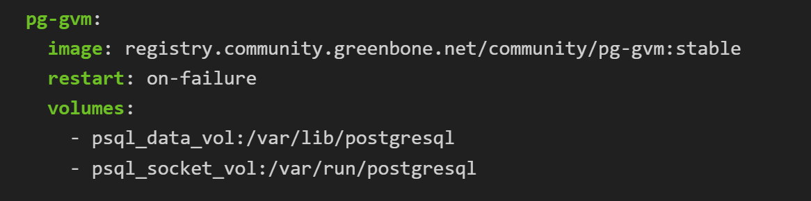
			Change every image listed above from `:stable` to `:latest`. Ex:
			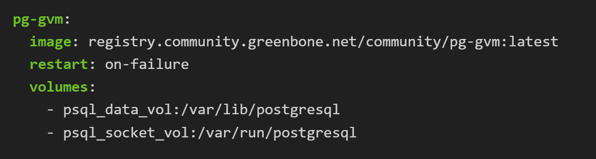
			
	- **Expose Greenbone Security Assistant**
		- The `docker-compose.yml` file must be configured to expose the Greenbone Security Assistant (GSA) to an external interface. 
			```
			sudo nano $DOWNLOAD_DIR/docker-compose.yml
			```
			Navigate to the **gsa** image and change the ports from `127.0.0.1:9392:90` to either `0.0.0.0:9392:80` or `<EXTERNAL_IP>:9392:80`
			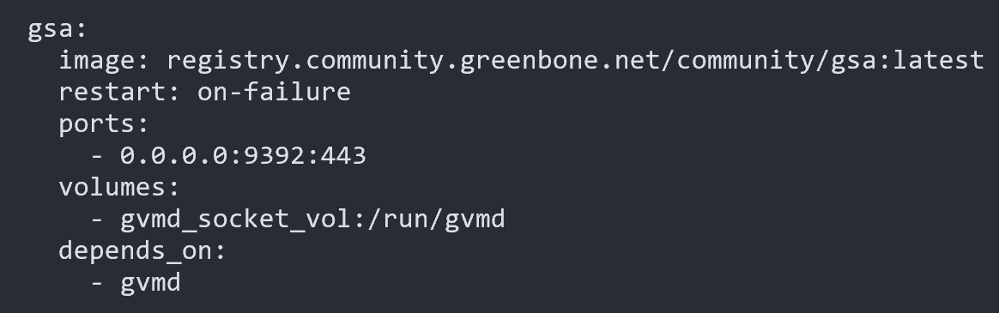
	- **Configure `https` instead of `http`**
        >[!WARNING] DO NOT USE HTTP

		- By default GSA will use `http` which is very dangerous unless you  want all of your network's vulnerabilities to be public.
			To solve this we must reconfigure the **gsa** container once again.
			We will configure **gsa** to use port `443` instead of `80` as well as specify a certificate and key.
			Your **gsa** container should look like:
            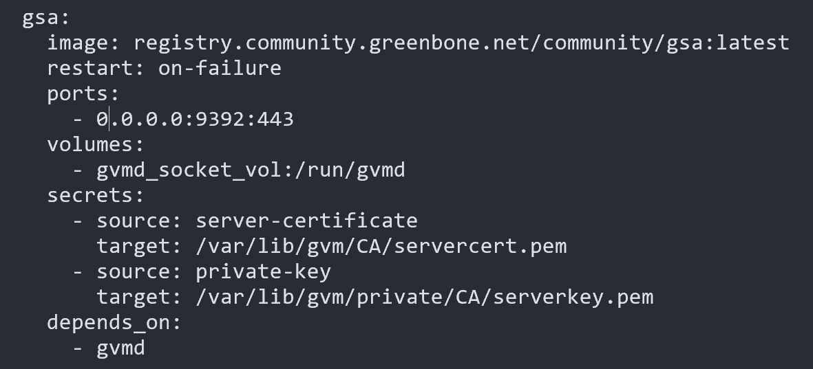
			
			This provides the container with a certificate and key in the default locations.
			
		- You must additionally add the secrets to the bottom of `docker-compose.yml`.
			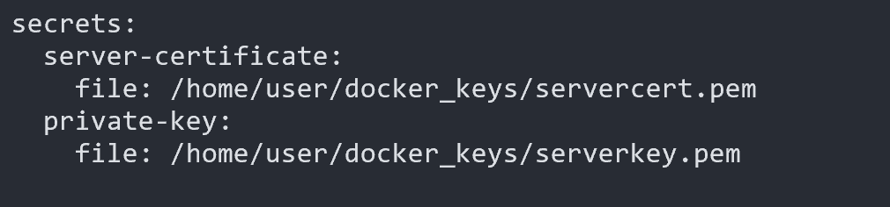
			This defines the secrets used in the gsa container.
			
		- The `server-certificate` and `private-key` can either be self signed certificates or can be obtained from a CA.
			In this example I will use a self signed certificate. Generate a certificate and key at the location you chose for your secrets:
			```
			openssl req -x509 -newkey rsa:4096 -keyout /home/<USER>/docker_keys/serverkey.pem -out /home/<USER>/docker_keys/servercert.pem -nodes -days 365
			```
            You will have to change the permissions for the serverkey.pem in order for the gvm user in the gsa container to access it.
            ```
            sudo chmod 660 /home/<USER>/docker_keys/serverkey.pem
            ```
            >[!WARNING] This is not secure, however, I have not found a better way. Using the default permissions (600), the gvm user inside the gsa container is unable to access the file once passed in.
            

        <details>
        <summary>Example docker-compose.yml (Click):</summary>

            services:
                vulnerability-tests:
                image: registry.community.greenbone.net/community/vulnerability-tests
                environment:
                    STORAGE_PATH: /var/lib/openvas/22.04/vt-data/nasl
                volumes:
                    - vt_data_vol:/mnt

                notus-data:
                image: registry.community.greenbone.net/community/notus-data
                volumes:
                    - notus_data_vol:/mnt

                scap-data:
                image: registry.community.greenbone.net/community/scap-data
                volumes:
                    - scap_data_vol:/mnt

                cert-bund-data:
                image: registry.community.greenbone.net/community/cert-bund-data
                volumes:
                    - cert_data_vol:/mnt

                dfn-cert-data:
                image: registry.community.greenbone.net/community/dfn-cert-data
                volumes:
                    - cert_data_vol:/mnt
                depends_on:
                    - cert-bund-data

                data-objects:
                image: registry.community.greenbone.net/community/data-objects
                volumes:
                    - data_objects_vol:/mnt

                report-formats:
                image: registry.community.greenbone.net/community/report-formats
                volumes:
                    - data_objects_vol:/mnt
                depends_on:
                    - data-objects

                gpg-data:
                image: registry.community.greenbone.net/community/gpg-data
                volumes:
                    - gpg_data_vol:/mnt

                redis-server:
                image: registry.community.greenbone.net/community/redis-server
                restart: on-failure
                volumes:
                    - redis_socket_vol:/run/redis/

                pg-gvm:
                image: registry.community.greenbone.net/community/pg-gvm:latest
                restart: on-failure
                volumes:
                    - psql_data_vol:/var/lib/postgresql
                    - psql_socket_vol:/var/run/postgresql

                gvmd:
                image: registry.community.greenbone.net/community/gvmd:latest
                restart: on-failure
                volumes:
                    - gvmd_data_vol:/var/lib/gvm
                    - scap_data_vol:/var/lib/gvm/scap-data/
                    - cert_data_vol:/var/lib/gvm/cert-data
                    - data_objects_vol:/var/lib/gvm/data-objects/gvmd
                    - vt_data_vol:/var/lib/openvas/plugins
                    - psql_data_vol:/var/lib/postgresql
                    - gvmd_socket_vol:/run/gvmd
                    - ospd_openvas_socket_vol:/run/ospd
                    - psql_socket_vol:/var/run/postgresql
                depends_on:
                    pg-gvm:
                    condition: service_started
                    scap-data:
                    condition: service_completed_successfully
                    cert-bund-data:
                    condition: service_completed_successfully
                    dfn-cert-data:
                    condition: service_completed_successfully
                    data-objects:
                    condition: service_completed_successfully
                    report-formats:
                    condition: service_completed_successfully

                gsa:
                image: registry.community.greenbone.net/community/gsa:latest
                restart: on-failure
                ports:
                    - 0.0.0.0:9392:443
                volumes:
                    - gvmd_socket_vol:/run/gvmd
                secrets:
                    - source: server-certificate
                      target: /var/lib/gvm/CA/servercert.pem
                    - source: private-key
                      target: /var/lib/gvm/private/CA/serverkey.pem
                depends_on:
                    - gvmd
                # Sets log level of openvas to the set LOG_LEVEL within the env
                # and changes log output to /var/log/openvas instead /var/log/gvm
                # to reduce likelyhood of unwanted log interferences
                configure-openvas:
                image: registry.community.greenbone.net/community/openvas-scanner:stable
                volumes:
                    - openvas_data_vol:/mnt
                    - openvas_log_data_vol:/var/log/openvas
                command:
                    - /bin/sh
                    - -c
                    - |
                    printf "table_driven_lsc = yes\nopenvasd_server = http://openvasd:80\n" > /mnt/openvas.conf
                    sed "s/127/128/" /etc/openvas/openvas_log.conf | sed 's/gvm/openvas/' > /mnt/openvas_log.conf
                    chmod 644 /mnt/openvas.conf
                    chmod 644 /mnt/openvas_log.conf
                    touch /var/log/openvas/openvas.log
                    chmod 666 /var/log/openvas/openvas.log

                # shows logs of openvas
                openvas:
                image: registry.community.greenbone.net/community/openvas-scanner:latest
                restart: on-failure
                volumes:
                    - openvas_data_vol:/etc/openvas
                    - openvas_log_data_vol:/var/log/openvas
                command:
                    - /bin/sh
                    - -c
                    - |
                    cat /etc/openvas/openvas.conf
                    tail -f /var/log/openvas/openvas.log
                depends_on:
                    configure-openvas:
                    condition: service_completed_successfully

                openvasd:
                image: registry.community.greenbone.net/community/openvas-scanner:latest
                restart: on-failure
                environment:
                    # `service_notus` is set to disable everything but notus,
                    # if you want to utilize openvasd directly removed `OPENVASD_MODE`
                    OPENVASD_MODE: service_notus
                    GNUPGHOME: /etc/openvas/gnupg
                    LISTENING: 0.0.0.0:80
                volumes:
                    - openvas_data_vol:/etc/openvas
                    - openvas_log_data_vol:/var/log/openvas
                    - gpg_data_vol:/etc/openvas/gnupg
                    - notus_data_vol:/var/lib/notus
                # enable port forwarding when you want to use the http api from your host machine
                # ports:
                #   - 127.0.0.1:3000:80
                depends_on:
                    vulnerability-tests:
                    condition: service_completed_successfully
                    configure-openvas:
                    condition: service_completed_successfully
                    gpg-data:
                    condition: service_completed_successfully
                networks:
                    default:
                    aliases:
                        - openvasd

                ospd-openvas:
                image: registry.community.greenbone.net/community/ospd-openvas:latest
                restart: on-failure
                hostname: ospd-openvas.local
                cap_add:
                    - NET_ADMIN # for capturing packages in promiscuous mode
                    - NET_RAW # for raw sockets e.g. used for the boreas alive detection
                security_opt:
                    - seccomp=unconfined
                    - apparmor=unconfined
                command:
                    [
                    "ospd-openvas",
                    "-f",
                    "--config",
                    "/etc/gvm/ospd-openvas.conf",
                    "--notus-feed-dir",
                    "/var/lib/notus/advisories",
                    "-m",
                    "666"
                    ]
                volumes:
                    - gpg_data_vol:/etc/openvas/gnupg
                    - vt_data_vol:/var/lib/openvas/plugins
                    - notus_data_vol:/var/lib/notus
                    - ospd_openvas_socket_vol:/run/ospd
                    - redis_socket_vol:/run/redis/
                    - openvas_data_vol:/etc/openvas/
                    - openvas_log_data_vol:/var/log/openvas
                depends_on:
                    redis-server:
                    condition: service_started
                    gpg-data:
                    condition: service_completed_successfully
                    vulnerability-tests:
                    condition: service_completed_successfully
                    configure-openvas:
                    condition: service_completed_successfully

                gvm-tools:
                image: registry.community.greenbone.net/community/gvm-tools
                volumes:
                    - gvmd_socket_vol:/run/gvmd
                    - ospd_openvas_socket_vol:/run/ospd
                depends_on:
                    - gvmd
                    - ospd-openvas

            volumes:
                gpg_data_vol:
                scap_data_vol:
                cert_data_vol:
                data_objects_vol:
                gvmd_data_vol:
                psql_data_vol:
                vt_data_vol:
                notus_data_vol:
                psql_socket_vol:
                gvmd_socket_vol:
                ospd_openvas_socket_vol:
                redis_socket_vol:
                openvas_data_vol:
                openvas_log_data_vol:

            secrets:
                server-certificate:
                    file: /home/blueteam/docker_keys/servercert.pem
                private-key:
                    file: /home/blueteam/docker_keys/serverkey.pem
        </details>

5. **Starting The Docker Containers**
    
    > [!NOTE] This process could take a long time (Possibly several hours) depending on your machine's resources. Consider using tmux to run commands in order to save and come back.

    **Pull (download) the docker images:**
    ```
    docker compose -f $DOWNLOAD_DIR/docker-compose.yml -p greenbone-community-edition pull
    ```
    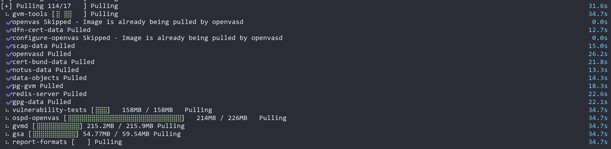


    **Start the docker containers (This could take a long time):**
    ```
    docker compose -f $DOWNLOAD_DIR/docker-compose.yml -p greenbone-community-edition up -d
    ```
    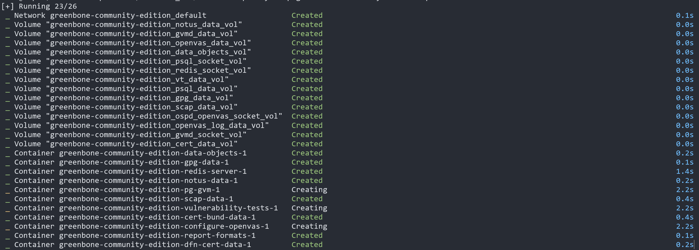

    **Ensure all docker containers started:**
    ```
    docker ps
    ```
    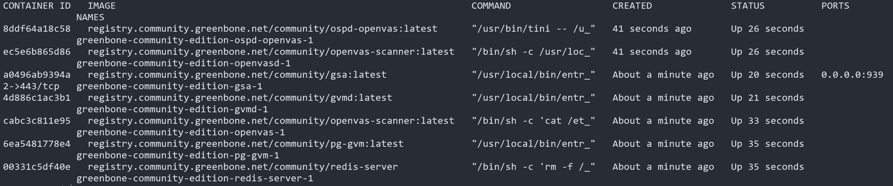

6. **Create an admin user**
   
   Create an admin user account with the command:
   ```
   docker compose -f $DOWNLOAD_DIR/docker-compose.yml -p greenbone-community-edition \
    exec -u gvmd gvmd gvmd --user=admin --new-password='<PASSWORD>'
   ```


## Running Vulnerability Scans
1. **Login to the GSA webpage**

    Navigate to `https://<EXTERNAL_IP>:9392` on a browser and login using your credentials.
   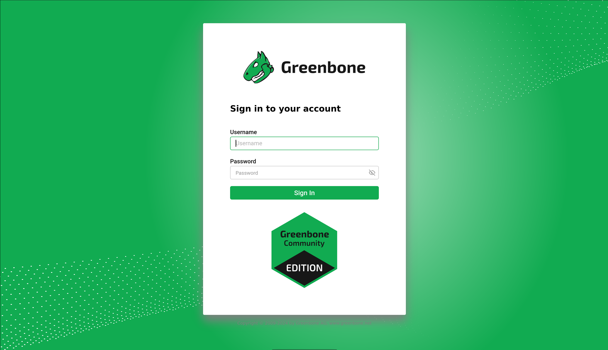

2. **Create a new host**

    In the toolbar on the left, navigate to `Configuration > Targets`
    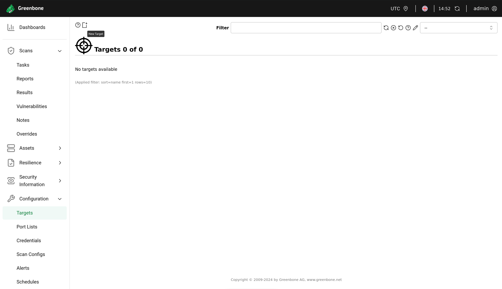
    In the top left corner select the `New Target` button

    - Name the target.
    - Enter the hosts for the scan. This can be one or multiple targets and can be entered as IP addresses or domain names.
    - Specify any credentials you want to use in the scan.
    - You can change more of these options if you choose.

    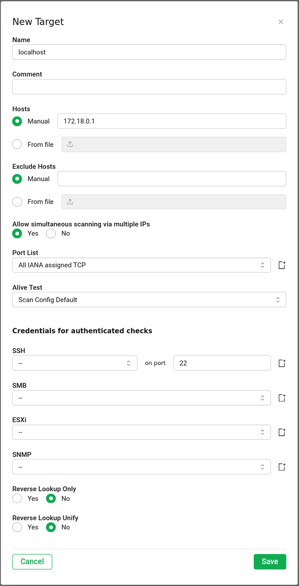

3. **Create a new task**

    In OpenVAS a scan is refered to as a *task*. To create a new task navigate to `Scans > Tasks` in the menu on the left side.
    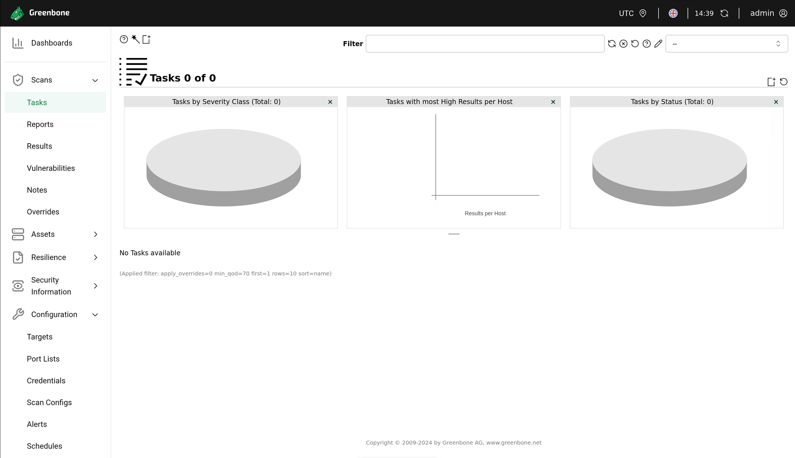

    Select `New Task` in the top left corner.
    - Enter a name for the scan.
    - Select the target you just created in the dropdown menu.
    - These are the only options I am going to specify, however, you can configure this further if you choose.

    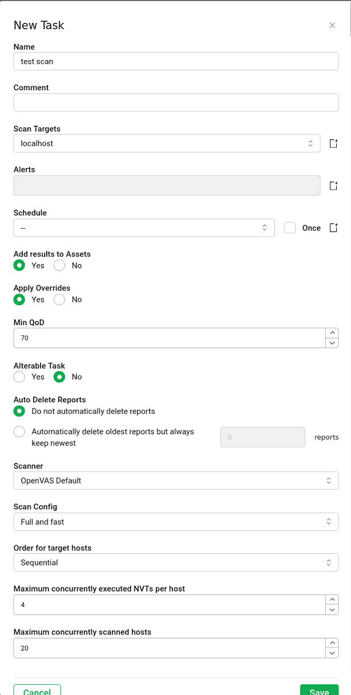

    Press start on your new task.
    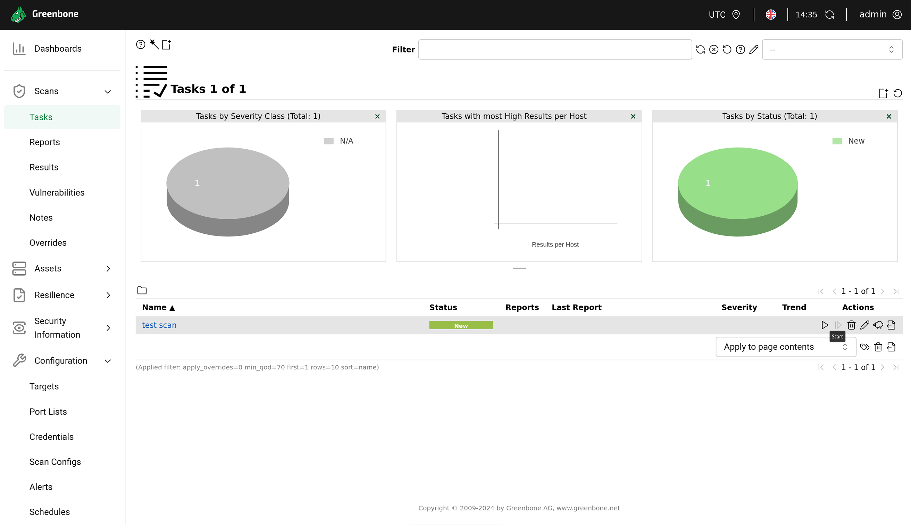

4. **Review task results**

    Navigate to `Scans > Reports` on the left side menu. Wait while the scan runs. The percentage on the task will update as the scan progresses.
    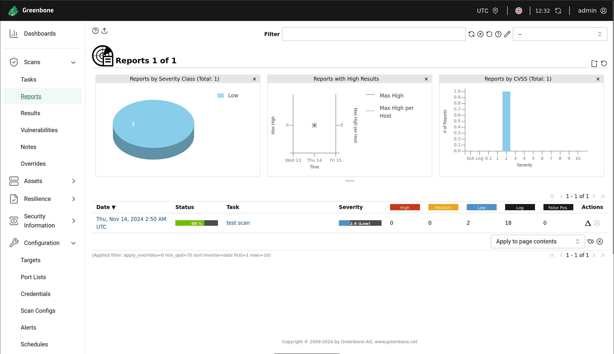

    Once the scan finishes, navigate to `Scans > Vulnerabilities` on the left side The scans can take a while depending on what configuration you chose. Scanning many IPs at once will take a while. All of the vulnerabilities found will be listed here in order of severity.
    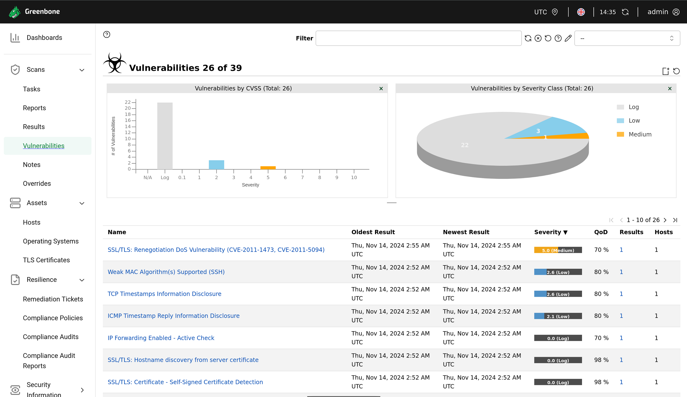

    By clicking on a vulnerability you can see a description. It will you show you a summary, score, insight, detection method, impact, and solution for each vulnerability. Additionally, it will give you links to the vulnerability disclosure which you can use to see methods of exploiting the vulnerability.
    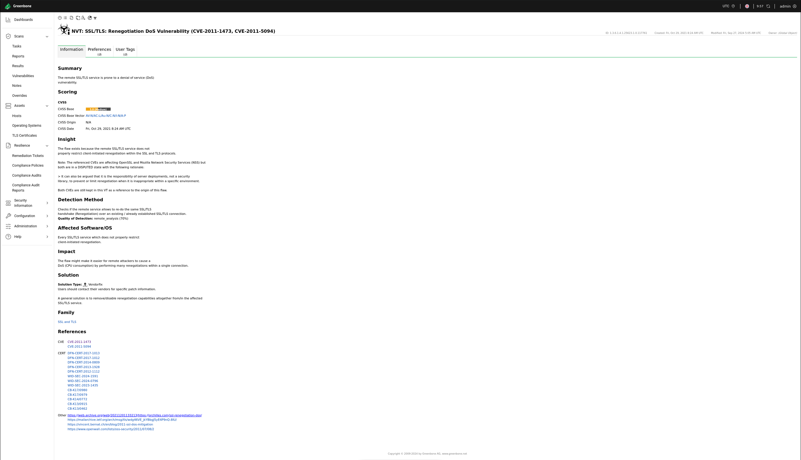

>[!NOTE]This concludes the guide for OpenVAS. This guide is mainly for the setup of OpenVAS / GVM. It is a powerfull tool and has many use cases that are not shown in this demonstration.