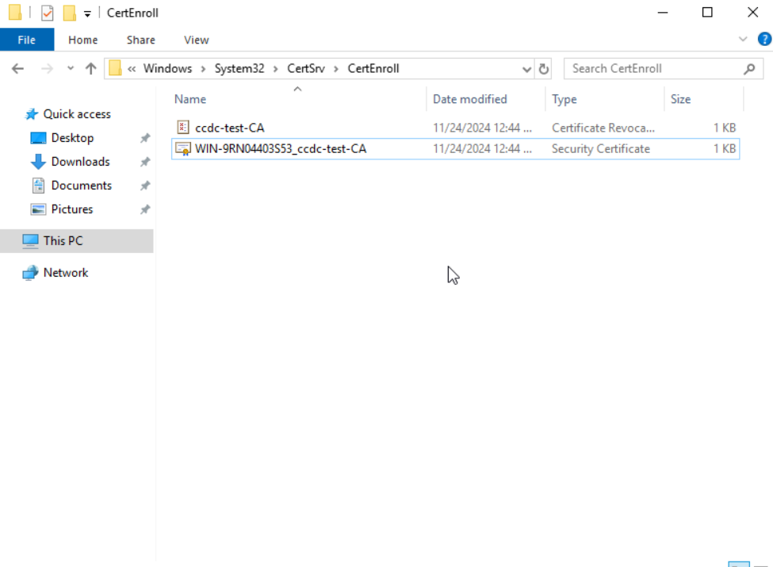
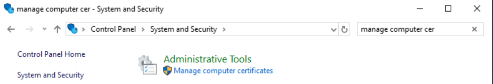
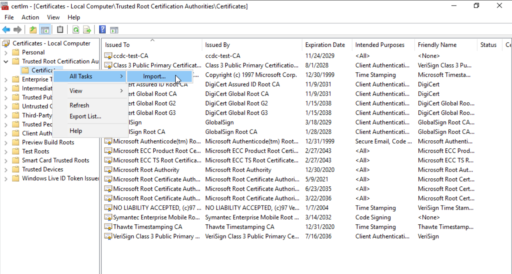

**GETTING ROOT CERT:**

The default file path, unless otherwise changed during the creation of a Windows CA, for the root certificate generated will be `C:/Windows/System32/CertSrv/CertEnroll/`

Here, it is found with the name `WIN-9RN04403S53_ccdc-test-CA`. This is your root certificate; not only does it have to be trusted on the machine with the CA present, but on every machine which is going to end up trusting this CA for the certificates which have been generated.

**ADDING TO TRUSTED CA LIST:**

Windows (Server 2019):
Typing "Manage computer certificates" into the search bar will result in a control panel option with the same name as the quotes. Similarly, you can search for the same thing in control panel and find the same tab underneath Administrative Tools.

Somewhat intuitively, in this tab, you can add the root certificate we saw earlier to the folder named "Trusted Root Certification Authority," simply by expanding this folder, right clicking the "Certificates" folder from the expansion, hovering over "All Tasks" and clicking import.

Find your certificate file, and import it to this list, which requires Administrator permissions. The following screens prompt questions which may or may not be changed, as importing the way shown above will place the certificate in the right folder, though it will automatically detect if something is wrong.