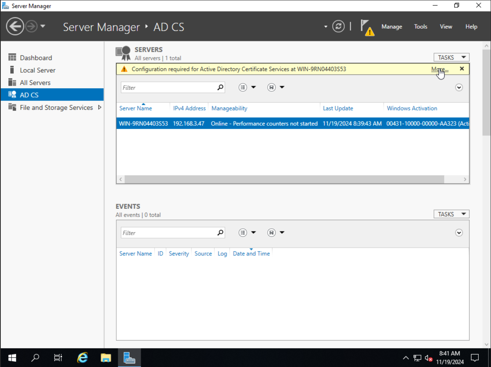
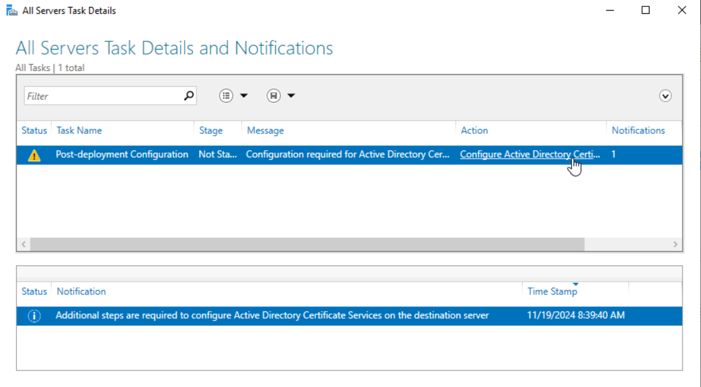
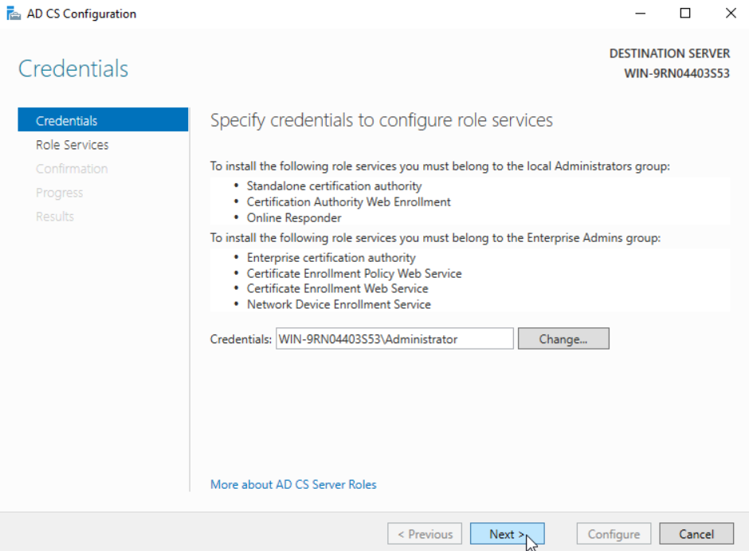
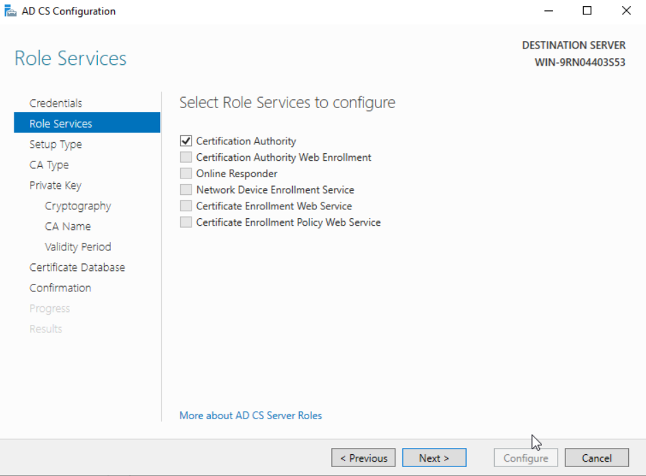
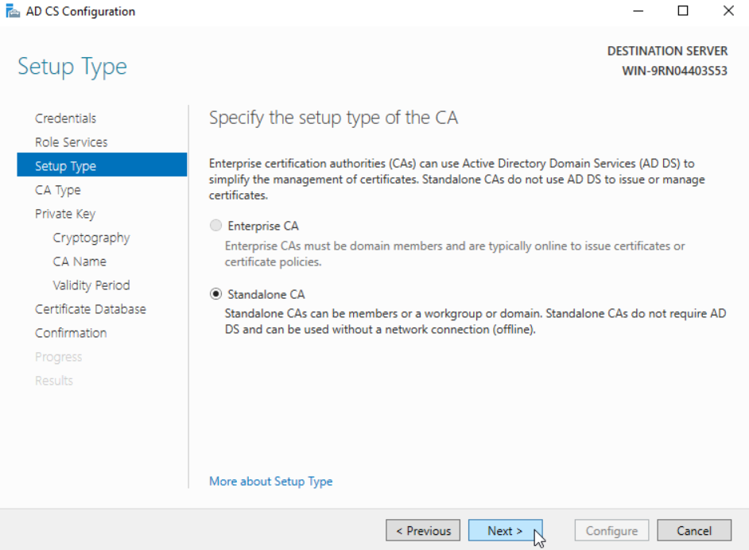
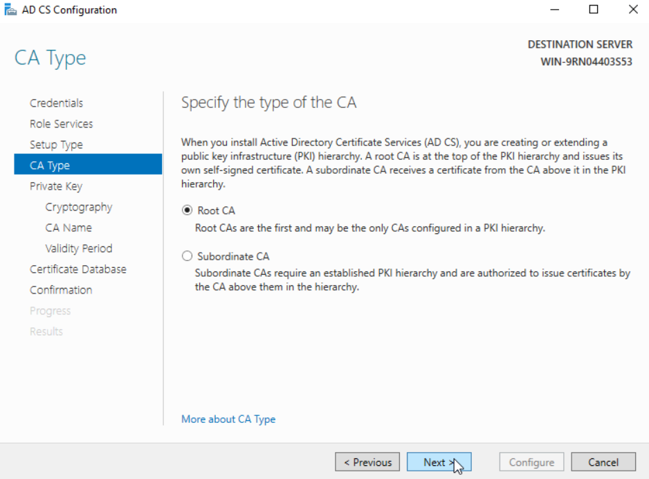

**Configuration Options**

**PREREQ: Make sure CA machine is added to Active Directory before configuring, as the Domain cannot change once this configuration is completed.**

Once AD CS is installed on the server of choice, a new tab should appear on the left side of the Server Manager simply titled "AD CS." Assuming no prior setup has been done, the easiest way to setup is to find the yellow bar that exclaims setup is needed, as shown in the screenshot below.

This will bring up a Task Details popup with the CA configuration task appearing somewhere in the list. Underneath the action column, there is a link titled "Configure Active Directory Certificate Services" which can be clicked to lead to the configuration.

The page that pops up will be a credentials page. Depending on which role services were selected, specific permissions may be required out of the user you are logged into. For simply installing the certification authority, administrator permissions are required. Change your credentials if necessary and click next.

The next role services page is the selection for which services should be configured. For this purpose, only the certification authority will be configured.

The next page asks which type of CA should be setup. An enterprise CA typically operates online alongside features such as web enrollment services; for the sake of a private network, in which all machines are connected, the standalone CA works just fine.

Next up, you have the choice between creating a Root CA and a subordinate CA; for the purpose of a standalone internal infrastructure, a Root CA would be the one of choice. Creating a Root CA also generates and self-signs a root certificate.

The next page will prompt about type of private key; if this is the first time configuring a CA on this machine, it is optimal to create a new private key. For the sake of migration, if a private key already exists, that same private key can be used.

![ss7][Images/key.png]

If it is chosen to create a new key, the next page has to do with cryptography. It is ideal to use a long key length (>=2048), combined with a secure and usable hashing algorithm (for example, SHA1 and MD5 are considered no longer usable due to collision attacks). SHA512 is a great example. The cryptographic provider is also up to the user's specifications, though RSA works great for this case.

The next two pages, CA name and validity period, are up to the user's specifications. These have no security impact.

Next up is the database location(s); the default location is in a directory underneath System32. Change this path if it is necessary to, and remember this path for later, as this will be the location of the self-signed root certificate which will need to be distributed to any system accessing this CA.

![ss8][Images/database.png]

Confirm on the next page, and the setup process will begin. Once finished, the CA will be ready to use.