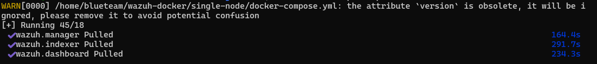
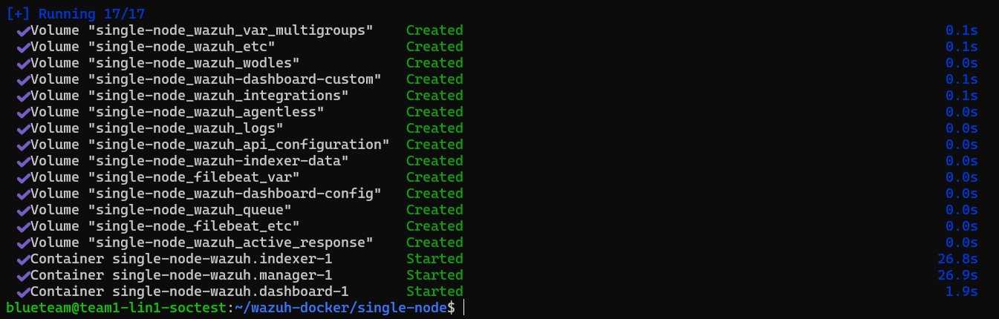

## How to Reset and Reinstall Wazuh w/ Docker ##

WHAT THIS IS:  
Guide showing steps to fresh reinstall wazuh with docker already installed on a Debian linux OS.
<br>
In case anything gets outdated/more information can be found here: [Offical Wazuh Installation Docs](https://documentation.wazuh.com/current/deployment-options/docker/docker-installation.html)  

### List out all Docker containers
``` docker ps ```

### Stop all the ones with Wazuh
There should be 3: Dashboard, manager, indexer  
``` docker stop <container> ```

### Run docker prune to remove all stopped containers and data
> [!IMPORTANT]
> This command will remove ALL stopped containers, make sure all containers that are stopped you are comfortable with deleting!

``` docker system prune ```

### Remove the wazuh github directory
``` rm -rf wazuh-docker ```

### Re-Pull the github
Check if this is latest version?  
```git clone https://github.com/wazuh/wazuh-docker.git -b v4.6.0 ```

### Get Certs Again
```docker compose -f generate-indexer-certs.yml run --rm generator ```

### Deploy the Containers
``` docker compose up -d ```<br><br>
  
 
(Sample docker compose output shown above)