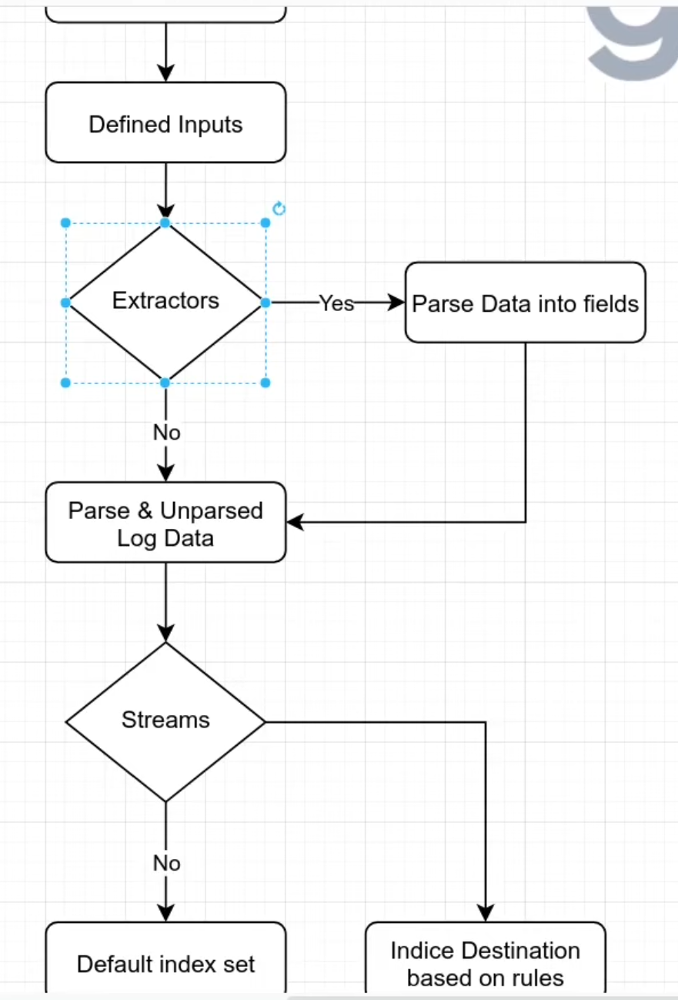

# Graylog Dashboard Creation #

WHAT THIS IS:  
Overview of how creating + managing dashboards on Graylog work. It is assumed you have Graylog working and inputs set up and logging.<br>


## 1. Overview of Graylog Data Flow ##

  

## 2. Setting up Data/Search Stream  ##

This is where the data coming into the manager will end up. By default it will be the ```default stream```.<br>

- On the dashboard go to ```Streams``` -> ```Create Stream```
- Give your stream a title (Ex: Linux rsyslog logging) and create stream
- Then select ```Data Routing``` on the newly created stream -> ```Create Rule```
- Specify the correct ```gl2_source_input``` that matches what data you want it to accept
- Start your stream

Now, in the search section you can search you logs by different ```Stream``` types in the top right.

## 3. Setting up Indices ##

Indices allow for managing the retention time of data stored in different streams.


## 4. Creating Searches and Parsing Logs ##

Unlike Wazuh, Graylog does not seem to have any "rule_ids" in the logs.  

To create a new "Search Query":
- On the dashboard go to ```Search```
- Add a search filter into your messages like below:
  
- Press ```Save``` on the top right to save a new Search Query

You can now load and use the search query's in searches by pressing ```Load```, or in dashboards. 


## 5. Creating and using Pipelines + Rules

Pipelines help transform and process messages coming from certain streams. 

## 6. Creating Dashboards from Searches ##

Dashboards are composed of ```Widgets``` (the charts and graphs) which in turn are usually created from ```Search Query's```. 
