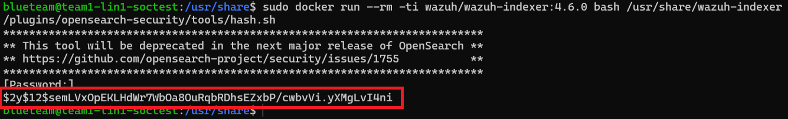

# Wazuh Dashboard Password Change w/DOCKER

Guide shows how to change dashboard password from a DOCKER Wazuh Install on a Linux system. More information/if guide is outdated can be found here:  
[Docker Wazuh Password/Installation Docs](https://documentation.wazuh.com/current/deployment-options/docker/wazuh-container.html#change-pwd-existing-usr)  


## 1. Procedure

Close your dashboard and then stop the Docker containers  

```bash
cd ~/wazuh-docker/single-node
sudo docker-compose down
```

Run the Docker indexer container tool and input your NEW password:  

```bash
docker run --rm -ti wazuh/wazuh-indexer:4.6.0 bash /usr/share/wazuh-indexer/plugins/opensearch-security/tools/hash.sh
```
 
Copy the password hash output generated by the password tool, DO NOT LOSE IT!

```bash
cd ~/wazuh-docker/single-node/config/wazuh_wazuh_indexer
sudo nano internal_users.yml
```

Change the `admin` and `kibanaserver` hash lines to your new password hash that you just generated. 
  
Then->  

```bash
sudo nano ../../docker-compose.yml
```

Then change the `INDEXER_PASSWORD` in .manager and .dashboard enviorment!!! 
   
Also change `DASHBOARD_PASSWORD` in `wazuh.dashboard:` part  
 
Then start the deployment stack->

```bash
docker-compose up -d
```

Run `docker ps` and note name of the Wazuh Indexer container\
Then enter the container->

```bash
docker exec -it single-node-wazuh.indexer-1 bash
```

Set the following variables
```bash
export INSTALLATION_DIR=/usr/share/wazuh-indexer
CACERT=$INSTALLATION_DIR/certs/root-ca.pem
KEY=$INSTALLATION_DIR/certs/admin-key.pem
CERT=$INSTALLATION_DIR/certs/admin.pem
export JAVA_HOME=/usr/share/wazuh-indexer/jdk
```

<br>

Then run the `securityadmin.sh` script->

```bash
bash /usr/share/wazuh-indexer/plugins/opensearch-security/tools/securityadmin.sh -cd /usr/share/wazuh-indexer/opensearch-security/ -nhnv -cacert  $CACERT -cert $CERT -key $KEY -p 9200 -icl
```
Wait for indexer to set up, then    
Exit the Wazuh Indexer container  
Dashboard password should now be changed
