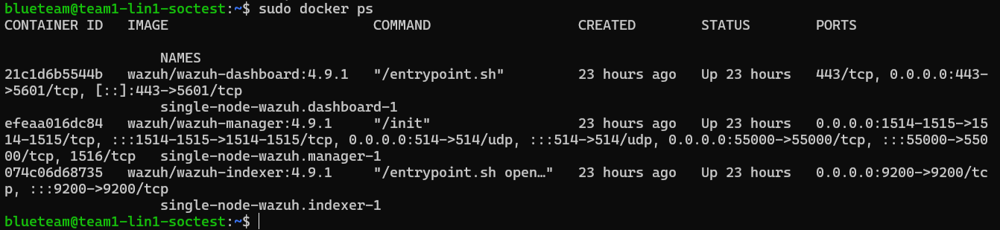

# How to Deploy Wazuh on Docker, Single-Node

This is a guide for a Debian Linux OS on how to deploy a single-node instance of Wazuh (including manager, dashboard, and indexer) with Docker already installed (look at the Docker - Install for Wazuh guide).<br><br>
Extra information can be found here: [Official Wazuh Installation Docs](https://documentation.wazuh.com/current/deployment-options/docker/wazuh-container.html)

## Get wazuh-Docker github repo
> [!IMPORTANT]
> Make sure this is the latest version!

`git clone https://github.com/wazuh/wazuh-docker.git -b v4.6.0`

## Get Certs
Navigate to the single node directory and run following command to generate proper certificates:  
`docker compose -f generate-indexer-certs.yml run --rm generator`  <br><br>

(Sample output of the cert generator command shown above)

## Deploy Docker containers
This will create 3 Docker containers: Wazuh manager, Wazuh Dashboard, and the Wazuh Indexer  
`docker compose up -d`  <br><br>
  
 
(Sample Docker compose output shown above)  
(Running Docker containers with `docker ps` shown below)
 
In case of restarting a particular Wazuh service (dashboard, indexer, or manager), the specific container will need to be restarted.

## Next Steps
Your dashboard should be accessible via browser at  
```https://<wazuh-machine-ip>```  
The dashboard might take some time to fully start up (a message saying "Wazuh dashboard server is not ready yet" will be shown)
<br><br>
Using following default credentials:   
```Username: admin```  
```Password: SecretPassword```<br><br>
(Change these next using the Docker - Dashboard Pass Change guide)!<br><br>
If installed correctly, image of what the inital dashboard login should look like is shown below:
 

## Possible Errors

Make sure you have the certs before you try to deploy the Docker containers. If you do not you will get an error. Make sure you follow the Wazuh documentation for Docker installation. If you follow Docker docs you may install the wrong packages and Wazuh will not work as intended.
