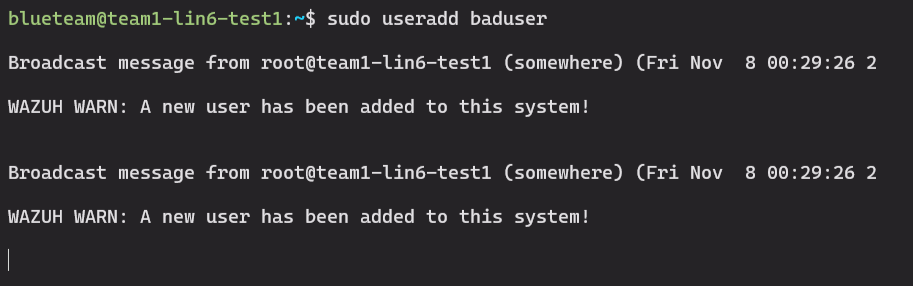
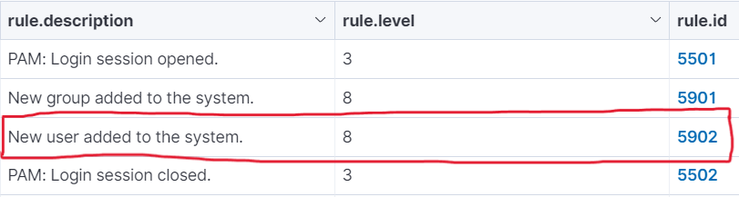

## Adding Active Response Capabilities to Wazuh ##
A small walkthrough of adding "active response", specifically "client end" user alerts for any suspicious activity.  
```
https://documentation.wazuh.com/current/user-manual/capabilities/active-response/how-to-configure.html
```

### 1. Confirm the Acitve Response module is enabled on the server ###

On the server in ```/var/ossec/etc/ossec.conf```, make sure there is a `<command>` block.<br><br>

Add the following command block:
```
  <active-response>
     <command>user-creation-alert</command>
     <location>local</location>
     <rules_id>5902</rules_id>
  </active-response>
  ```

  Add the following `<active-response>` tag somewhere between the `ossec_config`.   
  ```
  <active-response>
     <command>user-creation-alert</command>
     <location>local</location>
     <rules_id>5902</rules_id>
  </active-response>
  ```


### 2. Add Custom Script to all Linux endpoints ###

Add script/exe to `/var/ossec/active-response/bin`.  
Add following permissions:  

```bash
sudo chmod 750 /var/ossec/active-response/bin/<CUSTOM_SCRIPT>
sudo chown root:wazuh /var/ossec/active-response/bin/<CUSTOM_SCRIPT>
```  
For windows:  
```C:\Program Files (x86)\ossec-agent\active-response\bin```

Script example, `user-creation-alert.sh`: 
```bash
#!/bin/bash
wall "WAZUH WARN: A new user has been added to this system!"
```

### 3. Testing Configuration ###

After adding a new user to our test machine, a `wall` output is shown to the user, confirming that our configuration is running.<br>  
  
 
(Above) Wazuh dashboard alert 5902 showing a new user add

### Troubleshooting ###

#### Active Response is not activating ####
- In the agent `ossec.conf` make sure the following is set:  
```conf
<active-response>
   <disabled>no</disabled>
</active-response>
```


