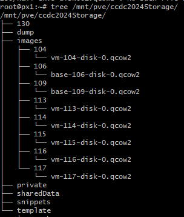
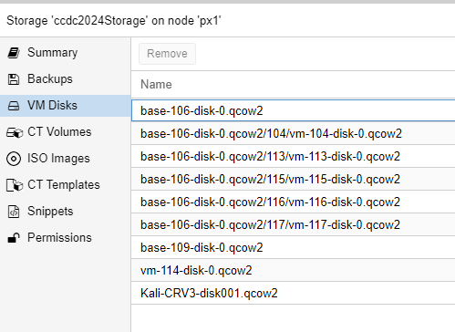
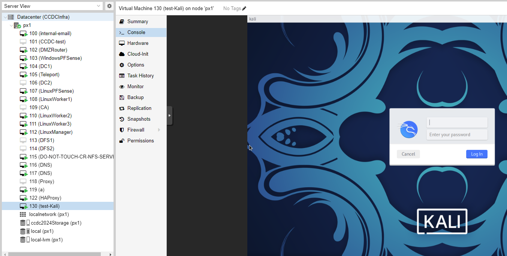

# Import OVA file from VirtualBox
*Author:* Chris Morales

*Summary:* This guide will cover how to manually import an `.ova` file that was exported from VirtualBox into Proxmox. There is no native support for this feature and so manual effort is required. 

# Download the OVA file onto Proxmox
You can either do this directly from the Proxmox Server **host** machine or on a separate computer and transfer over the files using SCP for example **onto the Promox Server host machine**.

# Unzip the OVA file
An .ova file will contain three files (the * means any file name):
1. *.vmdk
2. *.mf
3. *.ovf


The main file that you'll need is the `.vmdk` file. In this guide, you'll see it as `Kali-CRV3-disk001.vmdk`. This is the actual hard disk of the file, the other files serve as information for VirtualBox in terms of configuration information.


# Create a target machine location for the qcow2 file on Proxmox
For this guide, I will place the eventual converted `.vmdk` into the NFS server. When you look at the `VM Disks` of the machines under the `ccdc2024Storage` storage location, it's not intuitive as to where these are being held within the NFS mount.


And so, we can run the `tree` command on the NFS share to find these devices.



Notice how the `.qcow2` files are sorted under the corresponding machine ID that they are attached to. We will keep that format . In this case, it will be VM 130.

```
mkdir /mnt/pve/ccdc2024Storage/images/130
```

# Convert the VMDK to Proxmox VM's format (vmdk -> qcow2)
This method is slightly more reliable than another guide that would try to import the vmdk directly and use the `--convert qcow2` flag.

For this method, you will be using the `qemu-img` command. The format is:

```
qemu-img convert -f vmdk -O qcow2 <ova-file>.vmdk <converted-qcow2-filename>
```

*Note: It may take a while for it to complete. Be patient.*


In this case, I'm simply just renaming the file to have the appropriate extension.

You can see if it worked by refreshing the proxmox webpage where you found the `Disk Images` before.




# Create the VM on using CLI
Finally, you'll want to create the Virtual Machine and assign it the newly converted qcow2 file.


```
qm create 130 --name "test-Kali" --memory 2048 --net virtio,bridge=vmbr0 --sockets 1 --cores 1 --virtio0 ccdc2024Storage:130/Kali-CRV3-disk001.qcow2
```

To explain the command, I will simply read it out in English: 

We will create a VM with the `ID 130` that has the name `test-Kali` who will have `2048 MB of RAM` that will use the `vmbr0` network adapter while being allocated `1 socket and 1 core` for CPU which will have the hard disk assigned from our `ccdc2024Storage` storage location under the ID 130 folder and looking for the `Kali-CRV3-disk001.qcow2` hard disk image.


# Start the machine from Proxmox GUI
Simply start the machine from the Proxmox GUI and then you should be all set.

