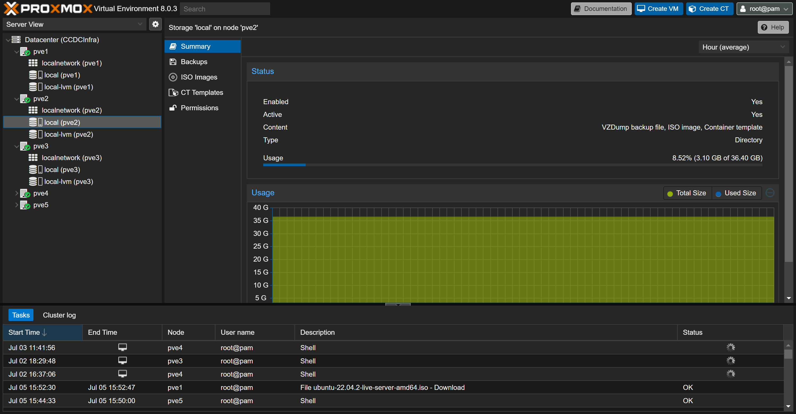
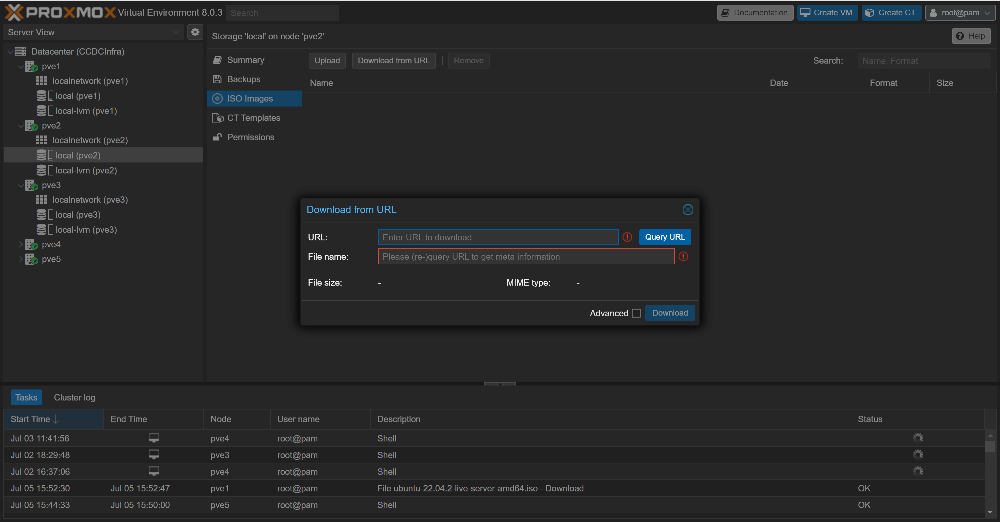

# Proxmox

## Install Ubuntu
1. Navigate to:
    ```
    https://releases.ubuntu.com/
    ```
2. Select the version of ubuntu we would like to download and gather the link.
3. Open a storage device in the proxmox cluster

    

4. Click on the ISO option, if this does not appear you are using the wrong storage device. 
5. Click on Download From URL, enter in the previously discovered URL

    

6. Click Query, ensure the information looks alright. This will fill in the filename information for you.
    
7. Click Download
## Enterprise Edition
We need to update the source list that apt utilizes when searching for packages. This is particularly important if we have the Enterprise Edition for Proxmox installed.

We need to edit the */etc/apt/sources* anf add the following line.
```
# Proxmox VE pve-no-subscription repository provided by proxmox.com,
# NOT recommended for production use
deb http://download.proxmox.com/debian/pve bookworm pve-no-subscription
```

Remove the Enterprise Edition Repository 
```
# Both are enterprise Repositories  
rm -f /etc/apt/sources.list.d/pve-enterprise.list && \
rm -f  /etc/apt/sources.list.d/ceph.list
```

## SDN setup
Please refer to [SDN](./../Network/Proxmox/SDN.md)