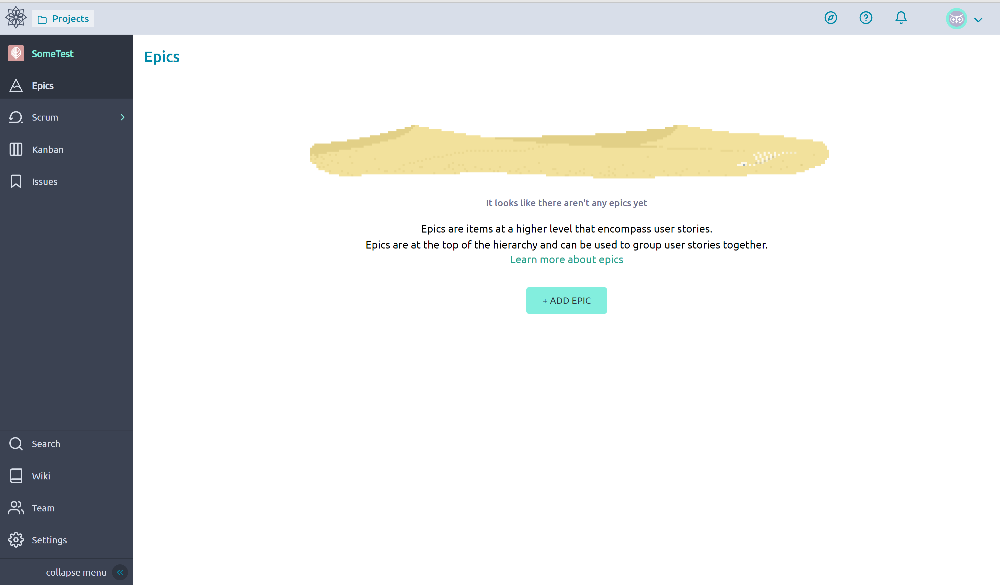
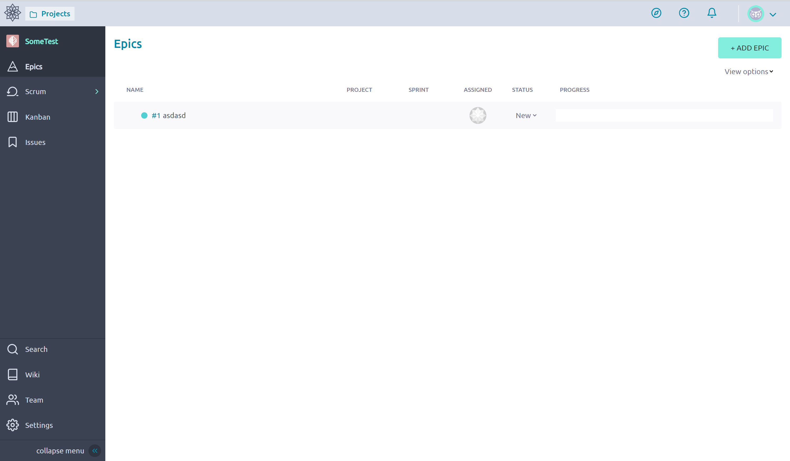
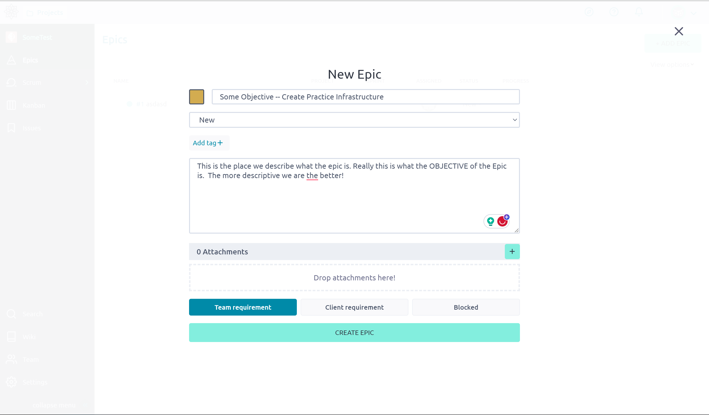

# Epics
A *Epic* is the largest organizational unit in Taiga that we use to represent something we want to do. This is often a [Objective](https://www.atlassian.com/agile/agile-at-scale/okr#:~:text=Objectives%3A%20are%20memorable%2C%20qualitative%20descriptions%20of%20what%20you%20want%20to%20achieve.%20Objectives%20should%20be%20short%2C%20inspirational%2C%20and%20engaging.%20An%20objective%20should%20motivate%20and%20challenge%20the%20team.) some large but clear end goal. This could be something like "Create Website Landing Page", "Create Practice Infrastructure", or "Web Security Event" to give us an idea. They are something that is large, that can be completed so not something like "Maintain Website", but is not so small like "Fix Spelling Mistake" that are trivial to complete. 

The *Epic* is a part of a [Project](./Project.md) a larger long lasting thing like "Maintain Website" and the *Epic* contains [Stories](./Stories.md) and [Tasks](./Tasks.md) that represent the smaller Key Results like "Implement Website Landing Page" and their subtasks like "Fix Spelling Mistakes".  

## Creation
1. Navigate to the Epics Section of Taiga 

    

2. Click Create Epic, If an epic exists it may look like the image below 

    

3. Fill in the information as desired. The more detailed the better 

    

4. Click on the newly created Epic and modify it as desired.

    

5. Add related user stories, refer to [Stories](./Stories.md)

Notice that we can create comments to better organize discussions, this is a common feature on the other Taiga structures 
