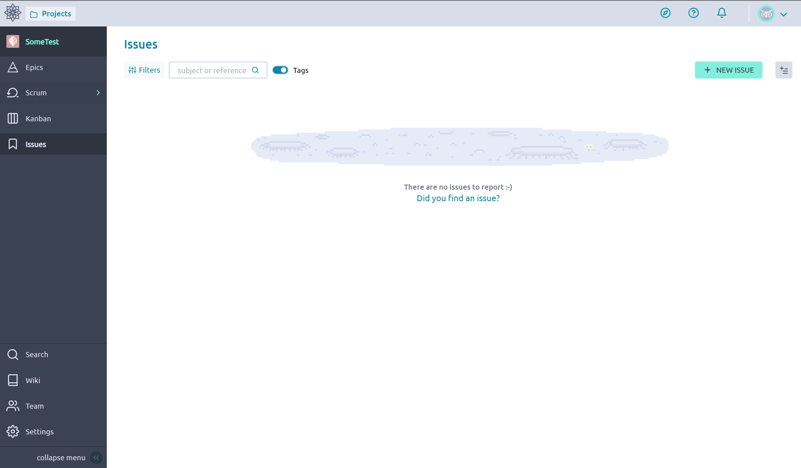
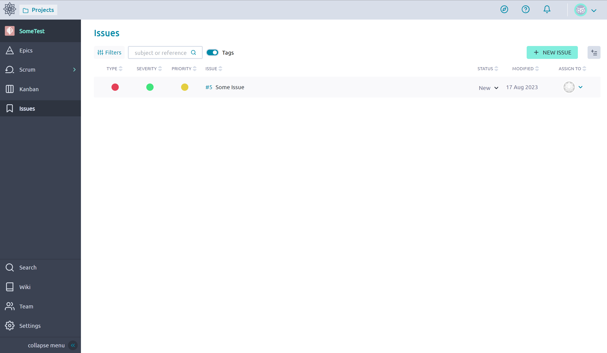
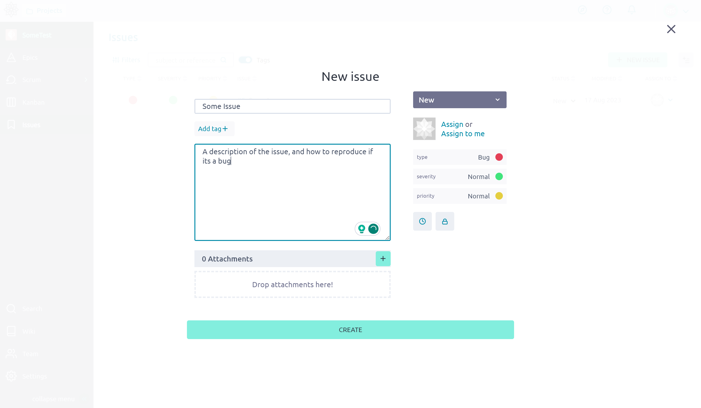
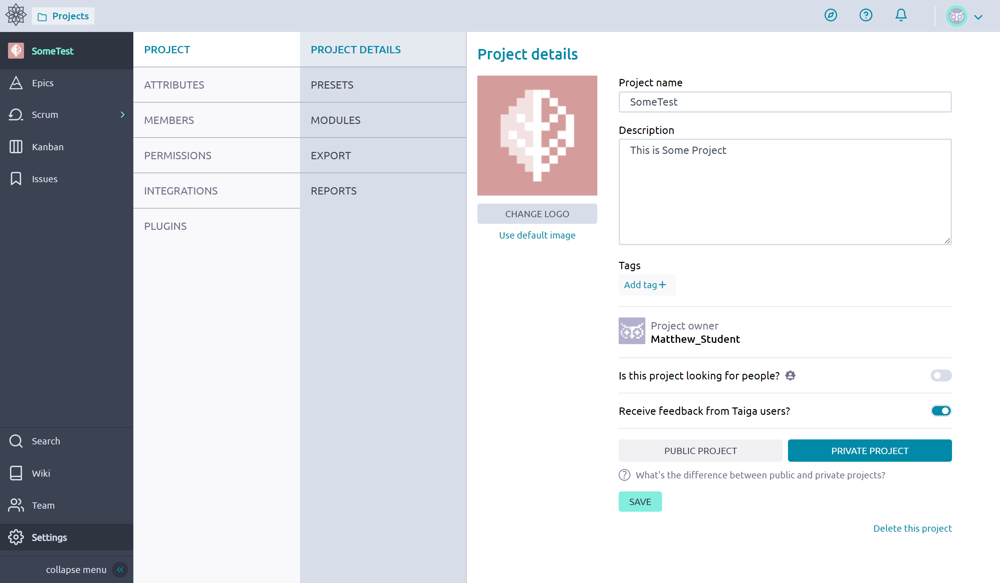

# Issues
In Jira, all of the units we interact with are a type of *issue*. **Taiga** distinguishes the normal [Objectives](https://www.atlassian.com/agile/agile-at-scale/okr#:~:text=Objectives%3A%20are%20memorable%2C%20qualitative%20descriptions%20of%20what%20you%20want%20to%20achieve.%20Objectives%20should%20be%20short%2C%20inspirational%2C%20and%20engaging.%20An%20objective%20should%20motivate%20and%20challenge%20the%20team.), [Key results](https://www.atlassian.com/agile/agile-at-scale/okr#:~:text=Key%20results%3A%20are%20a%20set,two%20to%20five%20key%20results) and [Tasks](./Tasks.md) from *issues* that you may be familiar with from [Git/GitHub](https://docs.github.com/en/issues/tracking-your-work-with-issues/about-issues). Issues are where we can track supplemental problems that need to be solved, such as questions, bugs, and enhancements. Additional configurations can be added by an Admin in the settings.  

## Creation and Modification 

**Create Issue**
1. Navigate to the Issues Page

    

2. Create a new issue, or select an existing one 

    

3. Fill in the information when creating a Issue.

    

   * Select the *Type*, *Severity*, and *Priority* this will vary 

4. Click on the newly create Issue to add attachments, comment or update it.

    

**Adding Options**
1. Open Settings

    

2. Open Attributes 

    

3. Modify the Issue (or other object) options as destined, increasing or decreasing the number of options

    

4. Click the Add button and fill out the field(s)

    
