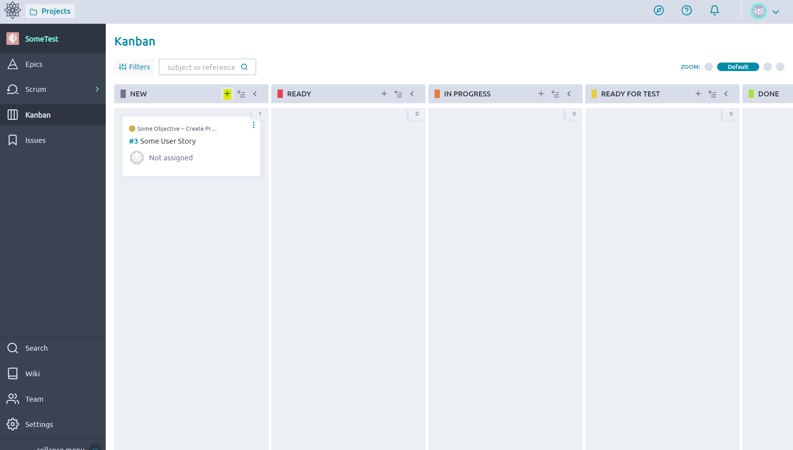

# Kanban
The Kanban board is a way of visually organizing and tracking tasks. They are presented both in [Sprints](./Taiga_Sprints.md) and as a stand alone feature. The Kanban board is enabled during the [Project](./Project.md) creation or in the settings. 

## Access and Use
1. Navigate to the Kanban Board

    

2. Create a User Story (largest Unit in this board) by clicking a Plus sign and fill out the information as described in [Stories](./Stories.md), you can attach them to an epic as well.

    

3. Click on the Story to edit it, or drag it to one of the columns

    

