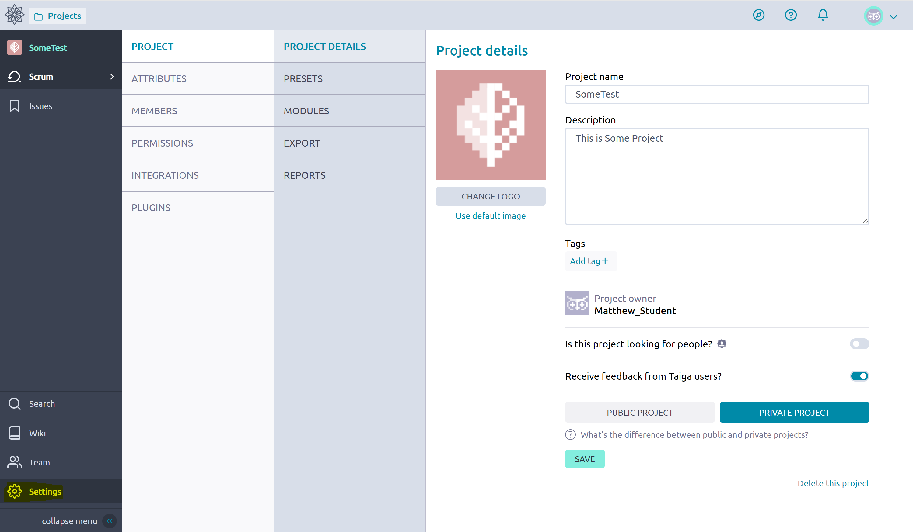
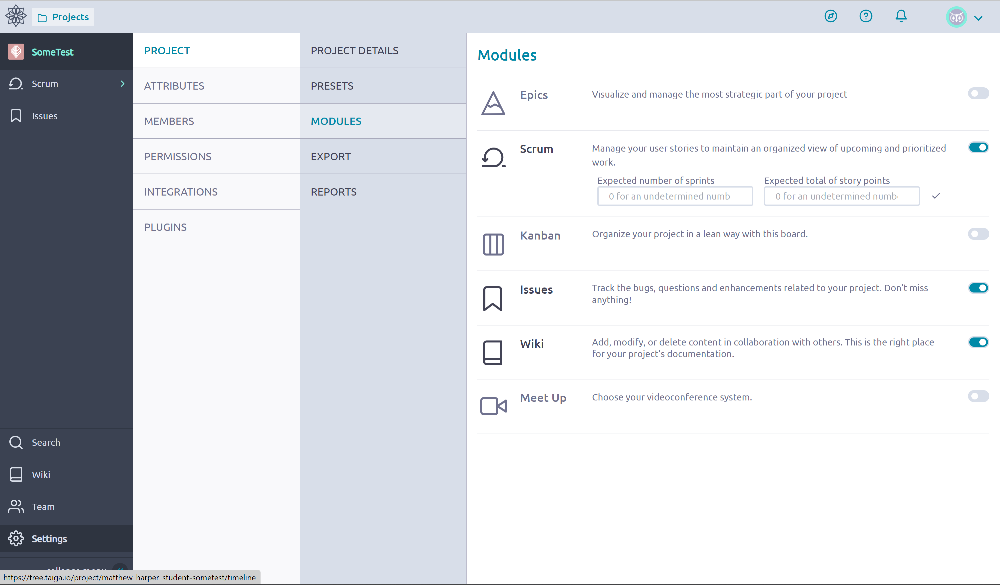
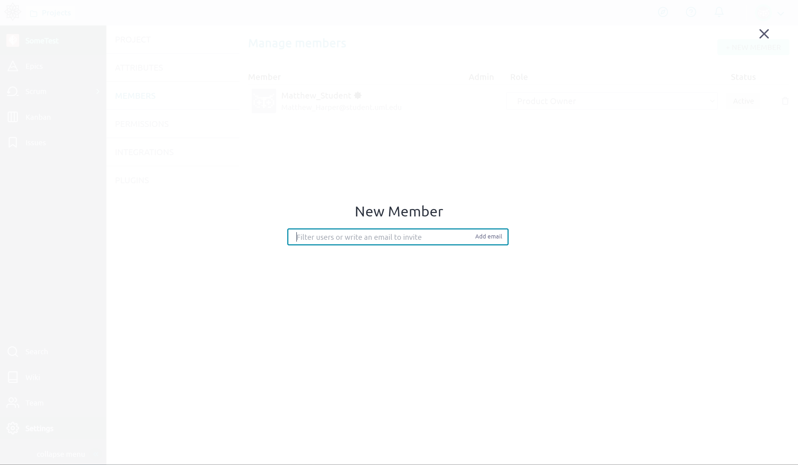

# Project
A project is exactly what it sounds like. You create a *taiga project* for a project that you're working on. Projects should be atomic, do not mix tasks or objectives between projects. Once completed, the *taiga project* can be removed to reduce clutter. 

A project contains **every** object Taiga provides, this includes Epics, Stories, Issued, and a Wiki to name a few! These all have their own documents that can be referenced, in addition to those provided by Taiga.

## Creation and Setup Steps
1. Access the Taiga Home Page, It may look something like the image below

    

2. Click on the Projects button in the top left, or hover over it and click "Create New Project" as highlighted below 

    

3. Select your desired Project Type, dont worry too much as you can add the Kanban or Scrum options to the project once it is created.

    

4. Fill out the information, you will probably want it to be private, as we likely want to control who can access the project 

    

5. Now we have a project, you may want to add a Kanban or Scrum system to the Project, First go to the settings (Highlighted Below).

    

6. Goto the Modules menu and turn on the systems you want to use 

    

7. Add some members. Still in the Settings, navigate to **Members**. If you made a private repository this is **mandatory**

    

8. Click Add Member. Fill in the Username or Email associated with the person.

    
