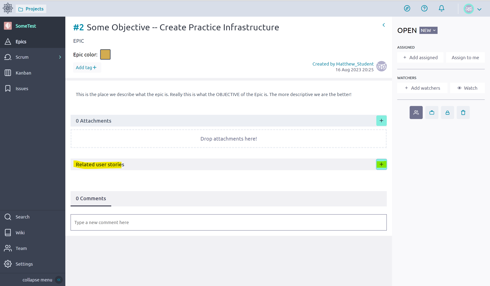
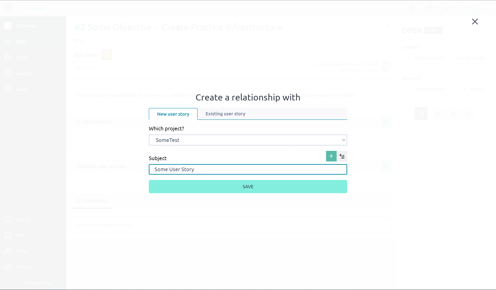
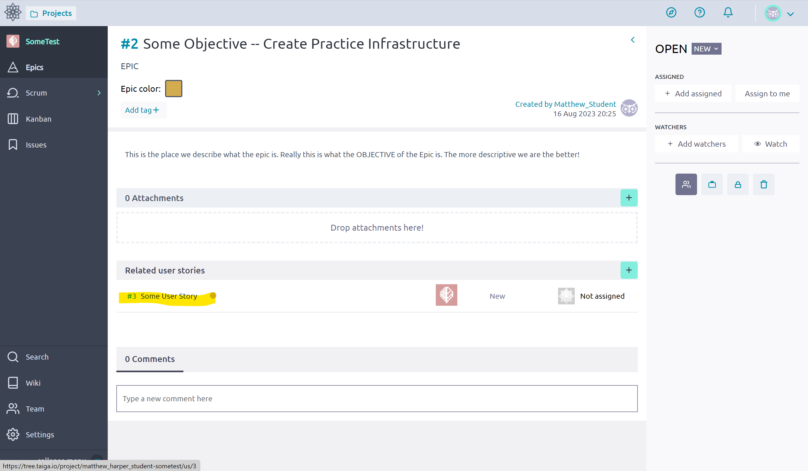

# Stories 
A Story is the second largest organization unit for something that needs to be done in a Taiga [Project](./Project.md). A user story is *related* or *attached* to a [Epic](./Epics.md), that is they are the Smaller [Key Results](https://www.atlassian.com/agile/agile-at-scale/okr#:~:text=Key%20results%3A%20are%20a%20set,two%20to%20five%20key%20results) that we use to organize the smaller subtasks and measure how complete a *Epic* is. 

A story is not something small like "Fix Spelling Mistake" or "Modify HTML -- Add name to About Page", those tend to be something more suited to a [Task](./Tasks.md). A *Story* is generally something that is not as trivial, like "Update Application Documentation" or "Update Website Landing Page" as they are part of an *Epic* they are something that is not too complicated, but can be used to measure our progress in completing the *Epic*.

## Creation
1. Navigate to the [Epics](./Epics.md) Page

    

2. Open an Epic

    

3. Click "Add Related User Story"

    

4. Create a new Story by filling in the information, or add an exiting one!

    

5. Open the new Story (click on it)

    

6. Fill in the Information, a description, [Tasks](./Tasks.md), Comments or add some attachments!

    

**Note**: Stories can be added to [Sprints](./Taiga_Sprints.md) where the [Tasks](./Tasks.md) will displayed in a [Kanban Board](./Kanban.md). 