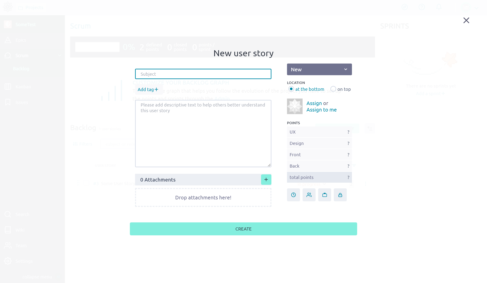
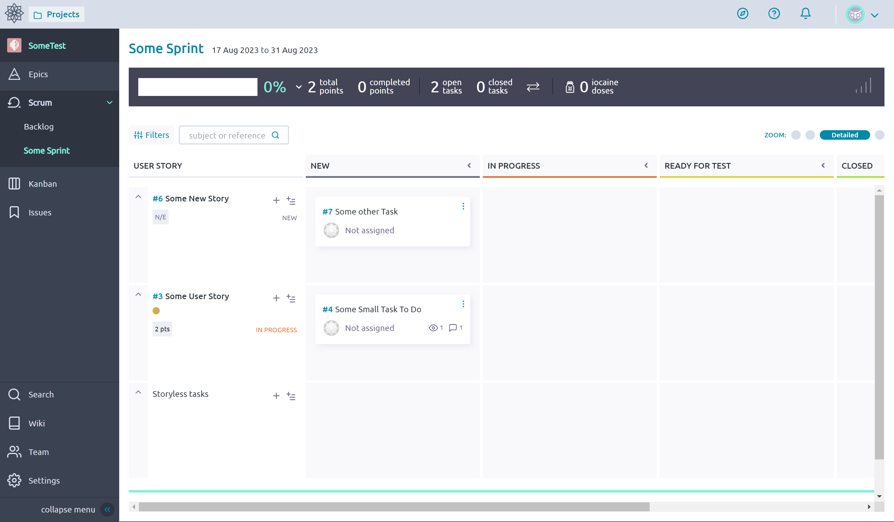
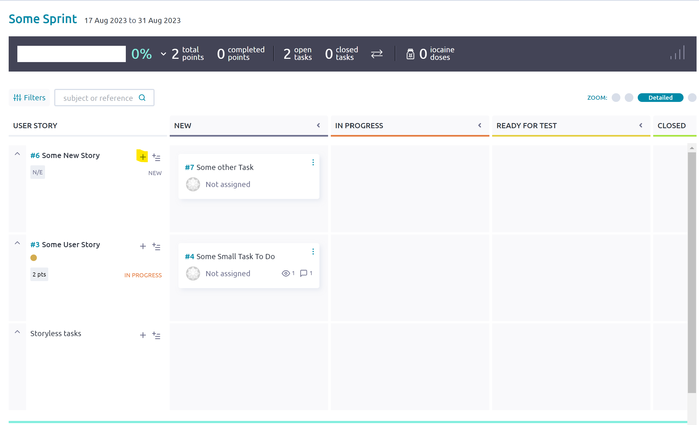
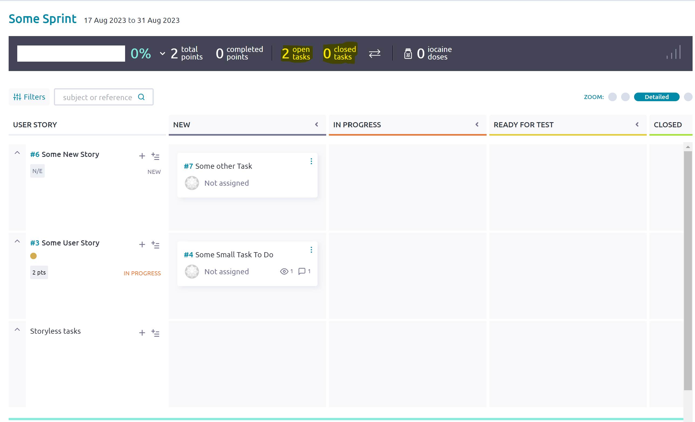
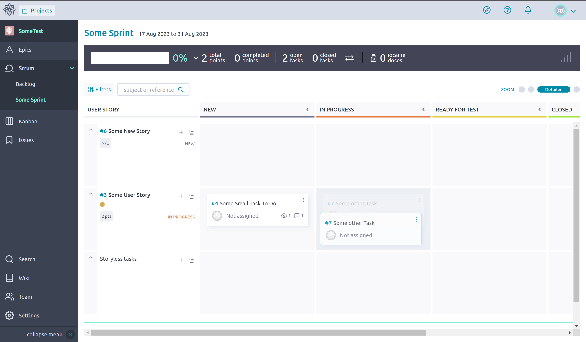

# Taiga Sprints
[Sprints](https://support.atlassian.com/jira-software-cloud/docs/what-is-a-sprint/) are a common practice in Scrum-like or AGILE systems. A sprint involves a working time period of 1 - 4 weeks where a team completes some set of tasks. Once the time is up, the team reviews their work and repeats the process again. 

Taiga houses *Sprints* in the **Backlog** tab under the [Scrum](https://www.scrum.org/resources/what-scrum-module) page. A sprint is composed of some set of [User Stories](./Stories.md) each representing a row, commonly known as a *[swimlane](https://www.oldstreetsolutions.com/jira-swimlanes-agile-boards)*, in the [Kanban board](./Kanban.md). The elements within a Taiga Sprint's Kanban board are the [Tasks](./Tasks.md) associated with a Story.  

## Create and Manage
1. Navigate to the Sprint Backlog in the **Scrum** page

    

2. Sprints operate on [User Stories](./Stories.md), so you can create one from the Scrum page or use one that has already been created.  

    

3. Click "Add New Sprint" and fill in the title, and duration. remember sprints are meant to be short 1 - 4 week intervals.

    

4. Now we can drag the user stories into the newly created sprint on the Right

    

5. Access the Sprint from the Scrum dropdown or the Backlog page 

    

6. Create Tasks associated with the story with the plus button 

    

7. Change the amount of details that are displayed (We would mainly be concerned with **Tags** added when creating tasks)

    

8. We can see the status of the current sprint (Number of open or closed tasks, points, ect.)

    

   * **Note**: Points can be assigned to stories and they are used when estimating the work done. They can be omitted in some cases. 

9. Tasks can be moved from one column to another, and even between the different swimlanes (stories)

    
