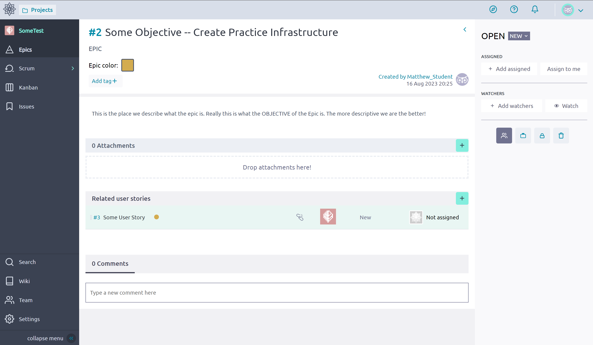
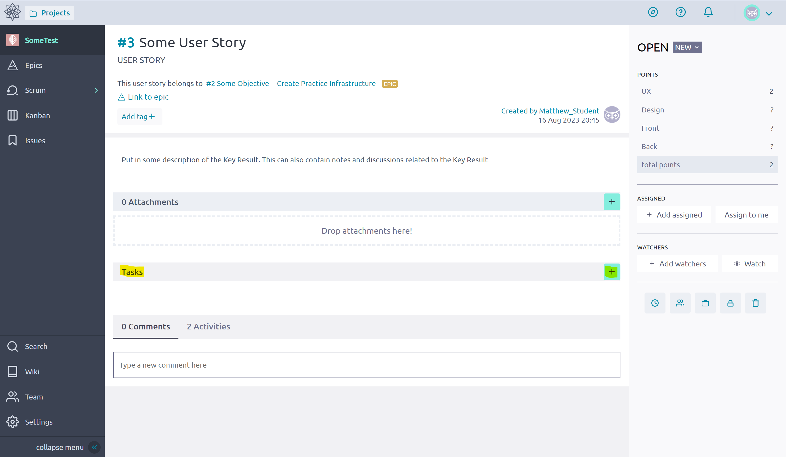
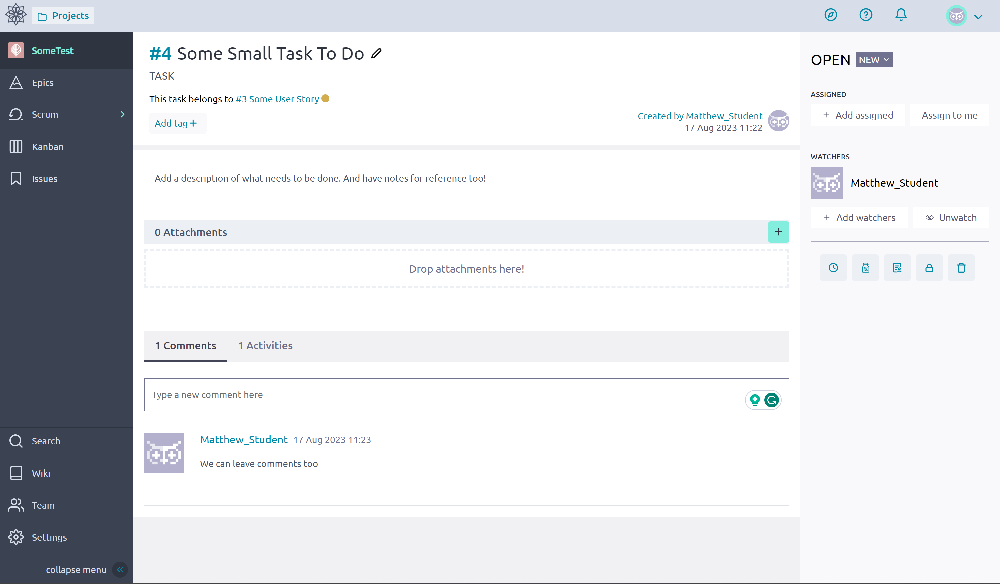
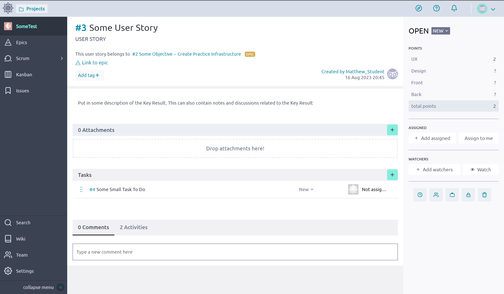
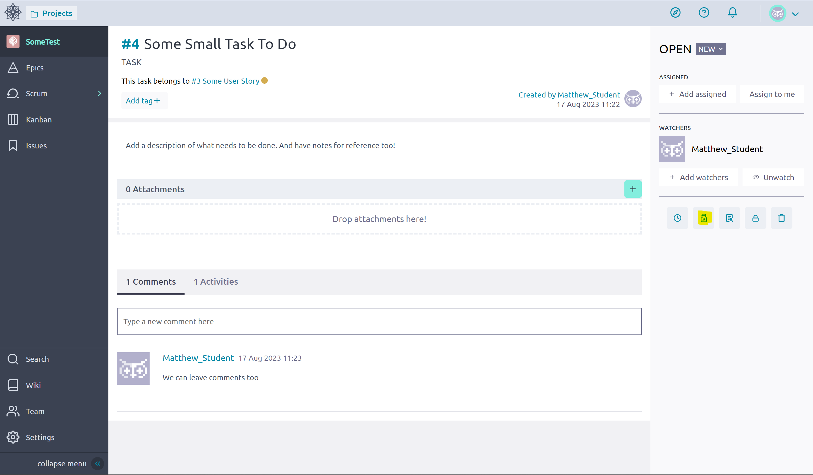

# Tasks
A *task* is the **smallest** unit of work that we will do, they are similar to the [Subtask Issues](https://support.atlassian.com/jira-cloud-administration/docs/what-are-issue-types/#:~:text=member%27s%20daily%20tasks.-,Subtask%20issues,-%2C%20which%20can%20help) in Jira. They are attached or related to a [User Story](./Stories.md) and make up the individual actions or... tasks that are done to complete a Story or [Key Result](https://www.atlassian.com/agile/agile-at-scale/okr#:~:text=Key%20results%3A%20are%20a%20set,two%20to%20five%20key%20results). 

They are not something large like "Maintain Website" that would be more suited as an [Epic](./Epics.md) or  "Update Application Documentation" that is more suited to being a *User Story*. They should be something that can be completed within the time frame of a [Sprint](./Taiga_Sprints.md), this can be a task like "Fix Spelling Mistakes" or "Modify HTML -- Add name to About Page".

## Creation
1. Open a Taiga [User Story](./Stories.md), from an [Epic](./Epics.md).

    

2. Click Add Task as highlighted below

    

3. Fill in the information and click save

    

4. Click on the Task

    

5. Fill in additional Details as Desired

    

## Note
We can add a little thing to make the tasks stand out know as [Iocane](https://community.taiga.io/t/what-is-this-iocaine-thing-in-taiga-and-how-should-i-use-it/153), this can be used when you are doing a completely new thing!  

1. Open a Task from a [User Story](./Stories.md)

    

2. Click on the Iocane button 

    

