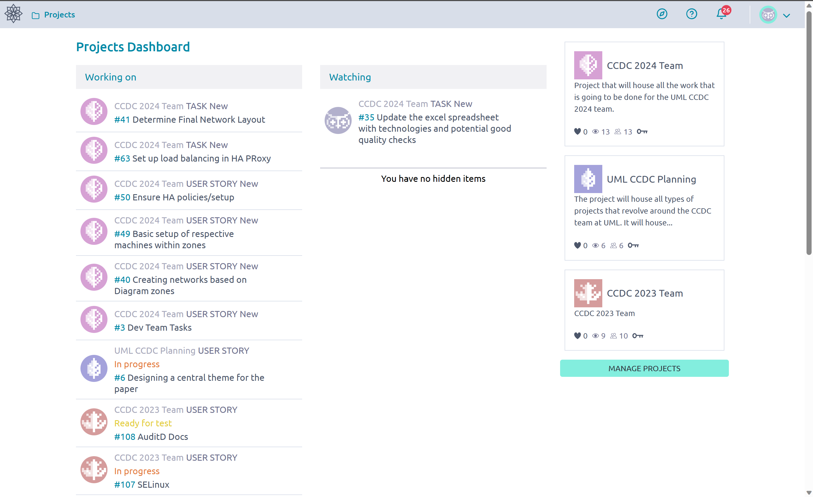
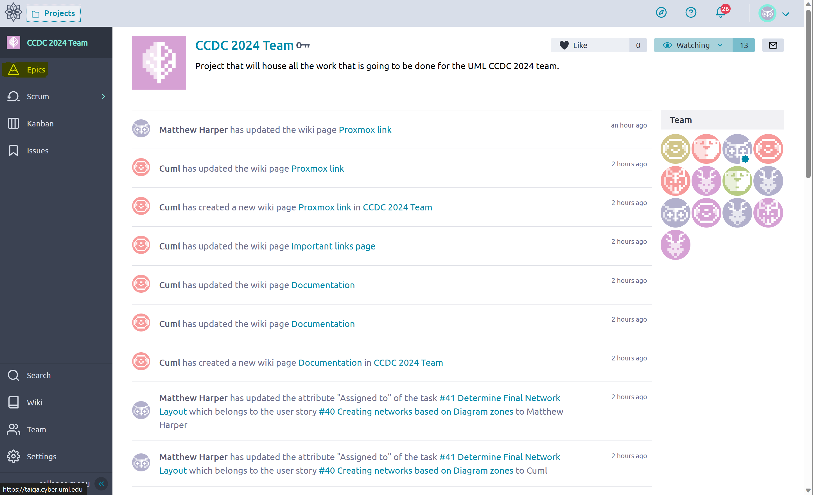

# Navigation <!-- omit from toc -->
This document contains some generalized instructions for navigating Taiga. This ranges from the project to the elements we would commonly interact within.

## Table of Contents <!-- omit from toc -->
- [Access a Project](#access-a-project)
- [Access Epic](#access-epic)
- [Access Sprint](#access-sprint)
- [Access Wiki](#access-wiki)
- [Access Issues](#access-issues)

## Access a Project
1. We assume at this point you have created a Taiga account and logged in. You should see something like the following.

     
2. Additionally you should be added to a Project by one of the other users (admins). Once you are added to the project, go to the top left and click projects. You will see something like the following.

    

3. Click on the project that you would like to access, you should see something like the following. Notice the additional options on the left.

    

## Access Epic
1. Click on the Epic tab on the *left*, it is highlighted below.

    

2. Once this is done you should see all the epics (Top Level Tasks) in the project. An example is shown below.

    

3. Click on the Epic and you will be able to access and create User Stories as shown below.

    

4. We can then click on an existing User Story to add individual tasks as shown below.

    

    * From this we can leave notes and access the tasks. Tasks are the smallest unit of organization, we cannot subdivide further, and only one user can be assigned to a task in Taiga.

## Access Sprint 
1. Click on the Scrum tab on the *left*. It is highlighted below.

    

2. From this, we will get a drop down. We can select a Sprint or access *Backlog*, from which we can create a sprint and add user stories (By dragging and dropping to the right)

    

3. The Backlog allows us to add User Stories to the sprints displayed on the *right* side of the screen. We can also access the sprints from the list on the *right*

    
4. The internal page once we have selected sprint is shown below. We can see the User Stories and their related tasks. We see a Kanban board that we can move tasks around, and add tasks to the user stories.

    

## Access Wiki 
1. Click on the Wiki tab on the *left* it is highlighted below

   

2. Once we have done that we can see the Main Wiki Page for the Project

    

    * On the left we can see Bookmarks (Pages) and once we have selected them we can leave notes, attachments, and see the previous edit history

## Access Issues
1. Click on the Issues tab on the *left* it is highlighted below

    

2. From here we can click "New Issue" button on the top right

    

3. Once we have done so, we can fill out the issue with the topic and necessary information. You can assign it to a user or ask someone else to do so.

    
