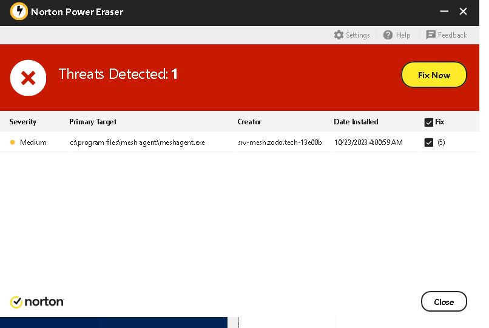
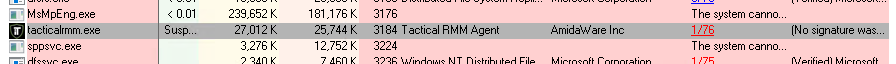
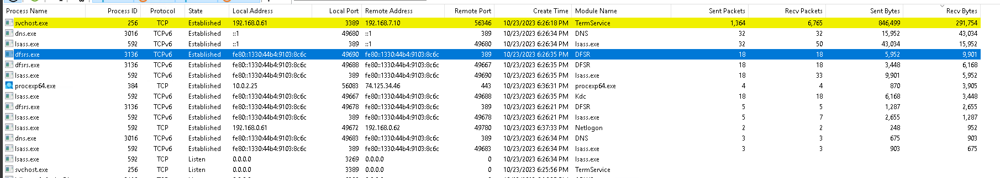

# Andrew Bernal
I got off to a slow start on windows. The room just didn't feel very tense, and it was hard to focus. 

## Failures
Towards the end my machine (the DC) died due to proxmox failing, and we were not able to set up the CA as a result. Otherwise it would have been a cakewalk with the great documentation I've made 😉

## Malware
Once I got into my groove, I ran my scripts (ZWHIPS). These also download sysinternals and norton power eraser.

Norton Power Eraser picked up on the tacticalrmm agent and removed it.

Process Explorer found the tacticalrmm.exe, which I promptly removed. I also removed its registry key at `HKLM\System\CurrentControlSet\Services\tacticalrmm`

The red team failed to attack us sufficiently, and we can prove they are kicked out because TCPView shows only my own RDP connection.

