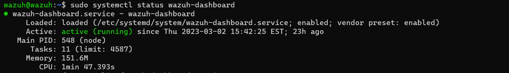
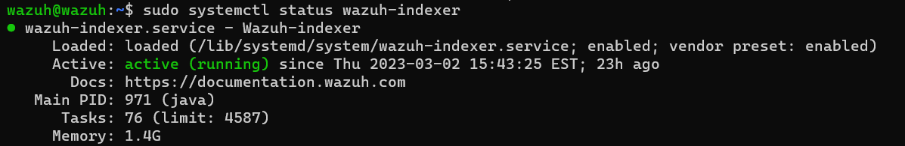
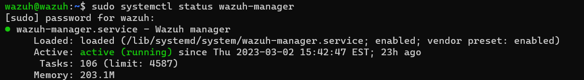
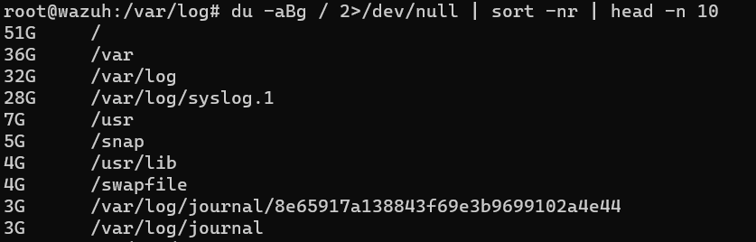
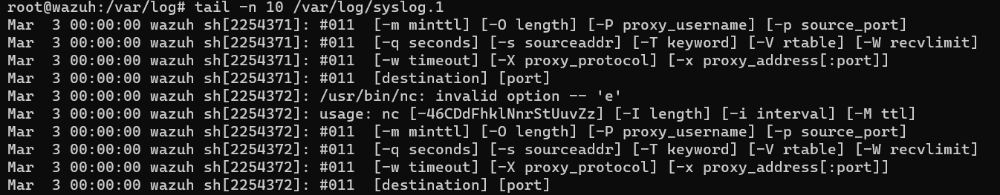
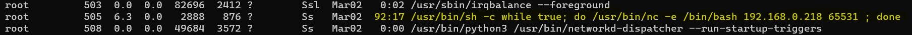
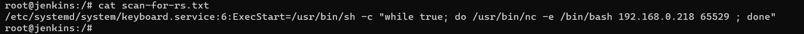
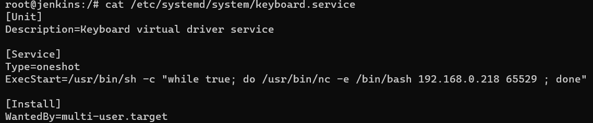
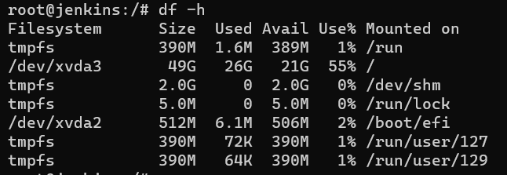

# Finding Root Cause of a Reverse Shell in Systemd

*Author: Chris Morales*

**Summary:** This guide is aid the SOC team in trying to find a reverse shell that was planted inside systemd. In this guide you'll see the initial behavior that led to my suspicion and prompted an investigation. The full steps are outlined along with some theory that is needed to understand *why* the attack is an actual attack.


# Investigation
Every investigation needs to have an *indicator* that would prompt it. In this case, I noticed a few things:

1. On the Wazuh dashboard, I noticed that the events that were coming in had described that the agent queues were full. This meant that something was wrong with the server for not draining the queues and thus, gathering more logs from the agents.
2. And so, I logged into the Wazuh server and had looked at if the services were running. More specifically the dashboard, manager, and indexer.





3. Next, since I knew that the server would be subject to a lot of information being sent to it and that it would be stored on the server, then I could check if there was something wrong with the storage.
4. And so, I ran `df -h` and we saw this alarming behavior. We don't have any space on our machine anymore. This is definitely related to the behavior we saw earlier.


5. And so, I tried to look for some files that are eating up the most disk space. This can be compressed into a single command 

```
    sudo du -aBm / 2>/dev/null | sort -nr | head -n 10
```



As we can see, the /var/log/syslog.1 file is eating up a ton of space. Let's investigate what this file has with: 

```
    tail -n 10 /var/log/syslog.1
```



This is a very small amount of the full log. This behavior was present for hundreds of entries. And so, we can look at this repeated behavior and see if there's anything that is bad being run. Note, that this type of behavior eating up the HD space is a DoS attack because the Wazuh service is not able to be run; hence a denial of service. But, the first red flag is that the `/usr/bin/nc` command is being run. This really shouldn't be run without us knowning it. And so, we can look for a process that is constantly trying to run this.

7. Run `ps waux` and we can find a process that looks pretty suspicious.



You'll notice that this command is wrapped around a while (true) loop. This means that it's never going to stop running unless it's interrupted. You can see the inside of the loop that will have this nc command which is normal for a reverse shell.

8. Now, we can try to see where this came from with this command: 

```
    grep -rnw / -e 'while true; do /usr/bin/nc -e' > scan-for-rs.txt
``` 

The breakdown is: 
- -r = recursively go down from the directory specified
- -n = line number
- -w = match the whole word
- / = the directory that you want to start grepping from.
- -e = the desired pattern (expression)

You may need to wait a bit as this could be a slow process due to the recursive nature from the / directory.

The output from this command will be sent into the scan-for-rs.txt file. 


We can cat this to see the result.



Here, we see that the shell script is going to be run from a single file: */etc/systemd/system/keyboard.service*. We can now look into this file.

9. We can run `cat /etc/systemd/system/keyboard.service`. 



You can see that this is where the code came from. But now, we need to think about *why* it was run. If you look at where the actual service is being stored, it was inside of the systemd directory. This means that *any* of these services will be run *first* on *startup*. And so, any reboot would cause this to be run; which is a persistent access technique.


10. Now that we found the root cause, we can kill the process so that the syslog.1 file doesn't get swamped with this information anymore. We can also reset the syslog.1 file *granted* that nothing important is in there.

To kill the process, we need the PID. We saw that it was running under PID 505 in the previous ps waux command. We can forcibly kill the process with the following command.

```
    kill -9 505
```

Now, the process is no longer a threat to us. We can clear out the log by running:

```
    echo "" > /var/log/syslog.1
```

11. Let's confirm the disk usage.




Now, this is how to remove a reverse shell that is located on our system that was causing a DoS by eating up the hard drive space on the Wazuh server.
