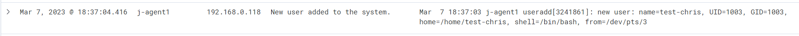
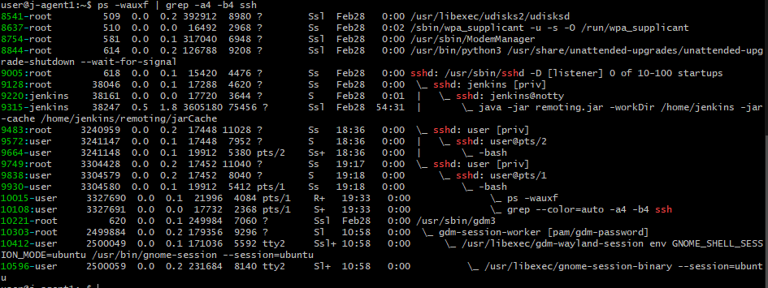
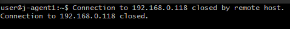
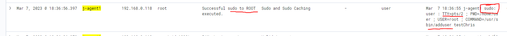
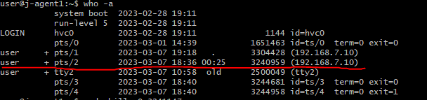
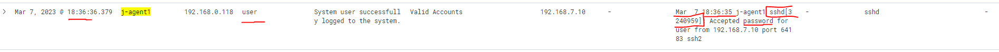

# User Creation Password Signin Investigation
*Author: Chris Morales*


**Summary:** Wazuh provides a huge help in trying to locate the root cause of an incident while providing key information about the systems. In this scenario, an investigation was launched to find the root cause of an additional user being created on a machine when no other users on the machine would have need of it. Through a series of steps that built upon each other, it was denoted that the root cause was a known password that allowed the attacker to gain access to an account that had sudo privileges that could create an account on the machine.


# Investigation

## **Initial Behavior**
This is the problematic log that was produced from our custom Wazuh dashboard that looks for the useradd command. 



Here, you can get some crucial information needed for the remediation and the incident response that should be written for this.

1. You notice that this is from the *j-agent1* agent that's registered with the Wazuh server.
2. Next, you notice that the timestamp. This could be the first time that you noticed this action or it could be used as the last time that you noticed an attacker coming in. 
3. In the full log on the right, you can see information regarding the user that was created (in terms of UID, GID, login shell, etc).
4. You'll notice that the full log on the right hand side houses the first major investigative note for us; this is the *"from=/dev/pts/3"* field.

## **Defensive Investigation / Commands**

This would indicate to us that this command was run from a shell by a remote user. The only thing that can be stored in the /dev/pts directory are pseudo-terminals that are derived from applications such as xterm or ssh (reference [here](https://unix.stackexchange.com/questions/93531/what-is-stored-in-dev-pts-files-and-can-we-open-them)). And so, we can log into the affected machine and look at the shells that are active.


Here, we can see that there are a few shell sessions that are connected. In this screenshot, you can see that *pts/3* is here. Now, we can see that this is under the pts/2 pseudo-terminal (ignore tty2, this is the actual console on the machine.). And so, *pts/2* is now what we're looking for. You can also look at the PID (the column housing 3244681) and see that the PID is relatively close to it. So it's safe to assume that this pts came from the other pts.

Let's confirm where this shell came from with:

```
    ps -wauxf | grep -a4 -b4 ssh
```




Notice that the pts/2 is attached to the *user* account which has PID 3241147. Now, we can take a remediation step and kill that session that the attacker still has.

```
    sudo kill -9 3241147
```


In the image above, you can see that we ran this same command to kill the session.



On the attacker side, we can see that the connection was closed. And once this is done, the attacker's session will have to be redone. It buys the blue team some time. But it also helps the SOC team look for a persistent authentication ssh method. This will help find an avenue that an attacker can get into the machine by.


## **Retracing Steps**
Now that we have bought ourselves some time by kicking out the attacker, we can now see how they got in the first place.

It is possible that the attacker has an authentication method but doesn't want to re run it immediately because they now know that we'll be on the lookout for their *in*. So, we need to find out what that original *in* was.


### *Looking for sudo command in Wazuh*
Remember, the session that we killed belonged to the *user* account. The only way to create a new session is to have *elevated privileges* through the "sudo" command with a *non-root* account. And so, we can look for the command that needed sudo to execute. Very likely something along the lines of "*sudo adduser*". Let's look for a log in Wazuh that supports our theory.



In this screenshot, you'll see a few key things:

1. The sudo command was utilized.
2. pts/2 was used to carry this out.
3. The adduser command was attached to this sudo command


These are all indicators of *how* an attack was carried out. There are two possibilites now on how the attacker was able to elevate privileges using sudo:

1. Entering the password upon the prompt.
2. The *user* account was granted access to use sudo without a password. This access is typically given in the sudoers file.

### *Looking through sudoers*

Quickly looking through the sudoers file, there was nothing there (in this case).

Now, we can pivot to looking at this session came to be. And so, we need to find out when a particular authentication for *user* had occurred.

### *Finding Authentication Successful in Wazuh*

Remember the old `who -a` command that we had run before? It had a key piece of information that we can use to help us digest the logs in Wazuh.



The key piece of information is the *timestamp*. Let's use this to look at the Wazuh log that matches with this.



We have found a log that looks like it. Let's confirm that the information matches what we know.

1. The timestamp in the log is similar if not the same as the SSH session under the `who -a` command - Yes. 
2. The account that was targeted was *user* - Yes.
3. The agent host was *j-agent1*. Yes.
4. In the full log on the right, we can see that the PID that was given to the session was 3240959. This matches with the PID contained in the `who -a` output. This also matches the `ps -wauxf` command from earlier if you match the PID with the *root* SSH process that houses pts/2. 

This log showcases that the method in which they had logged into the system was **via a password.**

## **Putting the story together**

Now, that we have all the pieces, we can come up with a timeline of what happened here.

And so, for an executive summary:

*On March 7, 2023 @ 18:36:36:379, a malicious party had gained access to one of our machines via a known password. Once inside, the attacker had created another user account (likely to setup persistent access to this machine). Our SOC analysts noticed this and swiftly removed the attacker from our system and removed this user. Upon further analysis of the breach, we do not see any signs of any data exfiltration or modification on our systems. We have contacted the administrator of the machine to immediately change the password of the machine to prevent this from happening. We have not seen any additional traffic from this attacker after March 7, 2023 @ 18:37:04.416.*


