# Task 2 Walkthrough
Initial Work taken from the CCDC Airforce Challege

## "Physical" Infrastructure Layout
A set of **N** Physical machines where **N** is greater than or equal to one. There will be at least **M** managers where **M** is greater than 1, but less than **N**, There are conventions where between 3-7(5) is the max you would want. **SOURCE** 

## Containers Used 

There are three types of containers used in this scenario.
1. Load Balancer/Proxy 
   * In this scenario we are using the [HAProxy](https://hub.docker.com/_/haproxy) container. This is an TCP/HTTP proxy.
1. Web server containers, or service containers. These are containers that clients will need to establish connections with through the proxy. We also will want to enable SSH on them, and connect with SSH through the proxy.
   * In this scenario we use a custom image that will (likely) need to be modified to enable SSH. It is a [django container](https://hub.docker.com/r/sh0rtcyb3r/ccdc23_af_django)
   * We did modify this container and it is located a https://hub.docker.com/r/daintyjet/ccdc23_af_django_ssh
1. Database containers, or protected containers. Theses containers are not supposed to be accessible to the proxy or any outside systems. Only the Web server or service containers should be able to access these containers. 
   * This is simply going to be a database container(s), in our case it is going to be a [postgres](https://hub.docker.com/_/postgres) database  
### Enabling SSH on Containers  

As we are using a "normal" web container that does not have SSH enabled we are going to need to use a [Dockerfile](https://docs.docker.com/engine/reference/builder/) to enable SSH on the container, and create an account and password so we can SSH into the container. 

Once this is done we can use the docker file in the stack/compose file, or for a more long term and flexible solution tag the image and upload it to [docker hub](https://hub.docker.com/)

### Dockerfile
Currently need to build on all systems that will host it... Put on dockerhub! 

Since we are using docker file we can build off of an existing container with relative ease using the **FROM** directive. The modifications to the container will include using the **RUN** directive to make the user(s), and download the ssh server we will use. Then the **COPY** directive will be used to copy our slightly modified entrypoint script into the container.

We **do not** need to use the **EXPOSE** keyword, the ports are open internally to the docker network, we do not want the port to available externally!

The first thing we will want to do is write the **Dockerfile** we will use to build the **Image** 
```Dockerfile
# Building off of an already existing image, simplifies this as we do not have to redo 
# The steps that were done to make the original container
FROM sh0rtcyb3r/ccdc23_af_django:latest

# We can chain shell commands together with the "&&" symbol. So this creates a new user with a home directory too.
# We assign a password to the user so that we can log in through SSH. I created a group and added the user to 
# The group too, though this is not necessary.
RUN useradd -m user && echo "user:1qazxsW@1"|chpasswd && groupadd sshUser && usermod -aG sshUser user 

# This directive runs commands to update the package manager's source lists (allowing most up to date binaries)
# We also run the command to install the open-ssh server we use the -y flag to confirm it as during the 
# Build we can not type yes (y) 
RUN apt-get update && apt-get install openssh-server -y

# This copies the entrypoint.sh file from the directory we are currently in to the root directory of the container
COPY entrypoint.sh /

# Set the command to be run on startup as the entrypoint.sh command
ENTRYPOINT ["/bin/bash", "/entrypoint.sh"]
```

As mentioned earlier we need to edit the entrypoint.sh file a little so that we start the Open-SSH server that we installed in the modified **Dockerfile**.

```bash
# Change to the Code directory, as this is where the server files are located 
# And this is where we need to run the Django specific commands 
cd /code

# We need to start the SSH server so this container can server a dual purpose
/etc/init.d/ssh start

# Django Specific commands
# Only thing to note is the server listens on 8000!
python manage.py makemigrations
python manage.py migrate 
python manage.py runserver 0.0.0.0:8000

```


There were a few **issues** I ran into when writing the entrypoint script. The main issue was when I ran the **service ssh start** command which appears to be a wrapper for the **/etc/init.d/ssh start** the process of starting the SSH server failed. However when I would  enter the container using **docker exec -it \<ContainerID/Name\> /bin/bash** and manually start the SSH service using the **service** commands it would work fine.

A complete version of the [entrypoint.sh](Code-Files/Dockerfile/entrypoint.sh) and [Dockerfile](Code-Files\Dockerfile\Dockerfile) can be found in this repository by clicking on the hyperlinks seen previously.

> 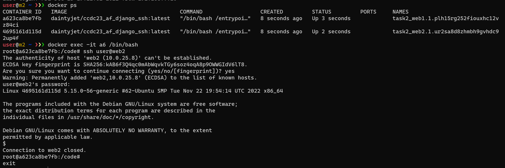
> Just to provide some sanity to those who may struggle here is a screenshot showing that it is working using the **Image** generated from out docker file to create the containers.

### Uploading to Docker hub

For this part I (Matt) will be uploading the container to my own docker account and a repository I create there. It is possible to upload to an organization's repository that you are a part of as well.

1. We need to make the repository this can be done once you have logged into [docker hub](https://hub.docker.com/)
> 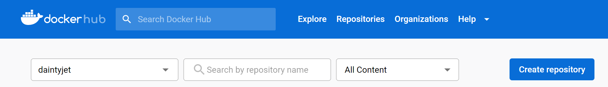
1. The repository will need a name and other information filled out
> 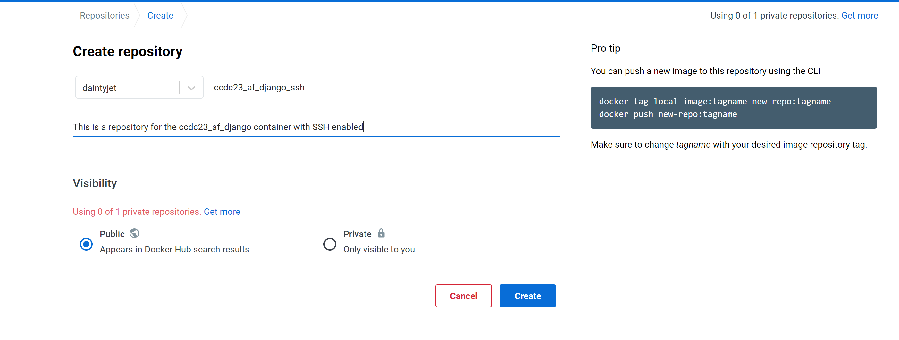
1. Once the repository is created you will see the following 
> 
1. Build and Tag the Docker image. This can be done in many different ways.
   * The fist way I often do it is **docker build -t \<hub-user/repository-name:Tag\> .** the "." can be replaced with a path to a Dockerfile
   * We can first build the image with the build the image and later tag it using **docker tag \<existingContainer\> \<hub-user/repository-name:Tag\>**
   * Or this can be done with a build container when committing it **docker commit \<existingContainer\> <hub-user/repository-name:tag> 
> 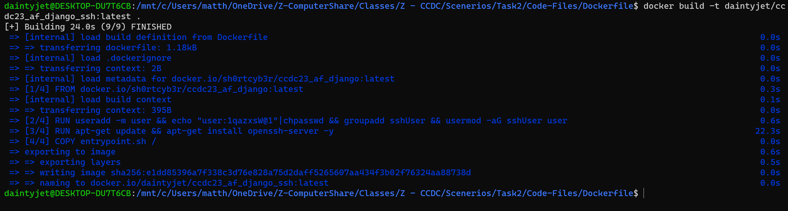
> This is an image of me using the build and tag method on my local machine.
1. Use the **docker push hub-user/repository-name:tag** command to push the container (with the repositories name) that has the specified tag to the repository.
> 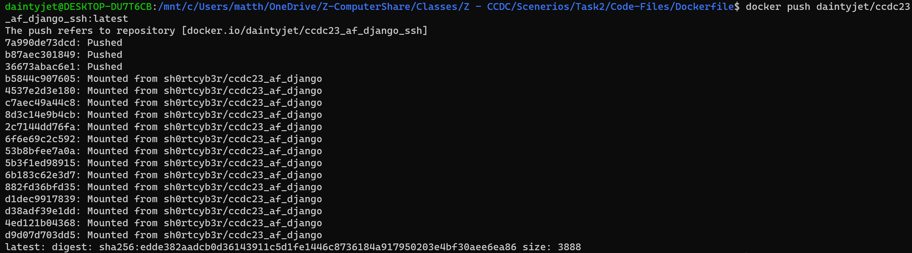 
> I used my local machine so I could be logged into the docker desktop and make the pushing process a little easier 

Now the image is available on docker hub! This image we created is at [this repository](https://hub.docker.com/r/daintyjet/ccdc23_af_django_ssh) with the following URL.
```
https://hub.docker.com/r/daintyjet/ccdc23_af_django_ssh
```

## Docker Networks

We will need **TWO** [Overlay networks](https://docs.docker.com/network/overlay/). We will configure both of them to be **internal** so that there is no connection to public internet.

Overlay networks allow for communication between containers on distributed systems in the swarm assigned the same overlay network driver.

### Proxy-Web
This is again an internal overlay network, it will be assigned to the [proxy](#containers-used) and [web server/service](#containers-used) containers. This will allow the proxy to communicate with the service containers.

### Web-DB
This is again an internal overlay network, it will be assigned to the [web server/service](#containers-used) and [database/protected](#containers-used) containers. This allows the service containers to communicate with the protected containers, without allowing the proxy to communicate with the protected containers directly.

## Docker Stack -- file
This will provide basic explications of the different parts of the Docker Stack(Compose) file we used to define and launch out infrastructure of containers.

As always we will start off with whatever the most recent version is! The we will have out sections defining constructs in docker.
```Dockerfile
version: "3.9"

services:
   ...
volumes: 
   ...
networks:
   ...
```
### Services
The services section defines the containers that are going to be pulled, or built from docker files and run. This section also defines all of the options that are going to applied to each container.

We will need a service for the HAProxy container, the Database container(s) and the Web Container(s). Since we are using Docker Swarm we can define multiple of each using the replicas "flag" however that would make it difficult to individually address the containers, so for now each replicated container is defined separately.


**HAProxy Service**
```Dockerfile
  # This defines the haproxy service (DNS will resolve "haproxy" to this container)
  haproxy:
    # Defining the image from docker hub that this service is based off of 
    image: haproxy:latest
    
    # Define the volumes to attach to this container
    volumes:
      # We are bind mounting the /home/user/HAProxy directory on the HOST machine to /usr/local/etc/haproxy
      # This means the /usr/local/etc/haproxy will mirror whatever is in /home/user/HAProxy
      - /home/user/HAProxy/:/usr/local/etc/haproxy:ro
    
    # Define host to container port mappings
    ports:
      - "80:80"
      - "443:443"
      - "2222:2222"

    # Define the networks that this container will be attached to
    networks: 
      - web_net
    
    # Define decencies, this will not spin up until the dependencies have successfully spun up.
    depends_on:
      - web1
      - web2
    
    # This section defines deployment parameters (docker swarm specific stuff)
    deploy:
      # define placement constraints 
      placement:
        constraints:
          # This will only deploy on nodes with the manager role
          - "node.role==manager"
      # Define restart policy, it will only restart on failures
      restart_policy:
        condition: on-failure
```


**Web Container(s) Service**
```Dockerfile
  # This defines the web1 service (DNS will resolve "web1" to this container)  
  web1:
    # This is the image that the container will be built off of. 
    # In this case it is a custom Django image
    image: daintyjet/ccdc23_af_django_ssh

    # Define environment variables that will be imported and used by the 
    # container and the program running in it. This is not a secure method of 
    # passing secrets
    environment:
      - POSTGRES_DB=postgres
      - POSTGRES_USER=postgres
      - POSTGRES_PASSWORD=postgres
    
    # Defines the networks that this container is attached to
    networks:
      - database_net
      - web_net  
    
    # Define decencies, this will not spin up until the dependencies have successfully spun up.
    depends_on:
      - db
    
    # This section defines deployment parameters (docker swarm specific stuff)
    deploy:

      # Define the number of replicated containers to create (made a demo of what we can do)
      replicas: 1

      # define placement constraints 
      placement:
        constraints:
          # Only deploy on swarm nodes that have the label web=m2
          # We will want to avoid machine based labels where possible as it could
          # prevent the stack from deploying if a machine goes down 
          - "node.labels.web==m2"
      
      # Define restart policy
      restart_policy:
        condition: on-failure
```

**Database Container(s) Service**
```Dockerfile
  # This defines the db service (DNS will resolve "db" to this container)  
  db:
    # This is the image that the container will be built off of.
    image: postgres

    # Defines the volumes that will be bound to the container
    volumes:
      # db is an anonymous volume, it is hosted (somewhere) on the host and is 
      # bound to the /var/lib/postgresql/data directory in the container 
      - db:/var/lib/postgresql/data
    
    # Define environment variables that will be imported and used by the 
    # container and the program running in it. This is not a secure method of 
    # passing secrets
    environment:
      - POSTGRES_DB=postgres
      - POSTGRES_USER=postgres
      - POSTGRES_PASSWORD=postgres

    # Defines the networks that this container is attached to
    networks:
      - database_net

    # This section defines deployment parameters (docker swarm specific stuff)
    deploy:

      # define placement constraints
      placement:
        constraints:
          # Only deploy on swarm nodes that have the label web=m3
          # We will want to avoid machine based labels where possible as it could
          # prevent the stack from deploying if a machine goes down
          - "node.labels.db==m3"
      restart_policy:
        condition: on-failure
```

**Labels** 
As we are using labels to place constraints and limit the number of machines a container can be deployed on, then it would make sense to describe how we would make a label. These are associated with the nodes, not the containers!

We would use the following command from a **Manager** node
```sh
$ docker node update --label-add <label=value> <nodeID/Name>

```

### Volumes
We use the constructs defined under this tag to define anonymous volumes in this case. We tend to define bind volumes inline of the container service.

```Dockerfile
# Define Volumes
volumes: 
  # Anonymous volume defined for the database containers (machine specific?)
  db: 
```
### Networks
We use this tag to define networks that will be used by the services in the swarm.

```Dockerfile
# Define Networks 
networks: 
  # Define database_net network
  database_net: 
    # Since this is a swarm network we use the overlay driver 
    driver: overlay 
    # We allow this network to be attached to containers
    attachable: true
    # Define this as an internal network, no outbound connections can be created
    internal: true
  
  # Define web_net network
  web_net:
    # Since this is a swarm network we use the overlay driver 
    driver: overlay 
    # We allow this network to be attached to containers
    attachable: true
    # Define this as an internal network, no outbound connections can be created
    internal: true
```

### Stack Commands (Launch, Take Down, and status) 
The launching of this is quite simple, we use the [complete compose file](Code-Files/docker-compose.yml) we have defined using the parts above.

On the **Manager** node we will run the following command.
```sh
# note that the docker-compose.yml can have any name
$ docker stack deploy <StackName> -c <path/to/docker-compose.yml> 
```
> 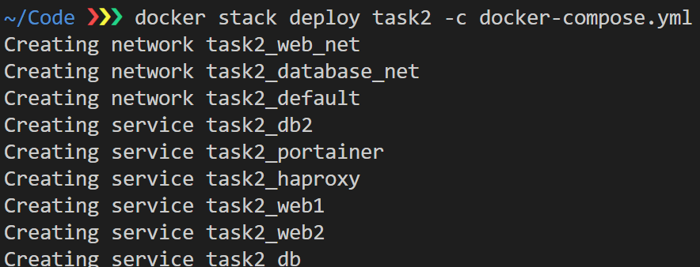
> Image of deploying the stack and the resulting output 

We can check on the status of the services with the following command
```sh
$ docker service ls
```
> 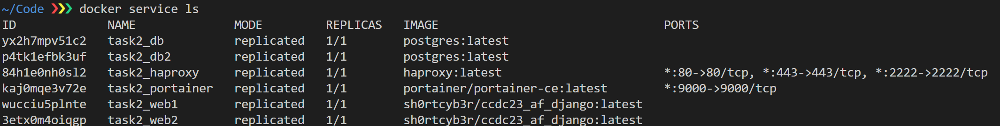
> Image of "docker service ls" and its resulting output

If we notice that there are issues with the specified service we can use the logs command to see the logs the container generated.
```sh
$ docker service logs <ServiceName/ID>
```
> 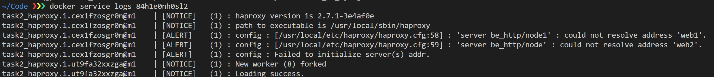
> 
> Image of "docker service logs \<ID\>" and its resulting output

We can do this same operation on individual containers as long as we are on the machine they are running on with the following command.
```sh
$ docker logs <ContainerID>
```
> 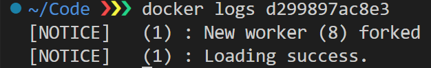
> 
> Image of "docker logs \<ContainerID\>" and its resulting output

We can delete the entire stack with the following command from the **Manager** node.
```sh
$ docker stack down <StackName>
```
> 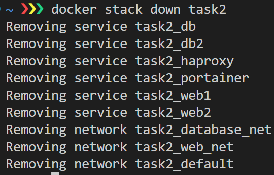
> Image of taking down the stack and the resulting output 


**Note:**
If these commands are run multiple times too close together (primarily a deploy after a down) then issues with port mapping and old networks could occur due to them being attached to containers in the process of being deleted.


## Certificate Authority

Manoj wants to do something with this, since it involves windows and he wants this done by Monday, I am using easyRSA as a temporary solution.

### EasyRSA -- Initial Temp CA
EasyRSA can be [downloaded](https://github.com/OpenVPN/easy-rsa/releases) for either Windows or Linux. It comes packaged in a Zip or Tar ball file. More info can be found at their [documentation site](https://easy-rsa.readthedocs.io/en/latest/). 

1. Unzip the file
2. Utilize the EasyRSA binary to run the CA commands
   1. On Windows you can run the **EasyRSA-Start.bat** file to open a configured cmd shell to run the commands 
   2. On Linux you can run the commands from the **EasyRSA** directory or add the directory to the **PATH** environment variable so it can be run from anywhere. 
3. On the initial setup you will need to run the following commands:

```zsh
# This initializes the PKI infrastructure 
$ easyrsa init-pki
Notice
------
'init-pki' complete; you may now create a CA or requests.

Your newly created PKI dir is:
* C:/Users/matth/Downloads/EasyRSA-3.1.1/pki

* Using Easy-RSA configuration:

* IMPORTANT: Easy-RSA 'vars' template file has been created in your new PKI.
             Edit this 'vars' file to customise the settings for your PKI.

* Using x509-types directory: C:/Users/matth/Downloads/EasyRSA-3.1.1/x509-types

# This will build and initialize the CA itself
# You will be prompted for a CA PEM file Passphrase (used to secure the use of the CA PEM)
# You will be prompted for a PKI Passphrase used to secure the signing key
# You will be prompted for a Common Name of the CA, as this is a demo the Common name does not matter much.
$ easyrsa build-ca
* Using SSL: openssl OpenSSL 3.0.5 5 Jul 2022 (Library: OpenSSL 3.0.5 5 Jul 2022)

* Using Easy-RSA configuration: C:/Users/matth/Downloads/EasyRSA-3.1.1/pki/vars


Enter New CA Key Passphrase:
Re-Enter New CA Key Passphrase:
Using configuration from C:/Users/matth/Downloads/EasyRSA-3.1.1/pki/safessl-easyrsa.cnf.init-tmp
...+......+.....+.+.....+.......+.....+...+...+.+.....+......+.......+...+++++++++++++++++++++++++++++++++++++++++++++++++++++++++++++++++*.+.+............+........+.........
Enter PEM pass phrase:
Verifying - Enter PEM pass phrase:
-----
You are about to be asked to enter information that will be incorporated
into your certificate request.
What you are about to enter is what is called a Distinguished Name or a DN.
There are quite a few fields but you can leave some blank
For some fields there will be a default value,
If you enter '.', the field will be left blank.
-----
Common Name (eg: your user, host, or server name) [Easy-RSA CA]:127.0.0.1

Notice
------
CA creation complete and you may now import and sign cert requests.
Your new CA certificate file for publishing is at:
C:/Users/matth/Downloads/EasyRSA-3.1.1/pki/ca.crt
```
4. Now that the PKI is initialized and the CA is built you can start to make some certificates. Run the following commands: 
```sh
# The following command will generate a signing request the CA can sign.
# The nopass option is important as we are also generating a private key, and if we do not include the nopass option it will be password protected and inaccessible to the HAProxy container. (We would have to do more work...)
# You will be asked for a Common name, this will be the IP or web address of the system that will be using the certificate.
$ easyrsa gen-req <reqName/ID> nopass
* Using SSL: openssl OpenSSL 3.0.5 5 Jul 2022 (Library: OpenSSL 3.0.5 5 Jul 2022)

* Using Easy-RSA configuration: C:/Users/matth/Downloads/EasyRSA-3.1.1/pki/vars

...+..+....+..+..........+...+.....+...............+++++++++++++++++++++++++++++++++++++++++++++++++++++++++++++++++*..+..+....+...........+....+...+...+...+...........+...............+....+..+++++++++++++++++++++++++++++++++++++++++++++++++++++++++++++++++*................
-----
You are about to be asked to enter information that will be incorporated
into your certificate request.
What you are about to enter is what is called a Distinguished Name or a DN.
There are quite a few fields but you can leave some blank
For some fields there will be a default value,
If you enter '.', the field will be left blank.
-----
Common Name (eg: your user, host, or server name) [haproxy1]:192.168.0.124

Notice
------
Keypair and certificate request completed. Your files are:
req: C:/Users/matth/Downloads/EasyRSA-3.1.1/pki/reqs/haproxy1.req
key: C:/Users/matth/Downloads/EasyRSA-3.1.1/pki/private/haproxy1.key

# This command will sign the request we generated earlier using the CA's Private key
# We specify we are creating a server certificate, this could be a client or ca certificate too.
# EasyRSA will display information about the certificate and ask us to confirm that it is correct. We do this by typing yes
# Then we will be asked for the passphrase to use the CA's key we generated earlier
$ easyrsa sign-req server <reqName/ID>
* Using SSL: openssl OpenSSL 3.0.5 5 Jul 2022 (Library: OpenSSL 3.0.5 5 Jul 2022)

* Using Easy-RSA configuration: C:/Users/matth/Downloads/EasyRSA-3.1.1/pki/vars


You are about to sign the following certificate.
Please check over the details shown below for accuracy. Note that this request
has not been cryptographically verified. Please be sure it came from a trusted
source or that you have verified the request checksum with the sender.

Request subject, to be signed as a server certificate for 825 days:

subject=
    commonName                = 192.168.0.124


Type the word 'yes' to continue, or any other input to abort.
  Confirm request details: yes

Using configuration from C:/Users/matth/Downloads/EasyRSA-3.1.1/pki/safessl-easyrsa.cnf.init-tmp
Enter pass phrase for C:/Users/matth/Downloads/EasyRSA-3.1.1/pki/private/ca.key:
F4430000:error:0700006C:configuration file routines:NCONF_get_string:no value:crypto/conf/conf_lib.c:315:group=<NULL> name=unique_subject
Check that the request matches the signature
Signature ok
The Subject's Distinguished Name is as follows
commonName            :ASN.1 12:'192.168.0.124'
Certificate is to be certified until Mar 26 17:10:41 2025 GMT (825 days)

Write out database with 1 new entries
Data Base Updated

Notice
------
Certificate created at: C:/Users/matth/Downloads/EasyRSA-3.1.1/pki/issued/haproxy1.crt
```
5. Now that we have a certificate and private key we will need to use them to make a pem format file that HAPRoxy can use.
   * This format is simply the certificate file with the private key file appended to the end we can do it with the following command:
``` sh
# The issued certificates will be in the pki/issued subdirectory
# For this demo I copy them to my home directory so the final command is a bit easier to read
$ cd /<PathToEasyRSA>/pki/issued
$ cp <reqName/ID>.crt ~

# The issued certificates will be in the pki/private subdirectory, this is because we are also generating the private key for the request 
# For this demo I copy them to my home directory so the final command is a bit easier to read
$ cd /<PathToEasyRSA>/pki/private
$ cp <reqName/ID>.key ~

# This command will print the contents of the <reqName/ID>.crt and <reqName/ID>.key one after another and pipe them into the tee command which will append them to the end of the <reqName/ID>.pem file (which to this point does not exist)
$ cat <reqName/ID>.crt <reqName/ID>.key | tee <reqName/ID>.pem
```

### Images

Windows: EasyRSA 
> 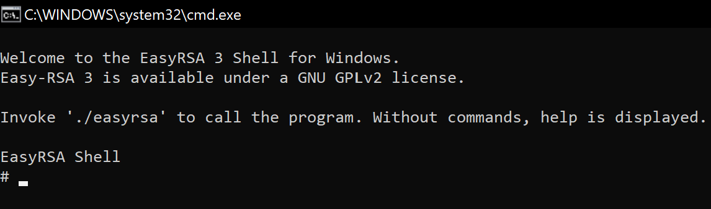
> Starting the Shell, similar process can be used in linux

> 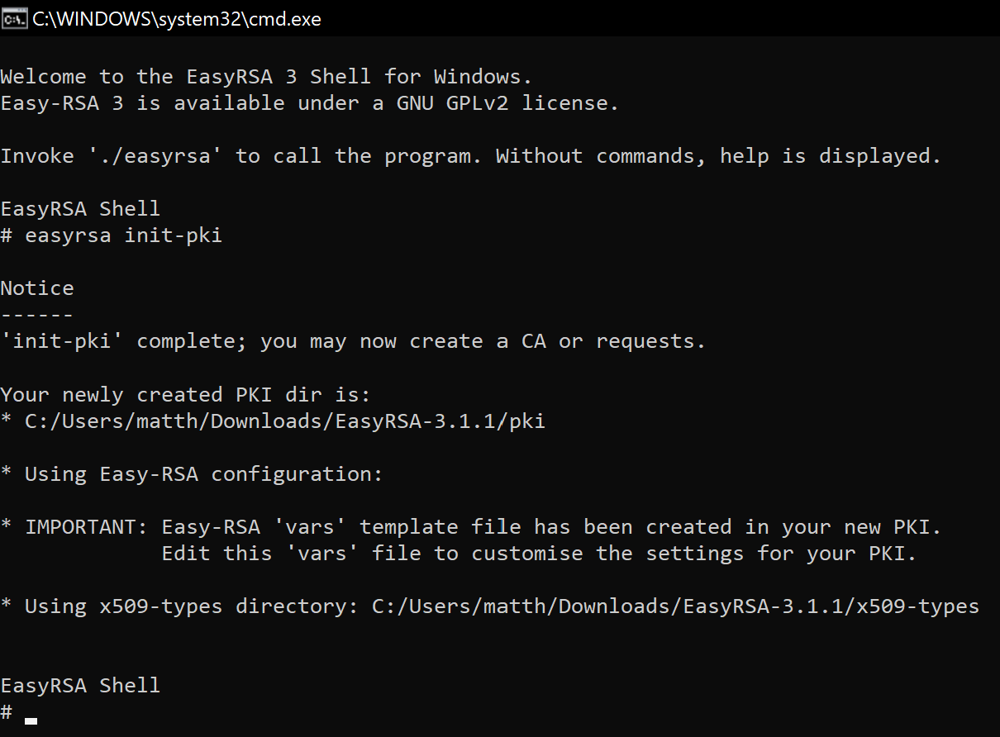
> Initializing the PKI infrastructure 

> 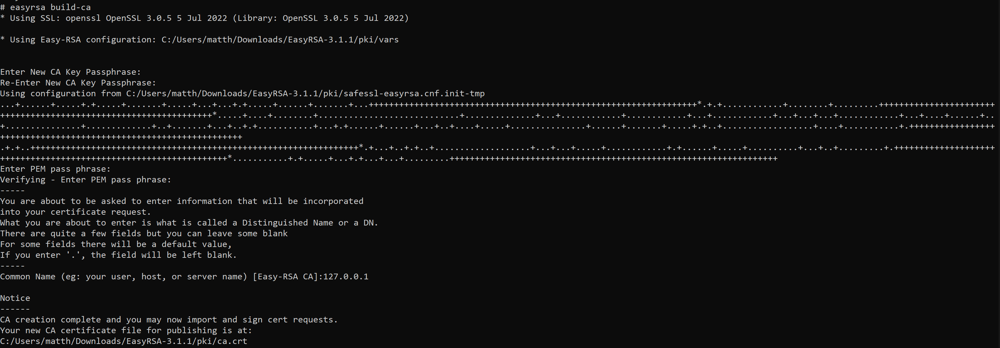
> Build the CA infrastructure on top of the PKI infrastructure 
> We will assign a passphrase for the CA PEM file, and a passphrase for the CA's signing key that is generated 
> We also will be asked for the CA's Common Name, since this is a demo, and the CA is a temporary measure it did not matter what I used

> 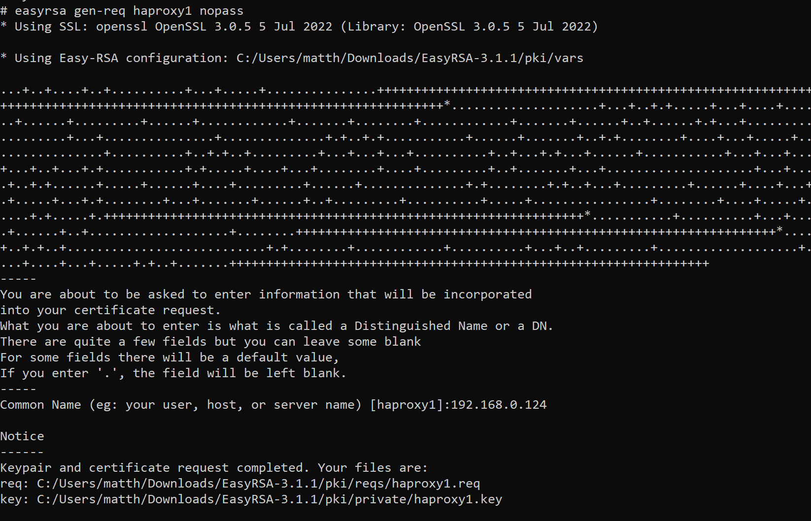
> This will generate the signing request for a service or system.
> We will be asked for a Common Name, this is the IP or Hostname of the system or service that will use the certificate to prove it's identity 
> During this step a private key is also generated for the system, this can later be combined with the certificate to make a PEM file.

> 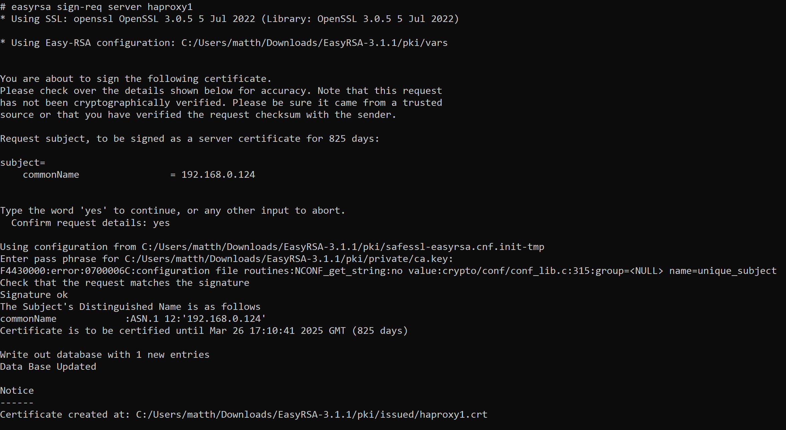
> This will generate the certificate from the signing request we generated earlier
> We user the nopass option so this certificate can easily be used with the HAProxy service. This means no password will be needed to open the certificate.
> We will be asked to confirm the details in the signing request, in this case that the Common Name is correct.
> Then we need to enter in the passphrase for the CA's private key so it can be used to sign the request

Linux: Creating the PEM file
> 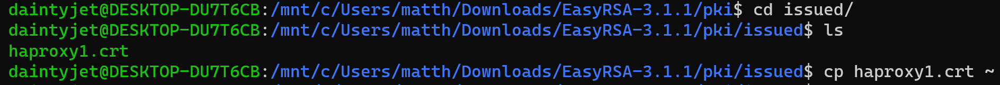
> This is me entering the subdirectory that holds the issued certificates, and copying it to my home directory, this is not necessary, and I do this so that the last command can be shorter (this is a demo!)

> 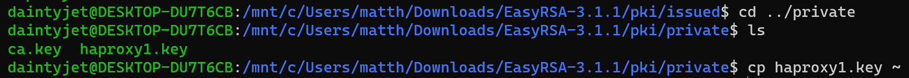 
> This is me entering the subdirectory that holds the issued private keys, and copying it to my home directory, this is not necessary, and I do this so that the last command can be shorter (this is a demo!)
> It is possible for the certificate to be generated without generating an associated private key (I think), we do not do this.

> 
> This is the command used to generate the PEM file, which is the certificate followed by the private key of the service.

## HAproxy

### Global

The [**global**](https://www.haproxy.com/documentation/hapee/latest/configuration/config-sections/global/) section defines process level directives. 
___

There are a variety of logging things that we can do with HAProxt, we want to enable logging output so all [**logging**](https://www.haproxy.com/documentation/hapee/latest/observability/logging/log-with-docker/) is outputted to a specific "area" in a specific format. This is so it can be fed to log analysis tools (likely), I(Matt) picked  a general one since I do not know what we will want later.

 
```python
global
   # This will output all logs in their raw format to local0 so that we can see all logs
   # It is possible to forward them to a specific service or container.
   log stdout format raw local0
```

Once we enable TLS/SSL we can define the minium version that is supported globally so we do not have to define it in each front end we define later.

```python
global
   # This will output all logs in their raw format to local0 so that we can see all logs
   # It is possible to forward them to a specific service or container.
   log stdout format raw local0

   # Define Minimum TLS/SSL Version Supported
   ssl-default-bind-options ssl-min-ver TLSv1.2 
```
There are further options that we can define, such as the max number of connections, chroot, user to run as, ect.

```python
global
   # This will output all logs in their raw format to local0 so that we can see all logs
   # It is possible to forward them to a specific service or container.
   log stdout format raw local0

   # Define Minimum TLS/SSL Version Supported
   ssl-default-bind-options ssl-min-ver TLSv1.2 

   # Set Maximum number of connections to 20 (Picked randomly)
   maxconn  20
```

### Defaults

There are a number of things that can be defined in the defaults section. Everything defined in this section applys to all following front and back ends. This can help to reduce duplication. The settings here can be overridden in the individual front and back ends. We are likely concerned with enabling [logging](https://www.haproxy.com/blog/introduction-to-haproxy-logging/)
___ 

We may as well start with some basic [timeout settings](https://www.haproxy.com/blog/the-four-essential-sections-of-an-haproxy-configuration/#:~:text=timeout%20connect%20%2F%20timeout%20client%20%2F%20timeout,backend%20server%20to%20be%20established.), so connections will not last indefinitely. This can be done with the **timeout \<type\> \<length of time\>** line as seen below. 
```python
defaults
    # Set timeout for attempts at connections
    timeout connect 5s
    # Set client timeout at 20s, if the client stops sending packets for 20 seconds close the connection
    timeout client 20s
    # Set serve timeout at 20s, if the server stops sending packets for 20 seconds close the connection
    timeout server 20s
```

We then want to enable logging using the line(s) specified in the global section so that we can easily access the logs generated by the individual front and back ends. We can do it by adding the **log global** line as seen below. The HTTP logging will be quite minimal by default so we should add the **option httplog** line to make it more verbose.

```python
defaults
   # Enable global logging in all FE and BE
   log global
   # Enable more verbose HTTP logging
   option httplog
   
   # Set timeout for attempts at connections
   timeout connect 5s
   # Set client timeout at 20s, if the client stops sending packets for 20 seconds close the connection
   timeout client 20s
   # Set serve timeout at 20s, if the server stops sending packets for 20 seconds close the connection
   timeout server 20s
```

We may want to set a default mode for each front end and back end which we can later override. In this case setting the default mode to HTTP as we are going to be a proxy for web-servers would make sense. We can do this by adding the line **mode http** in the defaults section as follows.

```python
defaults
   # Enable global logging in all FE and BE
   log global
   # Enable more verbose HTTP logging
   option httplog
   # Set default mode of FE and BE to http (overridden individually)
   mode http
   
   # Set timeout for attempts at connections
   timeout connect 5s
   # Set client timeout at 20s, if the client stops sending packets for 20 seconds close the connection
   timeout client 20s
   # Set serve timeout at 20s, if the server stops sending packets for 20 seconds close the connection
   timeout server 20s
```
### HTTP Configuration
The HTTP configuration can be quite simple, since we defined a **default** mode, there is no need to do this again, unless we would like to be explicit. Since we are using port mapping, it does not mater what the internal port we bind to is, however to keep things simple we will bind to port 80 for HTTP. As this Django site has an admin page we want to restrict access to it using an [Access Control List](https://www.haproxy.com/blog/introduction-to-haproxy-acls/) (ACL). We will use a default backend to round robin load balance between the web servers.

```python
# Define a frontend, and give it a name (this name is used in the logging!)
frontend fe_http
    # Explicitly define the mode (not needed due to defaults)
    mode http

    # bind (listen) on port 80 all (*) incoming traffic will be caught and apply all following rules and forwarding to received traffic
    bind *:80

    # We can create access control lists to filter traffic based on certain conditions, in this case we want to remove access to the admin page.
    # In this case we look at the beginning of the path, decode the url and look for the /admin, this acl is true if this is found.
    acl restricted_page path_beg, url_dec -i /admin
    # This defines the default backend to use, we will forward traffic unless the request is to the restricted page. 
    use_backend be_http unless restricted_page

# Define backend, and give it a name (this name is used in the logging!)
backend be_http
    # Explicitly define the mode (not needed due to defaults)
    mode http 

    # Define the load balancing type (default is RoundRobin)
    balance roundrobin

    # List of servers, they each have a name and route to a server using (docker) DNS on their desired port (8000)
    # They have the form server <nameLog> <Hostname/IP:Port> options
    # check specifies that health checks should occur
    server node1 web1:8000 check
    server node  web2:8000 check
```

Now we have a working load balancing proxy for HTTP traffic. A [complete version](Code-Files/haproxy-HTTP.cfg) can be seen in this repository. 

### HTTPS Configuration
Now we want to add some security to the connection using SSH. This will **require** a certificate and key in the form of a **PEM** file. Remember that we created one in the [CA](#easyrsa----initial-temp-ca) section earlier, so it should be as easy as copying the file over! We would also like to disallow HTTP connections and automatically upgrade them to TLS/SSL connections.

To do this we will need to bind to port 443, again since this is a container and we are using port mapping it does not matter all that much which port we bind to, but we want to keep this simple. 

The Backend does not change as the TLS/SSL connection is only being established between the client and proxy, in our case the backend servers still communicate with the proxy through HTTP or other unencrypted schemes. So there is no need to changed the backed.

```python
# Define a frontend, and give it a name (this name is used in the logging!)
frontend fe_http
    # Explicitly define the mode (not needed due to defaults)
    mode http

    # bind (listen) on port 80 all (*) incoming traffic will be caught and apply all following rules and forwarding to received traffic
    bind *:80
    # bind (listen) on port 443 all (*) incoming traffic will be caught and apply all following rules and forwarding to received traffic
    # We will establish the TLS connection with the ssl certificate at the following path 
    bind *:443 ssl crt /usr/local/etc/haproxy/haproxy1.pem # Min version defined in global.

    # This defines actions to take on HTTP requests
    # This will redirect HTTP requests to the HTTPS scheme unless it is already a HTTP/SSL connection
    http-request redirect scheme https unless { ssl_fc }

    # We can create access control lists to filter traffic based on certain conditions, in this case we want to remove access to the admin page.
    acl restricted_page path_beg, url_dec -i /admin
    # This defines the default backend to use, we will forward traffic unless the request is to the restricted page. 
    use_backend be_http unless restricted_page

# Define backend, and give it a name (this name is used in the logging!)
backend be_http
    # Explicitly define the mode (not needed due to defaults)
    mode http 

    # Define the load balancing type (default is RoundRobin)
    balance roundrobin

    # List of servers, they each have a name and route to a server using (docker) DNS on their desired port (8000)
    # They have the form server <nameLog> <Hostname/IP:Port> options
    # check specifies that health checks should occur
    server node1 web1:8000 check
    server node  web2:8000 check

```
Now we have a working load balancing proxy for HTTPS traffic. A [complete version](Code-Files/haproxy-HTTPS.cfg) can be seen in this repository. 

### SSH Configuration

#### Resolver
This is a structure defined in HAProxy to allow for DNS resolution, this can be used to resolve backend addresses dynamically. You are given quite a bit of control in how long a response and type of response is valid. This is not needed for this task, as you can have a different backend for each server, you can refer to their [example](https://www.haproxy.com/blog/route-ssh-connections-with-haproxy/). But the idea is you analyze the sever name in the request and jump to the backend with that name.

```python
# Define a resolver section for DNS resolution 
# Accessed through the tcp-content do-resolve action
resolvers swarm_internal
    # Define the max payload size accepted 
    accepted_payload_size 8192

    # Define the nameserver(s) that this resolver will use
    # Use the Swarm resolver at ist default location
    nameserver swarm 127.0.0.11:53

    # Max number of retires for resolution sent to the resolver 
    resolve_retries 3
    # Default time to trigger name resolutions 
    timeout resolve 1s
    # Time that is waited between DNS queries when no valid response is received
    timeout retry 1s

    # Hold defines the amount of time the last name resolution should be kept
    # Base on the last resolution status. This can be results that lead to it being up, or down. 

    # If OTHER status hold it for 30s
    hold other           30s
    # If refused hold it for 30s
    hold refused         30s
    # If non-existent hold for 30s 
    hold nx              30s
    # If request timeout hold for 30s 
    hold timeout         30s
    # If the request is received and valid 10s
    hold valid           10s
    # If it is obsolete hold for 30s
    hold obsolete        30s
```

#### Frontend
There are a few ways we can create this frontend server.

The following method uses the previously defined resolver to resolve the hostname we provide in the **ssh -o ProxyCommand="..."** command.

This definition also implements some basic checking to ensure the protocol used is SSH by getting the first 7 bytes of the payload and ensuring they are the "SSH-2.0" string. If this is not the case the request will be rejected. The log format is provided by the HAProxy guide I was looking through, is not necessary but can provide [useful information based on the format](https://www.haproxy.com/blog/introduction-to-haproxy-logging/#:~:text=HAProxy%20Log%20Format,-The%20type%20of).


As mentioned we use the previously defined resolver through the tcp-request content do-resolve command. The result is saved in the sess.dstIP variable. 
```python
# Define a frontend to handel SSH connections
frontend ssh_handler
    # Set mode to TCP, go against the default of HTTP
    mode tcp
    # Bind on listening for all traffic on port 2222
    # We chose 2222 so it mirrors the docker port mapping
    # Use SSL certificate
    bind *:2222 ssl crt /usr/local/etc/haproxy/haproxy1.pem

    # Wait 5 seconds before closing connection  
    tcp-request inspect-delay 5s
    # This req.payload extracts the binary contents at position 0 with a length of 7 bytes
    # The ACL takes a value of it being compared to the string SSH-2.0
    acl valid_payload req.payload(0,7) -m str "SSH-2.0"
    # Reject the TCP Connection if the payload is not valid (not SSH connection determined above)
    tcp-request content reject if !valid_payload
    # Accept the TCP Connection if the payload is valid (is SSH ad determined above)
    tcp-request content accept if { req_ssl_hello_type 1 }

    # This is from HAProxy, it is a log format that will allow us to get destination hints from the SSH command
    log-format "%ci:%cp [%t] %ft %b/%s %Tw/%Tc/%Tt %B %ts %ac/%fc/%bc/%sc/%rc %sq/%bq dstName:%[var(sess.dstName)] dstIP:%[var(sess.dstIP)] "

    # Use the resolver to resolve an IPv4 address, saves it to destIP variable in memory. This is done based on the input ssl_fc_sni 
    # ssl_fc_sni is a locally extracted variable from the TLS/SSL connection the Server Name Indication field.
    tcp-request content do-resolve(sess.dstIP,swarm_internal,ipv4) ssl_fc_sni
    # Saves TCP req content in an accessible in memory value of the logged felid
    tcp-request content set-var(sess.dstName) ssl_fc_sni

    # Use a single backend with the resolved IP to route 
    #default_backend be_ssh_all
    default_backend be_ssh_all
```


We can use an **alternate** frontend without the need of a **resolver**. This uses only the ssl_fc_sni feild to determine which **hard coded** backend to use.

Everything is the same except for how we chose the backend!

**The following is an alternative definition**
```python
# Define a frontend to handel SSH connections
frontend ssh_handler
    # Set mode to TCP, go against the default of HTTP
    mode tcp
    # Bind on listening for all traffic on port 2222
    # We chose 2222 so it mirrors the docker port mapping
    # Use SSL certificate
    bind *:2222 ssl crt /usr/local/etc/haproxy/haproxy1.pem

    # Wait 5 seconds before closing connection  
    tcp-request inspect-delay 5s
    # This req.payload extracts the binary contents at position 0 with a length of 7 bytes
    # The ACL takes a value of it being compared to the string SSH-2.0
    acl valid_payload req.payload(0,7) -m str "SSH-2.0"
    # Reject the TCP Connection if the payload is not valid (not SSH connection determined above)
    tcp-request content reject if !valid_payload
    # Accept the TCP Connection if the payload is valid (is SSH ad determined above)
    tcp-request content accept if { req_ssl_hello_type 1 }

    # This is from HAProxy, it is a log format that will allow us to get destination hints from the SSH command
    log-format "%ci:%cp [%t] %ft %b/%s %Tw/%Tc/%Tt %B %ts %ac/%fc/%bc/%sc/%rc %sq/%bq dst:%[var(sess.dst)] "

    # Saves TCP req content in an accessible in memory value of the logged felid
    tcp-request content set-var(sess.dst) ssl_fc_sni

    # Use a single backend with the resolved IP to route 
    use_backend %[ssl_fc_sni]

```

#### Backend

Again there will be **TWO** methods of writing the backend(s). 

**FIRST** is the **resolved DNS** backend. 

**THERE IS CURRENTLY NO ADDITIONAL SECURITY IMPLEMENTED I LEAVE THAT TO OTHERS!**

The tcp-request content set-dst var will fill in the destination felid of the packet so that it can be broadcast to the docker swarm network, and received by the intended host.

```python
backend be_ssh_all 
    # Set mode to TCP, go against the default of HTTP
    mode tcp

    # Limit access by using an ACL to limit the allowed IPs
    # These are true if destIP is equal to the "ip X.X.X.X" 
    # acl allowed_destination var(sess.dstIP) -m ip 
    # acl allowed_destination var(sess.dstIP) -m ip 

    # We can filter based on the resolved hostname as well further restricting access
    #acl allowed_server_names var(sess.dstName)
    #acl allowed_server_names var(sess.dstName) 

    # Edit the TCP requests destination to be the resolved IP
    tcp-request content set-dst var(sess.dstIP)

    # Accept the request if the requested server is valid
    #tcp-request content accept if allowed_server_names
    # Accept the request if the resolved IP is valid
    #tcp-request content accept if allowed_destination
    # Reject the tcp request if it has not been accepted 
    #tcp-request content reject

    # Broadcast to server?
    server ssh 0.0.0.0:22
```

The **SECOND** method where we only use the ssl_fc_sni value to determine the backend to use requires multiple hardcoded backends, one for each server.

```python
# Hardcoded backends for method 2
backend be_web1
    mode tcp
    server s1 web1:22
backend be_web2:
    mode tcp
    server s1 web2:22
```

#### Use

We will use the ProxyCommand option SSH provides to change the value in the servername field that is the ssl_fc_sni value. 

The command will be as follows

```sh
# -connect describes the IP:Port the initial connection is made to
# - servername changes the value in the ssl_fc_sni value in HAProxy, depending on the method you would input the DNS or Backend name
# We provide a username to connect to and a dummy name, this dummy name does not matter much as it is not used for anything  
$ ssh -o ProxyCommand="openssl s_client -quiet -connect <IPHaproxy:port> -servername <DNSName/BackendName>" <Usename>@<DummyValue>
```
> 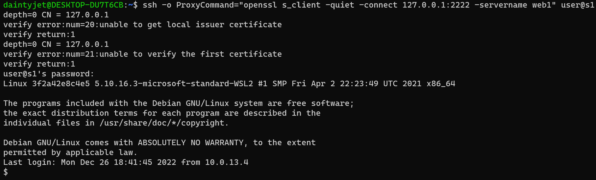
> This is an example of the output one would see when they run this command

## ISSUES 

When running the stack on a single node swarm a number of issues occurred. The first is that if there are two services (Database services) that access the same volume for persistance, it **does not** appear to work. Likely due to concurrency and memory access issues as they try to initialize the DB on the same volume. Using replicated instances would likely help.

Since a label can only have one value, The labels were changed so all containers could be hosted on the same node.

When SSH is dropped due to an ACL you will likely see **kex_exchange_identification: Connection closed by remote host**

## Sources
Docker Compose
https://docs.docker.com/compose/compose-file/compose-file-v3/

Docker Repository 
https://docs.docker.com/docker-hub/repos/#:~:text=To%20push%20an%20image%20to,docs%2Fbase%3Atesting%20)

Docker Swarm Node Management
https://docs.docker.com/engine/swarm/manage-nodes/

Logging
https://www.haproxy.com/blog/introduction-to-haproxy-logging/

ACL
https://www.haproxy.com/blog/introduction-to-haproxy-acls/

Load Balancing
https://www.digitalocean.com/community/tutorials/an-introduction-to-haproxy-and-load-balancing-concepts 

SSH
https://www.haproxy.com/blog/route-ssh-connections-with-haproxy/

Docker DNS resolution HA
https://www.haproxy.com/blog/haproxy-on-docker-swarm-load-balancing-and-dns-service-discovery/

Resolver 
https://www.haproxy.com/documentation/hapee/latest/configuration/config-sections/resolvers/

Basic Structure HA
https://www.haproxy.com/blog/the-four-essential-sections-of-an-haproxy-configuration

