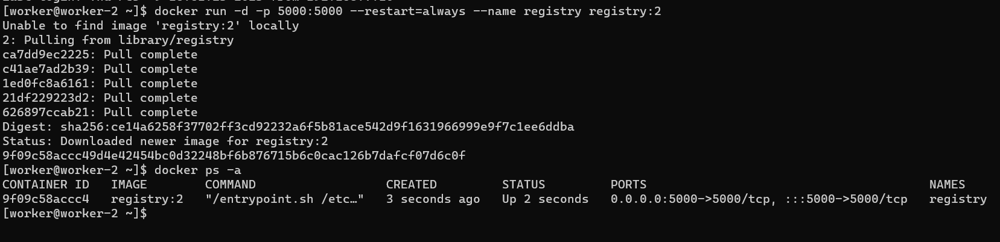
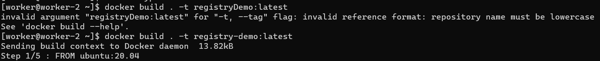
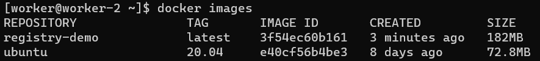
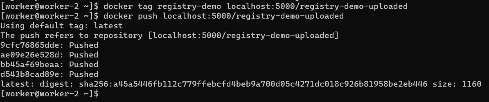
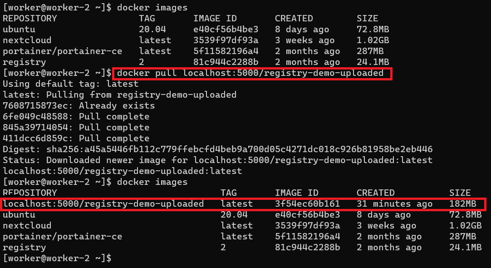

# Deploying Registry V2 Container

This guide showcases how to make an **INSECURE** registry V2 container that will be used to store Docker images that you create with the `docker build` and `docker tag` commands. 

This is very helpful when you want to have images stored and accesible only within the enterprise network.


## Resources Used
1. [Docker Documentation - Deploying your registry](https://docs.docker.com/registry/deploying/)


# Deploying the container
We want to run a local registry on a machine that will be accessible through the host's port 5000.

```
    docker run -d -p 5000:5000 --restart=always --name registry registry:2
```

This will make the registry restart whenever Docker gets restarted.




Now, you have a registry that can house your own custom container images.


# Testing a custom image
For this, we can use our own Dockerfile to create a custom image that we'll upload to our registry.



*Note: I included the error message to make sure that you understand that the name of build images must be lowercase.*

Once the build completes, you'll be able to see your image in your images.



With this, we can try to upload this to our registry. We can do this with the `tag` and `push` commands.

The format of the `tag` command is:

```
    docker tag <source image> <remoteIP>:<port>/<tag>
```

So, for this demo, the image was made locally. We can test connectivity with localhost. Now, we need to push the image onto the registry.

```
    docker tag registry-demo localhost:5000/registry-demo-uploaded
```

The format of the `push` command is:

```
    docker push
```

You will see a slight progress bar and a confirmation message.




This means that the registry has the image. You can now further test this by deleting the image locally and then pulling it from your registry.




You now have a local **insecure** registry.

You can continue to look through the resource used to figure out how to secure this.
