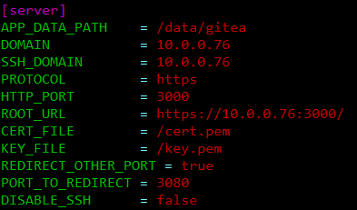
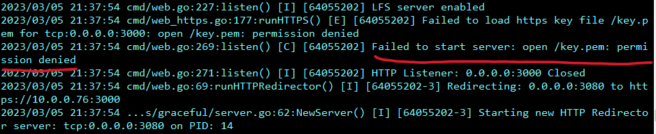

# Enabling HTTPS on Gitea
*Author: Chris Morales*

**Summary:** To reduce the chances of having an internal threat actor eavesdrop and gather more information, we can enable HTTPS on our gitea server that will house crucial code that could be used by a Jenkins pipeline for example. 

This guide is following closely with [this](https://docs.gitea.io/en-us/https-setup/) guide.

*DISCLAIMER/NOTE: This guide utilizes the SELF-SIGNED CERTIFICATE method. THIS SHOULD NEVER BE USED IN A PRODUCTION ENVIRONMENT. The certificate should be signed by a real third-party CA or some internal CA of the company.*

Theoretically, the process should be the same if you have a legitimate certificate, but you would need to mount or copy the certificate and key that you get into the machine running gitea.

*Infrastructure Used:*
This guide was run under my own homelab that had spun up a Gitea server through a docker-compose file. And so, the assumption here is that you a docker container running gitea.


## Optional Step 1: Utilize the internal certificate generator of Gitea

Again, this should **NOT** be used in a production environment, but for these testing purposes, this is how I got the service secured.


And just a reminder, this is assuming that Gitea is run the from Docker container.

```
    docker exec gitea gitea cert --host <HOST IP or DNS>
```

In my case, the IP address was 10.0.0.76

```
    docker exec gitea gitea cert --host 10.0.0.76
```

*Yes. The double gitea is not a typo. The first refers to the gitea container and then the second is the actual gitea service command within the container.*

This creates *cert.pem* and *key.pem* to be used for securing Gitea.


## Step 2: Update the app.ini file
Once you have these files created. You will need to update the Gitea configuration file (located at */data/gitea/conf/app.ini* ) to utilize their integrated HTTPS support.

*Note: You'll need to install an editor on the gitea container.*

The gitea Docker image is based off of alpine linux. The package manager for this is "apk" (alpine package keeper). And so, to install vim, you would need to run (within the container):

```
    apk update
    apk add vim
```


Below is the working .ini file.


I only did the following:
1. Added PROTOCOL = https - This is obvious. It makes gitea utilize HTTPS by default now.
2. Updated ROOT_URL to https instead of http - Again, it supports the protocol.
3. Added CERT_FILE = /cert.pem - This provides the location of the certificate for your service
4. Added KEY_FILE = /key.pem - This provides the location of the corresponding key to the file.
5. Added REDIRECT_OTHER_PORT = true - This means that gitea will *redirect* a specific port to the *ROOT_URL* to use HTTPS instead of HTTP.
6. Added PORT_TO_REDIRECT = 3080 - This is the *port* to *redirect* to the *ROOT_URL*. So any connections coming in to 3080 will be sent to HTTPS at 3000 for this case.


Before you move onto step 3, look at the debugging information at the bottom of this guide for a solution.

## Step 3: Restart the gitea container
Finally, you want these changes to go into effect. You can restart the gitea container.

```
    docker restart gitea
```

You can check the progress of the startup and check for any errors with 

```
    docker logs gitea
```


Finally, you should be able to reach gitea through HTTPS.


Remember, you need the CA that signed the cert to be trusted in order to have a completely trusted-secure session.


## Debugging: Permission denied for *cert.pem* and *key.pem*
Confirm the permissions of the certificate and the corresponding private key.

You may see the following logs if there's a permission issue with the cert and/or private key: 



If following the guide from above, there will be an issue that arises when trying to run the gitea service with the updated *app.ini* file. This is from the self-signed certificate generation method I described. When you ran the `docker run gitea gitea cert --host <host>` command, then the owner of *cert.pem* and *cert.key* will be *root*. However, the gitea service will be run under the user *git* by default. And so, we need to change the owner and correspoding permissions.


### Steps to Resolve
You can solve this by a series of commands:

1. Change the owner to git
```
    chown git /cert.pem
    chown git /key.pem
```

2. Change the permissions of the cert and the key to be 600.

```
    chmod 600 /cert.pem
    chmod 600 /key.pem
```

You should now be able to restart the gitea service and it shouldn't have this permission issue.