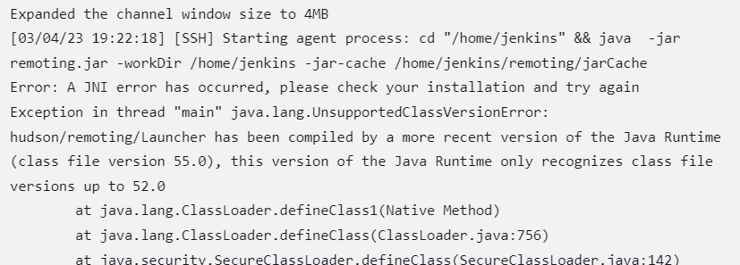
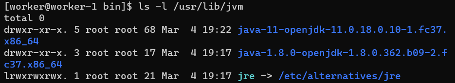

# Unsupported Class Version Error
*Author: Chris Morales*

**Summary:** Sometimes, if you have multiple java versions installed on a machine (in this case, a Fedora machine), then the Jenkins agent will fail to run because it likely used the older version of java. 


## Error Message
This is an example of an error message that you may see.




## Solution
You can find (on Fedora systems) the older versions of java (installed with dnf) with: 

```
    ls -l /usr/lib/jvm
```

You'll notice in the screenshot below that there are two versions.



Now, we can remove the older version

```
    sudo dnf remove java-1.8.0-openjdk-1.8.0.362.b09-2.fc37.x86_64
```


