# AWS EC2 Jenkins Server and Agent Registration
The purpose of this walkthrough is to demonstrate how a person can install a Jenkins server and register agents on different nodes to be used by Jenkins.
There is not a hard requirement of using AWS as the steps for installing the server and agent registration are the same, but there will be some security group firewall issues that will arise with AWS that I will show how to solve.

This isn't a clean cut walkthrough because I wanted to inform you of *why* certain don't work in this area. This is very helpful because these concepts will apply in many different areas.


# Create an EC2 instance
This tutorial assumes that you already have an AWS account that can use the EC2 service provided by AWS.

## Create an Amazon-Linux EC2 instance.
Ensure that the Amazon Linux OS is installed.


You can keep a majority of the defaults for the machine.

*Note: You'll need to have a public private key pair for use with SSH. You can also set a rule for SSH traffic to allow **only** from your IP.*


Now that your instance is set up, you can navigate back to the instances page and gather basic information about the machine.


## Connect to your EC2 jenkins server.
You can see these commands when you first spin up the instance. 

*In this screenshot, I had made a SSH alias for the machine.*
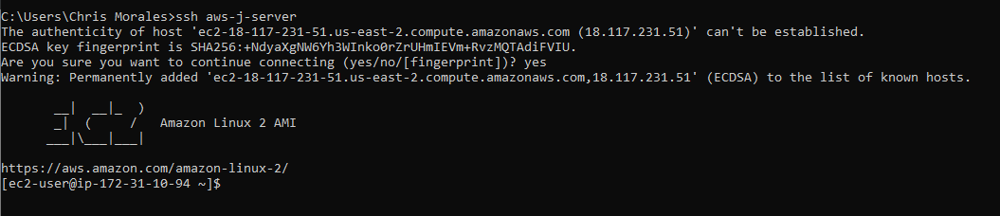


# Installing the Jenkins Server
Now that you have a shell, we can now begin installing the jenkins server.


The Jenkins documentation that is provided by Jenkins is what I followed for this guide. The link is [here](https://www.jenkins.io/doc/pipeline/tour/getting-started/).

## Installing the Jenkins Generic Java Package
You can find it [here](https://www.jenkins.io/download/). Just make sure to choose the right distribution; in this case "CentOS/Fedora/Red Hat" will be the correct choice. 


You will have to run the following commands

```
    sudo wget -O /etc/yum.repos.d/jenkins.repo https://pkg.jenkins.io/redhat-stable/jenkins.repo
    sudo rpm --import https://pkg.jenkins.io/redhat-stable/jenkins.io.key
```

*As noted in the link from above, the command might fail if you have an existing machine with these installed at one point. With this new EC2 instance, you won't have this problem.*

```
    sudo yum install fontconfig java-11-openjdk
```

You will run into an issue here with the java-11-openjdk file that you wanted to install. You'll have an output that should be the same as the one in the next screenshot. The output will tell you the right command. But I've put it here for your convenience.


```
    sudo amazon-linux-extras install java-openjdk11
```

Now that you have this, you can install the jenkins server onto the machine.

```
    sudo yum install jenkins
```

## Running the Jenkins Server
Now that you have the Jenkins server package installed, you now need to run the server. To find the package, you can use this find command with grep.

```
    sudo find / | grep jenkins.war
```


Now, you just need to run the the following command to start the server in the background. Replace the path of the .war file with wherever the file is.


```
    java -jar /usr/share/java/jenkins.war --httpPort=8080&
```


## Access the Jenkins Server
All you need to access this is either the public IP or the public DNS of the instance and input this into a web browser using the corresponding port.


***Question: Will this work?***

***Answer: No. Why? Because the security group (essentially firewall) prevents all traffic other than SSH connections from our own IP. So, we need to add a specific rule to allow this HTTP traffic through the port specified.***

### Creating a HTTP rule in security groups

There are multiple ways that you can find the seceurity group, but the easiest way to find which group is applied to a machine is by selecting the machines from the instances page and then clicking the "Security" tab.

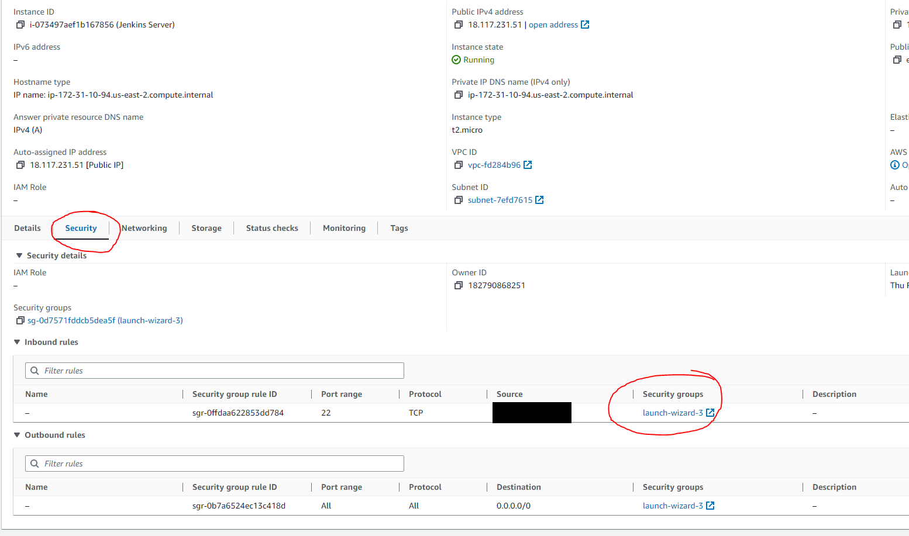

Here, you'll be getting a summary overview of the security rule. Now you can go further in and look at a summarized table of the group. 

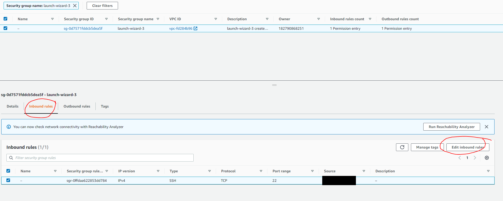

Now, you can add a rule.
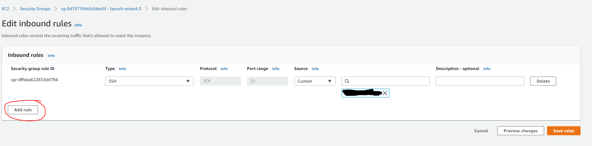


You need to add the rule to allow HTTP connections
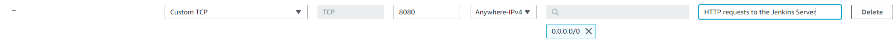

Press save and then you now have a new rule.

Now, refresh the webpage and you'll be brought to the initial "Unlock Jenkins" page. You can find the password based on what the page tells you.

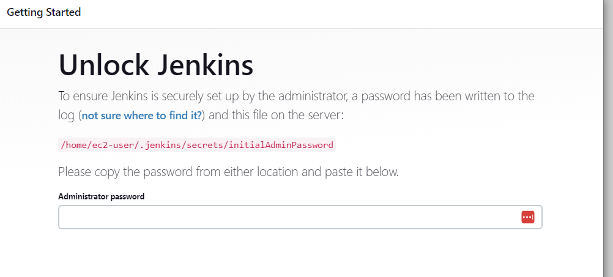

## Set up Jenkins Server Post-Fix
Having gotten the initial configuration page, you can set up your Jenkins server with basic stuff to get started.

1. You can install the recommmended default plugins.
2. Set up a super user of choice.
3. Finally, you can update the link, but for now, it's fine to keep it normal.

Now, you have a working Jenkins instance.


# Registering Agents
Now you need to to register an agent to do the work. You'll be shown the general menu on the left hand side of the screen. 


1. Press the "Manage Jenkins" button.

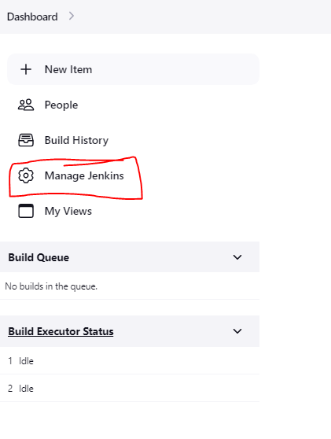


2. Choose "Manage Nodes and Clouds"

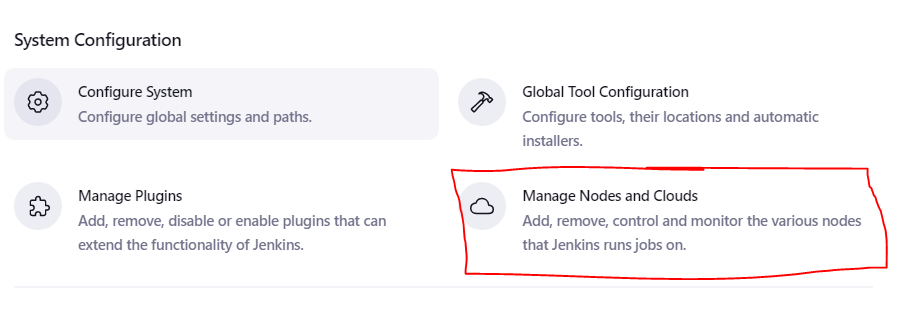


3. Choose "New Node"

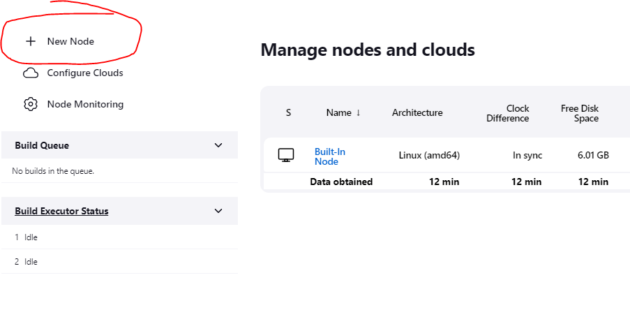

4. Give it a name and choose "permanent agent for our use case".

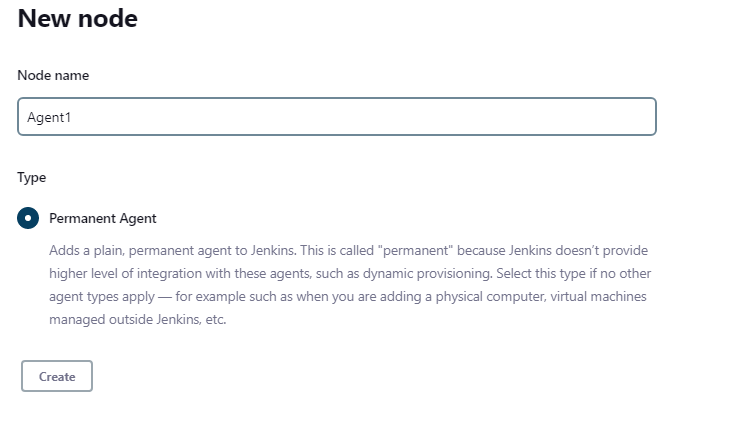

5. Create a new public-private key pair on a machine. Have the private key ready.
   
6. Back on Jenkins, go back into "Manage Jenkins" and then choose the "Manage Credentials" option.

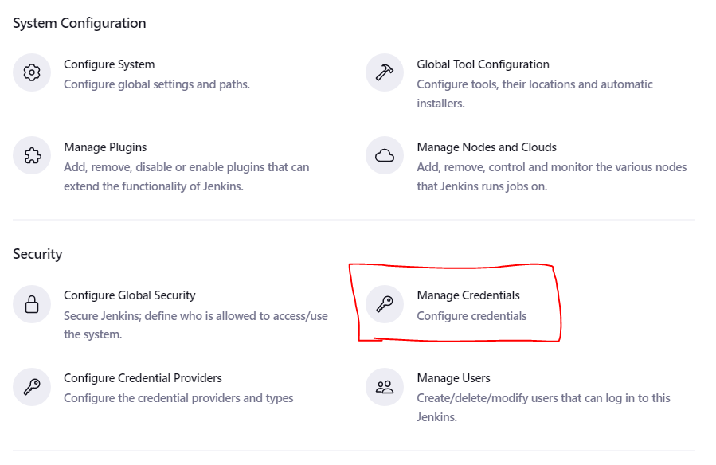


7. You'll be able to create some new credentials under the dropdow under the "global" option. Choose "add credential" and then you will be brought to another screen. Manually change the type of credential to "SSH Username with Private Key"

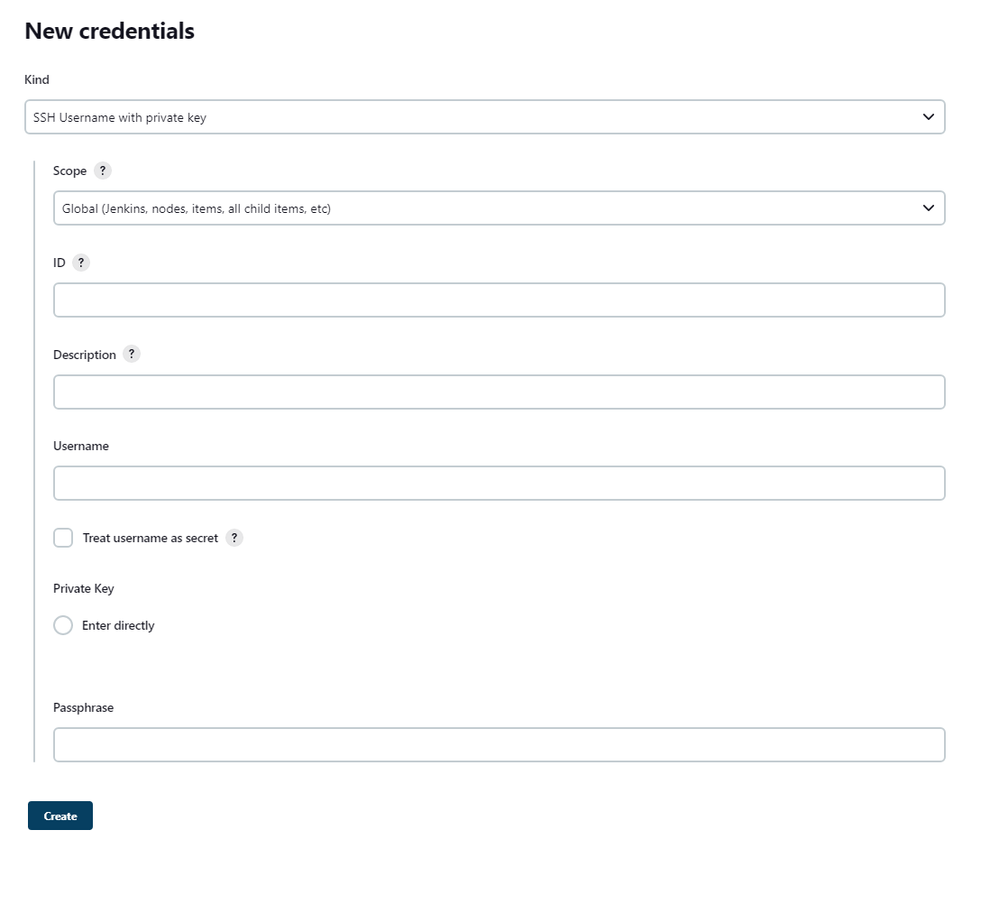


8. Fill out the fields with the correct information. Give it any ID. And then make sure that the username is an **actual** user on the target machine. Copy and paste the private key inside of the private key field.


This picture showcases a complete form after the credential was made.

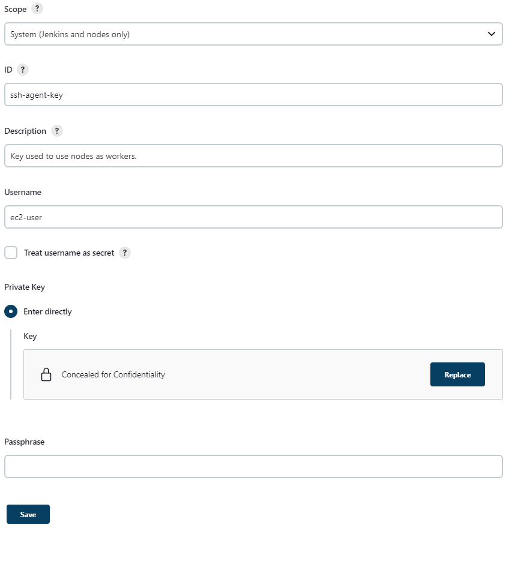

9. You can go back to the credetials tab to find your new entry.

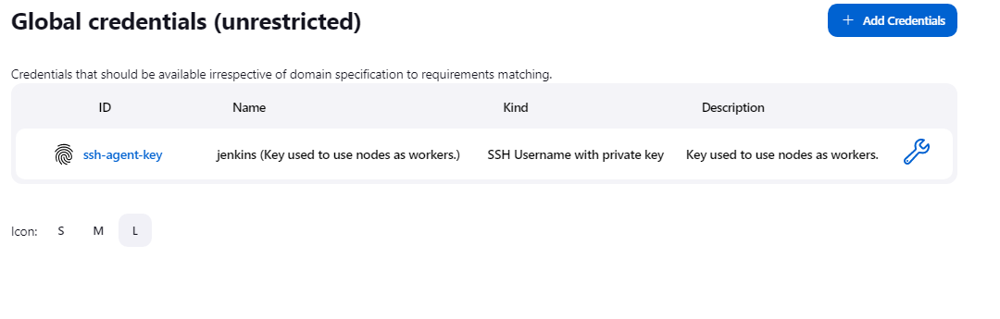


10. Go back to the agent creation, now we can fill in the later information. 
    1.  Fill in the information according to how you want to organize and use the agent. Use the hostname or the IP address. In this case, it's another EC2 instance.

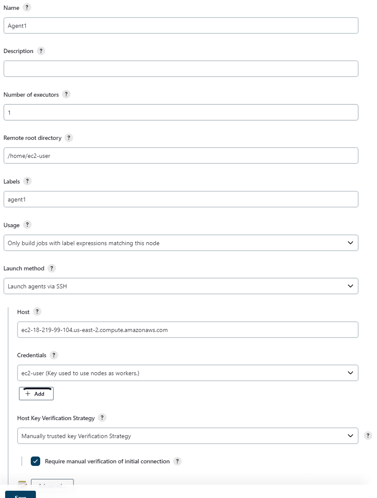

You'll have to place the appropriate hostname in the "Host" field.

You'll also have to specify the credential key that you want to use.

11. Once you save the agent, the agent launching process will begin. However, the manual verification option in the figure above will require your input. Once you go back, you can press "Status" and a new option that will allow you trust the host key will be there.


***Question: Does this work?***

***Answer: No. You haven't copied the public key to the target machine. And so, you need to update the authorized_keys file for the user that you're targeting. Then, you need to make sure that the SSH rule allows your jenkins server to SSH to your agents.***


12. Once you solve the SSH problem, you will run into another problem where the agent doesn't have java installed. You will have to simply run the same command from before on the agent to get java installed.


13. Now you can relaunch the agent and you should be see a connected message.

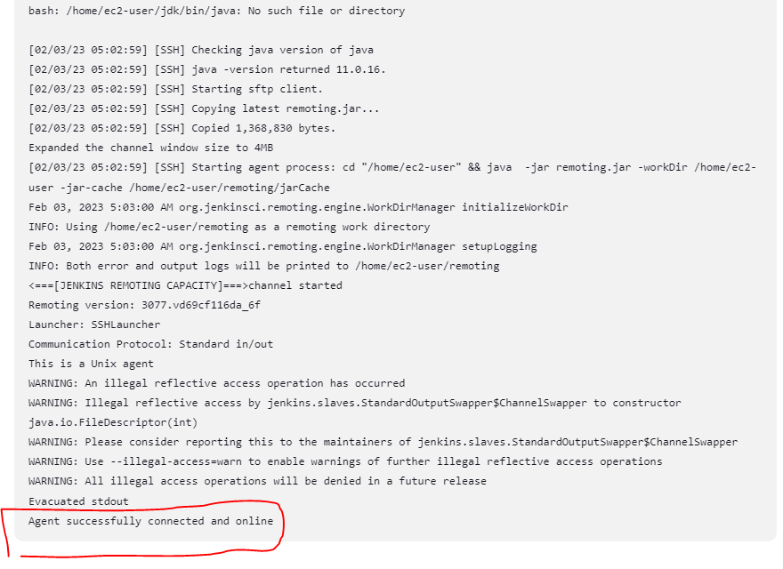