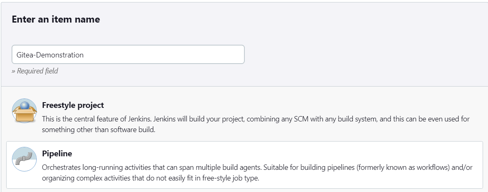
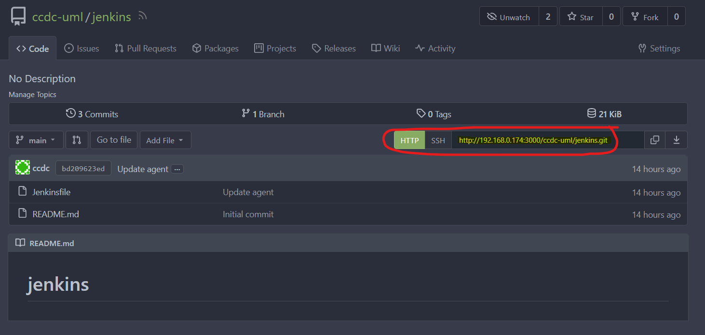
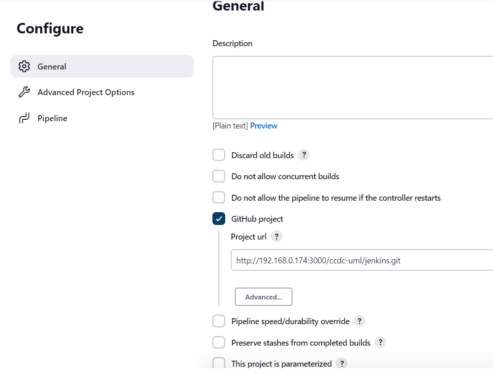
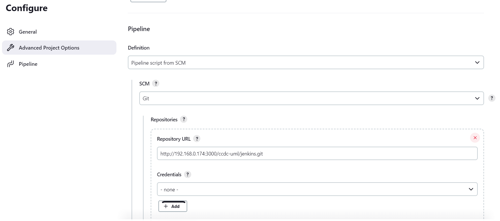
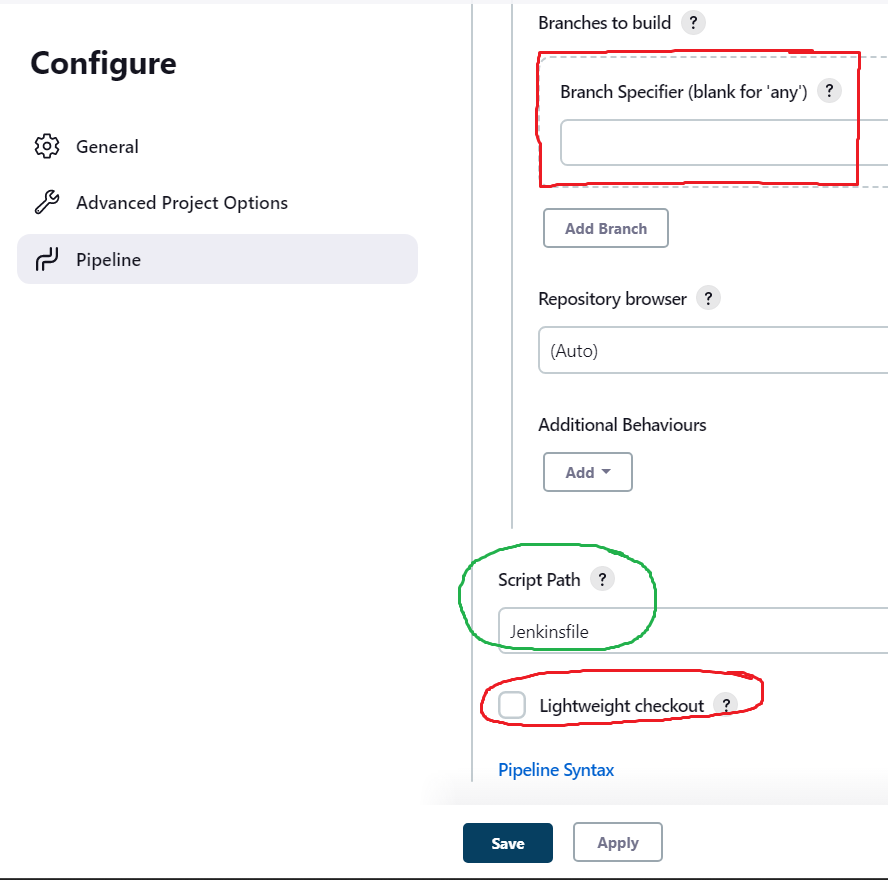
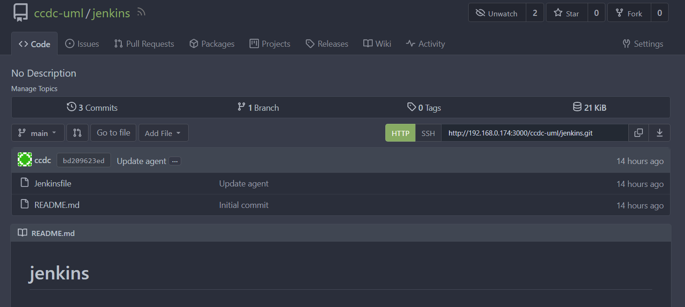
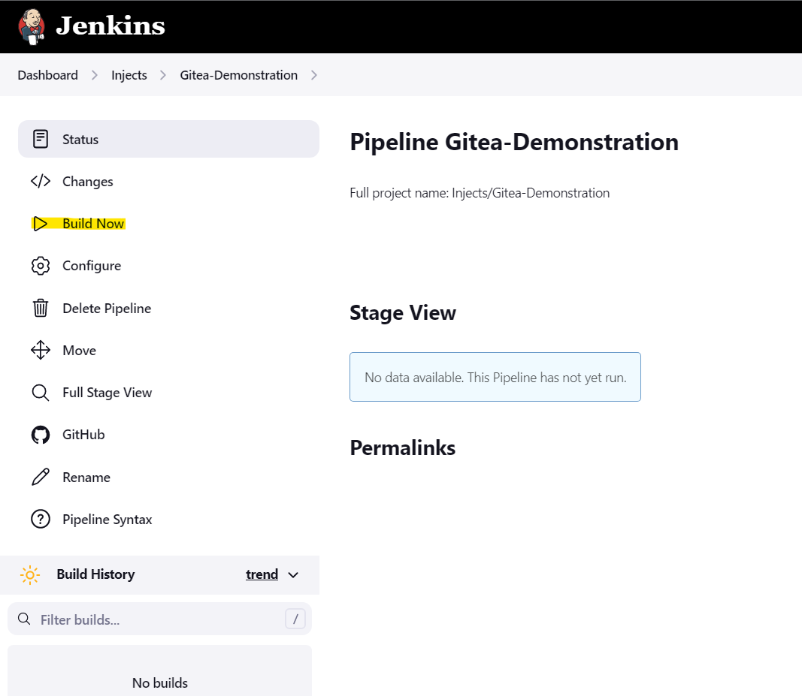
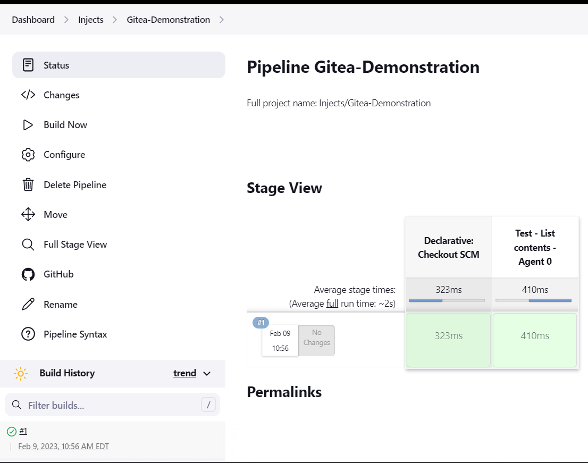

# Single Pipeline Git Integration

This walkthrough will help integrate a local git server into a Jenkins pipeline to carry out the automation portion of building, testing and deploying a product onto different machines. This will use the **pipeline** project type within Jenkins.

# Table of Contents
- [Single Pipeline Git Integration](#single-pipeline-git-integration)
- [Table of Contents](#table-of-contents)
- [Gitea](#gitea)
- [Jenkins](#jenkins)
  - [Pipeline project creation](#pipeline-project-creation)
    - [Project option selection](#project-option-selection)
    - [Pipeline Options](#pipeline-options)
  - [Running a build](#running-a-build)

# Gitea
Gitea will be the internal git server used in this walkthrough. The walkthrough is provided in the "containers" folder at the time of this document. You can search through our repo to find it.

# Jenkins
Log into an account that has access to create a new project.

## Pipeline project creation
On the Jenkins UI, after clicking `new item` , you will be able to select the `Pipeline` option. Create a meaningful name.

### Project option selection
1. GitHub project creation - Check the option and then put the URL to your internal git server. ***Note: This is not a fully secure connection as there is no HTTPS.***

You can find the link to the repo within the GUI of the Gitea server.

Plug this value into the `Project URL` textbox.

   
### Pipeline Options
In the Pipeline section, you'll be able to see the option for `Pipeline script from SCM` under the `Definition` Header. By default, this will be `Pipeline Script`.

Once again, you will need to fill out the information for the Git repo and then define any credentials if necessary. ***Note: Since this repo was made public for internal use, then there is no need for any type of credential.***

If you scroll down, you will reach a section that mentions `Branches to build`. If you create a completely new repo with nothing in it and no branches, then this will give you issues when you try to launch a build. To fix this, simple **blank out** the `Branch Specifier (blank for 'any')` field. Also, make sure the **uncheck** the `Lightweight Checkout` option.

Finally, you'll notice in the screenshot above that the Script Path is just named Jenkinsfile. This is not always the case as the jenkinsfile could be somewhere else in the repository. 

In this demonstration, you'll notice in the repo that the file named "Jenkinsfile" is in the root (/) directory. (Marked in Green)

Save all your changes with `Save` and then you're ready to go if all the other configurations are done.

## Running a build
Once you press save, you'll be brought back to the newly created project's home page that you can press the `Build Now` button to kick off a build.

If your pipeline is all set to handle all the steps defined in the Dockerfile, then you will see a successful run appear on the screen.

