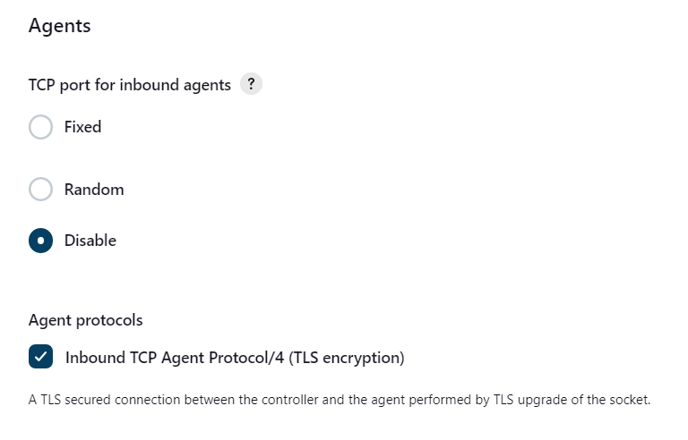

# Jenkins Global Security
*Author: Chris Morales*

Summary: This guide will serve as an aid into securing a Jenkins installation. This covers many best practices gathered from other guides and guidelines. This particular guide is for settings under *Dashboard -> Manage Jenkins -> Configure Global Security*. Note that this guide is specially made for CCDC competitions.

## Authentication
1. Check "Disable remember me" function.
2. Ideally, you can use LDAP or some third party company to authenticate users, but if not, then you could use an internal database.

## Authorization
1. **AVOID** using "Anyone can do anything". That's a recipe for disaster.
2. From the *Matrix Authorization Strategy Plugin*, you're given the *Matrix-based security* option. This would give the ability to implement PoLP (Principle of least privilege). This applies to anonymous users, authenticated users or specific ones.
3. You could also use Role-based Authorization Strategy 

## Markup Formatter
To reduce the possibility of having injected code through Markup files, we can enable "Safe HTML" under the *Markup Formatter*. This will sanitize the markup.

## Agents - TCP Port for inbound agents
Based on my understanding, the normal communication for Jenkins and its agents will be *server -> agent*.  I don't believe that there is any communication from the agent to the server. 

The server will attempt to make a node an agent via the method that you use. When I made these installations for CCDC, then the way this was done was through SSH.

And so, we can disable this port to reduce the attack vector a little more.

## SSH Server
Since there is no need to SSH into this server, then we can disable this port entirely.