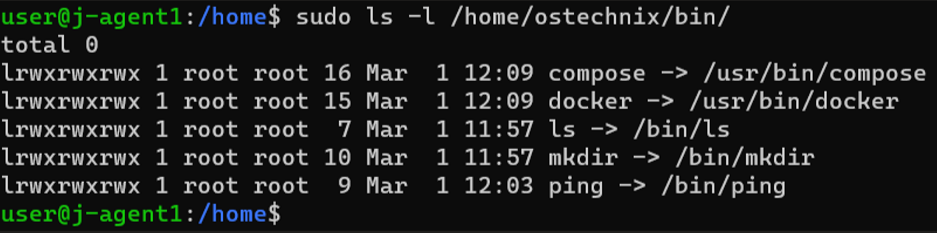
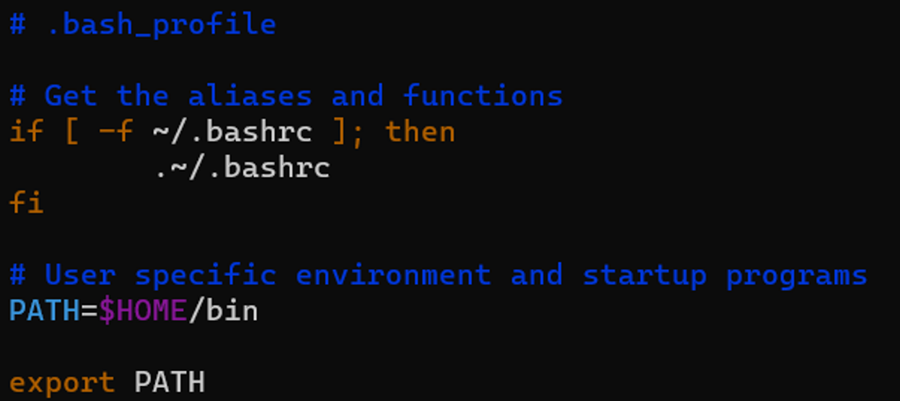
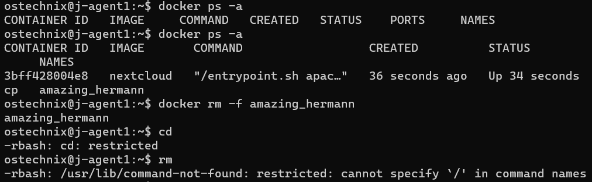

# Limiting Agent Internal Host Account
*Author: Chris Morales*

**Summary:** When running builds with remote agents, Jenkins will attempt to log into the machine that will house the agent using a specified account during setup. This account should only be used to carry out very specific tasks and shouldn't have the capabilities a normal user account would. And so, this guide will showcase how to heavily restrict an account's usability other than to carry out the automated functions.


## Resources Used:
1) [Limiting Access to System via rbash in Linux](https://ostechnix.com/how-to-limit-users-access-to-the-linux-system/)
2) [Changing existing user's login shell in Linux](https://www.tecmint.com/change-a-users-default-shell-in-linux/)


## Prerequisites:
To carry out the steps of the guide, you will need to have a user account that will be used *solely* for Jenkins automation. You will need to ask the Jenkins team what specifically this particular agent will be doing.


## Steps
*Note: This entire guide was done on an Ubuntu host machine. Adapt and research for other OSs.*


### Step 1 - Option A - Account Creation

*If* you have an existing account for jenkins, then you can skip this. 

If you ***don't*** then this is how you can easily make an account that is already pointed to the *rbash* shell: 

1. On a privileged user, simply run 
    
    ```
    adduser <username> --shell /bin/rshell
    ```

This will make a user with the name &lt;username&gt; that, once they login, will be given the shell *rbash* instead of the typical *bash*.

### Step 1 - Option B  - Home Directory Modification
*If* you have an existing account and their login shell is anything *but rbash*, then you can follow this step to change this.

Once you've confirmed that there is no risk in heavily restricting this user account, then you can run

```
    usermod --shell /bin/rbash <username>
```

This will make a user with the name &lt;username&gt; that, once they login, will be given the shell *rbash* instead of the typical *bash*.


### Step 2 - Create a *bin* directory for the user

Next, you need to make a bin directory in the home directory of the targeted user so they can run some commands.

```
    mkdir /home/<username>/bin
```

### Step 3 - Allow certain actions to be done
Using the information that you gathered about *what* the user should be able to do, you can now create symlinks to those commands. *rbash* will not allow any commands to be run that isn't in this newly created /bin directory.

For example, for using `ls`, `mkdir`, and `ping`, you would need to run the following commands.

```
    ln -s /bin/ls /home/<username>/bin/ls
    ln -s /bin/mkdir /home/<username>/bin/ls
    ln -s /bin/ping /home/<username>/bin/ls
```

The following screenshot shows a few more for a Jenkins pipeline that was run at the time. It required docker compose to be run.



### Step 4 - Restrict access to .bash_profile
Bash profile can be used to change environment variables even if the user can't access env. And so, we need to modify the *.bash_profile* file. To do this, we want to restrict modifications to the file other than root.

```
    chown root. /home/<username>/.bash_profile
    chmod 755 /home/<username>.bash_profile
```

### Step 5 - Update .bash_profile
You can keep everything normal in this file, all you need to update is the *$PATH* environment variable to be this local /bin directory so when a command is run, then it will only be looking in this local /bin directory.

An example of a basic *.bash_profile* file is shown:




### Step 6 - Confirmation
Now that all these have been completed, we can now confirm that the user is *only* able to carry out these commands and nothing else.



You'll notice the restricted outputs for those commands indicate that this is working.