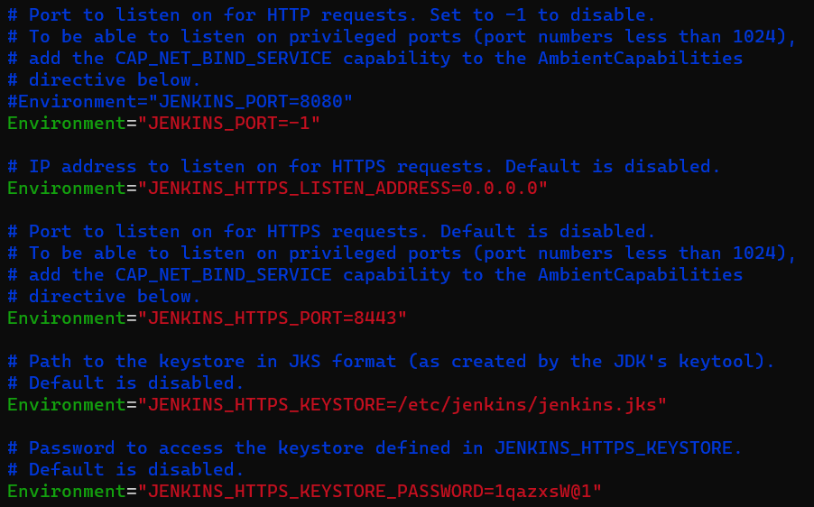

# Jenkins SSL Integration
*Author: Chris Morales*

**Summary:** Having an internal service be only HTTP with sensitive information being sent is a recipe for disaster. In the case of Jenkins, there can be keys, passwords and personal access tokens (PATs) - if using Git - sent across the network. And so, we need to secure this. This is done by using a certificate. The guide that I followed to get this working (With some slight modifications for configuration files) is [here](https://devopscube.com/configure-ssl-jenkins/).


## Step 1: Gathering a certificate and a private key

### BAD Option: Making our own self-signed cert
In this guide above, they also show us how to make our own self-signed cert in the case of testing. For this, I will link it to another guide found [here](self-signed-cert.md) for this particular purpose in the worst case. 


### GOOD Option: Requesting a cert 
In reality this should be gotten from a potential internal CA or legitimate third-party CA. 


## Step 2: Convert the SSL keys into a PKCS12 format
*Note: This is only needed if you don't have a certificate in .p12 or .pfx format. If you do, continue to Step 3.*

Using the same information from the self-signed cert steps, you will have three crucial files.

1. *root-ca.crt*
2. *server.key*
3. *server.crt*

Now, you can run this particular command and using the information from the self signed cert generation guide.

```
    openssl pkcs12 -export -out jenkins.p12 -inkey server.key -in server.crt -certfile root-ca.crt -name 192.168.0.94
```

You can replace the name with whatever you want the application name to be. You will be prompted to enter a password for this. Use a secure one.


## Step 3: Convert PKCS12 to JKS format
You will now have to use the keytool command to convert from *.p12* to *.jks* 

You can use the following command:

```
    keytool -importkeystore -srckeystore jenkins.p12 -srcstorepass '<firstpassword>' -srcstoretype PKCS12 -srcalias 192.168.0.94 -deststoretype JKS -destkeystore jenkins.jks -deststorepass '<newpassword>' -destalias 192.168.0.94
```

*Replace the following*
1. -srcstorepass = Use the first password from the PKCS12
2. -deststorepass = Make a new password for the JKS store
3. -srcalias = Use the first alias from the PKCS12 
4. -destalias = Use a new name for this. Can be the same.


You now have *jenkins.jks*


## Step 4: Make the JKS accessible to Jenkins
Make sure that this new jenkins.jks file is in a location that Jenkins can access. Let's say /etc/jenkins

```
    mkdir -p /etc/jenkins
    cp jenkins.jks /etc/jenkins/
```

Now, we want to make sure that this file can only be written/read to by the jenkins user and the jenkins user only.

```
    chown -R jenkins: /etc/jenkins
    chmod 700 /etc/jenkins
    chmod 600 /etc/jenkins/jenkins.jks
```


## Step 5: Update the Jenkins configuration
*Note: This is a very brute force way of doing this. Due to time constraints, I got it to work with this. Also note that this guide was made for a Jenkins server on an Ubuntu host. It could be different for different OSs. You'll notice that the first line tells you not to modify this file, but for this case, it will have to use this.*

The location of **a** jenkins configuration file that we're interested in to enable SSL is at: */lib/systemd/system/jenkins.service*. 

```
    vim /lib/systemd/system/jenkins.service
```

Now, you can scroll down and use a similar format only updating the password and the port field if you don't want to use 8443 for the HTTPS requests.




## Step 6: Restart the Jenkins service
Now, you can restart the service. You may need to run an additional command, but running these commands won't harm anything.

```
    sudo systemctl daemon-reload
    sudo systemctl restart jenkins
```

Now you'll be able to access the jenkins server via HTTPS only.


